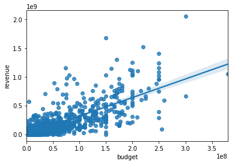

# Intro

> ### Your team is charged with doing data analysis and creating a presentation that explores what type of films are currently doing the best at the box office. You must then translate those findings into actionable insights that the CEO can use when deciding what type of films they should be creating.


```python
# Your code here - remember to use markdown cells for comments as well!
# !pip install -U fsds
# !pip install fsds_100719
# !pip install bs_ds
from fsds.imports import *
```

    fsds v0.2.22 loaded.  Read the docs: https://fs-ds.readthedocs.io/en/latest/ 


<style  type="text/css" >
</style><table id="T_4e15421e_d2c8_11ea_b3fe_acde48001122" ><caption>Loaded Packages and Handles</caption><thead>    <tr>        <th class="col_heading level0 col0" >Handle</th>        <th class="col_heading level0 col1" >Package</th>        <th class="col_heading level0 col2" >Description</th>    </tr></thead><tbody>
                <tr>
                                <td id="T_4e15421e_d2c8_11ea_b3fe_acde48001122row0_col0" class="data row0 col0" >dp</td>
                        <td id="T_4e15421e_d2c8_11ea_b3fe_acde48001122row0_col1" class="data row0 col1" >IPython.display</td>
                        <td id="T_4e15421e_d2c8_11ea_b3fe_acde48001122row0_col2" class="data row0 col2" >Display modules with helpful display and clearing commands.</td>
            </tr>
            <tr>
                                <td id="T_4e15421e_d2c8_11ea_b3fe_acde48001122row1_col0" class="data row1 col0" >fs</td>
                        <td id="T_4e15421e_d2c8_11ea_b3fe_acde48001122row1_col1" class="data row1 col1" >fsds</td>
                        <td id="T_4e15421e_d2c8_11ea_b3fe_acde48001122row1_col2" class="data row1 col2" >Custom data science bootcamp student package</td>
            </tr>
            <tr>
                                <td id="T_4e15421e_d2c8_11ea_b3fe_acde48001122row2_col0" class="data row2 col0" >mpl</td>
                        <td id="T_4e15421e_d2c8_11ea_b3fe_acde48001122row2_col1" class="data row2 col1" >matplotlib</td>
                        <td id="T_4e15421e_d2c8_11ea_b3fe_acde48001122row2_col2" class="data row2 col2" >Matplotlib's base OOP module with formatting artists</td>
            </tr>
            <tr>
                                <td id="T_4e15421e_d2c8_11ea_b3fe_acde48001122row3_col0" class="data row3 col0" >plt</td>
                        <td id="T_4e15421e_d2c8_11ea_b3fe_acde48001122row3_col1" class="data row3 col1" >matplotlib.pyplot</td>
                        <td id="T_4e15421e_d2c8_11ea_b3fe_acde48001122row3_col2" class="data row3 col2" >Matplotlib's matlab-like plotting module</td>
            </tr>
            <tr>
                                <td id="T_4e15421e_d2c8_11ea_b3fe_acde48001122row4_col0" class="data row4 col0" >np</td>
                        <td id="T_4e15421e_d2c8_11ea_b3fe_acde48001122row4_col1" class="data row4 col1" >numpy</td>
                        <td id="T_4e15421e_d2c8_11ea_b3fe_acde48001122row4_col2" class="data row4 col2" >scientific computing with Python</td>
            </tr>
            <tr>
                                <td id="T_4e15421e_d2c8_11ea_b3fe_acde48001122row5_col0" class="data row5 col0" >pd</td>
                        <td id="T_4e15421e_d2c8_11ea_b3fe_acde48001122row5_col1" class="data row5 col1" >pandas</td>
                        <td id="T_4e15421e_d2c8_11ea_b3fe_acde48001122row5_col2" class="data row5 col2" >High performance data structures and tools</td>
            </tr>
            <tr>
                                <td id="T_4e15421e_d2c8_11ea_b3fe_acde48001122row6_col0" class="data row6 col0" >sns</td>
                        <td id="T_4e15421e_d2c8_11ea_b3fe_acde48001122row6_col1" class="data row6 col1" >seaborn</td>
                        <td id="T_4e15421e_d2c8_11ea_b3fe_acde48001122row6_col2" class="data row6 col2" >High-level data visualization library based on matplotlib</td>
            </tr>
    </tbody></table>


<script type="text/javascript">
window.PlotlyConfig = {MathJaxConfig: 'local'};
if (window.MathJax) {MathJax.Hub.Config({SVG: {font: "STIX-Web"}});}
if (typeof require !== 'undefined') {
require.undef("plotly");
requirejs.config({
    paths: {
        'plotly': ['https://cdn.plot.ly/plotly-latest.min']
    }
});
require(['plotly'], function(Plotly) {
    window._Plotly = Plotly;
});
}
</script>


<script type="text/javascript">
window.PlotlyConfig = {MathJaxConfig: 'local'};
if (window.MathJax) {MathJax.Hub.Config({SVG: {font: "STIX-Web"}});}
if (typeof require !== 'undefined') {
require.undef("plotly");
requirejs.config({
    paths: {
        'plotly': ['https://cdn.plot.ly/plotly-latest.min']
    }
});
require(['plotly'], function(Plotly) {
    window._Plotly = Plotly;
});
}
</script>


    [i] Pandas .iplot() method activated.


```python
import plotly.express as px
# import pandas as pd
# pd.options.plotting.backend = "plotly"
```


```python

```


```python
import os,glob
display(os.listdir('zippedData'))
```


    ['imdb.title.crew.csv.gz',
     'tmdb.movies.csv.gz',
     'imdb.title.akas.csv.gz',
     'imdb.title.ratings.csv.gz',
     'imdb.name.basics.csv.gz',
     'rt.reviews.tsv.gz',
     'imdb.title.basics.csv.gz',
     'rt.movie_info.tsv.gz',
     'tn.movie_budgets.csv.gz',
     'bom.movie_gross.csv.gz',
     'imdb.title.principals.csv.gz']


```python
files = glob.glob('zippedData/*')
files
```


    ['zippedData/imdb.title.crew.csv.gz',
     'zippedData/tmdb.movies.csv.gz',
     'zippedData/imdb.title.akas.csv.gz',
     'zippedData/imdb.title.ratings.csv.gz',
     'zippedData/imdb.name.basics.csv.gz',
     'zippedData/rt.reviews.tsv.gz',
     'zippedData/imdb.title.basics.csv.gz',
     'zippedData/rt.movie_info.tsv.gz',
     'zippedData/tn.movie_budgets.csv.gz',
     'zippedData/bom.movie_gross.csv.gz',
     'zippedData/imdb.title.principals.csv.gz']


```python
files = glob.glob('zippedData/*')
files
```


    ['zippedData/imdb.title.crew.csv.gz',
     'zippedData/tmdb.movies.csv.gz',
     'zippedData/imdb.title.akas.csv.gz',
     'zippedData/imdb.title.ratings.csv.gz',
     'zippedData/imdb.name.basics.csv.gz',
     'zippedData/rt.reviews.tsv.gz',
     'zippedData/imdb.title.basics.csv.gz',
     'zippedData/rt.movie_info.tsv.gz',
     'zippedData/tn.movie_budgets.csv.gz',
     'zippedData/bom.movie_gross.csv.gz',
     'zippedData/imdb.title.principals.csv.gz']


```python
os.path.split(files[0])[-1].replace('.csv.gz','')
```


    'imdb.title.crew'


```python
DATA = {}
for file in files:
    print(file)
    key = os.path.split(file)[-1].replace('.csv.gz','').replace('tsv.gz','')
    if ".tsv" in file:
        sep='\t'
        encode = 'latin-1'#'utf-8'
    else:
        sep=','
        encode='utf-8'
    DATA[key] = pd.read_csv(file,sep=sep,encoding=encode)#,index_col=0)
```

    zippedData/imdb.title.crew.csv.gz
    zippedData/tmdb.movies.csv.gz
    zippedData/imdb.title.akas.csv.gz
    zippedData/imdb.title.ratings.csv.gz
    zippedData/imdb.name.basics.csv.gz
    zippedData/rt.reviews.tsv.gz
    zippedData/imdb.title.basics.csv.gz
    zippedData/rt.movie_info.tsv.gz
    zippedData/tn.movie_budgets.csv.gz
    zippedData/bom.movie_gross.csv.gz
    zippedData/imdb.title.principals.csv.gz


## Final Project Submission

Please fill out:
* Student name: James Irving
* Student pace: part time
* Scheduled project review date/time: 
* Instructor name: Jeff Herman
* Blog post URL:


```python
# import  IPython.display as dp
# with open('README.md','r+', encoding='utf-8') as f:
#     dp.display(dp.Markdown(f.read()))
```

# Preview Data

## Questions

- **Where are the gross box office numbers?**
    - rt.movie_info.
        - Key: ?
        
    - tn.movie_budgets
        - Key:
        
    - bom.movie_gross
        - Key: 
        
- **What website is that table from?**
    - What other tables are from the same source and can be joined easily?

- **What columns may require extensive pre-processing?**
    - Any Genre columns
        - `rt.movie.info.['genre']`


```python
for tablename, data in DATA.items():
#     print('---'*20+'\n'+f"{tablename}:")
    try:
        display(data.head(2).style.set_caption(f"{tablename}"))
        print(len(data))
    except:
        display(data.head(2).reset_index().style.set_caption(f"{tablename}"))
    print()
```


<style  type="text/css" >
</style><table id="T_50a97fcc_d2c8_11ea_b140_acde48001122" ><caption>imdb.title.crew</caption><thead>    <tr>        <th class="blank level0" ></th>        <th class="col_heading level0 col0" >tconst</th>        <th class="col_heading level0 col1" >directors</th>        <th class="col_heading level0 col2" >writers</th>    </tr></thead><tbody>
                <tr>
                        <th id="T_50a97fcc_d2c8_11ea_b140_acde48001122level0_row0" class="row_heading level0 row0" >0</th>
                        <td id="T_50a97fcc_d2c8_11ea_b140_acde48001122row0_col0" class="data row0 col0" >tt0285252</td>
                        <td id="T_50a97fcc_d2c8_11ea_b140_acde48001122row0_col1" class="data row0 col1" >nm0899854</td>
                        <td id="T_50a97fcc_d2c8_11ea_b140_acde48001122row0_col2" class="data row0 col2" >nm0899854</td>
            </tr>
            <tr>
                        <th id="T_50a97fcc_d2c8_11ea_b140_acde48001122level0_row1" class="row_heading level0 row1" >1</th>
                        <td id="T_50a97fcc_d2c8_11ea_b140_acde48001122row1_col0" class="data row1 col0" >tt0438973</td>
                        <td id="T_50a97fcc_d2c8_11ea_b140_acde48001122row1_col1" class="data row1 col1" >nan</td>
                        <td id="T_50a97fcc_d2c8_11ea_b140_acde48001122row1_col2" class="data row1 col2" >nm0175726,nm1802864</td>
            </tr>
    </tbody></table>


    146144
    


<style  type="text/css" >
</style><table id="T_50a9e4f8_d2c8_11ea_a337_acde48001122" ><caption>tmdb.movies</caption><thead>    <tr>        <th class="blank level0" ></th>        <th class="col_heading level0 col0" >Unnamed: 0</th>        <th class="col_heading level0 col1" >genre_ids</th>        <th class="col_heading level0 col2" >id</th>        <th class="col_heading level0 col3" >original_language</th>        <th class="col_heading level0 col4" >original_title</th>        <th class="col_heading level0 col5" >popularity</th>        <th class="col_heading level0 col6" >release_date</th>        <th class="col_heading level0 col7" >title</th>        <th class="col_heading level0 col8" >vote_average</th>        <th class="col_heading level0 col9" >vote_count</th>    </tr></thead><tbody>
                <tr>
                        <th id="T_50a9e4f8_d2c8_11ea_a337_acde48001122level0_row0" class="row_heading level0 row0" >0</th>
                        <td id="T_50a9e4f8_d2c8_11ea_a337_acde48001122row0_col0" class="data row0 col0" >0</td>
                        <td id="T_50a9e4f8_d2c8_11ea_a337_acde48001122row0_col1" class="data row0 col1" >[12, 14, 10751]</td>
                        <td id="T_50a9e4f8_d2c8_11ea_a337_acde48001122row0_col2" class="data row0 col2" >12444</td>
                        <td id="T_50a9e4f8_d2c8_11ea_a337_acde48001122row0_col3" class="data row0 col3" >en</td>
                        <td id="T_50a9e4f8_d2c8_11ea_a337_acde48001122row0_col4" class="data row0 col4" >Harry Potter and the Deathly Hallows: Part 1</td>
                        <td id="T_50a9e4f8_d2c8_11ea_a337_acde48001122row0_col5" class="data row0 col5" >33.533000</td>
                        <td id="T_50a9e4f8_d2c8_11ea_a337_acde48001122row0_col6" class="data row0 col6" >2010-11-19</td>
                        <td id="T_50a9e4f8_d2c8_11ea_a337_acde48001122row0_col7" class="data row0 col7" >Harry Potter and the Deathly Hallows: Part 1</td>
                        <td id="T_50a9e4f8_d2c8_11ea_a337_acde48001122row0_col8" class="data row0 col8" >7.700000</td>
                        <td id="T_50a9e4f8_d2c8_11ea_a337_acde48001122row0_col9" class="data row0 col9" >10788</td>
            </tr>
            <tr>
                        <th id="T_50a9e4f8_d2c8_11ea_a337_acde48001122level0_row1" class="row_heading level0 row1" >1</th>
                        <td id="T_50a9e4f8_d2c8_11ea_a337_acde48001122row1_col0" class="data row1 col0" >1</td>
                        <td id="T_50a9e4f8_d2c8_11ea_a337_acde48001122row1_col1" class="data row1 col1" >[14, 12, 16, 10751]</td>
                        <td id="T_50a9e4f8_d2c8_11ea_a337_acde48001122row1_col2" class="data row1 col2" >10191</td>
                        <td id="T_50a9e4f8_d2c8_11ea_a337_acde48001122row1_col3" class="data row1 col3" >en</td>
                        <td id="T_50a9e4f8_d2c8_11ea_a337_acde48001122row1_col4" class="data row1 col4" >How to Train Your Dragon</td>
                        <td id="T_50a9e4f8_d2c8_11ea_a337_acde48001122row1_col5" class="data row1 col5" >28.734000</td>
                        <td id="T_50a9e4f8_d2c8_11ea_a337_acde48001122row1_col6" class="data row1 col6" >2010-03-26</td>
                        <td id="T_50a9e4f8_d2c8_11ea_a337_acde48001122row1_col7" class="data row1 col7" >How to Train Your Dragon</td>
                        <td id="T_50a9e4f8_d2c8_11ea_a337_acde48001122row1_col8" class="data row1 col8" >7.700000</td>
                        <td id="T_50a9e4f8_d2c8_11ea_a337_acde48001122row1_col9" class="data row1 col9" >7610</td>
            </tr>
    </tbody></table>


    26517
    


<style  type="text/css" >
</style><table id="T_50aa6868_d2c8_11ea_be2b_acde48001122" ><caption>imdb.title.akas</caption><thead>    <tr>        <th class="blank level0" ></th>        <th class="col_heading level0 col0" >title_id</th>        <th class="col_heading level0 col1" >ordering</th>        <th class="col_heading level0 col2" >title</th>        <th class="col_heading level0 col3" >region</th>        <th class="col_heading level0 col4" >language</th>        <th class="col_heading level0 col5" >types</th>        <th class="col_heading level0 col6" >attributes</th>        <th class="col_heading level0 col7" >is_original_title</th>    </tr></thead><tbody>
                <tr>
                        <th id="T_50aa6868_d2c8_11ea_be2b_acde48001122level0_row0" class="row_heading level0 row0" >0</th>
                        <td id="T_50aa6868_d2c8_11ea_be2b_acde48001122row0_col0" class="data row0 col0" >tt0369610</td>
                        <td id="T_50aa6868_d2c8_11ea_be2b_acde48001122row0_col1" class="data row0 col1" >10</td>
                        <td id="T_50aa6868_d2c8_11ea_be2b_acde48001122row0_col2" class="data row0 col2" >Джурасик свят</td>
                        <td id="T_50aa6868_d2c8_11ea_be2b_acde48001122row0_col3" class="data row0 col3" >BG</td>
                        <td id="T_50aa6868_d2c8_11ea_be2b_acde48001122row0_col4" class="data row0 col4" >bg</td>
                        <td id="T_50aa6868_d2c8_11ea_be2b_acde48001122row0_col5" class="data row0 col5" >nan</td>
                        <td id="T_50aa6868_d2c8_11ea_be2b_acde48001122row0_col6" class="data row0 col6" >nan</td>
                        <td id="T_50aa6868_d2c8_11ea_be2b_acde48001122row0_col7" class="data row0 col7" >0.000000</td>
            </tr>
            <tr>
                        <th id="T_50aa6868_d2c8_11ea_be2b_acde48001122level0_row1" class="row_heading level0 row1" >1</th>
                        <td id="T_50aa6868_d2c8_11ea_be2b_acde48001122row1_col0" class="data row1 col0" >tt0369610</td>
                        <td id="T_50aa6868_d2c8_11ea_be2b_acde48001122row1_col1" class="data row1 col1" >11</td>
                        <td id="T_50aa6868_d2c8_11ea_be2b_acde48001122row1_col2" class="data row1 col2" >Jurashikku warudo</td>
                        <td id="T_50aa6868_d2c8_11ea_be2b_acde48001122row1_col3" class="data row1 col3" >JP</td>
                        <td id="T_50aa6868_d2c8_11ea_be2b_acde48001122row1_col4" class="data row1 col4" >nan</td>
                        <td id="T_50aa6868_d2c8_11ea_be2b_acde48001122row1_col5" class="data row1 col5" >imdbDisplay</td>
                        <td id="T_50aa6868_d2c8_11ea_be2b_acde48001122row1_col6" class="data row1 col6" >nan</td>
                        <td id="T_50aa6868_d2c8_11ea_be2b_acde48001122row1_col7" class="data row1 col7" >0.000000</td>
            </tr>
    </tbody></table>


    331703
    


<style  type="text/css" >
</style><table id="T_50aad9f8_d2c8_11ea_a22e_acde48001122" ><caption>imdb.title.ratings</caption><thead>    <tr>        <th class="blank level0" ></th>        <th class="col_heading level0 col0" >tconst</th>        <th class="col_heading level0 col1" >averagerating</th>        <th class="col_heading level0 col2" >numvotes</th>    </tr></thead><tbody>
                <tr>
                        <th id="T_50aad9f8_d2c8_11ea_a22e_acde48001122level0_row0" class="row_heading level0 row0" >0</th>
                        <td id="T_50aad9f8_d2c8_11ea_a22e_acde48001122row0_col0" class="data row0 col0" >tt10356526</td>
                        <td id="T_50aad9f8_d2c8_11ea_a22e_acde48001122row0_col1" class="data row0 col1" >8.300000</td>
                        <td id="T_50aad9f8_d2c8_11ea_a22e_acde48001122row0_col2" class="data row0 col2" >31</td>
            </tr>
            <tr>
                        <th id="T_50aad9f8_d2c8_11ea_a22e_acde48001122level0_row1" class="row_heading level0 row1" >1</th>
                        <td id="T_50aad9f8_d2c8_11ea_a22e_acde48001122row1_col0" class="data row1 col0" >tt10384606</td>
                        <td id="T_50aad9f8_d2c8_11ea_a22e_acde48001122row1_col1" class="data row1 col1" >8.900000</td>
                        <td id="T_50aad9f8_d2c8_11ea_a22e_acde48001122row1_col2" class="data row1 col2" >559</td>
            </tr>
    </tbody></table>


    73856
    


<style  type="text/css" >
</style><table id="T_50ab35b0_d2c8_11ea_a7c7_acde48001122" ><caption>imdb.name.basics</caption><thead>    <tr>        <th class="blank level0" ></th>        <th class="col_heading level0 col0" >nconst</th>        <th class="col_heading level0 col1" >primary_name</th>        <th class="col_heading level0 col2" >birth_year</th>        <th class="col_heading level0 col3" >death_year</th>        <th class="col_heading level0 col4" >primary_profession</th>        <th class="col_heading level0 col5" >known_for_titles</th>    </tr></thead><tbody>
                <tr>
                        <th id="T_50ab35b0_d2c8_11ea_a7c7_acde48001122level0_row0" class="row_heading level0 row0" >0</th>
                        <td id="T_50ab35b0_d2c8_11ea_a7c7_acde48001122row0_col0" class="data row0 col0" >nm0061671</td>
                        <td id="T_50ab35b0_d2c8_11ea_a7c7_acde48001122row0_col1" class="data row0 col1" >Mary Ellen Bauder</td>
                        <td id="T_50ab35b0_d2c8_11ea_a7c7_acde48001122row0_col2" class="data row0 col2" >nan</td>
                        <td id="T_50ab35b0_d2c8_11ea_a7c7_acde48001122row0_col3" class="data row0 col3" >nan</td>
                        <td id="T_50ab35b0_d2c8_11ea_a7c7_acde48001122row0_col4" class="data row0 col4" >miscellaneous,production_manager,producer</td>
                        <td id="T_50ab35b0_d2c8_11ea_a7c7_acde48001122row0_col5" class="data row0 col5" >tt0837562,tt2398241,tt0844471,tt0118553</td>
            </tr>
            <tr>
                        <th id="T_50ab35b0_d2c8_11ea_a7c7_acde48001122level0_row1" class="row_heading level0 row1" >1</th>
                        <td id="T_50ab35b0_d2c8_11ea_a7c7_acde48001122row1_col0" class="data row1 col0" >nm0061865</td>
                        <td id="T_50ab35b0_d2c8_11ea_a7c7_acde48001122row1_col1" class="data row1 col1" >Joseph Bauer</td>
                        <td id="T_50ab35b0_d2c8_11ea_a7c7_acde48001122row1_col2" class="data row1 col2" >nan</td>
                        <td id="T_50ab35b0_d2c8_11ea_a7c7_acde48001122row1_col3" class="data row1 col3" >nan</td>
                        <td id="T_50ab35b0_d2c8_11ea_a7c7_acde48001122row1_col4" class="data row1 col4" >composer,music_department,sound_department</td>
                        <td id="T_50ab35b0_d2c8_11ea_a7c7_acde48001122row1_col5" class="data row1 col5" >tt0896534,tt6791238,tt0287072,tt1682940</td>
            </tr>
    </tbody></table>


    606648
    


<style  type="text/css" >
</style><table id="T_50abb364_d2c8_11ea_9595_acde48001122" ><caption>rt.reviews.</caption><thead>    <tr>        <th class="blank level0" ></th>        <th class="col_heading level0 col0" >id</th>        <th class="col_heading level0 col1" >review</th>        <th class="col_heading level0 col2" >rating</th>        <th class="col_heading level0 col3" >fresh</th>        <th class="col_heading level0 col4" >critic</th>        <th class="col_heading level0 col5" >top_critic</th>        <th class="col_heading level0 col6" >publisher</th>        <th class="col_heading level0 col7" >date</th>    </tr></thead><tbody>
                <tr>
                        <th id="T_50abb364_d2c8_11ea_9595_acde48001122level0_row0" class="row_heading level0 row0" >0</th>
                        <td id="T_50abb364_d2c8_11ea_9595_acde48001122row0_col0" class="data row0 col0" >3</td>
                        <td id="T_50abb364_d2c8_11ea_9595_acde48001122row0_col1" class="data row0 col1" >A distinctly gallows take on contemporary financial mores, as one absurdly rich man's limo ride across town for a haircut functions as a state-of-the-nation discourse. </td>
                        <td id="T_50abb364_d2c8_11ea_9595_acde48001122row0_col2" class="data row0 col2" >3/5</td>
                        <td id="T_50abb364_d2c8_11ea_9595_acde48001122row0_col3" class="data row0 col3" >fresh</td>
                        <td id="T_50abb364_d2c8_11ea_9595_acde48001122row0_col4" class="data row0 col4" >PJ Nabarro</td>
                        <td id="T_50abb364_d2c8_11ea_9595_acde48001122row0_col5" class="data row0 col5" >0</td>
                        <td id="T_50abb364_d2c8_11ea_9595_acde48001122row0_col6" class="data row0 col6" >Patrick Nabarro</td>
                        <td id="T_50abb364_d2c8_11ea_9595_acde48001122row0_col7" class="data row0 col7" >November 10, 2018</td>
            </tr>
            <tr>
                        <th id="T_50abb364_d2c8_11ea_9595_acde48001122level0_row1" class="row_heading level0 row1" >1</th>
                        <td id="T_50abb364_d2c8_11ea_9595_acde48001122row1_col0" class="data row1 col0" >3</td>
                        <td id="T_50abb364_d2c8_11ea_9595_acde48001122row1_col1" class="data row1 col1" >It's an allegory in search of a meaning that never arrives...It's just old-fashioned bad storytelling.</td>
                        <td id="T_50abb364_d2c8_11ea_9595_acde48001122row1_col2" class="data row1 col2" >nan</td>
                        <td id="T_50abb364_d2c8_11ea_9595_acde48001122row1_col3" class="data row1 col3" >rotten</td>
                        <td id="T_50abb364_d2c8_11ea_9595_acde48001122row1_col4" class="data row1 col4" >Annalee Newitz</td>
                        <td id="T_50abb364_d2c8_11ea_9595_acde48001122row1_col5" class="data row1 col5" >0</td>
                        <td id="T_50abb364_d2c8_11ea_9595_acde48001122row1_col6" class="data row1 col6" >io9.com</td>
                        <td id="T_50abb364_d2c8_11ea_9595_acde48001122row1_col7" class="data row1 col7" >May 23, 2018</td>
            </tr>
    </tbody></table>


    54432
    


<style  type="text/css" >
</style><table id="T_50ac2588_d2c8_11ea_9131_acde48001122" ><caption>imdb.title.basics</caption><thead>    <tr>        <th class="blank level0" ></th>        <th class="col_heading level0 col0" >tconst</th>        <th class="col_heading level0 col1" >primary_title</th>        <th class="col_heading level0 col2" >original_title</th>        <th class="col_heading level0 col3" >start_year</th>        <th class="col_heading level0 col4" >runtime_minutes</th>        <th class="col_heading level0 col5" >genres</th>    </tr></thead><tbody>
                <tr>
                        <th id="T_50ac2588_d2c8_11ea_9131_acde48001122level0_row0" class="row_heading level0 row0" >0</th>
                        <td id="T_50ac2588_d2c8_11ea_9131_acde48001122row0_col0" class="data row0 col0" >tt0063540</td>
                        <td id="T_50ac2588_d2c8_11ea_9131_acde48001122row0_col1" class="data row0 col1" >Sunghursh</td>
                        <td id="T_50ac2588_d2c8_11ea_9131_acde48001122row0_col2" class="data row0 col2" >Sunghursh</td>
                        <td id="T_50ac2588_d2c8_11ea_9131_acde48001122row0_col3" class="data row0 col3" >2013</td>
                        <td id="T_50ac2588_d2c8_11ea_9131_acde48001122row0_col4" class="data row0 col4" >175.000000</td>
                        <td id="T_50ac2588_d2c8_11ea_9131_acde48001122row0_col5" class="data row0 col5" >Action,Crime,Drama</td>
            </tr>
            <tr>
                        <th id="T_50ac2588_d2c8_11ea_9131_acde48001122level0_row1" class="row_heading level0 row1" >1</th>
                        <td id="T_50ac2588_d2c8_11ea_9131_acde48001122row1_col0" class="data row1 col0" >tt0066787</td>
                        <td id="T_50ac2588_d2c8_11ea_9131_acde48001122row1_col1" class="data row1 col1" >One Day Before the Rainy Season</td>
                        <td id="T_50ac2588_d2c8_11ea_9131_acde48001122row1_col2" class="data row1 col2" >Ashad Ka Ek Din</td>
                        <td id="T_50ac2588_d2c8_11ea_9131_acde48001122row1_col3" class="data row1 col3" >2019</td>
                        <td id="T_50ac2588_d2c8_11ea_9131_acde48001122row1_col4" class="data row1 col4" >114.000000</td>
                        <td id="T_50ac2588_d2c8_11ea_9131_acde48001122row1_col5" class="data row1 col5" >Biography,Drama</td>
            </tr>
    </tbody></table>


    146144
    


<style  type="text/css" >
</style><table id="T_50ac9658_d2c8_11ea_995c_acde48001122" ><caption>rt.movie_info.</caption><thead>    <tr>        <th class="blank level0" ></th>        <th class="col_heading level0 col0" >id</th>        <th class="col_heading level0 col1" >synopsis</th>        <th class="col_heading level0 col2" >rating</th>        <th class="col_heading level0 col3" >genre</th>        <th class="col_heading level0 col4" >director</th>        <th class="col_heading level0 col5" >writer</th>        <th class="col_heading level0 col6" >theater_date</th>        <th class="col_heading level0 col7" >dvd_date</th>        <th class="col_heading level0 col8" >currency</th>        <th class="col_heading level0 col9" >box_office</th>        <th class="col_heading level0 col10" >runtime</th>        <th class="col_heading level0 col11" >studio</th>    </tr></thead><tbody>
                <tr>
                        <th id="T_50ac9658_d2c8_11ea_995c_acde48001122level0_row0" class="row_heading level0 row0" >0</th>
                        <td id="T_50ac9658_d2c8_11ea_995c_acde48001122row0_col0" class="data row0 col0" >1</td>
                        <td id="T_50ac9658_d2c8_11ea_995c_acde48001122row0_col1" class="data row0 col1" >This gritty, fast-paced, and innovative police drama earned five Academy Awards, including Best Picture, Best Adapted Screenplay (written by Ernest Tidyman), and Best Actor (Gene Hackman). Jimmy "Popeye" Doyle (Hackman) and his partner, Buddy Russo (Roy Scheider), are New York City police detectives on narcotics detail, trying to track down the source of heroin from Europe into the United States. Suave Alain Charnier (Fernando Rey) is the French drug kingpin who provides a large percentage of New York City's dope, and Pierre Nicoli (Marcel Bozzuffi) is a hired killer and Charnier's right-hand man. Acting on a hunch, Popeye and Buddy start tailing Sal Boca (Tony Lo Bianco) and his wife, Angie (Arlene Faber), who live pretty high for a couple whose corner store brings in about 7,000 dollars a year. It turns out Popeye's suspicions are right -- Sal and Angie are the New York agents for Charnier, who will be smuggling 32 million dollars' worth of heroin into the city in a car shipped over from France. The French Connection broke plenty of new ground for screen thrillers; Popeye Doyle was a highly unusual "hero," an often violent, racist, and mean-spirited cop whose dedication to his job fell just short of dangerous obsession. The film's high point, a high-speed car chase with Popeye tailing an elevated train, was one of the most viscerally exciting screen moments of its day and set the stage for dozens of action sequences to follow. And the film's grimy realism (and downbeat ending) was a big change from the buff-and-shine gloss and good-guys-always-win heroics of most police dramas that preceded it. The French Connection was inspired by a true story, and Eddie Egan and Sonny Grosso, Popeye and Buddy's real life counterparts, both have small roles in the film. A sequel followed four years later.</td>
                        <td id="T_50ac9658_d2c8_11ea_995c_acde48001122row0_col2" class="data row0 col2" >R</td>
                        <td id="T_50ac9658_d2c8_11ea_995c_acde48001122row0_col3" class="data row0 col3" >Action and Adventure|Classics|Drama</td>
                        <td id="T_50ac9658_d2c8_11ea_995c_acde48001122row0_col4" class="data row0 col4" >William Friedkin</td>
                        <td id="T_50ac9658_d2c8_11ea_995c_acde48001122row0_col5" class="data row0 col5" >Ernest Tidyman</td>
                        <td id="T_50ac9658_d2c8_11ea_995c_acde48001122row0_col6" class="data row0 col6" >Oct 9, 1971</td>
                        <td id="T_50ac9658_d2c8_11ea_995c_acde48001122row0_col7" class="data row0 col7" >Sep 25, 2001</td>
                        <td id="T_50ac9658_d2c8_11ea_995c_acde48001122row0_col8" class="data row0 col8" >nan</td>
                        <td id="T_50ac9658_d2c8_11ea_995c_acde48001122row0_col9" class="data row0 col9" >nan</td>
                        <td id="T_50ac9658_d2c8_11ea_995c_acde48001122row0_col10" class="data row0 col10" >104 minutes</td>
                        <td id="T_50ac9658_d2c8_11ea_995c_acde48001122row0_col11" class="data row0 col11" >nan</td>
            </tr>
            <tr>
                        <th id="T_50ac9658_d2c8_11ea_995c_acde48001122level0_row1" class="row_heading level0 row1" >1</th>
                        <td id="T_50ac9658_d2c8_11ea_995c_acde48001122row1_col0" class="data row1 col0" >3</td>
                        <td id="T_50ac9658_d2c8_11ea_995c_acde48001122row1_col1" class="data row1 col1" >New York City, not-too-distant-future: Eric Packer, a 28 year-old finance golden boy dreaming of living in a civilization ahead of this one, watches a dark shadow cast over the firmament of the Wall Street galaxy, of which he is the uncontested king. As he is chauffeured across midtown Manhattan to get a haircut at his father's old barber, his anxious eyes are glued to the yuan's exchange rate: it is mounting against all expectations, destroying Eric's bet against it. Eric Packer is losing his empire with every tick of the clock. Meanwhile, an eruption of wild activity unfolds in the city's streets. Petrified as the threats of the real world infringe upon his cloud of virtual convictions, his paranoia intensifies during the course of his 24-hour cross-town odyssey. Packer starts to piece together clues that lead him to a most terrifying secret: his imminent assassination. -- (C) Official Site</td>
                        <td id="T_50ac9658_d2c8_11ea_995c_acde48001122row1_col2" class="data row1 col2" >R</td>
                        <td id="T_50ac9658_d2c8_11ea_995c_acde48001122row1_col3" class="data row1 col3" >Drama|Science Fiction and Fantasy</td>
                        <td id="T_50ac9658_d2c8_11ea_995c_acde48001122row1_col4" class="data row1 col4" >David Cronenberg</td>
                        <td id="T_50ac9658_d2c8_11ea_995c_acde48001122row1_col5" class="data row1 col5" >David Cronenberg|Don DeLillo</td>
                        <td id="T_50ac9658_d2c8_11ea_995c_acde48001122row1_col6" class="data row1 col6" >Aug 17, 2012</td>
                        <td id="T_50ac9658_d2c8_11ea_995c_acde48001122row1_col7" class="data row1 col7" >Jan 1, 2013</td>
                        <td id="T_50ac9658_d2c8_11ea_995c_acde48001122row1_col8" class="data row1 col8" >$</td>
                        <td id="T_50ac9658_d2c8_11ea_995c_acde48001122row1_col9" class="data row1 col9" >600,000</td>
                        <td id="T_50ac9658_d2c8_11ea_995c_acde48001122row1_col10" class="data row1 col10" >108 minutes</td>
                        <td id="T_50ac9658_d2c8_11ea_995c_acde48001122row1_col11" class="data row1 col11" >Entertainment One</td>
            </tr>
    </tbody></table>


    1560
    


<style  type="text/css" >
</style><table id="T_50ad1d80_d2c8_11ea_9049_acde48001122" ><caption>tn.movie_budgets</caption><thead>    <tr>        <th class="blank level0" ></th>        <th class="col_heading level0 col0" >id</th>        <th class="col_heading level0 col1" >release_date</th>        <th class="col_heading level0 col2" >movie</th>        <th class="col_heading level0 col3" >production_budget</th>        <th class="col_heading level0 col4" >domestic_gross</th>        <th class="col_heading level0 col5" >worldwide_gross</th>    </tr></thead><tbody>
                <tr>
                        <th id="T_50ad1d80_d2c8_11ea_9049_acde48001122level0_row0" class="row_heading level0 row0" >0</th>
                        <td id="T_50ad1d80_d2c8_11ea_9049_acde48001122row0_col0" class="data row0 col0" >1</td>
                        <td id="T_50ad1d80_d2c8_11ea_9049_acde48001122row0_col1" class="data row0 col1" >Dec 18, 2009</td>
                        <td id="T_50ad1d80_d2c8_11ea_9049_acde48001122row0_col2" class="data row0 col2" >Avatar</td>
                        <td id="T_50ad1d80_d2c8_11ea_9049_acde48001122row0_col3" class="data row0 col3" >$425,000,000</td>
                        <td id="T_50ad1d80_d2c8_11ea_9049_acde48001122row0_col4" class="data row0 col4" >$760,507,625</td>
                        <td id="T_50ad1d80_d2c8_11ea_9049_acde48001122row0_col5" class="data row0 col5" >$2,776,345,279</td>
            </tr>
            <tr>
                        <th id="T_50ad1d80_d2c8_11ea_9049_acde48001122level0_row1" class="row_heading level0 row1" >1</th>
                        <td id="T_50ad1d80_d2c8_11ea_9049_acde48001122row1_col0" class="data row1 col0" >2</td>
                        <td id="T_50ad1d80_d2c8_11ea_9049_acde48001122row1_col1" class="data row1 col1" >May 20, 2011</td>
                        <td id="T_50ad1d80_d2c8_11ea_9049_acde48001122row1_col2" class="data row1 col2" >Pirates of the Caribbean: On Stranger Tides</td>
                        <td id="T_50ad1d80_d2c8_11ea_9049_acde48001122row1_col3" class="data row1 col3" >$410,600,000</td>
                        <td id="T_50ad1d80_d2c8_11ea_9049_acde48001122row1_col4" class="data row1 col4" >$241,063,875</td>
                        <td id="T_50ad1d80_d2c8_11ea_9049_acde48001122row1_col5" class="data row1 col5" >$1,045,663,875</td>
            </tr>
    </tbody></table>


    5782
    


<style  type="text/css" >
</style><table id="T_50ad80b8_d2c8_11ea_9cf5_acde48001122" ><caption>bom.movie_gross</caption><thead>    <tr>        <th class="blank level0" ></th>        <th class="col_heading level0 col0" >title</th>        <th class="col_heading level0 col1" >studio</th>        <th class="col_heading level0 col2" >domestic_gross</th>        <th class="col_heading level0 col3" >foreign_gross</th>        <th class="col_heading level0 col4" >year</th>    </tr></thead><tbody>
                <tr>
                        <th id="T_50ad80b8_d2c8_11ea_9cf5_acde48001122level0_row0" class="row_heading level0 row0" >0</th>
                        <td id="T_50ad80b8_d2c8_11ea_9cf5_acde48001122row0_col0" class="data row0 col0" >Toy Story 3</td>
                        <td id="T_50ad80b8_d2c8_11ea_9cf5_acde48001122row0_col1" class="data row0 col1" >BV</td>
                        <td id="T_50ad80b8_d2c8_11ea_9cf5_acde48001122row0_col2" class="data row0 col2" >415000000.000000</td>
                        <td id="T_50ad80b8_d2c8_11ea_9cf5_acde48001122row0_col3" class="data row0 col3" >652000000</td>
                        <td id="T_50ad80b8_d2c8_11ea_9cf5_acde48001122row0_col4" class="data row0 col4" >2010</td>
            </tr>
            <tr>
                        <th id="T_50ad80b8_d2c8_11ea_9cf5_acde48001122level0_row1" class="row_heading level0 row1" >1</th>
                        <td id="T_50ad80b8_d2c8_11ea_9cf5_acde48001122row1_col0" class="data row1 col0" >Alice in Wonderland (2010)</td>
                        <td id="T_50ad80b8_d2c8_11ea_9cf5_acde48001122row1_col1" class="data row1 col1" >BV</td>
                        <td id="T_50ad80b8_d2c8_11ea_9cf5_acde48001122row1_col2" class="data row1 col2" >334200000.000000</td>
                        <td id="T_50ad80b8_d2c8_11ea_9cf5_acde48001122row1_col3" class="data row1 col3" >691300000</td>
                        <td id="T_50ad80b8_d2c8_11ea_9cf5_acde48001122row1_col4" class="data row1 col4" >2010</td>
            </tr>
    </tbody></table>


    3387
    


<style  type="text/css" >
</style><table id="T_50ade2ba_d2c8_11ea_9505_acde48001122" ><caption>imdb.title.principals</caption><thead>    <tr>        <th class="blank level0" ></th>        <th class="col_heading level0 col0" >tconst</th>        <th class="col_heading level0 col1" >ordering</th>        <th class="col_heading level0 col2" >nconst</th>        <th class="col_heading level0 col3" >category</th>        <th class="col_heading level0 col4" >job</th>        <th class="col_heading level0 col5" >characters</th>    </tr></thead><tbody>
                <tr>
                        <th id="T_50ade2ba_d2c8_11ea_9505_acde48001122level0_row0" class="row_heading level0 row0" >0</th>
                        <td id="T_50ade2ba_d2c8_11ea_9505_acde48001122row0_col0" class="data row0 col0" >tt0111414</td>
                        <td id="T_50ade2ba_d2c8_11ea_9505_acde48001122row0_col1" class="data row0 col1" >1</td>
                        <td id="T_50ade2ba_d2c8_11ea_9505_acde48001122row0_col2" class="data row0 col2" >nm0246005</td>
                        <td id="T_50ade2ba_d2c8_11ea_9505_acde48001122row0_col3" class="data row0 col3" >actor</td>
                        <td id="T_50ade2ba_d2c8_11ea_9505_acde48001122row0_col4" class="data row0 col4" >nan</td>
                        <td id="T_50ade2ba_d2c8_11ea_9505_acde48001122row0_col5" class="data row0 col5" >["The Man"]</td>
            </tr>
            <tr>
                        <th id="T_50ade2ba_d2c8_11ea_9505_acde48001122level0_row1" class="row_heading level0 row1" >1</th>
                        <td id="T_50ade2ba_d2c8_11ea_9505_acde48001122row1_col0" class="data row1 col0" >tt0111414</td>
                        <td id="T_50ade2ba_d2c8_11ea_9505_acde48001122row1_col1" class="data row1 col1" >2</td>
                        <td id="T_50ade2ba_d2c8_11ea_9505_acde48001122row1_col2" class="data row1 col2" >nm0398271</td>
                        <td id="T_50ade2ba_d2c8_11ea_9505_acde48001122row1_col3" class="data row1 col3" >director</td>
                        <td id="T_50ade2ba_d2c8_11ea_9505_acde48001122row1_col4" class="data row1 col4" >nan</td>
                        <td id="T_50ade2ba_d2c8_11ea_9505_acde48001122row1_col5" class="data row1 col5" >nan</td>
            </tr>
    </tbody></table>


    1028186
    


## Fast Forward

- Used the tmdb api to extract movie info using the ids from the tmdb.movies table


```python
df = pd.read_csv("__api_results_combined.csv",parse_dates=['release_date','release_date_cert'],index_col=0)
df.reset_index(drop=True,inplace=True)
df.head()
```


<div>
<style scoped>
    .dataframe tbody tr th:only-of-type {
        vertical-align: middle;
    }

    .dataframe tbody tr th {
        vertical-align: top;
    }

    .dataframe thead th {
        text-align: right;
    }
</style>
<table border="1" class="dataframe">
  <thead>
    <tr style="text-align: right;">
      <th></th>
      <th>id</th>
      <th>rating</th>
      <th>release_date_cert</th>
      <th>imdb_id</th>
      <th>title</th>
      <th>budget</th>
      <th>release_date</th>
      <th>revenue</th>
      <th>runtime</th>
      <th>original_language</th>
      <th>original_title</th>
      <th>vote_average</th>
      <th>vote_count</th>
      <th>poster_path</th>
      <th>genres_id</th>
      <th>genres_name</th>
      <th>spoken_languages_name</th>
      <th>production_companies_id</th>
      <th>production_companies_name</th>
      <th>production_companies_origin_country</th>
    </tr>
  </thead>
  <tbody>
    <tr>
      <th>0</th>
      <td>116977</td>
      <td>PG</td>
      <td>2013-05-07 00:00:00+00:00</td>
      <td>tt0249516</td>
      <td>Foodfight!</td>
      <td>65000000</td>
      <td>2012-06-15</td>
      <td>73706</td>
      <td>87.0</td>
      <td>en</td>
      <td>Foodfight!</td>
      <td>1.7</td>
      <td>76</td>
      <td>/R1zn75Yz4wpdd85byqhP7mT6No.jpg</td>
      <td>[16, 28, 35, 10751]</td>
      <td>['Animation', 'Action', 'Comedy', 'Family']</td>
      <td>['English']</td>
      <td>[4174, 1632, 133802, 133803, 133804]</td>
      <td>['Threshold Entertainment', 'Lionsgate', 'C47 ...</td>
      <td>['', 'US', '', '', '']</td>
    </tr>
    <tr>
      <th>1</th>
      <td>308024</td>
      <td>R</td>
      <td>2015-01-23 00:00:00+00:00</td>
      <td>tt3844362</td>
      <td>The Overnight</td>
      <td>0</td>
      <td>2015-06-19</td>
      <td>1100000</td>
      <td>80.0</td>
      <td>en</td>
      <td>The Overnight</td>
      <td>6.0</td>
      <td>222</td>
      <td>/65L466UR3h1jw8mTJhGmMZlj0eT.jpg</td>
      <td>[9648, 35]</td>
      <td>['Mystery', 'Comedy']</td>
      <td>['English', 'Français']</td>
      <td>[1974, 63631]</td>
      <td>['Duplass Brothers Productions', "Gettin' Rad ...</td>
      <td>['US', '']</td>
    </tr>
    <tr>
      <th>2</th>
      <td>83770</td>
      <td>R</td>
      <td>2012-12-21 00:00:00+00:00</td>
      <td>tt0337692</td>
      <td>On the Road</td>
      <td>25000000</td>
      <td>2012-05-22</td>
      <td>8784318</td>
      <td>137.0</td>
      <td>en</td>
      <td>On the Road</td>
      <td>5.6</td>
      <td>600</td>
      <td>/k7LQteD02p3VHixbS6NXHkFdFwT.jpg</td>
      <td>[12, 18]</td>
      <td>['Adventure', 'Drama']</td>
      <td>['English', 'Français']</td>
      <td>[8372, 70, 79077, 614, 83, 10611, 346, 21914, ...</td>
      <td>['SPAD Films', 'American Zoetrope', 'Jerry Lei...</td>
      <td>['', 'US', '', '', 'FR', 'FR', 'BR', 'AR', 'CA...</td>
    </tr>
    <tr>
      <th>3</th>
      <td>116745</td>
      <td>PG</td>
      <td>2013-12-25 00:00:00+00:00</td>
      <td>tt0359950</td>
      <td>The Secret Life of Walter Mitty</td>
      <td>90000000</td>
      <td>2013-12-18</td>
      <td>188133322</td>
      <td>114.0</td>
      <td>en</td>
      <td>The Secret Life of Walter Mitty</td>
      <td>7.1</td>
      <td>5561</td>
      <td>/tY6ypjKOOtujhxiSwTmvA4OZ5IE.jpg</td>
      <td>[12, 35, 18, 14]</td>
      <td>['Adventure', 'Comedy', 'Drama', 'Fantasy']</td>
      <td>['English']</td>
      <td>[290, 22213, 9118, 12, 10893, 37336, 25, 2932]</td>
      <td>['Ingenious Media', 'TSG Entertainment', 'Samu...</td>
      <td>['GB', 'US', 'US', 'US', '', '', 'US', 'US']</td>
    </tr>
    <tr>
      <th>4</th>
      <td>169917</td>
      <td>R</td>
      <td>2014-09-19 00:00:00+00:00</td>
      <td>tt0365907</td>
      <td>A Walk Among the Tombstones</td>
      <td>28000000</td>
      <td>2014-09-18</td>
      <td>53181600</td>
      <td>113.0</td>
      <td>en</td>
      <td>A Walk Among the Tombstones</td>
      <td>6.3</td>
      <td>1926</td>
      <td>/bQTHTZezSudf27mMQtedHf1XpgO.jpg</td>
      <td>[80, 18, 9648, 53]</td>
      <td>['Crime', 'Drama', 'Mystery', 'Thriller']</td>
      <td>['English']</td>
      <td>[39043, 216, 40106, 11448, 10246, 8532, 40107,...</td>
      <td>['Traveling Picture Show Company (TPSC)', 'Jer...</td>
      <td>['', '', '', 'US', 'US', '', '', '']</td>
    </tr>
  </tbody>
</table>
</div>


```python

```


```python
df.info()
```

    <class 'pandas.core.frame.DataFrame'>
    RangeIndex: 1586 entries, 0 to 1585
    Data columns (total 20 columns):
     #   Column                               Non-Null Count  Dtype              
    ---  ------                               --------------  -----              
     0   id                                   1586 non-null   int64              
     1   rating                               1431 non-null   object             
     2   release_date_cert                    1584 non-null   datetime64[ns, UTC]
     3   imdb_id                              1583 non-null   object             
     4   title                                1586 non-null   object             
     5   budget                               1586 non-null   int64              
     6   release_date                         1586 non-null   datetime64[ns]     
     7   revenue                              1586 non-null   int64              
     8   runtime                              1583 non-null   float64            
     9   original_language                    1586 non-null   object             
     10  original_title                       1586 non-null   object             
     11  vote_average                         1586 non-null   float64            
     12  vote_count                           1586 non-null   int64              
     13  poster_path                          1533 non-null   object             
     14  genres_id                            1586 non-null   object             
     15  genres_name                          1586 non-null   object             
     16  spoken_languages_name                1586 non-null   object             
     17  production_companies_id              1586 non-null   object             
     18  production_companies_name            1586 non-null   object             
     19  production_companies_origin_country  1586 non-null   object             
    dtypes: datetime64[ns, UTC](1), datetime64[ns](1), float64(2), int64(4), object(12)
    memory usage: 247.9+ KB


```python
import missingno as ms
ms.matrix(df)
```


    <AxesSubplot:>


```python
df.isna().sum()
```


    id                                       0
    rating                                 155
    release_date_cert                        2
    imdb_id                                  3
    title                                    0
    budget                                   0
    release_date                             0
    revenue                                  0
    runtime                                  3
    original_language                        0
    original_title                           0
    vote_average                             0
    vote_count                               0
    poster_path                             53
    genres_id                                0
    genres_name                              0
    spoken_languages_name                    0
    production_companies_id                  0
    production_companies_name                0
    production_companies_origin_country      0
    dtype: int64


```python
df.dropna(subset=['rating','imdb_id'],inplace=True)
df.isna().sum()
```


    id                                     0
    rating                                 0
    release_date_cert                      0
    imdb_id                                0
    title                                  0
    budget                                 0
    release_date                           0
    revenue                                0
    runtime                                0
    original_language                      0
    original_title                         0
    vote_average                           0
    vote_count                             0
    poster_path                            8
    genres_id                              0
    genres_name                            0
    spoken_languages_name                  0
    production_companies_id                0
    production_companies_name              0
    production_companies_origin_country    0
    dtype: int64


```python
df.reset_index(drop=True,inplace=True)
df
```


<div>
<style scoped>
    .dataframe tbody tr th:only-of-type {
        vertical-align: middle;
    }

    .dataframe tbody tr th {
        vertical-align: top;
    }

    .dataframe thead th {
        text-align: right;
    }
</style>
<table border="1" class="dataframe">
  <thead>
    <tr style="text-align: right;">
      <th></th>
      <th>id</th>
      <th>rating</th>
      <th>release_date_cert</th>
      <th>imdb_id</th>
      <th>title</th>
      <th>budget</th>
      <th>release_date</th>
      <th>revenue</th>
      <th>runtime</th>
      <th>original_language</th>
      <th>original_title</th>
      <th>vote_average</th>
      <th>vote_count</th>
      <th>poster_path</th>
      <th>genres_id</th>
      <th>genres_name</th>
      <th>spoken_languages_name</th>
      <th>production_companies_id</th>
      <th>production_companies_name</th>
      <th>production_companies_origin_country</th>
    </tr>
  </thead>
  <tbody>
    <tr>
      <th>0</th>
      <td>116977</td>
      <td>PG</td>
      <td>2013-05-07 00:00:00+00:00</td>
      <td>tt0249516</td>
      <td>Foodfight!</td>
      <td>65000000</td>
      <td>2012-06-15</td>
      <td>73706</td>
      <td>87.0</td>
      <td>en</td>
      <td>Foodfight!</td>
      <td>1.7</td>
      <td>76</td>
      <td>/R1zn75Yz4wpdd85byqhP7mT6No.jpg</td>
      <td>[16, 28, 35, 10751]</td>
      <td>['Animation', 'Action', 'Comedy', 'Family']</td>
      <td>['English']</td>
      <td>[4174, 1632, 133802, 133803, 133804]</td>
      <td>['Threshold Entertainment', 'Lionsgate', 'C47 ...</td>
      <td>['', 'US', '', '', '']</td>
    </tr>
    <tr>
      <th>1</th>
      <td>308024</td>
      <td>R</td>
      <td>2015-01-23 00:00:00+00:00</td>
      <td>tt3844362</td>
      <td>The Overnight</td>
      <td>0</td>
      <td>2015-06-19</td>
      <td>1100000</td>
      <td>80.0</td>
      <td>en</td>
      <td>The Overnight</td>
      <td>6.0</td>
      <td>222</td>
      <td>/65L466UR3h1jw8mTJhGmMZlj0eT.jpg</td>
      <td>[9648, 35]</td>
      <td>['Mystery', 'Comedy']</td>
      <td>['English', 'Français']</td>
      <td>[1974, 63631]</td>
      <td>['Duplass Brothers Productions', "Gettin' Rad ...</td>
      <td>['US', '']</td>
    </tr>
    <tr>
      <th>2</th>
      <td>83770</td>
      <td>R</td>
      <td>2012-12-21 00:00:00+00:00</td>
      <td>tt0337692</td>
      <td>On the Road</td>
      <td>25000000</td>
      <td>2012-05-22</td>
      <td>8784318</td>
      <td>137.0</td>
      <td>en</td>
      <td>On the Road</td>
      <td>5.6</td>
      <td>600</td>
      <td>/k7LQteD02p3VHixbS6NXHkFdFwT.jpg</td>
      <td>[12, 18]</td>
      <td>['Adventure', 'Drama']</td>
      <td>['English', 'Français']</td>
      <td>[8372, 70, 79077, 614, 83, 10611, 346, 21914, ...</td>
      <td>['SPAD Films', 'American Zoetrope', 'Jerry Lei...</td>
      <td>['', 'US', '', '', 'FR', 'FR', 'BR', 'AR', 'CA...</td>
    </tr>
    <tr>
      <th>3</th>
      <td>116745</td>
      <td>PG</td>
      <td>2013-12-25 00:00:00+00:00</td>
      <td>tt0359950</td>
      <td>The Secret Life of Walter Mitty</td>
      <td>90000000</td>
      <td>2013-12-18</td>
      <td>188133322</td>
      <td>114.0</td>
      <td>en</td>
      <td>The Secret Life of Walter Mitty</td>
      <td>7.1</td>
      <td>5561</td>
      <td>/tY6ypjKOOtujhxiSwTmvA4OZ5IE.jpg</td>
      <td>[12, 35, 18, 14]</td>
      <td>['Adventure', 'Comedy', 'Drama', 'Fantasy']</td>
      <td>['English']</td>
      <td>[290, 22213, 9118, 12, 10893, 37336, 25, 2932]</td>
      <td>['Ingenious Media', 'TSG Entertainment', 'Samu...</td>
      <td>['GB', 'US', 'US', 'US', '', '', 'US', 'US']</td>
    </tr>
    <tr>
      <th>4</th>
      <td>169917</td>
      <td>R</td>
      <td>2014-09-19 00:00:00+00:00</td>
      <td>tt0365907</td>
      <td>A Walk Among the Tombstones</td>
      <td>28000000</td>
      <td>2014-09-18</td>
      <td>53181600</td>
      <td>113.0</td>
      <td>en</td>
      <td>A Walk Among the Tombstones</td>
      <td>6.3</td>
      <td>1926</td>
      <td>/bQTHTZezSudf27mMQtedHf1XpgO.jpg</td>
      <td>[80, 18, 9648, 53]</td>
      <td>['Crime', 'Drama', 'Mystery', 'Thriller']</td>
      <td>['English']</td>
      <td>[39043, 216, 40106, 11448, 10246, 8532, 40107,...</td>
      <td>['Traveling Picture Show Company (TPSC)', 'Jer...</td>
      <td>['', '', '', 'US', 'US', '', '', '']</td>
    </tr>
    <tr>
      <th>...</th>
      <td>...</td>
      <td>...</td>
      <td>...</td>
      <td>...</td>
      <td>...</td>
      <td>...</td>
      <td>...</td>
      <td>...</td>
      <td>...</td>
      <td>...</td>
      <td>...</td>
      <td>...</td>
      <td>...</td>
      <td>...</td>
      <td>...</td>
      <td>...</td>
      <td>...</td>
      <td>...</td>
      <td>...</td>
      <td>...</td>
    </tr>
    <tr>
      <th>1426</th>
      <td>487558</td>
      <td>R</td>
      <td>2018-08-10 00:00:00+00:00</td>
      <td>tt7349662</td>
      <td>BlacKkKlansman</td>
      <td>15000000</td>
      <td>2018-07-30</td>
      <td>48686605</td>
      <td>135.0</td>
      <td>en</td>
      <td>BlacKkKlansman</td>
      <td>7.6</td>
      <td>4633</td>
      <td>/8jxqAvSDoneSKRczaK8v9X5gqBp.jpg</td>
      <td>[80, 18, 36, 35]</td>
      <td>['Crime', 'Drama', 'History', 'Comedy']</td>
      <td>['English']</td>
      <td>[3172, 72725, 923, 88934, 4319]</td>
      <td>['Blumhouse Productions', 'QC Entertainment', ...</td>
      <td>['US', 'US', 'US', 'US', 'US']</td>
    </tr>
    <tr>
      <th>1427</th>
      <td>476968</td>
      <td>PG-13</td>
      <td>2018-03-28 00:00:00+00:00</td>
      <td>tt7388562</td>
      <td>Paul, Apostle of Christ</td>
      <td>5000000</td>
      <td>2018-03-23</td>
      <td>22525668</td>
      <td>108.0</td>
      <td>en</td>
      <td>Paul, Apostle of Christ</td>
      <td>6.8</td>
      <td>123</td>
      <td>/2NUXG94dGMKYgJL1BkJGKynMb3l.jpg</td>
      <td>[36]</td>
      <td>['History']</td>
      <td>['Español', 'English']</td>
      <td>[81520, 10156, 105388]</td>
      <td>['Outside Da Box', 'Affirm Films', 'ODB Films']</td>
      <td>['', 'US', '']</td>
    </tr>
    <tr>
      <th>1428</th>
      <td>491418</td>
      <td>PG-13</td>
      <td>2019-03-05 00:00:00+00:00</td>
      <td>tt7401588</td>
      <td>Instant Family</td>
      <td>48000000</td>
      <td>2018-11-16</td>
      <td>14700000</td>
      <td>118.0</td>
      <td>en</td>
      <td>Instant Family</td>
      <td>7.5</td>
      <td>1437</td>
      <td>/dic3GdmMpxxfkCQfvZnasb5ZkSG.jpg</td>
      <td>[35, 18]</td>
      <td>['Comedy', 'Drama']</td>
      <td>['English']</td>
      <td>[8537, 4, 119509]</td>
      <td>['Closest to the Hole Productions', 'Paramount...</td>
      <td>['US', 'US', 'US']</td>
    </tr>
    <tr>
      <th>1429</th>
      <td>493922</td>
      <td>R</td>
      <td>2018-09-04 00:00:00+00:00</td>
      <td>tt7784604</td>
      <td>Hereditary</td>
      <td>10000000</td>
      <td>2018-06-07</td>
      <td>79336821</td>
      <td>127.0</td>
      <td>en</td>
      <td>Hereditary</td>
      <td>7.1</td>
      <td>3950</td>
      <td>/lHV8HHlhwNup2VbpiACtlKzaGIQ.jpg</td>
      <td>[27, 9648, 53]</td>
      <td>['Horror', 'Mystery', 'Thriller']</td>
      <td>['English']</td>
      <td>[24277]</td>
      <td>['PalmStar Media']</td>
      <td>['US']</td>
    </tr>
    <tr>
      <th>1430</th>
      <td>532908</td>
      <td>R</td>
      <td>2018-09-21 00:00:00+00:00</td>
      <td>tt8632862</td>
      <td>Fahrenheit 11/9</td>
      <td>0</td>
      <td>2018-09-10</td>
      <td>0</td>
      <td>128.0</td>
      <td>en</td>
      <td>Fahrenheit 11/9</td>
      <td>7.2</td>
      <td>247</td>
      <td>/k2G8IO5oGHezde70Xv7falXhuWC.jpg</td>
      <td>[99]</td>
      <td>['Documentary']</td>
      <td>['English']</td>
      <td>[107992, 108737, 26137]</td>
      <td>['Midwestern Films', 'State Run Films', 'Dog E...</td>
      <td>['', '', 'US']</td>
    </tr>
  </tbody>
</table>
<p>1431 rows × 20 columns</p>
</div>


### Restricting Dataset to 2010+


- To provide the most helpful up-to-date recommendations, we are restricting our analysis to movies released after 2010


```python
## Limit to 2010
df = df.loc[df['release_date']>='2010']
df
```


<div>
<style scoped>
    .dataframe tbody tr th:only-of-type {
        vertical-align: middle;
    }

    .dataframe tbody tr th {
        vertical-align: top;
    }

    .dataframe thead th {
        text-align: right;
    }
</style>
<table border="1" class="dataframe">
  <thead>
    <tr style="text-align: right;">
      <th></th>
      <th>id</th>
      <th>rating</th>
      <th>release_date_cert</th>
      <th>imdb_id</th>
      <th>title</th>
      <th>budget</th>
      <th>release_date</th>
      <th>revenue</th>
      <th>runtime</th>
      <th>original_language</th>
      <th>original_title</th>
      <th>vote_average</th>
      <th>vote_count</th>
      <th>poster_path</th>
      <th>genres_id</th>
      <th>genres_name</th>
      <th>spoken_languages_name</th>
      <th>production_companies_id</th>
      <th>production_companies_name</th>
      <th>production_companies_origin_country</th>
    </tr>
  </thead>
  <tbody>
    <tr>
      <th>0</th>
      <td>116977</td>
      <td>PG</td>
      <td>2013-05-07 00:00:00+00:00</td>
      <td>tt0249516</td>
      <td>Foodfight!</td>
      <td>65000000</td>
      <td>2012-06-15</td>
      <td>73706</td>
      <td>87.0</td>
      <td>en</td>
      <td>Foodfight!</td>
      <td>1.7</td>
      <td>76</td>
      <td>/R1zn75Yz4wpdd85byqhP7mT6No.jpg</td>
      <td>[16, 28, 35, 10751]</td>
      <td>['Animation', 'Action', 'Comedy', 'Family']</td>
      <td>['English']</td>
      <td>[4174, 1632, 133802, 133803, 133804]</td>
      <td>['Threshold Entertainment', 'Lionsgate', 'C47 ...</td>
      <td>['', 'US', '', '', '']</td>
    </tr>
    <tr>
      <th>1</th>
      <td>308024</td>
      <td>R</td>
      <td>2015-01-23 00:00:00+00:00</td>
      <td>tt3844362</td>
      <td>The Overnight</td>
      <td>0</td>
      <td>2015-06-19</td>
      <td>1100000</td>
      <td>80.0</td>
      <td>en</td>
      <td>The Overnight</td>
      <td>6.0</td>
      <td>222</td>
      <td>/65L466UR3h1jw8mTJhGmMZlj0eT.jpg</td>
      <td>[9648, 35]</td>
      <td>['Mystery', 'Comedy']</td>
      <td>['English', 'Français']</td>
      <td>[1974, 63631]</td>
      <td>['Duplass Brothers Productions', "Gettin' Rad ...</td>
      <td>['US', '']</td>
    </tr>
    <tr>
      <th>2</th>
      <td>83770</td>
      <td>R</td>
      <td>2012-12-21 00:00:00+00:00</td>
      <td>tt0337692</td>
      <td>On the Road</td>
      <td>25000000</td>
      <td>2012-05-22</td>
      <td>8784318</td>
      <td>137.0</td>
      <td>en</td>
      <td>On the Road</td>
      <td>5.6</td>
      <td>600</td>
      <td>/k7LQteD02p3VHixbS6NXHkFdFwT.jpg</td>
      <td>[12, 18]</td>
      <td>['Adventure', 'Drama']</td>
      <td>['English', 'Français']</td>
      <td>[8372, 70, 79077, 614, 83, 10611, 346, 21914, ...</td>
      <td>['SPAD Films', 'American Zoetrope', 'Jerry Lei...</td>
      <td>['', 'US', '', '', 'FR', 'FR', 'BR', 'AR', 'CA...</td>
    </tr>
    <tr>
      <th>3</th>
      <td>116745</td>
      <td>PG</td>
      <td>2013-12-25 00:00:00+00:00</td>
      <td>tt0359950</td>
      <td>The Secret Life of Walter Mitty</td>
      <td>90000000</td>
      <td>2013-12-18</td>
      <td>188133322</td>
      <td>114.0</td>
      <td>en</td>
      <td>The Secret Life of Walter Mitty</td>
      <td>7.1</td>
      <td>5561</td>
      <td>/tY6ypjKOOtujhxiSwTmvA4OZ5IE.jpg</td>
      <td>[12, 35, 18, 14]</td>
      <td>['Adventure', 'Comedy', 'Drama', 'Fantasy']</td>
      <td>['English']</td>
      <td>[290, 22213, 9118, 12, 10893, 37336, 25, 2932]</td>
      <td>['Ingenious Media', 'TSG Entertainment', 'Samu...</td>
      <td>['GB', 'US', 'US', 'US', '', '', 'US', 'US']</td>
    </tr>
    <tr>
      <th>4</th>
      <td>169917</td>
      <td>R</td>
      <td>2014-09-19 00:00:00+00:00</td>
      <td>tt0365907</td>
      <td>A Walk Among the Tombstones</td>
      <td>28000000</td>
      <td>2014-09-18</td>
      <td>53181600</td>
      <td>113.0</td>
      <td>en</td>
      <td>A Walk Among the Tombstones</td>
      <td>6.3</td>
      <td>1926</td>
      <td>/bQTHTZezSudf27mMQtedHf1XpgO.jpg</td>
      <td>[80, 18, 9648, 53]</td>
      <td>['Crime', 'Drama', 'Mystery', 'Thriller']</td>
      <td>['English']</td>
      <td>[39043, 216, 40106, 11448, 10246, 8532, 40107,...</td>
      <td>['Traveling Picture Show Company (TPSC)', 'Jer...</td>
      <td>['', '', '', 'US', 'US', '', '', '']</td>
    </tr>
    <tr>
      <th>...</th>
      <td>...</td>
      <td>...</td>
      <td>...</td>
      <td>...</td>
      <td>...</td>
      <td>...</td>
      <td>...</td>
      <td>...</td>
      <td>...</td>
      <td>...</td>
      <td>...</td>
      <td>...</td>
      <td>...</td>
      <td>...</td>
      <td>...</td>
      <td>...</td>
      <td>...</td>
      <td>...</td>
      <td>...</td>
      <td>...</td>
    </tr>
    <tr>
      <th>1426</th>
      <td>487558</td>
      <td>R</td>
      <td>2018-08-10 00:00:00+00:00</td>
      <td>tt7349662</td>
      <td>BlacKkKlansman</td>
      <td>15000000</td>
      <td>2018-07-30</td>
      <td>48686605</td>
      <td>135.0</td>
      <td>en</td>
      <td>BlacKkKlansman</td>
      <td>7.6</td>
      <td>4633</td>
      <td>/8jxqAvSDoneSKRczaK8v9X5gqBp.jpg</td>
      <td>[80, 18, 36, 35]</td>
      <td>['Crime', 'Drama', 'History', 'Comedy']</td>
      <td>['English']</td>
      <td>[3172, 72725, 923, 88934, 4319]</td>
      <td>['Blumhouse Productions', 'QC Entertainment', ...</td>
      <td>['US', 'US', 'US', 'US', 'US']</td>
    </tr>
    <tr>
      <th>1427</th>
      <td>476968</td>
      <td>PG-13</td>
      <td>2018-03-28 00:00:00+00:00</td>
      <td>tt7388562</td>
      <td>Paul, Apostle of Christ</td>
      <td>5000000</td>
      <td>2018-03-23</td>
      <td>22525668</td>
      <td>108.0</td>
      <td>en</td>
      <td>Paul, Apostle of Christ</td>
      <td>6.8</td>
      <td>123</td>
      <td>/2NUXG94dGMKYgJL1BkJGKynMb3l.jpg</td>
      <td>[36]</td>
      <td>['History']</td>
      <td>['Español', 'English']</td>
      <td>[81520, 10156, 105388]</td>
      <td>['Outside Da Box', 'Affirm Films', 'ODB Films']</td>
      <td>['', 'US', '']</td>
    </tr>
    <tr>
      <th>1428</th>
      <td>491418</td>
      <td>PG-13</td>
      <td>2019-03-05 00:00:00+00:00</td>
      <td>tt7401588</td>
      <td>Instant Family</td>
      <td>48000000</td>
      <td>2018-11-16</td>
      <td>14700000</td>
      <td>118.0</td>
      <td>en</td>
      <td>Instant Family</td>
      <td>7.5</td>
      <td>1437</td>
      <td>/dic3GdmMpxxfkCQfvZnasb5ZkSG.jpg</td>
      <td>[35, 18]</td>
      <td>['Comedy', 'Drama']</td>
      <td>['English']</td>
      <td>[8537, 4, 119509]</td>
      <td>['Closest to the Hole Productions', 'Paramount...</td>
      <td>['US', 'US', 'US']</td>
    </tr>
    <tr>
      <th>1429</th>
      <td>493922</td>
      <td>R</td>
      <td>2018-09-04 00:00:00+00:00</td>
      <td>tt7784604</td>
      <td>Hereditary</td>
      <td>10000000</td>
      <td>2018-06-07</td>
      <td>79336821</td>
      <td>127.0</td>
      <td>en</td>
      <td>Hereditary</td>
      <td>7.1</td>
      <td>3950</td>
      <td>/lHV8HHlhwNup2VbpiACtlKzaGIQ.jpg</td>
      <td>[27, 9648, 53]</td>
      <td>['Horror', 'Mystery', 'Thriller']</td>
      <td>['English']</td>
      <td>[24277]</td>
      <td>['PalmStar Media']</td>
      <td>['US']</td>
    </tr>
    <tr>
      <th>1430</th>
      <td>532908</td>
      <td>R</td>
      <td>2018-09-21 00:00:00+00:00</td>
      <td>tt8632862</td>
      <td>Fahrenheit 11/9</td>
      <td>0</td>
      <td>2018-09-10</td>
      <td>0</td>
      <td>128.0</td>
      <td>en</td>
      <td>Fahrenheit 11/9</td>
      <td>7.2</td>
      <td>247</td>
      <td>/k2G8IO5oGHezde70Xv7falXhuWC.jpg</td>
      <td>[99]</td>
      <td>['Documentary']</td>
      <td>['English']</td>
      <td>[107992, 108737, 26137]</td>
      <td>['Midwestern Films', 'State Run Films', 'Dog E...</td>
      <td>['', '', 'US']</td>
    </tr>
  </tbody>
</table>
<p>1429 rows × 20 columns</p>
</div>


### Removing Undesirable Ratings


```python
df['rating'].value_counts()
keep_ratings = ['G','PG','PG-13','R']
```


```python
df = df.loc[df['rating'].isin(keep_ratings)]
```


```python
df['rating'].value_counts()
```


    R        641
    PG-13    529
    PG       192
    G         16
    Name: rating, dtype: int64


```python
def column_report(df1,styled=False,cmap='Reds'):
    """Returns a report of the dtypes, num null, % null, and num of unique values
    """
    report = pd.DataFrame(index=df1.columns)

    report['dtype']=df1.dtypes

    report['num_null'] = df1.isna().sum()
    report['% null'] = round(df1.isna().sum()/len(df1)*100,2)

    report['nunique'] = df1.nunique()
    
    if styled:
        s = report.style.bar('% null').background_gradient(subset=['nunique'],
                                                           cmap=cmap)
        display(s)
    else:
        return report#.style.background_gradient(subset=['num_null'],cmap='Reds')


column_report(df,True)#.style.bar('% null').background_gradient(subset=['nunique'],
```


<style  type="text/css" >
#T_511b9df0_d2c8_11ea_b35a_acde48001122row0_col2,#T_511b9df0_d2c8_11ea_b35a_acde48001122row1_col2,#T_511b9df0_d2c8_11ea_b35a_acde48001122row2_col2,#T_511b9df0_d2c8_11ea_b35a_acde48001122row3_col2,#T_511b9df0_d2c8_11ea_b35a_acde48001122row4_col2,#T_511b9df0_d2c8_11ea_b35a_acde48001122row5_col2,#T_511b9df0_d2c8_11ea_b35a_acde48001122row6_col2,#T_511b9df0_d2c8_11ea_b35a_acde48001122row7_col2,#T_511b9df0_d2c8_11ea_b35a_acde48001122row8_col2,#T_511b9df0_d2c8_11ea_b35a_acde48001122row9_col2,#T_511b9df0_d2c8_11ea_b35a_acde48001122row10_col2,#T_511b9df0_d2c8_11ea_b35a_acde48001122row11_col2,#T_511b9df0_d2c8_11ea_b35a_acde48001122row12_col2,#T_511b9df0_d2c8_11ea_b35a_acde48001122row14_col2,#T_511b9df0_d2c8_11ea_b35a_acde48001122row15_col2,#T_511b9df0_d2c8_11ea_b35a_acde48001122row16_col2,#T_511b9df0_d2c8_11ea_b35a_acde48001122row17_col2,#T_511b9df0_d2c8_11ea_b35a_acde48001122row18_col2,#T_511b9df0_d2c8_11ea_b35a_acde48001122row19_col2{
            width:  10em;
             height:  80%;
        }#T_511b9df0_d2c8_11ea_b35a_acde48001122row0_col3,#T_511b9df0_d2c8_11ea_b35a_acde48001122row3_col3,#T_511b9df0_d2c8_11ea_b35a_acde48001122row4_col3,#T_511b9df0_d2c8_11ea_b35a_acde48001122row10_col3,#T_511b9df0_d2c8_11ea_b35a_acde48001122row13_col3{
            background-color:  #67000d;
            color:  #f1f1f1;
        }#T_511b9df0_d2c8_11ea_b35a_acde48001122row1_col3,#T_511b9df0_d2c8_11ea_b35a_acde48001122row9_col3{
            background-color:  #fff5f0;
            color:  #000000;
        }#T_511b9df0_d2c8_11ea_b35a_acde48001122row2_col3{
            background-color:  #f6583e;
            color:  #000000;
        }#T_511b9df0_d2c8_11ea_b35a_acde48001122row5_col3{
            background-color:  #fed9c9;
            color:  #000000;
        }#T_511b9df0_d2c8_11ea_b35a_acde48001122row6_col3{
            background-color:  #d11e1f;
            color:  #f1f1f1;
        }#T_511b9df0_d2c8_11ea_b35a_acde48001122row7_col3{
            background-color:  #a30f15;
            color:  #f1f1f1;
        }#T_511b9df0_d2c8_11ea_b35a_acde48001122row8_col3{
            background-color:  #feeae1;
            color:  #000000;
        }#T_511b9df0_d2c8_11ea_b35a_acde48001122row11_col3{
            background-color:  #fff0e8;
            color:  #000000;
        }#T_511b9df0_d2c8_11ea_b35a_acde48001122row12_col3{
            background-color:  #af1117;
            color:  #f1f1f1;
        }#T_511b9df0_d2c8_11ea_b35a_acde48001122row13_col2{
            width:  10em;
             height:  80%;
            background:  linear-gradient(90deg,#d65f5f 100.0%, transparent 100.0%);
        }#T_511b9df0_d2c8_11ea_b35a_acde48001122row14_col3,#T_511b9df0_d2c8_11ea_b35a_acde48001122row15_col3{
            background-color:  #fc9272;
            color:  #000000;
        }#T_511b9df0_d2c8_11ea_b35a_acde48001122row16_col3{
            background-color:  #fee4d8;
            color:  #000000;
        }#T_511b9df0_d2c8_11ea_b35a_acde48001122row17_col3,#T_511b9df0_d2c8_11ea_b35a_acde48001122row18_col3{
            background-color:  #8a0812;
            color:  #f1f1f1;
        }#T_511b9df0_d2c8_11ea_b35a_acde48001122row19_col3{
            background-color:  #fc9d7f;
            color:  #000000;
        }</style><table id="T_511b9df0_d2c8_11ea_b35a_acde48001122" ><thead>    <tr>        <th class="blank level0" ></th>        <th class="col_heading level0 col0" >dtype</th>        <th class="col_heading level0 col1" >num_null</th>        <th class="col_heading level0 col2" >% null</th>        <th class="col_heading level0 col3" >nunique</th>    </tr></thead><tbody>
                <tr>
                        <th id="T_511b9df0_d2c8_11ea_b35a_acde48001122level0_row0" class="row_heading level0 row0" >id</th>
                        <td id="T_511b9df0_d2c8_11ea_b35a_acde48001122row0_col0" class="data row0 col0" >int64</td>
                        <td id="T_511b9df0_d2c8_11ea_b35a_acde48001122row0_col1" class="data row0 col1" >0</td>
                        <td id="T_511b9df0_d2c8_11ea_b35a_acde48001122row0_col2" class="data row0 col2" >0.000000</td>
                        <td id="T_511b9df0_d2c8_11ea_b35a_acde48001122row0_col3" class="data row0 col3" >1378</td>
            </tr>
            <tr>
                        <th id="T_511b9df0_d2c8_11ea_b35a_acde48001122level0_row1" class="row_heading level0 row1" >rating</th>
                        <td id="T_511b9df0_d2c8_11ea_b35a_acde48001122row1_col0" class="data row1 col0" >object</td>
                        <td id="T_511b9df0_d2c8_11ea_b35a_acde48001122row1_col1" class="data row1 col1" >0</td>
                        <td id="T_511b9df0_d2c8_11ea_b35a_acde48001122row1_col2" class="data row1 col2" >0.000000</td>
                        <td id="T_511b9df0_d2c8_11ea_b35a_acde48001122row1_col3" class="data row1 col3" >4</td>
            </tr>
            <tr>
                        <th id="T_511b9df0_d2c8_11ea_b35a_acde48001122level0_row2" class="row_heading level0 row2" >release_date_cert</th>
                        <td id="T_511b9df0_d2c8_11ea_b35a_acde48001122row2_col0" class="data row2 col0" >datetime64[ns, UTC]</td>
                        <td id="T_511b9df0_d2c8_11ea_b35a_acde48001122row2_col1" class="data row2 col1" >0</td>
                        <td id="T_511b9df0_d2c8_11ea_b35a_acde48001122row2_col2" class="data row2 col2" >0.000000</td>
                        <td id="T_511b9df0_d2c8_11ea_b35a_acde48001122row2_col3" class="data row2 col3" >759</td>
            </tr>
            <tr>
                        <th id="T_511b9df0_d2c8_11ea_b35a_acde48001122level0_row3" class="row_heading level0 row3" >imdb_id</th>
                        <td id="T_511b9df0_d2c8_11ea_b35a_acde48001122row3_col0" class="data row3 col0" >object</td>
                        <td id="T_511b9df0_d2c8_11ea_b35a_acde48001122row3_col1" class="data row3 col1" >0</td>
                        <td id="T_511b9df0_d2c8_11ea_b35a_acde48001122row3_col2" class="data row3 col2" >0.000000</td>
                        <td id="T_511b9df0_d2c8_11ea_b35a_acde48001122row3_col3" class="data row3 col3" >1378</td>
            </tr>
            <tr>
                        <th id="T_511b9df0_d2c8_11ea_b35a_acde48001122level0_row4" class="row_heading level0 row4" >title</th>
                        <td id="T_511b9df0_d2c8_11ea_b35a_acde48001122row4_col0" class="data row4 col0" >object</td>
                        <td id="T_511b9df0_d2c8_11ea_b35a_acde48001122row4_col1" class="data row4 col1" >0</td>
                        <td id="T_511b9df0_d2c8_11ea_b35a_acde48001122row4_col2" class="data row4 col2" >0.000000</td>
                        <td id="T_511b9df0_d2c8_11ea_b35a_acde48001122row4_col3" class="data row4 col3" >1378</td>
            </tr>
            <tr>
                        <th id="T_511b9df0_d2c8_11ea_b35a_acde48001122level0_row5" class="row_heading level0 row5" >budget</th>
                        <td id="T_511b9df0_d2c8_11ea_b35a_acde48001122row5_col0" class="data row5 col0" >int64</td>
                        <td id="T_511b9df0_d2c8_11ea_b35a_acde48001122row5_col1" class="data row5 col1" >0</td>
                        <td id="T_511b9df0_d2c8_11ea_b35a_acde48001122row5_col2" class="data row5 col2" >0.000000</td>
                        <td id="T_511b9df0_d2c8_11ea_b35a_acde48001122row5_col3" class="data row5 col3" >210</td>
            </tr>
            <tr>
                        <th id="T_511b9df0_d2c8_11ea_b35a_acde48001122level0_row6" class="row_heading level0 row6" >release_date</th>
                        <td id="T_511b9df0_d2c8_11ea_b35a_acde48001122row6_col0" class="data row6 col0" >datetime64[ns]</td>
                        <td id="T_511b9df0_d2c8_11ea_b35a_acde48001122row6_col1" class="data row6 col1" >0</td>
                        <td id="T_511b9df0_d2c8_11ea_b35a_acde48001122row6_col2" class="data row6 col2" >0.000000</td>
                        <td id="T_511b9df0_d2c8_11ea_b35a_acde48001122row6_col3" class="data row6 col3" >1005</td>
            </tr>
            <tr>
                        <th id="T_511b9df0_d2c8_11ea_b35a_acde48001122level0_row7" class="row_heading level0 row7" >revenue</th>
                        <td id="T_511b9df0_d2c8_11ea_b35a_acde48001122row7_col0" class="data row7 col0" >int64</td>
                        <td id="T_511b9df0_d2c8_11ea_b35a_acde48001122row7_col1" class="data row7 col1" >0</td>
                        <td id="T_511b9df0_d2c8_11ea_b35a_acde48001122row7_col2" class="data row7 col2" >0.000000</td>
                        <td id="T_511b9df0_d2c8_11ea_b35a_acde48001122row7_col3" class="data row7 col3" >1210</td>
            </tr>
            <tr>
                        <th id="T_511b9df0_d2c8_11ea_b35a_acde48001122level0_row8" class="row_heading level0 row8" >runtime</th>
                        <td id="T_511b9df0_d2c8_11ea_b35a_acde48001122row8_col0" class="data row8 col0" >float64</td>
                        <td id="T_511b9df0_d2c8_11ea_b35a_acde48001122row8_col1" class="data row8 col1" >0</td>
                        <td id="T_511b9df0_d2c8_11ea_b35a_acde48001122row8_col2" class="data row8 col2" >0.000000</td>
                        <td id="T_511b9df0_d2c8_11ea_b35a_acde48001122row8_col3" class="data row8 col3" >92</td>
            </tr>
            <tr>
                        <th id="T_511b9df0_d2c8_11ea_b35a_acde48001122level0_row9" class="row_heading level0 row9" >original_language</th>
                        <td id="T_511b9df0_d2c8_11ea_b35a_acde48001122row9_col0" class="data row9 col0" >object</td>
                        <td id="T_511b9df0_d2c8_11ea_b35a_acde48001122row9_col1" class="data row9 col1" >0</td>
                        <td id="T_511b9df0_d2c8_11ea_b35a_acde48001122row9_col2" class="data row9 col2" >0.000000</td>
                        <td id="T_511b9df0_d2c8_11ea_b35a_acde48001122row9_col3" class="data row9 col3" >2</td>
            </tr>
            <tr>
                        <th id="T_511b9df0_d2c8_11ea_b35a_acde48001122level0_row10" class="row_heading level0 row10" >original_title</th>
                        <td id="T_511b9df0_d2c8_11ea_b35a_acde48001122row10_col0" class="data row10 col0" >object</td>
                        <td id="T_511b9df0_d2c8_11ea_b35a_acde48001122row10_col1" class="data row10 col1" >0</td>
                        <td id="T_511b9df0_d2c8_11ea_b35a_acde48001122row10_col2" class="data row10 col2" >0.000000</td>
                        <td id="T_511b9df0_d2c8_11ea_b35a_acde48001122row10_col3" class="data row10 col3" >1378</td>
            </tr>
            <tr>
                        <th id="T_511b9df0_d2c8_11ea_b35a_acde48001122level0_row11" class="row_heading level0 row11" >vote_average</th>
                        <td id="T_511b9df0_d2c8_11ea_b35a_acde48001122row11_col0" class="data row11 col0" >float64</td>
                        <td id="T_511b9df0_d2c8_11ea_b35a_acde48001122row11_col1" class="data row11 col1" >0</td>
                        <td id="T_511b9df0_d2c8_11ea_b35a_acde48001122row11_col2" class="data row11 col2" >0.000000</td>
                        <td id="T_511b9df0_d2c8_11ea_b35a_acde48001122row11_col3" class="data row11 col3" >49</td>
            </tr>
            <tr>
                        <th id="T_511b9df0_d2c8_11ea_b35a_acde48001122level0_row12" class="row_heading level0 row12" >vote_count</th>
                        <td id="T_511b9df0_d2c8_11ea_b35a_acde48001122row12_col0" class="data row12 col0" >int64</td>
                        <td id="T_511b9df0_d2c8_11ea_b35a_acde48001122row12_col1" class="data row12 col1" >0</td>
                        <td id="T_511b9df0_d2c8_11ea_b35a_acde48001122row12_col2" class="data row12 col2" >0.000000</td>
                        <td id="T_511b9df0_d2c8_11ea_b35a_acde48001122row12_col3" class="data row12 col3" >1161</td>
            </tr>
            <tr>
                        <th id="T_511b9df0_d2c8_11ea_b35a_acde48001122level0_row13" class="row_heading level0 row13" >poster_path</th>
                        <td id="T_511b9df0_d2c8_11ea_b35a_acde48001122row13_col0" class="data row13 col0" >object</td>
                        <td id="T_511b9df0_d2c8_11ea_b35a_acde48001122row13_col1" class="data row13 col1" >3</td>
                        <td id="T_511b9df0_d2c8_11ea_b35a_acde48001122row13_col2" class="data row13 col2" >0.220000</td>
                        <td id="T_511b9df0_d2c8_11ea_b35a_acde48001122row13_col3" class="data row13 col3" >1375</td>
            </tr>
            <tr>
                        <th id="T_511b9df0_d2c8_11ea_b35a_acde48001122level0_row14" class="row_heading level0 row14" >genres_id</th>
                        <td id="T_511b9df0_d2c8_11ea_b35a_acde48001122row14_col0" class="data row14 col0" >object</td>
                        <td id="T_511b9df0_d2c8_11ea_b35a_acde48001122row14_col1" class="data row14 col1" >0</td>
                        <td id="T_511b9df0_d2c8_11ea_b35a_acde48001122row14_col2" class="data row14 col2" >0.000000</td>
                        <td id="T_511b9df0_d2c8_11ea_b35a_acde48001122row14_col3" class="data row14 col3" >523</td>
            </tr>
            <tr>
                        <th id="T_511b9df0_d2c8_11ea_b35a_acde48001122level0_row15" class="row_heading level0 row15" >genres_name</th>
                        <td id="T_511b9df0_d2c8_11ea_b35a_acde48001122row15_col0" class="data row15 col0" >object</td>
                        <td id="T_511b9df0_d2c8_11ea_b35a_acde48001122row15_col1" class="data row15 col1" >0</td>
                        <td id="T_511b9df0_d2c8_11ea_b35a_acde48001122row15_col2" class="data row15 col2" >0.000000</td>
                        <td id="T_511b9df0_d2c8_11ea_b35a_acde48001122row15_col3" class="data row15 col3" >523</td>
            </tr>
            <tr>
                        <th id="T_511b9df0_d2c8_11ea_b35a_acde48001122level0_row16" class="row_heading level0 row16" >spoken_languages_name</th>
                        <td id="T_511b9df0_d2c8_11ea_b35a_acde48001122row16_col0" class="data row16 col0" >object</td>
                        <td id="T_511b9df0_d2c8_11ea_b35a_acde48001122row16_col1" class="data row16 col1" >0</td>
                        <td id="T_511b9df0_d2c8_11ea_b35a_acde48001122row16_col2" class="data row16 col2" >0.000000</td>
                        <td id="T_511b9df0_d2c8_11ea_b35a_acde48001122row16_col3" class="data row16 col3" >145</td>
            </tr>
            <tr>
                        <th id="T_511b9df0_d2c8_11ea_b35a_acde48001122level0_row17" class="row_heading level0 row17" >production_companies_id</th>
                        <td id="T_511b9df0_d2c8_11ea_b35a_acde48001122row17_col0" class="data row17 col0" >object</td>
                        <td id="T_511b9df0_d2c8_11ea_b35a_acde48001122row17_col1" class="data row17 col1" >0</td>
                        <td id="T_511b9df0_d2c8_11ea_b35a_acde48001122row17_col2" class="data row17 col2" >0.000000</td>
                        <td id="T_511b9df0_d2c8_11ea_b35a_acde48001122row17_col3" class="data row17 col3" >1280</td>
            </tr>
            <tr>
                        <th id="T_511b9df0_d2c8_11ea_b35a_acde48001122level0_row18" class="row_heading level0 row18" >production_companies_name</th>
                        <td id="T_511b9df0_d2c8_11ea_b35a_acde48001122row18_col0" class="data row18 col0" >object</td>
                        <td id="T_511b9df0_d2c8_11ea_b35a_acde48001122row18_col1" class="data row18 col1" >0</td>
                        <td id="T_511b9df0_d2c8_11ea_b35a_acde48001122row18_col2" class="data row18 col2" >0.000000</td>
                        <td id="T_511b9df0_d2c8_11ea_b35a_acde48001122row18_col3" class="data row18 col3" >1280</td>
            </tr>
            <tr>
                        <th id="T_511b9df0_d2c8_11ea_b35a_acde48001122level0_row19" class="row_heading level0 row19" >production_companies_origin_country</th>
                        <td id="T_511b9df0_d2c8_11ea_b35a_acde48001122row19_col0" class="data row19 col0" >object</td>
                        <td id="T_511b9df0_d2c8_11ea_b35a_acde48001122row19_col1" class="data row19 col1" >0</td>
                        <td id="T_511b9df0_d2c8_11ea_b35a_acde48001122row19_col2" class="data row19 col2" >0.000000</td>
                        <td id="T_511b9df0_d2c8_11ea_b35a_acde48001122row19_col3" class="data row19 col3" >472</td>
            </tr>
    </tbody></table>


```python
with plt.style.context('seaborn-talk'):

    df.plot(kind='scatter',x='budget',y='revenue')
```


## Formatting $Millions


```python
# df['revenue'].describe().round(3)
```


```python
def billions(x, pos):
    '''The two args are the value and tick position;
    From https://matplotlib.org/3.1.0/gallery/ticks_and_spines/custom_ticker1.html'''
    # Ref https://www.w3schools.com/python/ref_string_format.asp
    return '$ %1.1fB' % (x * 1e-9)

def millions(x, pos):
    '''The two args are the value and tick position;
    From https://matplotlib.org/3.1.0/gallery/ticks_and_spines/custom_ticker1.html'''
    # Ref https://www.w3schools.com/python/ref_string_format.asp
    return '$ %1.0f M' % (x * 1e-6)

formatterM = mpl.ticker.FuncFormatter(millions)
formatterB = mpl.ticker.FuncFormatter(billions)
```


```python
pd.set_option('display.max_columns',0)
```

#  📕BOOKMARK  START HERE


```python
id_cols = ['id','imdb_id','title']

with plt.style.context('seaborn-talk'):

    plt.rcParams['figure.figsize'] = (15,15)
    axes = pd.plotting.scatter_matrix(df.drop(columns=id_cols))#,c='vote_count');
```


```python
# %conda install -c conda-forge statsmodels

import statsmodels.formula.api as smf
import statsmodels.api as sm
```


```python
df.head()
```


<div>
<style scoped>
    .dataframe tbody tr th:only-of-type {
        vertical-align: middle;
    }

    .dataframe tbody tr th {
        vertical-align: top;
    }

    .dataframe thead th {
        text-align: right;
    }
</style>
<table border="1" class="dataframe">
  <thead>
    <tr style="text-align: right;">
      <th></th>
      <th>id</th>
      <th>rating</th>
      <th>release_date_cert</th>
      <th>imdb_id</th>
      <th>title</th>
      <th>budget</th>
      <th>release_date</th>
      <th>revenue</th>
      <th>runtime</th>
      <th>original_language</th>
      <th>original_title</th>
      <th>vote_average</th>
      <th>vote_count</th>
      <th>poster_path</th>
      <th>genres_id</th>
      <th>genres_name</th>
      <th>spoken_languages_name</th>
      <th>production_companies_id</th>
      <th>production_companies_name</th>
      <th>production_companies_origin_country</th>
    </tr>
  </thead>
  <tbody>
    <tr>
      <th>0</th>
      <td>116977</td>
      <td>PG</td>
      <td>2013-05-07 00:00:00+00:00</td>
      <td>tt0249516</td>
      <td>Foodfight!</td>
      <td>65000000</td>
      <td>2012-06-15</td>
      <td>73706</td>
      <td>87.0</td>
      <td>en</td>
      <td>Foodfight!</td>
      <td>1.7</td>
      <td>76</td>
      <td>/R1zn75Yz4wpdd85byqhP7mT6No.jpg</td>
      <td>[16, 28, 35, 10751]</td>
      <td>['Animation', 'Action', 'Comedy', 'Family']</td>
      <td>['English']</td>
      <td>[4174, 1632, 133802, 133803, 133804]</td>
      <td>['Threshold Entertainment', 'Lionsgate', 'C47 ...</td>
      <td>['', 'US', '', '', '']</td>
    </tr>
    <tr>
      <th>1</th>
      <td>308024</td>
      <td>R</td>
      <td>2015-01-23 00:00:00+00:00</td>
      <td>tt3844362</td>
      <td>The Overnight</td>
      <td>0</td>
      <td>2015-06-19</td>
      <td>1100000</td>
      <td>80.0</td>
      <td>en</td>
      <td>The Overnight</td>
      <td>6.0</td>
      <td>222</td>
      <td>/65L466UR3h1jw8mTJhGmMZlj0eT.jpg</td>
      <td>[9648, 35]</td>
      <td>['Mystery', 'Comedy']</td>
      <td>['English', 'Français']</td>
      <td>[1974, 63631]</td>
      <td>['Duplass Brothers Productions', "Gettin' Rad ...</td>
      <td>['US', '']</td>
    </tr>
    <tr>
      <th>2</th>
      <td>83770</td>
      <td>R</td>
      <td>2012-12-21 00:00:00+00:00</td>
      <td>tt0337692</td>
      <td>On the Road</td>
      <td>25000000</td>
      <td>2012-05-22</td>
      <td>8784318</td>
      <td>137.0</td>
      <td>en</td>
      <td>On the Road</td>
      <td>5.6</td>
      <td>600</td>
      <td>/k7LQteD02p3VHixbS6NXHkFdFwT.jpg</td>
      <td>[12, 18]</td>
      <td>['Adventure', 'Drama']</td>
      <td>['English', 'Français']</td>
      <td>[8372, 70, 79077, 614, 83, 10611, 346, 21914, ...</td>
      <td>['SPAD Films', 'American Zoetrope', 'Jerry Lei...</td>
      <td>['', 'US', '', '', 'FR', 'FR', 'BR', 'AR', 'CA...</td>
    </tr>
    <tr>
      <th>3</th>
      <td>116745</td>
      <td>PG</td>
      <td>2013-12-25 00:00:00+00:00</td>
      <td>tt0359950</td>
      <td>The Secret Life of Walter Mitty</td>
      <td>90000000</td>
      <td>2013-12-18</td>
      <td>188133322</td>
      <td>114.0</td>
      <td>en</td>
      <td>The Secret Life of Walter Mitty</td>
      <td>7.1</td>
      <td>5561</td>
      <td>/tY6ypjKOOtujhxiSwTmvA4OZ5IE.jpg</td>
      <td>[12, 35, 18, 14]</td>
      <td>['Adventure', 'Comedy', 'Drama', 'Fantasy']</td>
      <td>['English']</td>
      <td>[290, 22213, 9118, 12, 10893, 37336, 25, 2932]</td>
      <td>['Ingenious Media', 'TSG Entertainment', 'Samu...</td>
      <td>['GB', 'US', 'US', 'US', '', '', 'US', 'US']</td>
    </tr>
    <tr>
      <th>4</th>
      <td>169917</td>
      <td>R</td>
      <td>2014-09-19 00:00:00+00:00</td>
      <td>tt0365907</td>
      <td>A Walk Among the Tombstones</td>
      <td>28000000</td>
      <td>2014-09-18</td>
      <td>53181600</td>
      <td>113.0</td>
      <td>en</td>
      <td>A Walk Among the Tombstones</td>
      <td>6.3</td>
      <td>1926</td>
      <td>/bQTHTZezSudf27mMQtedHf1XpgO.jpg</td>
      <td>[80, 18, 9648, 53]</td>
      <td>['Crime', 'Drama', 'Mystery', 'Thriller']</td>
      <td>['English']</td>
      <td>[39043, 216, 40106, 11448, 10246, 8532, 40107,...</td>
      <td>['Traveling Picture Show Company (TPSC)', 'Jer...</td>
      <td>['', '', '', 'US', 'US', '', '', '']</td>
    </tr>
  </tbody>
</table>
</div>


```python

```

### Making Modeling Column lists


```python
# making a eyar columns
df['release_year'] = df['release_date_cert'].dt.year
```


```python
id_cols = ['id','imdb_id','title','original_title']
target = 'revenue'
num_cols = df.drop([*id_cols,target],axis=1).select_dtypes('number').columns
num_cols
```


    Index(['budget', 'runtime', 'vote_average', 'vote_count', 'release_year'], dtype='object')


```python
ohe_cols = ['rating']
ohe_cols
```


    ['rating']


```python
str_cols = df.drop([*id_cols,*ohe_cols],axis=1).select_dtypes('object').columns
str_cols
```


    Index(['original_language', 'poster_path', 'genres_id', 'genres_name',
           'spoken_languages_name', 'production_companies_id',
           'production_companies_name', 'production_companies_origin_country'],
          dtype='object')


```python
X = df.drop([*str_cols,*id_cols],axis=1)
X
```


<div>
<style scoped>
    .dataframe tbody tr th:only-of-type {
        vertical-align: middle;
    }

    .dataframe tbody tr th {
        vertical-align: top;
    }

    .dataframe thead th {
        text-align: right;
    }
</style>
<table border="1" class="dataframe">
  <thead>
    <tr style="text-align: right;">
      <th></th>
      <th>rating</th>
      <th>release_date_cert</th>
      <th>budget</th>
      <th>release_date</th>
      <th>revenue</th>
      <th>runtime</th>
      <th>vote_average</th>
      <th>vote_count</th>
      <th>release_year</th>
    </tr>
  </thead>
  <tbody>
    <tr>
      <th>0</th>
      <td>PG</td>
      <td>2013-05-07 00:00:00+00:00</td>
      <td>65000000</td>
      <td>2012-06-15</td>
      <td>73706</td>
      <td>87.0</td>
      <td>1.7</td>
      <td>76</td>
      <td>2013</td>
    </tr>
    <tr>
      <th>1</th>
      <td>R</td>
      <td>2015-01-23 00:00:00+00:00</td>
      <td>0</td>
      <td>2015-06-19</td>
      <td>1100000</td>
      <td>80.0</td>
      <td>6.0</td>
      <td>222</td>
      <td>2015</td>
    </tr>
    <tr>
      <th>2</th>
      <td>R</td>
      <td>2012-12-21 00:00:00+00:00</td>
      <td>25000000</td>
      <td>2012-05-22</td>
      <td>8784318</td>
      <td>137.0</td>
      <td>5.6</td>
      <td>600</td>
      <td>2012</td>
    </tr>
    <tr>
      <th>3</th>
      <td>PG</td>
      <td>2013-12-25 00:00:00+00:00</td>
      <td>90000000</td>
      <td>2013-12-18</td>
      <td>188133322</td>
      <td>114.0</td>
      <td>7.1</td>
      <td>5561</td>
      <td>2013</td>
    </tr>
    <tr>
      <th>4</th>
      <td>R</td>
      <td>2014-09-19 00:00:00+00:00</td>
      <td>28000000</td>
      <td>2014-09-18</td>
      <td>53181600</td>
      <td>113.0</td>
      <td>6.3</td>
      <td>1926</td>
      <td>2014</td>
    </tr>
    <tr>
      <th>...</th>
      <td>...</td>
      <td>...</td>
      <td>...</td>
      <td>...</td>
      <td>...</td>
      <td>...</td>
      <td>...</td>
      <td>...</td>
      <td>...</td>
    </tr>
    <tr>
      <th>1426</th>
      <td>R</td>
      <td>2018-08-10 00:00:00+00:00</td>
      <td>15000000</td>
      <td>2018-07-30</td>
      <td>48686605</td>
      <td>135.0</td>
      <td>7.6</td>
      <td>4633</td>
      <td>2018</td>
    </tr>
    <tr>
      <th>1427</th>
      <td>PG-13</td>
      <td>2018-03-28 00:00:00+00:00</td>
      <td>5000000</td>
      <td>2018-03-23</td>
      <td>22525668</td>
      <td>108.0</td>
      <td>6.8</td>
      <td>123</td>
      <td>2018</td>
    </tr>
    <tr>
      <th>1428</th>
      <td>PG-13</td>
      <td>2019-03-05 00:00:00+00:00</td>
      <td>48000000</td>
      <td>2018-11-16</td>
      <td>14700000</td>
      <td>118.0</td>
      <td>7.5</td>
      <td>1437</td>
      <td>2019</td>
    </tr>
    <tr>
      <th>1429</th>
      <td>R</td>
      <td>2018-09-04 00:00:00+00:00</td>
      <td>10000000</td>
      <td>2018-06-07</td>
      <td>79336821</td>
      <td>127.0</td>
      <td>7.1</td>
      <td>3950</td>
      <td>2018</td>
    </tr>
    <tr>
      <th>1430</th>
      <td>R</td>
      <td>2018-09-21 00:00:00+00:00</td>
      <td>0</td>
      <td>2018-09-10</td>
      <td>0</td>
      <td>128.0</td>
      <td>7.2</td>
      <td>247</td>
      <td>2018</td>
    </tr>
  </tbody>
</table>
<p>1378 rows × 9 columns</p>
</div>


```python
df.drop(id_cols,axis=1)
```


<div>
<style scoped>
    .dataframe tbody tr th:only-of-type {
        vertical-align: middle;
    }

    .dataframe tbody tr th {
        vertical-align: top;
    }

    .dataframe thead th {
        text-align: right;
    }
</style>
<table border="1" class="dataframe">
  <thead>
    <tr style="text-align: right;">
      <th></th>
      <th>rating</th>
      <th>release_date_cert</th>
      <th>budget</th>
      <th>release_date</th>
      <th>revenue</th>
      <th>runtime</th>
      <th>original_language</th>
      <th>vote_average</th>
      <th>vote_count</th>
      <th>poster_path</th>
      <th>genres_id</th>
      <th>genres_name</th>
      <th>spoken_languages_name</th>
      <th>production_companies_id</th>
      <th>production_companies_name</th>
      <th>production_companies_origin_country</th>
      <th>release_year</th>
    </tr>
  </thead>
  <tbody>
    <tr>
      <th>0</th>
      <td>PG</td>
      <td>2013-05-07 00:00:00+00:00</td>
      <td>65000000</td>
      <td>2012-06-15</td>
      <td>73706</td>
      <td>87.0</td>
      <td>en</td>
      <td>1.7</td>
      <td>76</td>
      <td>/R1zn75Yz4wpdd85byqhP7mT6No.jpg</td>
      <td>[16, 28, 35, 10751]</td>
      <td>['Animation', 'Action', 'Comedy', 'Family']</td>
      <td>['English']</td>
      <td>[4174, 1632, 133802, 133803, 133804]</td>
      <td>['Threshold Entertainment', 'Lionsgate', 'C47 ...</td>
      <td>['', 'US', '', '', '']</td>
      <td>2013</td>
    </tr>
    <tr>
      <th>1</th>
      <td>R</td>
      <td>2015-01-23 00:00:00+00:00</td>
      <td>0</td>
      <td>2015-06-19</td>
      <td>1100000</td>
      <td>80.0</td>
      <td>en</td>
      <td>6.0</td>
      <td>222</td>
      <td>/65L466UR3h1jw8mTJhGmMZlj0eT.jpg</td>
      <td>[9648, 35]</td>
      <td>['Mystery', 'Comedy']</td>
      <td>['English', 'Français']</td>
      <td>[1974, 63631]</td>
      <td>['Duplass Brothers Productions', "Gettin' Rad ...</td>
      <td>['US', '']</td>
      <td>2015</td>
    </tr>
    <tr>
      <th>2</th>
      <td>R</td>
      <td>2012-12-21 00:00:00+00:00</td>
      <td>25000000</td>
      <td>2012-05-22</td>
      <td>8784318</td>
      <td>137.0</td>
      <td>en</td>
      <td>5.6</td>
      <td>600</td>
      <td>/k7LQteD02p3VHixbS6NXHkFdFwT.jpg</td>
      <td>[12, 18]</td>
      <td>['Adventure', 'Drama']</td>
      <td>['English', 'Français']</td>
      <td>[8372, 70, 79077, 614, 83, 10611, 346, 21914, ...</td>
      <td>['SPAD Films', 'American Zoetrope', 'Jerry Lei...</td>
      <td>['', 'US', '', '', 'FR', 'FR', 'BR', 'AR', 'CA...</td>
      <td>2012</td>
    </tr>
    <tr>
      <th>3</th>
      <td>PG</td>
      <td>2013-12-25 00:00:00+00:00</td>
      <td>90000000</td>
      <td>2013-12-18</td>
      <td>188133322</td>
      <td>114.0</td>
      <td>en</td>
      <td>7.1</td>
      <td>5561</td>
      <td>/tY6ypjKOOtujhxiSwTmvA4OZ5IE.jpg</td>
      <td>[12, 35, 18, 14]</td>
      <td>['Adventure', 'Comedy', 'Drama', 'Fantasy']</td>
      <td>['English']</td>
      <td>[290, 22213, 9118, 12, 10893, 37336, 25, 2932]</td>
      <td>['Ingenious Media', 'TSG Entertainment', 'Samu...</td>
      <td>['GB', 'US', 'US', 'US', '', '', 'US', 'US']</td>
      <td>2013</td>
    </tr>
    <tr>
      <th>4</th>
      <td>R</td>
      <td>2014-09-19 00:00:00+00:00</td>
      <td>28000000</td>
      <td>2014-09-18</td>
      <td>53181600</td>
      <td>113.0</td>
      <td>en</td>
      <td>6.3</td>
      <td>1926</td>
      <td>/bQTHTZezSudf27mMQtedHf1XpgO.jpg</td>
      <td>[80, 18, 9648, 53]</td>
      <td>['Crime', 'Drama', 'Mystery', 'Thriller']</td>
      <td>['English']</td>
      <td>[39043, 216, 40106, 11448, 10246, 8532, 40107,...</td>
      <td>['Traveling Picture Show Company (TPSC)', 'Jer...</td>
      <td>['', '', '', 'US', 'US', '', '', '']</td>
      <td>2014</td>
    </tr>
    <tr>
      <th>...</th>
      <td>...</td>
      <td>...</td>
      <td>...</td>
      <td>...</td>
      <td>...</td>
      <td>...</td>
      <td>...</td>
      <td>...</td>
      <td>...</td>
      <td>...</td>
      <td>...</td>
      <td>...</td>
      <td>...</td>
      <td>...</td>
      <td>...</td>
      <td>...</td>
      <td>...</td>
    </tr>
    <tr>
      <th>1426</th>
      <td>R</td>
      <td>2018-08-10 00:00:00+00:00</td>
      <td>15000000</td>
      <td>2018-07-30</td>
      <td>48686605</td>
      <td>135.0</td>
      <td>en</td>
      <td>7.6</td>
      <td>4633</td>
      <td>/8jxqAvSDoneSKRczaK8v9X5gqBp.jpg</td>
      <td>[80, 18, 36, 35]</td>
      <td>['Crime', 'Drama', 'History', 'Comedy']</td>
      <td>['English']</td>
      <td>[3172, 72725, 923, 88934, 4319]</td>
      <td>['Blumhouse Productions', 'QC Entertainment', ...</td>
      <td>['US', 'US', 'US', 'US', 'US']</td>
      <td>2018</td>
    </tr>
    <tr>
      <th>1427</th>
      <td>PG-13</td>
      <td>2018-03-28 00:00:00+00:00</td>
      <td>5000000</td>
      <td>2018-03-23</td>
      <td>22525668</td>
      <td>108.0</td>
      <td>en</td>
      <td>6.8</td>
      <td>123</td>
      <td>/2NUXG94dGMKYgJL1BkJGKynMb3l.jpg</td>
      <td>[36]</td>
      <td>['History']</td>
      <td>['Español', 'English']</td>
      <td>[81520, 10156, 105388]</td>
      <td>['Outside Da Box', 'Affirm Films', 'ODB Films']</td>
      <td>['', 'US', '']</td>
      <td>2018</td>
    </tr>
    <tr>
      <th>1428</th>
      <td>PG-13</td>
      <td>2019-03-05 00:00:00+00:00</td>
      <td>48000000</td>
      <td>2018-11-16</td>
      <td>14700000</td>
      <td>118.0</td>
      <td>en</td>
      <td>7.5</td>
      <td>1437</td>
      <td>/dic3GdmMpxxfkCQfvZnasb5ZkSG.jpg</td>
      <td>[35, 18]</td>
      <td>['Comedy', 'Drama']</td>
      <td>['English']</td>
      <td>[8537, 4, 119509]</td>
      <td>['Closest to the Hole Productions', 'Paramount...</td>
      <td>['US', 'US', 'US']</td>
      <td>2019</td>
    </tr>
    <tr>
      <th>1429</th>
      <td>R</td>
      <td>2018-09-04 00:00:00+00:00</td>
      <td>10000000</td>
      <td>2018-06-07</td>
      <td>79336821</td>
      <td>127.0</td>
      <td>en</td>
      <td>7.1</td>
      <td>3950</td>
      <td>/lHV8HHlhwNup2VbpiACtlKzaGIQ.jpg</td>
      <td>[27, 9648, 53]</td>
      <td>['Horror', 'Mystery', 'Thriller']</td>
      <td>['English']</td>
      <td>[24277]</td>
      <td>['PalmStar Media']</td>
      <td>['US']</td>
      <td>2018</td>
    </tr>
    <tr>
      <th>1430</th>
      <td>R</td>
      <td>2018-09-21 00:00:00+00:00</td>
      <td>0</td>
      <td>2018-09-10</td>
      <td>0</td>
      <td>128.0</td>
      <td>en</td>
      <td>7.2</td>
      <td>247</td>
      <td>/k2G8IO5oGHezde70Xv7falXhuWC.jpg</td>
      <td>[99]</td>
      <td>['Documentary']</td>
      <td>['English']</td>
      <td>[107992, 108737, 26137]</td>
      <td>['Midwestern Films', 'State Run Films', 'Dog E...</td>
      <td>['', '', 'US']</td>
      <td>2018</td>
    </tr>
  </tbody>
</table>
<p>1378 rows × 17 columns</p>
</div>


```python
!pip install -U plotly
import plotly.express as px
```

    Requirement already up-to-date: plotly in /opt/anaconda3/envs/learn-env/lib/python3.6/site-packages (4.9.0)
    Requirement already satisfied, skipping upgrade: retrying>=1.3.3 in /opt/anaconda3/envs/learn-env/lib/python3.6/site-packages (from plotly) (1.3.3)
    Requirement already satisfied, skipping upgrade: six in /opt/anaconda3/envs/learn-env/lib/python3.6/site-packages (from plotly) (1.15.0)


```python
import plotly.io as pio
import plotly.graph_objects as go 
```


```python
pio.templates
```


    Templates configuration
    -----------------------
        Default template: 'plotly'
        Available templates:
            ['ggplot2', 'seaborn', 'simple_white', 'plotly',
             'plotly_white', 'plotly_dark', 'presentation', 'xgridoff',
             'ygridoff', 'gridon', 'none']


```python
px.scatter(df,'budget','revenue')#,template='ggplot2')
```


<div>


            <div id="4f83429c-5849-43be-a641-f9892ec890db" class="plotly-graph-div" style="height:525px; width:100%;"></div>
            <script type="text/javascript">
                require(["plotly"], function(Plotly) {
                    window.PLOTLYENV=window.PLOTLYENV || {};

                if (document.getElementById("4f83429c-5849-43be-a641-f9892ec890db")) {
                    Plotly.newPlot(
                        '4f83429c-5849-43be-a641-f9892ec890db',
                        [{"hovertemplate": "budget=%{x}<br>revenue=%{y}<extra></extra>", "legendgroup": "", "marker": {"color": "#636efa", "symbol": "circle"}, "mode": "markers", "name": "", "showlegend": false, "type": "scattergl", "x": [65000000, 0, 25000000, 90000000, 28000000, 150000000, 45000000, 30000000, 260000000, 250000000, 69000000, 110000000, 14000000, 110000000, 25000000, 200000000, 65000000, 0, 130000000, 40000000, 120000000, 20000000, 55000000, 140000000, 65000000, 0, 24000000, 14000000, 15000000, 75000000, 110000000, 40000000, 22000000, 100000000, 32000000, 130000000, 40000000, 25000000, 36000000, 135000000, 0, 58000000, 46000000, 35000000, 25000000, 35000000, 15000000, 25000000, 40000000, 20000000, 4000000, 225000000, 15000000, 150000000, 60000000, 0, 30000000, 5000000, 60000000, 130000000, 125000000, 150000000, 160000000, 8000000, 48000000, 79000000, 19000000, 95000000, 20000000, 0, 90000000, 165000000, 200000000, 14000000, 52000000, 60000000, 70000000, 160000000, 85000000, 37000000, 3500000, 220000000, 100000000, 20000000, 3730500, 145000000, 25000000, 4000000, 3000000, 60000000, 30, 23000000, 19000000, 30000000, 165000000, 165000000, 250000000, 35000000, 180000000, 5000000, 150000000, 0, 110000000, 32000000, 13000000, 100000000, 215000000, 13000000, 200000000, 5000000, 150000000, 25000000, 25000000, 170000000, 100000000, 300000000, 82000000, 0, 155000000, 130000000, 20000000, 25000000, 120000000, 30000000, 100000000, 25000000, 130000000, 18500000, 13000000, 64000000, 117000000, 20000000, 200000000, 50000000, 0, 10000000, 20000000, 12000000, 44500000, 35000000, 35000000, 2000000, 42000000, 20000000, 25000000, 20000000, 80000000, 26000000, 40000000, 90000000, 70000000, 21000000, 25000000, 58000000, 32000000, 41000000, 4000000, 38000000, 20000000, 24000000, 57000000, 3500000, 200000000, 47000000, 150000000, 5000000, 23000000, 18000000, 40000000, 40000000, 40000000, 50000000, 30000000, 75000000, 7000000, 55000000, 20000000, 20000000, 3500000, 95000000, 12500000, 50000000, 0, 10000000, 55000000, 40000000, 80000000, 6000000, 200000000, 32000000, 30000000, 26000000, 45000000, 39000000, 0, 17000000, 3000000, 10000000, 40000000, 37000000, 250000000, 8500000, 0, 8000000, 35000000, 15000000, 22000000, 0, 40000000, 135000000, 30000000, 130000000, 12500000, 30000000, 15000000, 7500000, 45000000, 28000000, 5000000, 60000000, 22000000, 10000000, 50000000, 255000000, 165000000, 50000000, 15000000, 50000000, 30000000, 26000000, 70000000, 20000000, 200000000, 5000000, 19000000, 185000000, 27000000, 80000000, 110000000, 60000000, 80000000, 40000000, 80000000, 20000000, 0, 200000000, 20000000, 50000000, 0, 0, 65000000, 36000000, 70000000, 42000000, 25000000, 65000000, 120000000, 1000000, 8000000, 56000000, 0, 0, 2000000, 7000000, 100000000, 37000000, 31000000, 12500000, 12000000, 0, 28000000, 0, 110000000, 75000000, 42000000, 15000000, 30000000, 30000000, 0, 100000000, 40000000, 16000000, 100000000, 19100000, 25000000, 61000000, 2000000, 8000000, 28000000, 20000000, 15000000, 30000000, 145000000, 55000000, 8000000, 20000000, 40000000, 85000000, 17000000, 144000000, 0, 125000000, 25000000, 85000000, 0, 0, 68000000, 380000000, 150000000, 80000000, 14000000, 150000000, 8000000, 10000000, 55000000, 5000000, 10000000, 0, 93000000, 1800000, 80000000, 112000000, 0, 21000000, 21000000, 27000000, 60000000, 25000000, 32000000, 0, 69000000, 68000000, 25000000, 3000000, 7000000, 6000000, 15000000, 40000000, 0, 175000000, 75000000, 30000000, 967686, 105000000, 50000000, 250000000, 195000000, 11000000, 25000000, 110000000, 53000000, 7000000, 94000000, 916000, 25000000, 20000000, 102000000, 7200000, 7700000, 28000000, 60000000, 160000000, 80000000, 25000000, 50200000, 30000000, 100000000, 175000000, 125000000, 68000000, 50000000, 10000000, 100000000, 0, 20000000, 75000000, 150000000, 50000000, 46000000, 35000000, 45000000, 79000000, 28000000, 195000000, 2000000, 30000000, 130000000, 7000000, 18000000, 38000000, 16000000, 0, 0, 190000000, 25000000, 225000000, 25000000, 38000000, 10000000, 80000000, 63000000, 10000000, 5000000, 35000000, 6500000, 20000000, 25000000, 0, 65000000, 7347125, 8000000, 4000000, 30000000, 22000000, 40000000, 17500000, 50000000, 120000000, 10000000, 28000000, 40000000, 58000000, 8000000, 24000000, 17000000, 90000000, 30000000, 44000000, 209000000, 0, 0, 20000000, 0, 13300000, 11000000, 0, 145000000, 130000000, 1400000, 66000000, 30000000, 200000000, 25000000, 105000000, 0, 13000000, 21000000, 30000000, 11000000, 5000000, 50000000, 3000000, 1987650, 25000000, 32000000, 650000, 60000000, 69000000, 10000000, 500000, 10000000, 20000000, 160000000, 0, 32500000, 14350531, 135000, 120000000, 84000000, 42000000, 20000000, 20000000, 20000000, 52000000, 10000000, 50000000, 60000000, 20000000, 12500000, 8000000, 35000000, 50000000, 10000000, 120000000, 23000000, 75000000, 2902660, 2500000, 125000000, 44000000, 0, 5000000, 30000000, 25000000, 13000000, 31000000, 140000000, 9500000, 5000000, 3200000, 20000000, 1100000, 115000000, 55000000, 30000000, 15000000, 3000000, 3000000, 60000000, 5000000, 6000000, 134005, 18000000, 200000, 16000000, 35000000, 100000, 30000000, 10000000, 15000000, 25000000, 60000000, 32000000, 0, 1000000, 2000000, 15000000, 12000000, 37000000, 10000000, 12000000, 42000000, 300000, 90000000, 66000000, 15000000, 100000000, 0, 10000000, 6000000, 10000000, 70000000, 6900000, 30000000, 130000000, 40000000, 30000000, 180000000, 35000000, 10000000, 30000000, 1500000, 12000000, 20000000, 11000000, 750000, 7000000, 125000000, 18000000, 65000000, 28000000, 17000000, 40000000, 85000000, 35000000, 12600000, 25000000, 8000000, 4800000, 8000000, 50000000, 5000000, 30000000, 92000000, 30000000, 50000000, 70000, 69000000, 9500000, 500000, 45000000, 3500000, 35000000, 75000000, 35000000, 176000003, 90000000, 9000000, 103000000, 6000000, 55000000, 12000000, 28000000, 47000000, 200000000, 60000000, 100000, 12000000, 165000000, 0, 0, 1000000, 0, 178000000, 37000000, 35000000, 28000000, 45000000, 12000000, 40000000, 5000000, 50000000, 6600000, 0, 250000, 0, 0, 2000000, 65000000, 145000000, 150000000, 25000000, 0, 60000000, 10000000, 50000000, 28000000, 6400000, 25000000, 15000000, 35000000, 35000000, 30000000, 15000000, 40000000, 7000000, 13000000, 95000000, 40000000, 14000000, 135000000, 180000000, 40000000, 20000000, 0, 12000000, 85000000, 95000000, 1200000, 75000000, 0, 30000000, 36000000, 5000000, 175000000, 125000000, 12000000, 3000000, 76000000, 5000000, 0, 25000000, 40000000, 10000000, 2000000, 28000000, 15, 19000000, 28000000, 13000000, 1000000, 0, 5000000, 15000000, 0, 0, 45000000, 45000000, 20000000, 2500000, 16000000, 4000000, 1000000, 37000000, 930000, 22000000, 10000000, 15000000, 52000000, 0, 110000000, 1500000, 0, 170000000, 19500000, 40000000, 35000000, 125000, 24000000, 25500000, 16000000, 14000000, 0, 0, 7000000, 1250000, 250000, 1500000, 35000000, 0, 12000000, 15000000, 100000000, 2000000, 0, 5000000, 10000000, 165000000, 10000000, 5000000, 0, 0, 20000000, 5000000, 25000000, 500000, 230000000, 34000000, 40000000, 95000000, 20000000, 10000000, 0, 5000000, 0, 30000000, 23000000, 40000000, 8000000, 33000000, 10000000, 15000000, 22000000, 65000000, 20000000, 13000000, 130000000, 15000000, 0, 12000000, 42000000, 84000000, 65000000, 49000000, 12500000, 30000000, 25000000, 28000000, 4000000, 85000000, 6000000, 3000000, 170000000, 0, 30000000, 100000000, 0, 90000000, 7000000, 65000000, 0, 150000000, 17000000, 11500000, 135000000, 110000000, 750000, 500000, 1000000, 5000000, 0, 12000000, 6500000, 0, 200000000, 50000000, 250000000, 4000000, 9000000, 4000000, 20000000, 35000000, 1000000, 31000000, 13000000, 132000000, 7000000, 3000000, 100000000, 10000000, 0, 35000000, 15000000, 10000000, 0, 30000000, 0, 8000000, 25000000, 0, 16000000, 130000000, 125000000, 160000000, 40000000, 33000000, 40000000, 190000000, 25000000, 18000000, 270000, 15000000, 175000000, 26000000, 7000000, 40000000, 38000000, 175000000, 25000000, 33000000, 170000000, 120000000, 17000000, 78000000, 37500000, 2500000, 0, 0, 5500000, 12000000, 18000000, 40000000, 27220000, 25000000, 0, 13200000, 950000, 170000000, 105000000, 9000000, 10000000, 35000000, 2000000, 20000000, 80000000, 0, 5000000, 150000000, 900000, 19000000, 11000000, 3000000, 30000000, 13000000, 18000000, 105000000, 5000000, 30000000, 17000000, 0, 14000000, 38000000, 15000000, 30000000, 40000000, 0, 0, 5000000, 20000000, 170000000, 50000000, 5000000, 210000000, 8000000, 10000000, 0, 40000000, 51000000, 12000000, 0, 1800000, 21500000, 110000000, 16000000, 25000000, 35000000, 44000000, 0, 12500000, 35000000, 1000000, 18000000, 9500000, 42000000, 13000000, 28000000, 70000000, 58800000, 50000000, 6000000, 13000000, 3000000, 80000000, 25000000, 12000000, 50000000, 30000000, 0, 3000000, 0, 12000000, 25000000, 175000000, 3000000, 120000000, 30000000, 58000000, 1000000, 177200000, 24000000, 27000000, 16000000, 2500000, 165000000, 15000000, 175000000, 30000000, 50000000, 0, 145000000, 61000000, 14800000, 11000000, 200000000, 30000000, 17000000, 74000000, 50000000, 90000000, 250000, 74000000, 50000000, 4500000, 0, 59000000, 70000000, 0, 35000000, 38000000, 15000000, 100000, 0, 250000000, 22000000, 97000000, 20000000, 4000000, 10000000, 90000000, 900000, 18000000, 150000000, 10000000, 12250000, 125000000, 0, 0, 12000000, 103000000, 35000000, 420000, 108000000, 35000000, 1000000, 0, 30000000, 15000000, 2000000, 66000000, 30000000, 245000000, 175000000, 50100000, 4000000, 3500000, 26000000, 8000000, 4000000, 5000000, 20000000, 0, 250000000, 16000000, 60000000, 0, 8000000, 0, 15000000, 0, 5000000, 0, 140000000, 11000000, 90000000, 43000000, 30000000, 12000000, 12000000, 48000000, 99000000, 18000000, 10000000, 30000000, 5000000, 0, 0, 60000000, 0, 8000000, 20000000, 950000, 0, 80000000, 17000000, 40000000, 21000000, 44000000, 47000000, 20000000, 20000000, 55000000, 10000000, 150000000, 40000000, 170000000, 25000000, 0, 10000000, 12000000, 12000000, 40000000, 0, 68000000, 14000000, 100000000, 18000000, 185000000, 5500000, 24000000, 20000000, 10000000, 35000000, 447524, 127000000, 2000000, 3000000, 29000000, 37000000, 75000000, 68000000, 70000000, 55000000, 0, 34000000, 19800000, 0, 0, 7000000, 10000000, 6000000, 0, 18000000, 3300000, 40000000, 81000000, 60000000, 33000000, 4000000, 29000000, 40000000, 5000000, 5500000, 8500000, 40000000, 69000000, 9000000, 0, 4000000, 0, 4000000, 20000000, 0, 20000000, 25000000, 2500000, 150000000, 0, 0, 0, 35000000, 0, 9000000, 36000000, 30000000, 15000000, 22000000, 5000000, 1000000, 22500000, 70000000, 31500000, 0, 60000000, 75000000, 10000000, 14000000, 125000000, 2800000, 0, 30000000, 90000000, 7000000, 0, 35000000, 15000000, 6000000, 2000000, 4000000, 20000000, 180000000, 18000000, 5000000, 2000000, 0, 60000000, 1000000, 39000000, 60000000, 28000000, 5000000, 0, 6500000, 150000000, 0, 10000000, 217000000, 25000000, 178000000, 60000000, 30000000, 22000000, 55000000, 111000000, 43000000, 105000000, 38000000, 150000000, 44000000, 4000000, 80000000, 75000000, 10000000, 40000000, 250000000, 180000000, 10000000, 40000000, 25000000, 50000000, 35000000, 19000000, 0, 30000000, 2500000, 175000000, 200000000, 4900000, 5000000, 12000000, 18000000, 20000000, 85000000, 11000000, 108000000, 40000000, 7000000, 140000000, 10000000, 1000000, 35000000, 100000000, 0, 6000000, 185000000, 12000000, 18000000, 62000000, 40000000, 250000000, 30000000, 6000000, 50000000, 0, 88000000, 38000000, 3000000, 1500000, 5000000, 700000, 15000000, 3500000, 12000000, 125000000, 30000000, 34000000, 30000000, 135000000, 0, 7400000, 9000000, 3000000, 61000000, 17000000, 0, 5000000, 0, 2000000, 34000000, 10000000, 3500000, 80000000, 200000000, 29000000, 15000000, 300000000, 7000000, 12000000, 900000, 8500000, 120000000, 42000000, 0, 16000000, 25000000, 60000000, 5000000, 15000000, 9000000, 10000000, 35000000, 55000000, 55000000, 7000000, 62000000, 38000000, 3200000, 29000000, 13000000, 22500000, 30000000, 35000000, 45000000, 250000, 75000000, 10000000, 0, 25000000, 70000000, 250000000, 10000000, 104000000, 20000000, 0, 20000000, 9900000, 20000000, 9000000, 36000000, 5000000, 2500000, 135000000, 50000000, 0, 1000000, 45000000, 0, 150000000, 4900000, 0, 20000000, 25000000, 50000000, 170000000, 2000000, 10000000, 4000000, 8500000, 0, 10000000, 100000000, 15000000, 130000000, 35000000, 15000000, 140000000, 50000000, 15000000, 0, 17000000, 0, 80000000, 5000000, 12000000, 4800000, 25000000, 12000000, 8000000, 35000000, 29000000, 5000000, 120000000, 11000000, 23000000, 19500000, 0, 2000000, 35000000, 0, 10000000, 22000000, 10000000, 7700000, 125000000, 1000000, 15000000, 22000000, 22000000, 3500000, 20000000, 13000000, 0, 100000, 0, 50000000, 50000000, 17000000, 28000000, 14000000, 7000000, 19000000, 5000000, 32000000, 32000000, 30000000, 25000000, 23000000, 2000000, 20000000, 12000000, 9000000, 1500000, 2000000, 19000000, 15000000, 5000000, 48000000, 10000000, 0], "xaxis": "x", "y": [73706, 1100000, 8784318, 188133322, 53181600, 1671713208, 24000000, 54819301, 591794936, 284139100, 86387857, 177238796, 85446075, 299268508, 66980456, 1066969703, 275293450, 37151, 554987477, 95020213, 609016565, 54956140, 192330738, 370569774, 39407616, 0, 83188165, 46495, 36869414, 152930623, 563749323, 51070807, 63647656, 167805466, 54674226, 519311965, 91627228, 23580000, 86157237, 587204668, 0, 50365377, 23737523, 65090821, 3425664, 36236710, 27293743, 83080890, 22044277, 30426096, 0, 668045518, 78054825, 0, 108255770, 11472454, 27437881, 55198285, 218340595, 61648500, 232713139, 449326618, 433677183, 6491240, 112462508, 149673788, 6928068, 226497209, 49779728, 76586316, 48795021, 675120017, 531865000, 1755212, 216485654, 78309131, 217124280, 529076069, 358375603, 154026136, 34705850, 1519557910, 268426634, 46069568, 6294161, 272912430, 19829957, 1104682, 0, 204594016, 108609310, 79799880, 49830607, 82148538, 494878759, 752600867, 1021103568, 28128670, 356743061, 5132850, 318502923, 0, 293329073, 147332697, 327803731, 94882889, 757930663, 0, 310669540, 0, 215283742, 93617009, 15478800, 185770160, 310650585, 657924295, 89792502, 0, 415686217, 371940071, 44093316, 114977104, 227817248, 63782078, 392000694, 10324441, 321885765, 6490401, 114956699, 97571250, 261930431, 4634062, 1025467110, 3324330, 0, 2995811, 66787908, 6814789, 232324128, 60251371, 95437994, 14400000, 11087569, 177243185, 27122040, 6348889, 157107755, 67918658, 136000000, 16178959, 61279452, 236412453, 119772232, 158162788, 18409891, 7448385, 44349000, 117094902, 39667665, 63543328, 132563930, 25091816, 1108561013, 10539000, 245527149, 10166820, 46152411, 0, 123494610, 149295601, 97552050, 0, 64626786, 98159963, 46488, 259207227, 24261569, 117224271, 16566240, 114178613, 76338111, 25035950, 0, 28883511, 89519773, 58785180, 294804195, 399611, 219851172, 69055695, 34017028, 24487, 60222298, 35287788, 0, 43165571, 103735, 7022728, 357852395, 96047633, 958400000, 22456509, 0, 35991087, 115664037, 108286421, 0, 317382, 85412898, 245724603, 159291809, 276572938, 1083683, 53909751, 0, 0, 165184237, 134402450, 103590271, 135511030, 15400000, 82739, 110206216, 89289910, 677700000, 122915111, 0, 105197635, 8574339, 53676580, 100546153, 46089287, 559852396, 2450846, 29922472, 538983207, 161849455, 140073390, 169801921, 300228084, 169852759, 90029656, 74901339, 45636368, 63931, 623933331, 24145613, 173649015, 6423605, 71594792, 211780824, 64572262, 58058367, 201585328, 0, 44806783, 242688965, 0, 3453043, 19701164, 0, 0, 572809, 10765283, 278731369, 26250020, 15134293, 6732980, 17768012, 0, 96188903, 89182, 337580051, 226904017, 40462793, 15608545, 71041255, 80509622, 0, 288347692, 97138686, 52545707, 244819862, 5728213, 36993168, 131940411, 0, 252676, 45236543, 346594, 0, 47042000, 746921274, 152263880, 74952305, 216197492, 224920315, 112483764, 97542952, 229147509, 2592808, 477200000, 23057115, 346147658, 0, 0, 68267862, 1045713802, 665692281, 201584141, 21409028, 38992758, 39187783, 9636289, 9489829, 1000000, 33583175, 0, 482860185, 67738090, 274470394, 237382724, 0, 49050886, 970816, 0, 105200903, 74188937, 42045846, 3065860, 543513985, 698491347, 99357138, 0, 0, 32438988, 9918093, 45735397, 14870, 150962475, 59418613, 80630608, 4658570, 351040419, 41037742, 1081041287, 197687603, 78874843, 15436808, 303144152, 98837872, 453079, 274650803, 6179955, 34942188, 16863583, 130482868, 12629471, 1072602, 16374328, 8106475, 825532764, 271430189, 6399, 127869379, 55583804, 170432927, 746846894, 198802074, 55003890, 120081841, 30658387, 93820758, 0, 60072596, 691210692, 378858340, 83761844, 122126687, 700381748, 376141306, 355692760, 201634991, 1123794079, 13831503, 130786397, 150406466, 382946, 0, 252276927, 56032889, 37000000, 21520719, 467365246, 153997819, 624026776, 147780440, 98337295, 0, 254455986, 183953723, 136836156, 5042014, 67131266, 0, 32005248, 123276807, 1188194, 71154592, 0, 0, 25345000, 8454301, 9479718, 127233108, 7018189, 224803475, 415440673, 0, 68896829, 24719215, 783100000, 18124262, 23081726, 9627492, 484635760, 41002607, 48190704, 303025485, 1296937, 864659, 65464324, 3538446, 5380251, 59520298, 1822250, 306941670, 403170142, 0, 57777106, 14460000, 743559607, 124272124, 716392705, 1803009, 319494638, 30718107, 51148651, 62076141, 0, 38502340, 0, 19152480, 56012642, 83615414, 33245, 101134059, 177856751, 9322895, 5639730, 6272403, 136150434, 1143689193, 6861102, 288383523, 3964682, 10474, 286168572, 432844677, 89162162, 17479, 27187375, 0, 75450437, 37608299, 216972543, 469160692, 1969193, 1353868, 163265, 209600000, 28931401, 253688035, 167977596, 33372606, 132274484, 0, 324138, 334615000, 63327201, 876302, 7556, 15395087, 63100000, 1784763, 104384188, 268031828, 120000, 2614773, 14311701, 16549477, 0, 286140700, 95000000, 114281051, 0, 22000, 177512032, 95396573, 45172994, 19560274, 1332231, 35692920, 2295733, 0, 31083599, 1776935, 0, 1759252, 20601987, 37807625, 60052138, 28258060, 0, 101758490, 841733, 59389433, 91244913, 95404397, 66821036, 9622846, 46221189, 0, 232617430, 177584879, 27462041, 83672673, 5284309, 0, 0, 0, 67112664, 44287131, 36160375, 371876278, 79700000, 2527904, 758539785, 116980662, 4417580, 119942387, 97009150, 81272766, 32204030, 0, 78396, 17062499, 626137675, 47088990, 156974557, 133346506, 127730736, 36893721, 208076205, 82087155, 19054534, 77278331, 5634828, 10337387, 10130000, 234989584, 98450062, 151119219, 304654182, 196114570, 55969000, 0, 116471580, 0, 98017, 82966152, 19504039, 145374099, 342695435, 84606030, 183987723, 146936910, 13960394, 132675864, 6174491, 110000000, 96070507, 40547440, 157887643, 491868548, 107139399, 95000, 22939027, 389681935, 623528, 0, 34522221, 0, 370541256, 173567581, 150483765, 10126458, 160078586, 100000000, 173930596, 24816118, 549368315, 37710610, 0, 0, 0, 1406224, 7871522, 179379533, 609123048, 301000000, 38307627, 73100172, 113231078, 0, 260095987, 60700000, 35057696, 65663276, 133432856, 24159934, 2106557, 40346186, 0, 60965854, 573335, 33400000, 543514353, 44907260, 11417362, 532950503, 407602906, 44922302, 80547866, 0, 66351, 183018522, 877244782, 2861020, 351723989, 0, 49263404, 9612469, 3099314, 582890172, 346864462, 12077441, 0, 970761885, 12141122, 0, 27603069, 41863726, 0, 563706, 100654149, 0, 140705322, 97594140, 98441954, 0, 5681622, 9206470, 145000000, 24084, 0, 114501299, 30353232, 12639297, 6854611, 12434778, 355688, 5396618, 269994119, 30905, 15447154, 3665069, 14860766, 894027543, 0, 125537191, 1165882, 0, 396600000, 34854990, 67347013, 17508518, 3200000, 31410151, 2415472, 68263166, 13551174, 0, 6842058, 0, 0, 3542353, 3566225, 43203413, 22836, 35485056, 37930465, 312573423, 13101672, 0, 25562924, 10835752, 471222889, 1064454, 205703818, 68929150, 0, 0, 54418872, 53213633, 450275, 794861794, 348319861, 132820716, 104907746, 14710975, 7587485, 34153101, 58293, 0, 91709827, 47351251, 251171807, 26049082, 140470746, 4343227, 146497771, 67800064, 163442937, 6485961, 18637201, 243843127, 35485608, 70958, 17654912, 122529966, 148100000, 133821816, 104399548, 49002684, 61700416, 39171130, 8555008, 350006, 288747895, 13231461, 3387000, 714766572, 0, 105011053, 425368238, 14347000, 199850315, 48126384, 240159255, 0, 259239658, 73244881, 94073028, 282570682, 121790373, 4424699, 0, 9138338, 24804129, 0, 0, 2401510, 5310554, 708962323, 83719388, 747862775, 10898293, 18803648, 187112, 88346473, 46216641, 0, 161772375, 68572378, 373552094, 167221571, 11947954, 117831631, 1034589, 0, 21819348, 33035736, 21587700, 0, 82394288, 0, 63464861, 0, 0, 5867686, 847423452, 752100229, 653428261, 126069509, 66167951, 0, 209154322, 25601244, 20275812, 319285, 31554855, 148675066, 35926213, 3377430, 34227298, 90247624, 331926147, 87305549, 9494789, 644571402, 221600160, 115400000, 248384621, 111353135, 3325038, 18112929, 0, 0, 15008161, 270665134, 86234523, 5496951, 24902723, 0, 53830415, 0, 772776600, 347434178, 0, 0, 173965010, 0, 187000000, 52099090, 519535, 15179302, 331957105, 25000, 45158254, 32935319, 0, 63372757, 18704595, 22320893, 133718711, 13809, 34441873, 71625195, 0, 233555708, 125289450, 8138788, 26576000, 169837010, 45710059, 18074539, 31724284, 100525432, 710644566, 160602194, 142817992, 1104054072, 0, 0, 0, 175302354, 35808437, 27020284, 0, 21107746, 4811525, 470490832, 72282227, 1397284, 112544580, 155160045, 18612, 0, 61181942, 0, 10501938, 7800000, 107670357, 54837234, 52597999, 154984035, 542307423, 212902372, 32251, 45300000, 89328627, 246984278, 71009334, 87100449, 71561644, 102000000, 0, 11176469, 0, 32726956, 28831145, 966550600, 0, 426245950, 10023153, 44000000, 0, 225874228, 70181428, 93282604, 19682924, 60141683, 657827828, 30127963, 880166924, 2351359, 97437106, 343341, 521170825, 369330363, 117813057, 0, 1028570889, 174600318, 42426912, 311594032, 80383290, 962102237, 56825, 1156730962, 188441614, 11774, 0, 87625666, 161025640, 0, 27333835, 109906372, 52501541, 42664410, 0, 956019788, 43058898, 232380243, 34077920, 571006128, 111107, 206172544, 17549645, 99206215, 205366737, 653651, 2295423, 409231607, 4069826, 0, 35931410, 500188435, 14431253, 993313, 22678555, 194564672, 0, 0, 62616646, 0, 45431, 203277636, 87937815, 880674609, 800526015, 153962963, 2365467, 25174316, 51164106, 0, 1031243, 44030246, 43967255, 25288872, 1405403694, 3442853, 197183546, 0, 5659286, 523511, 32556119, 40272135, 6833445, 0, 150680864, 61619773, 162360636, 158674180, 100014025, 100129872, 32248241, 325771424, 246233113, 25312387, 78096553, 33448971, 86362372, 5405500, 0, 0, 919591, 53086, 36606743, 0, 0, 473226958, 3758328, 13644292, 94017294, 12342632, 203388186, 305937718, 25975621, 74679822, 85978266, 290061297, 111811453, 299457024, 84618541, 0, 13082071, 37589296, 307166834, 312242626, 32230907, 215863606, 12314651, 94061311, 6212282, 343471816, 5000000, 64414761, 207945075, 0, 81967450, 771317, 363204635, 4635300, 0, 78636257, 117501013, 875457937, 211817906, 17752940, 203427584, 6901965, 63013281, 0, 0, 0, 36433975, 52882018, 3485127, 25434291, 20497844, 45000, 43070915, 414351546, 9420546, 77068246, 25343661, 287506194, 124827316, 40100000, 5483299, 50300000, 126546825, 151572634, 21571189, 336472, 143101, 3123963, 2665322, 88761661, 0, 12007070, 72629670, 0, 1023784195, 0, 0, 0, 51680201, 233755553, 111928365, 52424533, 4212494, 123726688, 88880821, 0, 59744, 15520023, 123081555, 14708696, 0, 30418560, 220021259, 14333790, 16002420, 64493915, 1826705, 0, 237994561, 334901337, 14618727, 0, 140795793, 3020664, 35401758, 1477002, 52425855, 557241, 809342332, 0, 6341855, 14674076, 0, 240797623, 0, 12780692, 205754447, 27139524, 43884652, 17671101, 257047661, 128388320, 0, 102952888, 605425157, 42972994, 543934787, 162146076, 84025816, 41087017, 351839303, 295038508, 47309313, 408579038, 107597242, 488533726, 155760117, 15656193, 1031552585, 634151679, 0, 65146020, 1153296293, 853977126, 29820616, 125729635, 52395996, 133511855, 23083334, 140376621, 14332467, 1750000, 6341684, 383925276, 1242805359, 3494070, 2333684, 85512300, 41325328, 55030051, 119520023, 0, 630161890, 165478348, 0, 195243411, 3727746, 62882090, 81093313, 142337240, 1818075, 41387687, 566652812, 140312928, 88923251, 102084362, 37279439, 392952373, 446486224, 11122090, 62788218, 134552, 160542134, 25754775, 67790117, 779820, 0, 17986781, 61788393, 615816, 60273173, 498814908, 8484418, 226945087, 14793385, 245623848, 9496130, 26667197, 78988148, 4210454, 312296056, 119100758, 0, 3220371, 0, 0, 41142379, 118587880, 16367326, 311950384, 653355901, 48902953, 20609977, 2046239637, 3719383, 14394097, 9097072, 15861566, 415484914, 73866088, 0, 73983359, 23964782, 69929545, 4842699, 10367161, 81705746, 0, 108758521, 378827494, 368307760, 40343446, 288175335, 118034273, 4267218, 26000000, 9101546, 29252978, 147568410, 0, 50548152, 3914430, 99138899, 0, 8586944, 12638526, 182379278, 1238764765, 4073489, 410902662, 183936074, 0, 21164799, 23600000, 38673750, 8996802, 88528280, 19280931, 23200000, 467989645, 53431158, 0, 9602624, 184724494, 0, 530243742, 148868835, 26251899, 45056771, 230698791, 216909830, 1303459585, 0, 76858273, 65046687, 23316139, 1502347, 61621140, 525573161, 158526998, 348807090, 75836683, 82124805, 622674139, 351266433, 306515884, 0, 66316289, 1015744, 100176000, 2152738, 10051659, 122637878, 0, 14301505, 2455027, 5400000, 48453605, 56303596, 59522646, 53939297, 29163535, 194989655, 2830775, 11303040, 92503612, 0, 11817275, 6069605, 167184112, 41036181, 292351275, 7123919, 12371132, 11942780, 40120144, 2525738, 34764055, 137056262, 0, 1596371, 0, 174503458, 214215889, 340677200, 130560428, 21753365, 86026201, 5059608, 16593554, 31882724, 51748264, 57076286, 48818723, 319700000, 13539709, 97644617, 20572691, 0, 14293601, 2115765, 17665000, 48686605, 22525668, 14700000, 79336821, 0], "yaxis": "y"}],
                        {"legend": {"tracegroupgap": 0}, "margin": {"t": 60}, "template": {"data": {"bar": [{"error_x": {"color": "#2a3f5f"}, "error_y": {"color": "#2a3f5f"}, "marker": {"line": {"color": "#E5ECF6", "width": 0.5}}, "type": "bar"}], "barpolar": [{"marker": {"line": {"color": "#E5ECF6", "width": 0.5}}, "type": "barpolar"}], "carpet": [{"aaxis": {"endlinecolor": "#2a3f5f", "gridcolor": "white", "linecolor": "white", "minorgridcolor": "white", "startlinecolor": "#2a3f5f"}, "baxis": {"endlinecolor": "#2a3f5f", "gridcolor": "white", "linecolor": "white", "minorgridcolor": "white", "startlinecolor": "#2a3f5f"}, "type": "carpet"}], "choropleth": [{"colorbar": {"outlinewidth": 0, "ticks": ""}, "type": "choropleth"}], "contour": [{"colorbar": {"outlinewidth": 0, "ticks": ""}, "colorscale": [[0.0, "#0d0887"], [0.1111111111111111, "#46039f"], [0.2222222222222222, "#7201a8"], [0.3333333333333333, "#9c179e"], [0.4444444444444444, "#bd3786"], [0.5555555555555556, "#d8576b"], [0.6666666666666666, "#ed7953"], [0.7777777777777778, "#fb9f3a"], [0.8888888888888888, "#fdca26"], [1.0, "#f0f921"]], "type": "contour"}], "contourcarpet": [{"colorbar": {"outlinewidth": 0, "ticks": ""}, "type": "contourcarpet"}], "heatmap": [{"colorbar": {"outlinewidth": 0, "ticks": ""}, "colorscale": [[0.0, "#0d0887"], [0.1111111111111111, "#46039f"], [0.2222222222222222, "#7201a8"], [0.3333333333333333, "#9c179e"], [0.4444444444444444, "#bd3786"], [0.5555555555555556, "#d8576b"], [0.6666666666666666, "#ed7953"], [0.7777777777777778, "#fb9f3a"], [0.8888888888888888, "#fdca26"], [1.0, "#f0f921"]], "type": "heatmap"}], "heatmapgl": [{"colorbar": {"outlinewidth": 0, "ticks": ""}, "colorscale": [[0.0, "#0d0887"], [0.1111111111111111, "#46039f"], [0.2222222222222222, "#7201a8"], [0.3333333333333333, "#9c179e"], [0.4444444444444444, "#bd3786"], [0.5555555555555556, "#d8576b"], [0.6666666666666666, "#ed7953"], [0.7777777777777778, "#fb9f3a"], [0.8888888888888888, "#fdca26"], [1.0, "#f0f921"]], "type": "heatmapgl"}], "histogram": [{"marker": {"colorbar": {"outlinewidth": 0, "ticks": ""}}, "type": "histogram"}], "histogram2d": [{"colorbar": {"outlinewidth": 0, "ticks": ""}, "colorscale": [[0.0, "#0d0887"], [0.1111111111111111, "#46039f"], [0.2222222222222222, "#7201a8"], [0.3333333333333333, "#9c179e"], [0.4444444444444444, "#bd3786"], [0.5555555555555556, "#d8576b"], [0.6666666666666666, "#ed7953"], [0.7777777777777778, "#fb9f3a"], [0.8888888888888888, "#fdca26"], [1.0, "#f0f921"]], "type": "histogram2d"}], "histogram2dcontour": [{"colorbar": {"outlinewidth": 0, "ticks": ""}, "colorscale": [[0.0, "#0d0887"], [0.1111111111111111, "#46039f"], [0.2222222222222222, "#7201a8"], [0.3333333333333333, "#9c179e"], [0.4444444444444444, "#bd3786"], [0.5555555555555556, "#d8576b"], [0.6666666666666666, "#ed7953"], [0.7777777777777778, "#fb9f3a"], [0.8888888888888888, "#fdca26"], [1.0, "#f0f921"]], "type": "histogram2dcontour"}], "mesh3d": [{"colorbar": {"outlinewidth": 0, "ticks": ""}, "type": "mesh3d"}], "parcoords": [{"line": {"colorbar": {"outlinewidth": 0, "ticks": ""}}, "type": "parcoords"}], "pie": [{"automargin": true, "type": "pie"}], "scatter": [{"marker": {"colorbar": {"outlinewidth": 0, "ticks": ""}}, "type": "scatter"}], "scatter3d": [{"line": {"colorbar": {"outlinewidth": 0, "ticks": ""}}, "marker": {"colorbar": {"outlinewidth": 0, "ticks": ""}}, "type": "scatter3d"}], "scattercarpet": [{"marker": {"colorbar": {"outlinewidth": 0, "ticks": ""}}, "type": "scattercarpet"}], "scattergeo": [{"marker": {"colorbar": {"outlinewidth": 0, "ticks": ""}}, "type": "scattergeo"}], "scattergl": [{"marker": {"colorbar": {"outlinewidth": 0, "ticks": ""}}, "type": "scattergl"}], "scattermapbox": [{"marker": {"colorbar": {"outlinewidth": 0, "ticks": ""}}, "type": "scattermapbox"}], "scatterpolar": [{"marker": {"colorbar": {"outlinewidth": 0, "ticks": ""}}, "type": "scatterpolar"}], "scatterpolargl": [{"marker": {"colorbar": {"outlinewidth": 0, "ticks": ""}}, "type": "scatterpolargl"}], "scatterternary": [{"marker": {"colorbar": {"outlinewidth": 0, "ticks": ""}}, "type": "scatterternary"}], "surface": [{"colorbar": {"outlinewidth": 0, "ticks": ""}, "colorscale": [[0.0, "#0d0887"], [0.1111111111111111, "#46039f"], [0.2222222222222222, "#7201a8"], [0.3333333333333333, "#9c179e"], [0.4444444444444444, "#bd3786"], [0.5555555555555556, "#d8576b"], [0.6666666666666666, "#ed7953"], [0.7777777777777778, "#fb9f3a"], [0.8888888888888888, "#fdca26"], [1.0, "#f0f921"]], "type": "surface"}], "table": [{"cells": {"fill": {"color": "#EBF0F8"}, "line": {"color": "white"}}, "header": {"fill": {"color": "#C8D4E3"}, "line": {"color": "white"}}, "type": "table"}]}, "layout": {"annotationdefaults": {"arrowcolor": "#2a3f5f", "arrowhead": 0, "arrowwidth": 1}, "coloraxis": {"colorbar": {"outlinewidth": 0, "ticks": ""}}, "colorscale": {"diverging": [[0, "#8e0152"], [0.1, "#c51b7d"], [0.2, "#de77ae"], [0.3, "#f1b6da"], [0.4, "#fde0ef"], [0.5, "#f7f7f7"], [0.6, "#e6f5d0"], [0.7, "#b8e186"], [0.8, "#7fbc41"], [0.9, "#4d9221"], [1, "#276419"]], "sequential": [[0.0, "#0d0887"], [0.1111111111111111, "#46039f"], [0.2222222222222222, "#7201a8"], [0.3333333333333333, "#9c179e"], [0.4444444444444444, "#bd3786"], [0.5555555555555556, "#d8576b"], [0.6666666666666666, "#ed7953"], [0.7777777777777778, "#fb9f3a"], [0.8888888888888888, "#fdca26"], [1.0, "#f0f921"]], "sequentialminus": [[0.0, "#0d0887"], [0.1111111111111111, "#46039f"], [0.2222222222222222, "#7201a8"], [0.3333333333333333, "#9c179e"], [0.4444444444444444, "#bd3786"], [0.5555555555555556, "#d8576b"], [0.6666666666666666, "#ed7953"], [0.7777777777777778, "#fb9f3a"], [0.8888888888888888, "#fdca26"], [1.0, "#f0f921"]]}, "colorway": ["#636efa", "#EF553B", "#00cc96", "#ab63fa", "#FFA15A", "#19d3f3", "#FF6692", "#B6E880", "#FF97FF", "#FECB52"], "font": {"color": "#2a3f5f"}, "geo": {"bgcolor": "white", "lakecolor": "white", "landcolor": "#E5ECF6", "showlakes": true, "showland": true, "subunitcolor": "white"}, "hoverlabel": {"align": "left"}, "hovermode": "closest", "mapbox": {"style": "light"}, "paper_bgcolor": "white", "plot_bgcolor": "#E5ECF6", "polar": {"angularaxis": {"gridcolor": "white", "linecolor": "white", "ticks": ""}, "bgcolor": "#E5ECF6", "radialaxis": {"gridcolor": "white", "linecolor": "white", "ticks": ""}}, "scene": {"xaxis": {"backgroundcolor": "#E5ECF6", "gridcolor": "white", "gridwidth": 2, "linecolor": "white", "showbackground": true, "ticks": "", "zerolinecolor": "white"}, "yaxis": {"backgroundcolor": "#E5ECF6", "gridcolor": "white", "gridwidth": 2, "linecolor": "white", "showbackground": true, "ticks": "", "zerolinecolor": "white"}, "zaxis": {"backgroundcolor": "#E5ECF6", "gridcolor": "white", "gridwidth": 2, "linecolor": "white", "showbackground": true, "ticks": "", "zerolinecolor": "white"}}, "shapedefaults": {"line": {"color": "#2a3f5f"}}, "ternary": {"aaxis": {"gridcolor": "white", "linecolor": "white", "ticks": ""}, "baxis": {"gridcolor": "white", "linecolor": "white", "ticks": ""}, "bgcolor": "#E5ECF6", "caxis": {"gridcolor": "white", "linecolor": "white", "ticks": ""}}, "title": {"x": 0.05}, "xaxis": {"automargin": true, "gridcolor": "white", "linecolor": "white", "ticks": "", "title": {"standoff": 15}, "zerolinecolor": "white", "zerolinewidth": 2}, "yaxis": {"automargin": true, "gridcolor": "white", "linecolor": "white", "ticks": "", "title": {"standoff": 15}, "zerolinecolor": "white", "zerolinewidth": 2}}}, "xaxis": {"anchor": "y", "domain": [0.0, 1.0], "title": {"text": "budget"}}, "yaxis": {"anchor": "x", "domain": [0.0, 1.0], "title": {"text": "revenue"}}},
                        {"responsive": true}
                    ).then(function(){

var gd = document.getElementById('4f83429c-5849-43be-a641-f9892ec890db');
var x = new MutationObserver(function (mutations, observer) {{
        var display = window.getComputedStyle(gd).display;
        if (!display || display === 'none') {{
            console.log([gd, 'removed!']);
            Plotly.purge(gd);
            observer.disconnect();
        }}
}});

// Listen for the removal of the full notebook cells
var notebookContainer = gd.closest('#notebook-container');
if (notebookContainer) {{
    x.observe(notebookContainer, {childList: true});
}}

// Listen for the clearing of the current output cell
var outputEl = gd.closest('.output');
if (outputEl) {{
    x.observe(outputEl, {childList: true});
}}

                        })
                };
                });
            </script>
        </div>


```python
# !pip install -U cufflinks
import cufflinks as cf
cf.go_offline()
```


<script type="text/javascript">
window.PlotlyConfig = {MathJaxConfig: 'local'};
if (window.MathJax) {MathJax.Hub.Config({SVG: {font: "STIX-Web"}});}
if (typeof require !== 'undefined') {
require.undef("plotly");
requirejs.config({
    paths: {
        'plotly': ['https://cdn.plot.ly/plotly-latest.min']
    }
});
require(['plotly'], function(Plotly) {
    window._Plotly = Plotly;
});
}
</script>


```python
df.plot(kind='scatter',x='budget',y='revenue')
```


    <AxesSubplot:xlabel='budget', ylabel='revenue'>


```python

```


```python
df.plot(x='budget',y='revenue',kind='scatter')
```


    <AxesSubplot:xlabel='budget', ylabel='revenue'>


```python
df.describe()
```


<div>
<style scoped>
    .dataframe tbody tr th:only-of-type {
        vertical-align: middle;
    }

    .dataframe tbody tr th {
        vertical-align: top;
    }

    .dataframe thead th {
        text-align: right;
    }
</style>
<table border="1" class="dataframe">
  <thead>
    <tr style="text-align: right;">
      <th></th>
      <th>id</th>
      <th>budget</th>
      <th>revenue</th>
      <th>runtime</th>
      <th>vote_average</th>
      <th>vote_count</th>
      <th>release_year</th>
    </tr>
  </thead>
  <tbody>
    <tr>
      <th>count</th>
      <td>1378.000000</td>
      <td>1.378000e+03</td>
      <td>1.378000e+03</td>
      <td>1378.000000</td>
      <td>1378.000000</td>
      <td>1378.000000</td>
      <td>1378.000000</td>
    </tr>
    <tr>
      <th>mean</th>
      <td>184204.766328</td>
      <td>4.279311e+07</td>
      <td>1.329671e+08</td>
      <td>107.484761</td>
      <td>6.306676</td>
      <td>2489.911466</td>
      <td>2013.659652</td>
    </tr>
    <tr>
      <th>std</th>
      <td>133109.656387</td>
      <td>5.403868e+07</td>
      <td>2.214688e+08</td>
      <td>16.997462</td>
      <td>0.812966</td>
      <td>3284.807945</td>
      <td>2.497257</td>
    </tr>
    <tr>
      <th>min</th>
      <td>189.000000</td>
      <td>0.000000e+00</td>
      <td>0.000000e+00</td>
      <td>0.000000</td>
      <td>1.700000</td>
      <td>1.000000</td>
      <td>2010.000000</td>
    </tr>
    <tr>
      <th>25%</th>
      <td>62207.250000</td>
      <td>7.000000e+06</td>
      <td>6.095826e+06</td>
      <td>95.000000</td>
      <td>5.800000</td>
      <td>436.500000</td>
      <td>2011.000000</td>
    </tr>
    <tr>
      <th>50%</th>
      <td>146302.500000</td>
      <td>2.300000e+07</td>
      <td>4.832215e+07</td>
      <td>105.000000</td>
      <td>6.300000</td>
      <td>1282.500000</td>
      <td>2014.000000</td>
    </tr>
    <tr>
      <th>75%</th>
      <td>295896.250000</td>
      <td>5.450000e+07</td>
      <td>1.510800e+08</td>
      <td>117.000000</td>
      <td>6.800000</td>
      <td>3156.750000</td>
      <td>2016.000000</td>
    </tr>
    <tr>
      <th>max</th>
      <td>532908.000000</td>
      <td>3.800000e+08</td>
      <td>2.046240e+09</td>
      <td>188.000000</td>
      <td>9.000000</td>
      <td>25972.000000</td>
      <td>2019.000000</td>
    </tr>
  </tbody>
</table>
</div>


```python
drop_cols =[*id_cols, 'release_date_cert','release_date','original_language',*str_cols]
```


```python
y = df['revenue'].copy()
# X = df.drop(columns=[*drop_cols, 'revenue']).copy()
# X.head() 
```


```python
# X = pd.get_dummies(df.drop(columns=[*drop_cols, 'revenue']).copy(),columns=ohe_cols)
X =df.drop(columns=[*drop_cols, 'revenue']).copy()
Xy = pd.concat([X,y],axis=1)
Xy
```


<div>
<style scoped>
    .dataframe tbody tr th:only-of-type {
        vertical-align: middle;
    }

    .dataframe tbody tr th {
        vertical-align: top;
    }

    .dataframe thead th {
        text-align: right;
    }
</style>
<table border="1" class="dataframe">
  <thead>
    <tr style="text-align: right;">
      <th></th>
      <th>rating</th>
      <th>budget</th>
      <th>runtime</th>
      <th>vote_average</th>
      <th>vote_count</th>
      <th>release_year</th>
      <th>revenue</th>
    </tr>
  </thead>
  <tbody>
    <tr>
      <th>0</th>
      <td>PG</td>
      <td>65000000</td>
      <td>87.0</td>
      <td>1.7</td>
      <td>76</td>
      <td>2013</td>
      <td>73706</td>
    </tr>
    <tr>
      <th>1</th>
      <td>R</td>
      <td>0</td>
      <td>80.0</td>
      <td>6.0</td>
      <td>222</td>
      <td>2015</td>
      <td>1100000</td>
    </tr>
    <tr>
      <th>2</th>
      <td>R</td>
      <td>25000000</td>
      <td>137.0</td>
      <td>5.6</td>
      <td>600</td>
      <td>2012</td>
      <td>8784318</td>
    </tr>
    <tr>
      <th>3</th>
      <td>PG</td>
      <td>90000000</td>
      <td>114.0</td>
      <td>7.1</td>
      <td>5561</td>
      <td>2013</td>
      <td>188133322</td>
    </tr>
    <tr>
      <th>4</th>
      <td>R</td>
      <td>28000000</td>
      <td>113.0</td>
      <td>6.3</td>
      <td>1926</td>
      <td>2014</td>
      <td>53181600</td>
    </tr>
    <tr>
      <th>...</th>
      <td>...</td>
      <td>...</td>
      <td>...</td>
      <td>...</td>
      <td>...</td>
      <td>...</td>
      <td>...</td>
    </tr>
    <tr>
      <th>1426</th>
      <td>R</td>
      <td>15000000</td>
      <td>135.0</td>
      <td>7.6</td>
      <td>4633</td>
      <td>2018</td>
      <td>48686605</td>
    </tr>
    <tr>
      <th>1427</th>
      <td>PG-13</td>
      <td>5000000</td>
      <td>108.0</td>
      <td>6.8</td>
      <td>123</td>
      <td>2018</td>
      <td>22525668</td>
    </tr>
    <tr>
      <th>1428</th>
      <td>PG-13</td>
      <td>48000000</td>
      <td>118.0</td>
      <td>7.5</td>
      <td>1437</td>
      <td>2019</td>
      <td>14700000</td>
    </tr>
    <tr>
      <th>1429</th>
      <td>R</td>
      <td>10000000</td>
      <td>127.0</td>
      <td>7.1</td>
      <td>3950</td>
      <td>2018</td>
      <td>79336821</td>
    </tr>
    <tr>
      <th>1430</th>
      <td>R</td>
      <td>0</td>
      <td>128.0</td>
      <td>7.2</td>
      <td>247</td>
      <td>2018</td>
      <td>0</td>
    </tr>
  </tbody>
</table>
<p>1378 rows × 7 columns</p>
</div>


```python
formula = f"revenue~budget+runtime+release_year+C(rating)+vote_average+vote_count"

model = smf.ols(formula=formula,data=Xy).fit()
model.summary()
```


<table class="simpletable">
<caption>OLS Regression Results</caption>
<tr>
  <th>Dep. Variable:</th>         <td>revenue</td>     <th>  R-squared:         </th> <td>   0.759</td> 
</tr>
<tr>
  <th>Model:</th>                   <td>OLS</td>       <th>  Adj. R-squared:    </th> <td>   0.757</td> 
</tr>
<tr>
  <th>Method:</th>             <td>Least Squares</td>  <th>  F-statistic:       </th> <td>   538.1</td> 
</tr>
<tr>
  <th>Date:</th>             <td>Thu, 30 Jul 2020</td> <th>  Prob (F-statistic):</th>  <td>  0.00</td>  
</tr>
<tr>
  <th>Time:</th>                 <td>20:54:03</td>     <th>  Log-Likelihood:    </th> <td> -27455.</td> 
</tr>
<tr>
  <th>No. Observations:</th>      <td>  1378</td>      <th>  AIC:               </th> <td>5.493e+04</td>
</tr>
<tr>
  <th>Df Residuals:</th>          <td>  1369</td>      <th>  BIC:               </th> <td>5.497e+04</td>
</tr>
<tr>
  <th>Df Model:</th>              <td>     8</td>      <th>                     </th>     <td> </td>    
</tr>
<tr>
  <th>Covariance Type:</th>      <td>nonrobust</td>    <th>                     </th>     <td> </td>    
</tr>
</table>
<table class="simpletable">
<tr>
           <td></td>             <th>coef</th>     <th>std err</th>      <th>t</th>      <th>P>|t|</th>  <th>[0.025</th>    <th>0.975]</th>  
</tr>
<tr>
  <th>Intercept</th>          <td>-5.337e+09</td> <td>  2.4e+09</td> <td>   -2.227</td> <td> 0.026</td> <td>   -1e+10</td> <td>-6.35e+08</td>
</tr>
<tr>
  <th>C(rating)[T.PG]</th>    <td>-4.091e+07</td> <td> 2.85e+07</td> <td>   -1.436</td> <td> 0.151</td> <td>-9.68e+07</td> <td>  1.5e+07</td>
</tr>
<tr>
  <th>C(rating)[T.PG-13]</th> <td>-8.902e+07</td> <td> 2.81e+07</td> <td>   -3.166</td> <td> 0.002</td> <td>-1.44e+08</td> <td>-3.39e+07</td>
</tr>
<tr>
  <th>C(rating)[T.R]</th>     <td>-1.023e+08</td> <td> 2.83e+07</td> <td>   -3.620</td> <td> 0.000</td> <td>-1.58e+08</td> <td>-4.69e+07</td>
</tr>
<tr>
  <th>budget</th>             <td>    1.8595</td> <td>    0.081</td> <td>   22.913</td> <td> 0.000</td> <td>    1.700</td> <td>    2.019</td>
</tr>
<tr>
  <th>runtime</th>            <td>-5.223e+05</td> <td> 2.14e+05</td> <td>   -2.445</td> <td> 0.015</td> <td>-9.41e+05</td> <td>-1.03e+05</td>
</tr>
<tr>
  <th>release_year</th>       <td> 2.714e+06</td> <td> 1.19e+06</td> <td>    2.276</td> <td> 0.023</td> <td> 3.75e+05</td> <td> 5.05e+06</td>
</tr>
<tr>
  <th>vote_average</th>       <td>-2.506e+06</td> <td> 4.47e+06</td> <td>   -0.560</td> <td> 0.576</td> <td>-1.13e+07</td> <td> 6.27e+06</td>
</tr>
<tr>
  <th>vote_count</th>         <td> 3.406e+04</td> <td> 1346.959</td> <td>   25.289</td> <td> 0.000</td> <td> 3.14e+04</td> <td> 3.67e+04</td>
</tr>
</table>
<table class="simpletable">
<tr>
  <th>Omnibus:</th>       <td>794.399</td> <th>  Durbin-Watson:     </th> <td>   1.934</td> 
</tr>
<tr>
  <th>Prob(Omnibus):</th> <td> 0.000</td>  <th>  Jarque-Bera (JB):  </th> <td>16098.747</td>
</tr>
<tr>
  <th>Skew:</th>          <td> 2.260</td>  <th>  Prob(JB):          </th> <td>    0.00</td> 
</tr>
<tr>
  <th>Kurtosis:</th>      <td>19.123</td>  <th>  Cond. No.          </th> <td>5.62e+10</td> 
</tr>
</table><br/><br/>Warnings:<br/>[1] Standard Errors assume that the covariance matrix of the errors is correctly specified.<br/>[2] The condition number is large, 5.62e+10. This might indicate that there are<br/>strong multicollinearity or other numerical problems.


```python
# model.
```


```python
revenue_cols = ['revenue','budget']
corr = df.corr()[['revenue']]
corr_tf = corr.apply(lambda x: np.abs(x) > 0.5)

corr.style.background_gradient(cmap='Greens').set_caption('Correlation Matrix')

```


<style  type="text/css" >
#T_54616d9e_d2c8_11ea_a538_acde48001122row0_col0{
            background-color:  #f7fcf5;
            color:  #000000;
        }#T_54616d9e_d2c8_11ea_a538_acde48001122row1_col0{
            background-color:  #157f3b;
            color:  #f1f1f1;
        }#T_54616d9e_d2c8_11ea_a538_acde48001122row2_col0{
            background-color:  #00441b;
            color:  #f1f1f1;
        }#T_54616d9e_d2c8_11ea_a538_acde48001122row3_col0{
            background-color:  #a0d99b;
            color:  #000000;
        }#T_54616d9e_d2c8_11ea_a538_acde48001122row4_col0{
            background-color:  #b0dfaa;
            color:  #000000;
        }#T_54616d9e_d2c8_11ea_a538_acde48001122row5_col0{
            background-color:  #18823d;
            color:  #f1f1f1;
        }#T_54616d9e_d2c8_11ea_a538_acde48001122row6_col0{
            background-color:  #e2f4dd;
            color:  #000000;
        }</style><table id="T_54616d9e_d2c8_11ea_a538_acde48001122" ><caption>Correlation Matrix</caption><thead>    <tr>        <th class="blank level0" ></th>        <th class="col_heading level0 col0" >revenue</th>    </tr></thead><tbody>
                <tr>
                        <th id="T_54616d9e_d2c8_11ea_a538_acde48001122level0_row0" class="row_heading level0 row0" >id</th>
                        <td id="T_54616d9e_d2c8_11ea_a538_acde48001122row0_col0" class="data row0 col0" >-0.062465</td>
            </tr>
            <tr>
                        <th id="T_54616d9e_d2c8_11ea_a538_acde48001122level0_row1" class="row_heading level0 row1" >budget</th>
                        <td id="T_54616d9e_d2c8_11ea_a538_acde48001122row1_col0" class="data row1 col0" >0.785052</td>
            </tr>
            <tr>
                        <th id="T_54616d9e_d2c8_11ea_a538_acde48001122level0_row2" class="row_heading level0 row2" >revenue</th>
                        <td id="T_54616d9e_d2c8_11ea_a538_acde48001122row2_col0" class="data row2 col0" >1.000000</td>
            </tr>
            <tr>
                        <th id="T_54616d9e_d2c8_11ea_a538_acde48001122level0_row3" class="row_heading level0 row3" >runtime</th>
                        <td id="T_54616d9e_d2c8_11ea_a538_acde48001122row3_col0" class="data row3 col0" >0.337446</td>
            </tr>
            <tr>
                        <th id="T_54616d9e_d2c8_11ea_a538_acde48001122level0_row4" class="row_heading level0 row4" >vote_average</th>
                        <td id="T_54616d9e_d2c8_11ea_a538_acde48001122row4_col0" class="data row4 col0" >0.282399</td>
            </tr>
            <tr>
                        <th id="T_54616d9e_d2c8_11ea_a538_acde48001122level0_row5" class="row_heading level0 row5" >vote_count</th>
                        <td id="T_54616d9e_d2c8_11ea_a538_acde48001122row5_col0" class="data row5 col0" >0.775605</td>
            </tr>
            <tr>
                        <th id="T_54616d9e_d2c8_11ea_a538_acde48001122level0_row6" class="row_heading level0 row6" >release_year</th>
                        <td id="T_54616d9e_d2c8_11ea_a538_acde48001122row6_col0" class="data row6 col0" >0.083681</td>
            </tr>
    </tbody></table>


```python
# df1=ratings_api.copy()
# fg = sns.catplot(data=df,x='rating',y='revenue',
```


```python
# df.set_index('tmdb_id',inplace=True)
# df_api.set_index('id',inplace=True)

# display(df.head(),df_api.head())
```


```python
# df['rating'] = df_api['rating']
# df
```


```python
df.groupby('rating').get_group('G')
```


<div>
<style scoped>
    .dataframe tbody tr th:only-of-type {
        vertical-align: middle;
    }

    .dataframe tbody tr th {
        vertical-align: top;
    }

    .dataframe thead th {
        text-align: right;
    }
</style>
<table border="1" class="dataframe">
  <thead>
    <tr style="text-align: right;">
      <th></th>
      <th>id</th>
      <th>rating</th>
      <th>release_date_cert</th>
      <th>imdb_id</th>
      <th>title</th>
      <th>budget</th>
      <th>release_date</th>
      <th>revenue</th>
      <th>runtime</th>
      <th>original_language</th>
      <th>original_title</th>
      <th>vote_average</th>
      <th>vote_count</th>
      <th>poster_path</th>
      <th>genres_id</th>
      <th>genres_name</th>
      <th>spoken_languages_name</th>
      <th>production_companies_id</th>
      <th>production_companies_name</th>
      <th>production_companies_origin_country</th>
      <th>release_year</th>
    </tr>
  </thead>
  <tbody>
    <tr>
      <th>15</th>
      <td>10193</td>
      <td>G</td>
      <td>2010-06-17 00:00:00+00:00</td>
      <td>tt0435761</td>
      <td>Toy Story 3</td>
      <td>200000000</td>
      <td>2010-06-16</td>
      <td>1066969703</td>
      <td>103.0</td>
      <td>en</td>
      <td>Toy Story 3</td>
      <td>7.8</td>
      <td>10198</td>
      <td>/a83hHwstUsEEjE55kTgDkZMFweR.jpg</td>
      <td>[16, 10751, 35]</td>
      <td>['Animation', 'Family', 'Comedy']</td>
      <td>['English', 'Español']</td>
      <td>[3]</td>
      <td>['Pixar']</td>
      <td>['US']</td>
      <td>2010</td>
    </tr>
    <tr>
      <th>46</th>
      <td>38843</td>
      <td>G</td>
      <td>2010-07-23 00:00:00+00:00</td>
      <td>tt0493949</td>
      <td>Ramona and Beezus</td>
      <td>15000000</td>
      <td>2010-07-23</td>
      <td>27293743</td>
      <td>103.0</td>
      <td>en</td>
      <td>Ramona and Beezus</td>
      <td>6.4</td>
      <td>540</td>
      <td>/r9HUYkHyBgGIgqn9FZKBW4zGsYd.jpg</td>
      <td>[35, 10751]</td>
      <td>['Comedy', 'Family']</td>
      <td>['English']</td>
      <td>[444, 813]</td>
      <td>['Dune Entertainment', 'Di Novi Pictures']</td>
      <td>['US', 'US']</td>
      <td>2010</td>
    </tr>
    <tr>
      <th>234</th>
      <td>49013</td>
      <td>G</td>
      <td>2011-06-16 00:00:00+00:00</td>
      <td>tt1216475</td>
      <td>Cars 2</td>
      <td>200000000</td>
      <td>2011-06-11</td>
      <td>559852396</td>
      <td>106.0</td>
      <td>en</td>
      <td>Cars 2</td>
      <td>5.9</td>
      <td>4895</td>
      <td>/okIz1HyxeVOMzYwwHUjH2pHi74I.jpg</td>
      <td>[16, 10751, 12, 35]</td>
      <td>['Animation', 'Family', 'Adventure', 'Comedy']</td>
      <td>['English', '日本語', 'Italiano', 'Français']</td>
      <td>[3, 2]</td>
      <td>['Pixar', 'Walt Disney Pictures']</td>
      <td>['US', 'US']</td>
      <td>2011</td>
    </tr>
    <tr>
      <th>253</th>
      <td>49953</td>
      <td>G</td>
      <td>2011-03-25 00:00:00+00:00</td>
      <td>tt1230204</td>
      <td>A Turtle's Tale: Sammy's Adventures</td>
      <td>0</td>
      <td>2010-08-03</td>
      <td>71594792</td>
      <td>88.0</td>
      <td>en</td>
      <td>A Turtle's Tale: Sammy's Adventures</td>
      <td>5.8</td>
      <td>391</td>
      <td>/rKzBoLWJX1Ku2BPiT2OQqoSLBxl.jpg</td>
      <td>[16, 10751]</td>
      <td>['Animation', 'Family']</td>
      <td>['English']</td>
      <td>[1991, 10159, 10160]</td>
      <td>['Motion Investment Group', 'nWave Pictures', ...</td>
      <td>['BE', 'BE', 'US']</td>
      <td>2011</td>
    </tr>
    <tr>
      <th>430</th>
      <td>46195</td>
      <td>G</td>
      <td>2011-04-15 00:00:00+00:00</td>
      <td>tt1436562</td>
      <td>Rio</td>
      <td>90000000</td>
      <td>2011-04-03</td>
      <td>484635760</td>
      <td>96.0</td>
      <td>en</td>
      <td>Rio</td>
      <td>6.6</td>
      <td>4342</td>
      <td>/6qCgledQWttNg3EKpts8RYes74r.jpg</td>
      <td>[16, 12, 35, 10751]</td>
      <td>['Animation', 'Adventure', 'Comedy', 'Family']</td>
      <td>['English', 'Português']</td>
      <td>[9383, 11749, 25]</td>
      <td>['Blue Sky Studios', '20th Century Fox Animati...</td>
      <td>['US', 'US', 'US']</td>
      <td>2011</td>
    </tr>
    <tr>
      <th>445</th>
      <td>51162</td>
      <td>G</td>
      <td>2011-07-14 00:00:00+00:00</td>
      <td>tt1449283</td>
      <td>Winnie the Pooh</td>
      <td>30000000</td>
      <td>2011-04-13</td>
      <td>14460000</td>
      <td>63.0</td>
      <td>en</td>
      <td>Winnie the Pooh</td>
      <td>6.9</td>
      <td>536</td>
      <td>/9T8emBz4BqhahoAuhcOU9X2y0IQ.jpg</td>
      <td>[16, 10751]</td>
      <td>['Animation', 'Family']</td>
      <td>['English']</td>
      <td>[6125, 2]</td>
      <td>['Walt Disney Animation Studios', 'Walt Disney...</td>
      <td>['US', 'US']</td>
      <td>2011</td>
    </tr>
    <tr>
      <th>446</th>
      <td>62211</td>
      <td>G</td>
      <td>2013-06-21 00:00:00+00:00</td>
      <td>tt1453405</td>
      <td>Monsters University</td>
      <td>200000000</td>
      <td>2013-06-20</td>
      <td>743559607</td>
      <td>104.0</td>
      <td>en</td>
      <td>Monsters University</td>
      <td>7.0</td>
      <td>7423</td>
      <td>/y7thwJ7z5Bplv6vwl6RI0yteaDD.jpg</td>
      <td>[16, 10751]</td>
      <td>['Animation', 'Family']</td>
      <td>['English']</td>
      <td>[3, 2]</td>
      <td>['Pixar', 'Walt Disney Pictures']</td>
      <td>['US', 'US']</td>
      <td>2013</td>
    </tr>
    <tr>
      <th>471</th>
      <td>44010</td>
      <td>G</td>
      <td>2010-09-10 00:00:00+00:00</td>
      <td>tt1483010</td>
      <td>Logan</td>
      <td>135000</td>
      <td>2010-09-10</td>
      <td>10474</td>
      <td>94.0</td>
      <td>en</td>
      <td>Logan</td>
      <td>6.1</td>
      <td>6</td>
      <td>NaN</td>
      <td>[35, 18, 10751]</td>
      <td>['Comedy', 'Drama', 'Family']</td>
      <td>['English']</td>
      <td>[16726, 16727, 16728]</td>
      <td>['logan films', 'Real Bean Entertainment', 'Av...</td>
      <td>['', '', '']</td>
      <td>2010</td>
    </tr>
    <tr>
      <th>476</th>
      <td>172391</td>
      <td>G</td>
      <td>2013-12-07 00:00:00+00:00</td>
      <td>tt1487931</td>
      <td>Khumba</td>
      <td>20000000</td>
      <td>2013-07-18</td>
      <td>27187375</td>
      <td>85.0</td>
      <td>en</td>
      <td>Khumba</td>
      <td>5.7</td>
      <td>163</td>
      <td>/7RXXQxM4ZlmoiqQD053k8GFyegR.jpg</td>
      <td>[16, 12, 10751]</td>
      <td>['Animation', 'Adventure', 'Family']</td>
      <td>['English']</td>
      <td>[23953]</td>
      <td>['Triggerfish Animation Studios']</td>
      <td>['ZA']</td>
      <td>2013</td>
    </tr>
    <tr>
      <th>477</th>
      <td>133931</td>
      <td>G</td>
      <td>2012-07-07 00:00:00+00:00</td>
      <td>tt1488181</td>
      <td>Zambezia</td>
      <td>20000000</td>
      <td>2012-06-05</td>
      <td>0</td>
      <td>83.0</td>
      <td>en</td>
      <td>Zambezia</td>
      <td>5.7</td>
      <td>159</td>
      <td>/7aJl440TlbyqthklVrvCnSbjKYe.jpg</td>
      <td>[35, 16, 12, 10751]</td>
      <td>['Comedy', 'Animation', 'Adventure', 'Family']</td>
      <td>['English']</td>
      <td>[25032, 10884, 25033, 564, 25034, 5113, 23953]</td>
      <td>['Cinema Management Group', 'The Department of...</td>
      <td>['', '', '', '', '', 'US', 'ZA']</td>
      <td>2012</td>
    </tr>
    <tr>
      <th>591</th>
      <td>55301</td>
      <td>G</td>
      <td>2011-12-16 00:00:00+00:00</td>
      <td>tt1615918</td>
      <td>Alvin and the Chipmunks: Chipwrecked</td>
      <td>75000000</td>
      <td>2011-12-14</td>
      <td>342695435</td>
      <td>87.0</td>
      <td>en</td>
      <td>Alvin and the Chipmunks: Chipwrecked</td>
      <td>5.6</td>
      <td>1341</td>
      <td>/jm2cEy9A8EIvTcUHcNqGPEbN2lo.jpg</td>
      <td>[35, 14, 10751, 10402, 16]</td>
      <td>['Comedy', 'Fantasy', 'Family', 'Music', 'Anim...</td>
      <td>['English']</td>
      <td>[711, 25, 508, 444, 10930]</td>
      <td>['Fox 2000 Pictures', '20th Century Fox', 'Reg...</td>
      <td>['US', 'US', 'US', 'US', '']</td>
      <td>2011</td>
    </tr>
    <tr>
      <th>678</th>
      <td>54518</td>
      <td>G</td>
      <td>2011-02-11 00:00:00+00:00</td>
      <td>tt1702443</td>
      <td>Justin Bieber: Never Say Never</td>
      <td>13000000</td>
      <td>2011-02-11</td>
      <td>98441954</td>
      <td>105.0</td>
      <td>en</td>
      <td>Justin Bieber: Never Say Never</td>
      <td>5.1</td>
      <td>269</td>
      <td>/dGNMD5XTBQN3teIth21ohKOCJcR.jpg</td>
      <td>[99, 10402, 10751]</td>
      <td>['Documentary', 'Music', 'Family']</td>
      <td>['English']</td>
      <td>[7377, 7378, 7379]</td>
      <td>['Insurge Pictures', 'Magical Elves Production...</td>
      <td>['US', 'US', '']</td>
      <td>2011</td>
    </tr>
    <tr>
      <th>852</th>
      <td>157841</td>
      <td>G</td>
      <td>2014-10-26 00:00:00+00:00</td>
      <td>tt1981107</td>
      <td>The Young and Prodigious T.S. Spivet</td>
      <td>33000000</td>
      <td>2013-10-16</td>
      <td>9494789</td>
      <td>105.0</td>
      <td>en</td>
      <td>The Young and Prodigious T.S. Spivet</td>
      <td>6.8</td>
      <td>473</td>
      <td>/xnEP86BDCQnzwWjnMwZLyyoziDV.jpg</td>
      <td>[12, 18, 10751]</td>
      <td>['Adventure', 'Drama', 'Family']</td>
      <td>['English']</td>
      <td>[7286, 10246, 12000]</td>
      <td>['Epithète Films', 'Cross Creek Pictures', 'Ta...</td>
      <td>['FR', 'US', '']</td>
      <td>2014</td>
    </tr>
    <tr>
      <th>1014</th>
      <td>172385</td>
      <td>G</td>
      <td>2014-04-11 00:00:00+00:00</td>
      <td>tt2357291</td>
      <td>Rio 2</td>
      <td>103000000</td>
      <td>2014-03-19</td>
      <td>500188435</td>
      <td>102.0</td>
      <td>en</td>
      <td>Rio 2</td>
      <td>6.4</td>
      <td>2218</td>
      <td>/urFzh1shUnJCzc6eI7MqV4RsJWP.jpg</td>
      <td>[12, 35, 10751, 16]</td>
      <td>['Adventure', 'Comedy', 'Family', 'Animation']</td>
      <td>['English', 'Português']</td>
      <td>[9383, 11749, 25]</td>
      <td>['Blue Sky Studios', '20th Century Fox Animati...</td>
      <td>['US', 'US', 'US']</td>
      <td>2014</td>
    </tr>
    <tr>
      <th>1058</th>
      <td>227973</td>
      <td>G</td>
      <td>2016-02-12 00:00:00+00:00</td>
      <td>tt2452042</td>
      <td>The Peanuts Movie</td>
      <td>99000000</td>
      <td>2015-11-01</td>
      <td>246233113</td>
      <td>88.0</td>
      <td>en</td>
      <td>The Peanuts Movie</td>
      <td>6.7</td>
      <td>1034</td>
      <td>/dZOcwqxurYhDyjmdnhYcGnn1agL.jpg</td>
      <td>[12, 35, 16, 10751]</td>
      <td>['Adventure', 'Comedy', 'Animation', 'Family']</td>
      <td>['English']</td>
      <td>[9383, 11749, 25]</td>
      <td>['Blue Sky Studios', '20th Century Fox Animati...</td>
      <td>['US', 'US', 'US']</td>
      <td>2016</td>
    </tr>
    <tr>
      <th>1235</th>
      <td>260514</td>
      <td>G</td>
      <td>2017-06-16 00:00:00+00:00</td>
      <td>tt3606752</td>
      <td>Cars 3</td>
      <td>175000000</td>
      <td>2017-06-15</td>
      <td>383925276</td>
      <td>102.0</td>
      <td>en</td>
      <td>Cars 3</td>
      <td>6.7</td>
      <td>3286</td>
      <td>/fyy1nDC8wm553FCiBDojkJmKLCs.jpg</td>
      <td>[12, 16, 35, 10751]</td>
      <td>['Adventure', 'Animation', 'Comedy', 'Family']</td>
      <td>['English']</td>
      <td>[3]</td>
      <td>['Pixar']</td>
      <td>['US']</td>
      <td>2017</td>
    </tr>
  </tbody>
</table>
</div>


## SAVING FINAL DF


```python
df.to_csv("__FINAL_MOVIES_DATASET.csv",index=False)
```


```python
df = pd.read_csv('__FINAL_MOVIES_DATASET.csv',
                 parse_dates=['release_date_cert','release_date'])
df
```


<div>
<style scoped>
    .dataframe tbody tr th:only-of-type {
        vertical-align: middle;
    }

    .dataframe tbody tr th {
        vertical-align: top;
    }

    .dataframe thead th {
        text-align: right;
    }
</style>
<table border="1" class="dataframe">
  <thead>
    <tr style="text-align: right;">
      <th></th>
      <th>id</th>
      <th>rating</th>
      <th>release_date_cert</th>
      <th>imdb_id</th>
      <th>title</th>
      <th>budget</th>
      <th>release_date</th>
      <th>revenue</th>
      <th>runtime</th>
      <th>original_language</th>
      <th>original_title</th>
      <th>vote_average</th>
      <th>vote_count</th>
      <th>poster_path</th>
      <th>genres_id</th>
      <th>genres_name</th>
      <th>spoken_languages_name</th>
      <th>production_companies_id</th>
      <th>production_companies_name</th>
      <th>production_companies_origin_country</th>
      <th>release_year</th>
    </tr>
  </thead>
  <tbody>
    <tr>
      <th>0</th>
      <td>116977</td>
      <td>PG</td>
      <td>2013-05-07 00:00:00+00:00</td>
      <td>tt0249516</td>
      <td>Foodfight!</td>
      <td>65000000</td>
      <td>2012-06-15</td>
      <td>73706</td>
      <td>87.0</td>
      <td>en</td>
      <td>Foodfight!</td>
      <td>1.7</td>
      <td>76</td>
      <td>/R1zn75Yz4wpdd85byqhP7mT6No.jpg</td>
      <td>[16, 28, 35, 10751]</td>
      <td>['Animation', 'Action', 'Comedy', 'Family']</td>
      <td>['English']</td>
      <td>[4174, 1632, 133802, 133803, 133804]</td>
      <td>['Threshold Entertainment', 'Lionsgate', 'C47 ...</td>
      <td>['', 'US', '', '', '']</td>
      <td>2013</td>
    </tr>
    <tr>
      <th>1</th>
      <td>308024</td>
      <td>R</td>
      <td>2015-01-23 00:00:00+00:00</td>
      <td>tt3844362</td>
      <td>The Overnight</td>
      <td>0</td>
      <td>2015-06-19</td>
      <td>1100000</td>
      <td>80.0</td>
      <td>en</td>
      <td>The Overnight</td>
      <td>6.0</td>
      <td>222</td>
      <td>/65L466UR3h1jw8mTJhGmMZlj0eT.jpg</td>
      <td>[9648, 35]</td>
      <td>['Mystery', 'Comedy']</td>
      <td>['English', 'Français']</td>
      <td>[1974, 63631]</td>
      <td>['Duplass Brothers Productions', "Gettin' Rad ...</td>
      <td>['US', '']</td>
      <td>2015</td>
    </tr>
    <tr>
      <th>2</th>
      <td>83770</td>
      <td>R</td>
      <td>2012-12-21 00:00:00+00:00</td>
      <td>tt0337692</td>
      <td>On the Road</td>
      <td>25000000</td>
      <td>2012-05-22</td>
      <td>8784318</td>
      <td>137.0</td>
      <td>en</td>
      <td>On the Road</td>
      <td>5.6</td>
      <td>600</td>
      <td>/k7LQteD02p3VHixbS6NXHkFdFwT.jpg</td>
      <td>[12, 18]</td>
      <td>['Adventure', 'Drama']</td>
      <td>['English', 'Français']</td>
      <td>[8372, 70, 79077, 614, 83, 10611, 346, 21914, ...</td>
      <td>['SPAD Films', 'American Zoetrope', 'Jerry Lei...</td>
      <td>['', 'US', '', '', 'FR', 'FR', 'BR', 'AR', 'CA...</td>
      <td>2012</td>
    </tr>
    <tr>
      <th>3</th>
      <td>116745</td>
      <td>PG</td>
      <td>2013-12-25 00:00:00+00:00</td>
      <td>tt0359950</td>
      <td>The Secret Life of Walter Mitty</td>
      <td>90000000</td>
      <td>2013-12-18</td>
      <td>188133322</td>
      <td>114.0</td>
      <td>en</td>
      <td>The Secret Life of Walter Mitty</td>
      <td>7.1</td>
      <td>5561</td>
      <td>/tY6ypjKOOtujhxiSwTmvA4OZ5IE.jpg</td>
      <td>[12, 35, 18, 14]</td>
      <td>['Adventure', 'Comedy', 'Drama', 'Fantasy']</td>
      <td>['English']</td>
      <td>[290, 22213, 9118, 12, 10893, 37336, 25, 2932]</td>
      <td>['Ingenious Media', 'TSG Entertainment', 'Samu...</td>
      <td>['GB', 'US', 'US', 'US', '', '', 'US', 'US']</td>
      <td>2013</td>
    </tr>
    <tr>
      <th>4</th>
      <td>169917</td>
      <td>R</td>
      <td>2014-09-19 00:00:00+00:00</td>
      <td>tt0365907</td>
      <td>A Walk Among the Tombstones</td>
      <td>28000000</td>
      <td>2014-09-18</td>
      <td>53181600</td>
      <td>113.0</td>
      <td>en</td>
      <td>A Walk Among the Tombstones</td>
      <td>6.3</td>
      <td>1926</td>
      <td>/bQTHTZezSudf27mMQtedHf1XpgO.jpg</td>
      <td>[80, 18, 9648, 53]</td>
      <td>['Crime', 'Drama', 'Mystery', 'Thriller']</td>
      <td>['English']</td>
      <td>[39043, 216, 40106, 11448, 10246, 8532, 40107,...</td>
      <td>['Traveling Picture Show Company (TPSC)', 'Jer...</td>
      <td>['', '', '', 'US', 'US', '', '', '']</td>
      <td>2014</td>
    </tr>
    <tr>
      <th>...</th>
      <td>...</td>
      <td>...</td>
      <td>...</td>
      <td>...</td>
      <td>...</td>
      <td>...</td>
      <td>...</td>
      <td>...</td>
      <td>...</td>
      <td>...</td>
      <td>...</td>
      <td>...</td>
      <td>...</td>
      <td>...</td>
      <td>...</td>
      <td>...</td>
      <td>...</td>
      <td>...</td>
      <td>...</td>
      <td>...</td>
      <td>...</td>
    </tr>
    <tr>
      <th>1373</th>
      <td>487558</td>
      <td>R</td>
      <td>2018-08-10 00:00:00+00:00</td>
      <td>tt7349662</td>
      <td>BlacKkKlansman</td>
      <td>15000000</td>
      <td>2018-07-30</td>
      <td>48686605</td>
      <td>135.0</td>
      <td>en</td>
      <td>BlacKkKlansman</td>
      <td>7.6</td>
      <td>4633</td>
      <td>/8jxqAvSDoneSKRczaK8v9X5gqBp.jpg</td>
      <td>[80, 18, 36, 35]</td>
      <td>['Crime', 'Drama', 'History', 'Comedy']</td>
      <td>['English']</td>
      <td>[3172, 72725, 923, 88934, 4319]</td>
      <td>['Blumhouse Productions', 'QC Entertainment', ...</td>
      <td>['US', 'US', 'US', 'US', 'US']</td>
      <td>2018</td>
    </tr>
    <tr>
      <th>1374</th>
      <td>476968</td>
      <td>PG-13</td>
      <td>2018-03-28 00:00:00+00:00</td>
      <td>tt7388562</td>
      <td>Paul, Apostle of Christ</td>
      <td>5000000</td>
      <td>2018-03-23</td>
      <td>22525668</td>
      <td>108.0</td>
      <td>en</td>
      <td>Paul, Apostle of Christ</td>
      <td>6.8</td>
      <td>123</td>
      <td>/2NUXG94dGMKYgJL1BkJGKynMb3l.jpg</td>
      <td>[36]</td>
      <td>['History']</td>
      <td>['Español', 'English']</td>
      <td>[81520, 10156, 105388]</td>
      <td>['Outside Da Box', 'Affirm Films', 'ODB Films']</td>
      <td>['', 'US', '']</td>
      <td>2018</td>
    </tr>
    <tr>
      <th>1375</th>
      <td>491418</td>
      <td>PG-13</td>
      <td>2019-03-05 00:00:00+00:00</td>
      <td>tt7401588</td>
      <td>Instant Family</td>
      <td>48000000</td>
      <td>2018-11-16</td>
      <td>14700000</td>
      <td>118.0</td>
      <td>en</td>
      <td>Instant Family</td>
      <td>7.5</td>
      <td>1437</td>
      <td>/dic3GdmMpxxfkCQfvZnasb5ZkSG.jpg</td>
      <td>[35, 18]</td>
      <td>['Comedy', 'Drama']</td>
      <td>['English']</td>
      <td>[8537, 4, 119509]</td>
      <td>['Closest to the Hole Productions', 'Paramount...</td>
      <td>['US', 'US', 'US']</td>
      <td>2019</td>
    </tr>
    <tr>
      <th>1376</th>
      <td>493922</td>
      <td>R</td>
      <td>2018-09-04 00:00:00+00:00</td>
      <td>tt7784604</td>
      <td>Hereditary</td>
      <td>10000000</td>
      <td>2018-06-07</td>
      <td>79336821</td>
      <td>127.0</td>
      <td>en</td>
      <td>Hereditary</td>
      <td>7.1</td>
      <td>3950</td>
      <td>/lHV8HHlhwNup2VbpiACtlKzaGIQ.jpg</td>
      <td>[27, 9648, 53]</td>
      <td>['Horror', 'Mystery', 'Thriller']</td>
      <td>['English']</td>
      <td>[24277]</td>
      <td>['PalmStar Media']</td>
      <td>['US']</td>
      <td>2018</td>
    </tr>
    <tr>
      <th>1377</th>
      <td>532908</td>
      <td>R</td>
      <td>2018-09-21 00:00:00+00:00</td>
      <td>tt8632862</td>
      <td>Fahrenheit 11/9</td>
      <td>0</td>
      <td>2018-09-10</td>
      <td>0</td>
      <td>128.0</td>
      <td>en</td>
      <td>Fahrenheit 11/9</td>
      <td>7.2</td>
      <td>247</td>
      <td>/k2G8IO5oGHezde70Xv7falXhuWC.jpg</td>
      <td>[99]</td>
      <td>['Documentary']</td>
      <td>['English']</td>
      <td>[107992, 108737, 26137]</td>
      <td>['Midwestern Films', 'State Run Films', 'Dog E...</td>
      <td>['', '', 'US']</td>
      <td>2018</td>
    </tr>
  </tbody>
</table>
<p>1378 rows × 21 columns</p>
</div>


```python
sns.regplot('budget','revenue',data=df)
```


    <AxesSubplot:xlabel='budget', ylabel='revenue'>





```python
df.isna().sum()
```


    id                                     0
    rating                                 0
    release_date_cert                      0
    imdb_id                                0
    title                                  0
    budget                                 0
    release_date                           0
    revenue                                0
    runtime                                0
    original_language                      0
    original_title                         0
    vote_average                           0
    vote_count                             0
    poster_path                            3
    genres_id                              0
    genres_name                            0
    spoken_languages_name                  0
    production_companies_id                0
    production_companies_name              0
    production_companies_origin_country    0
    release_year                           0
    dtype: int64


# Q1: Is a higher budget correlated with revenue?


```python
# def millions(x, pos):
#     '''The two args are the value and tick position;
#     From https://matplotlib.org/3.1.0/gallery/ticks_and_spines/custom_ticker1.html'''
#     # Ref https://www.w3schools.com/python/ref_string_format.asp
#     return '$ %1.0fM' % (x * 1e-6)

# formatter = mpl.ticker.FuncFormatter(millions)
```


```python
plt.style.available
```


    ['Solarize_Light2',
     '_classic_test_patch',
     'bmh',
     'classic',
     'dark_background',
     'fast',
     'fivethirtyeight',
     'ggplot',
     'grayscale',
     'seaborn',
     'seaborn-bright',
     'seaborn-colorblind',
     'seaborn-dark',
     'seaborn-dark-palette',
     'seaborn-darkgrid',
     'seaborn-deep',
     'seaborn-muted',
     'seaborn-notebook',
     'seaborn-paper',
     'seaborn-pastel',
     'seaborn-poster',
     'seaborn-talk',
     'seaborn-ticks',
     'seaborn-white',
     'seaborn-whitegrid',
     'tableau-colorblind10']


```python
plt.style.use('seaborn-poster')
```


```python
with plt.style.context('seaborn-poster'):
    ax = sns.regplot(data=df,x='budget',y='revenue')
    ax.yaxis.set_major_formatter(formatterB)
    ax.set_title('Movie Budget vs Revenue')
```


```python
ax = sns.regplot(data=df,x='budget',y='revenue',marker='.',
                 scatter_kws=dict(alpha=0.5))
ax.yaxis.set_major_formatter(formatterB)
```


```python
rating_order = ['G','PG','PG-13','R']
sns.boxplot(data=df,x='rating',y='revenue',order=rating_order)
```


    <AxesSubplot:xlabel='rating', ylabel='revenue'>


```python
sns.swarmplot(data=df,x='rating',y='revenue',order=rating_order)
```


    <AxesSubplot:xlabel='rating', ylabel='revenue'>


```python
ax = sns.barplot(data=df,x='rating',y='revenue',ci=68,order=rating_order)
ax.yaxis.set_major_formatter(formatterM)
```


```python
sns.swarmplot(data=df,x='rating',y='revenue',order=rating_order)#,ci=68)
```


    <AxesSubplot:xlabel='rating', ylabel='revenue'>


```python

```

# GENRES


```python
df
```


<div>
<style scoped>
    .dataframe tbody tr th:only-of-type {
        vertical-align: middle;
    }

    .dataframe tbody tr th {
        vertical-align: top;
    }

    .dataframe thead th {
        text-align: right;
    }
</style>
<table border="1" class="dataframe">
  <thead>
    <tr style="text-align: right;">
      <th></th>
      <th>id</th>
      <th>rating</th>
      <th>release_date_cert</th>
      <th>imdb_id</th>
      <th>title</th>
      <th>budget</th>
      <th>release_date</th>
      <th>revenue</th>
      <th>runtime</th>
      <th>original_language</th>
      <th>original_title</th>
      <th>vote_average</th>
      <th>vote_count</th>
      <th>poster_path</th>
      <th>genres_id</th>
      <th>genres_name</th>
      <th>spoken_languages_name</th>
      <th>production_companies_id</th>
      <th>production_companies_name</th>
      <th>production_companies_origin_country</th>
      <th>release_year</th>
    </tr>
  </thead>
  <tbody>
    <tr>
      <th>0</th>
      <td>116977</td>
      <td>PG</td>
      <td>2013-05-07 00:00:00+00:00</td>
      <td>tt0249516</td>
      <td>Foodfight!</td>
      <td>65000000</td>
      <td>2012-06-15</td>
      <td>73706</td>
      <td>87.0</td>
      <td>en</td>
      <td>Foodfight!</td>
      <td>1.7</td>
      <td>76</td>
      <td>/R1zn75Yz4wpdd85byqhP7mT6No.jpg</td>
      <td>[16, 28, 35, 10751]</td>
      <td>['Animation', 'Action', 'Comedy', 'Family']</td>
      <td>['English']</td>
      <td>[4174, 1632, 133802, 133803, 133804]</td>
      <td>['Threshold Entertainment', 'Lionsgate', 'C47 ...</td>
      <td>['', 'US', '', '', '']</td>
      <td>2013</td>
    </tr>
    <tr>
      <th>1</th>
      <td>308024</td>
      <td>R</td>
      <td>2015-01-23 00:00:00+00:00</td>
      <td>tt3844362</td>
      <td>The Overnight</td>
      <td>0</td>
      <td>2015-06-19</td>
      <td>1100000</td>
      <td>80.0</td>
      <td>en</td>
      <td>The Overnight</td>
      <td>6.0</td>
      <td>222</td>
      <td>/65L466UR3h1jw8mTJhGmMZlj0eT.jpg</td>
      <td>[9648, 35]</td>
      <td>['Mystery', 'Comedy']</td>
      <td>['English', 'Français']</td>
      <td>[1974, 63631]</td>
      <td>['Duplass Brothers Productions', "Gettin' Rad ...</td>
      <td>['US', '']</td>
      <td>2015</td>
    </tr>
    <tr>
      <th>2</th>
      <td>83770</td>
      <td>R</td>
      <td>2012-12-21 00:00:00+00:00</td>
      <td>tt0337692</td>
      <td>On the Road</td>
      <td>25000000</td>
      <td>2012-05-22</td>
      <td>8784318</td>
      <td>137.0</td>
      <td>en</td>
      <td>On the Road</td>
      <td>5.6</td>
      <td>600</td>
      <td>/k7LQteD02p3VHixbS6NXHkFdFwT.jpg</td>
      <td>[12, 18]</td>
      <td>['Adventure', 'Drama']</td>
      <td>['English', 'Français']</td>
      <td>[8372, 70, 79077, 614, 83, 10611, 346, 21914, ...</td>
      <td>['SPAD Films', 'American Zoetrope', 'Jerry Lei...</td>
      <td>['', 'US', '', '', 'FR', 'FR', 'BR', 'AR', 'CA...</td>
      <td>2012</td>
    </tr>
    <tr>
      <th>3</th>
      <td>116745</td>
      <td>PG</td>
      <td>2013-12-25 00:00:00+00:00</td>
      <td>tt0359950</td>
      <td>The Secret Life of Walter Mitty</td>
      <td>90000000</td>
      <td>2013-12-18</td>
      <td>188133322</td>
      <td>114.0</td>
      <td>en</td>
      <td>The Secret Life of Walter Mitty</td>
      <td>7.1</td>
      <td>5561</td>
      <td>/tY6ypjKOOtujhxiSwTmvA4OZ5IE.jpg</td>
      <td>[12, 35, 18, 14]</td>
      <td>['Adventure', 'Comedy', 'Drama', 'Fantasy']</td>
      <td>['English']</td>
      <td>[290, 22213, 9118, 12, 10893, 37336, 25, 2932]</td>
      <td>['Ingenious Media', 'TSG Entertainment', 'Samu...</td>
      <td>['GB', 'US', 'US', 'US', '', '', 'US', 'US']</td>
      <td>2013</td>
    </tr>
    <tr>
      <th>4</th>
      <td>169917</td>
      <td>R</td>
      <td>2014-09-19 00:00:00+00:00</td>
      <td>tt0365907</td>
      <td>A Walk Among the Tombstones</td>
      <td>28000000</td>
      <td>2014-09-18</td>
      <td>53181600</td>
      <td>113.0</td>
      <td>en</td>
      <td>A Walk Among the Tombstones</td>
      <td>6.3</td>
      <td>1926</td>
      <td>/bQTHTZezSudf27mMQtedHf1XpgO.jpg</td>
      <td>[80, 18, 9648, 53]</td>
      <td>['Crime', 'Drama', 'Mystery', 'Thriller']</td>
      <td>['English']</td>
      <td>[39043, 216, 40106, 11448, 10246, 8532, 40107,...</td>
      <td>['Traveling Picture Show Company (TPSC)', 'Jer...</td>
      <td>['', '', '', 'US', 'US', '', '', '']</td>
      <td>2014</td>
    </tr>
    <tr>
      <th>...</th>
      <td>...</td>
      <td>...</td>
      <td>...</td>
      <td>...</td>
      <td>...</td>
      <td>...</td>
      <td>...</td>
      <td>...</td>
      <td>...</td>
      <td>...</td>
      <td>...</td>
      <td>...</td>
      <td>...</td>
      <td>...</td>
      <td>...</td>
      <td>...</td>
      <td>...</td>
      <td>...</td>
      <td>...</td>
      <td>...</td>
      <td>...</td>
    </tr>
    <tr>
      <th>1373</th>
      <td>487558</td>
      <td>R</td>
      <td>2018-08-10 00:00:00+00:00</td>
      <td>tt7349662</td>
      <td>BlacKkKlansman</td>
      <td>15000000</td>
      <td>2018-07-30</td>
      <td>48686605</td>
      <td>135.0</td>
      <td>en</td>
      <td>BlacKkKlansman</td>
      <td>7.6</td>
      <td>4633</td>
      <td>/8jxqAvSDoneSKRczaK8v9X5gqBp.jpg</td>
      <td>[80, 18, 36, 35]</td>
      <td>['Crime', 'Drama', 'History', 'Comedy']</td>
      <td>['English']</td>
      <td>[3172, 72725, 923, 88934, 4319]</td>
      <td>['Blumhouse Productions', 'QC Entertainment', ...</td>
      <td>['US', 'US', 'US', 'US', 'US']</td>
      <td>2018</td>
    </tr>
    <tr>
      <th>1374</th>
      <td>476968</td>
      <td>PG-13</td>
      <td>2018-03-28 00:00:00+00:00</td>
      <td>tt7388562</td>
      <td>Paul, Apostle of Christ</td>
      <td>5000000</td>
      <td>2018-03-23</td>
      <td>22525668</td>
      <td>108.0</td>
      <td>en</td>
      <td>Paul, Apostle of Christ</td>
      <td>6.8</td>
      <td>123</td>
      <td>/2NUXG94dGMKYgJL1BkJGKynMb3l.jpg</td>
      <td>[36]</td>
      <td>['History']</td>
      <td>['Español', 'English']</td>
      <td>[81520, 10156, 105388]</td>
      <td>['Outside Da Box', 'Affirm Films', 'ODB Films']</td>
      <td>['', 'US', '']</td>
      <td>2018</td>
    </tr>
    <tr>
      <th>1375</th>
      <td>491418</td>
      <td>PG-13</td>
      <td>2019-03-05 00:00:00+00:00</td>
      <td>tt7401588</td>
      <td>Instant Family</td>
      <td>48000000</td>
      <td>2018-11-16</td>
      <td>14700000</td>
      <td>118.0</td>
      <td>en</td>
      <td>Instant Family</td>
      <td>7.5</td>
      <td>1437</td>
      <td>/dic3GdmMpxxfkCQfvZnasb5ZkSG.jpg</td>
      <td>[35, 18]</td>
      <td>['Comedy', 'Drama']</td>
      <td>['English']</td>
      <td>[8537, 4, 119509]</td>
      <td>['Closest to the Hole Productions', 'Paramount...</td>
      <td>['US', 'US', 'US']</td>
      <td>2019</td>
    </tr>
    <tr>
      <th>1376</th>
      <td>493922</td>
      <td>R</td>
      <td>2018-09-04 00:00:00+00:00</td>
      <td>tt7784604</td>
      <td>Hereditary</td>
      <td>10000000</td>
      <td>2018-06-07</td>
      <td>79336821</td>
      <td>127.0</td>
      <td>en</td>
      <td>Hereditary</td>
      <td>7.1</td>
      <td>3950</td>
      <td>/lHV8HHlhwNup2VbpiACtlKzaGIQ.jpg</td>
      <td>[27, 9648, 53]</td>
      <td>['Horror', 'Mystery', 'Thriller']</td>
      <td>['English']</td>
      <td>[24277]</td>
      <td>['PalmStar Media']</td>
      <td>['US']</td>
      <td>2018</td>
    </tr>
    <tr>
      <th>1377</th>
      <td>532908</td>
      <td>R</td>
      <td>2018-09-21 00:00:00+00:00</td>
      <td>tt8632862</td>
      <td>Fahrenheit 11/9</td>
      <td>0</td>
      <td>2018-09-10</td>
      <td>0</td>
      <td>128.0</td>
      <td>en</td>
      <td>Fahrenheit 11/9</td>
      <td>7.2</td>
      <td>247</td>
      <td>/k2G8IO5oGHezde70Xv7falXhuWC.jpg</td>
      <td>[99]</td>
      <td>['Documentary']</td>
      <td>['English']</td>
      <td>[107992, 108737, 26137]</td>
      <td>['Midwestern Films', 'State Run Films', 'Dog E...</td>
      <td>['', '', 'US']</td>
      <td>2018</td>
    </tr>
  </tbody>
</table>
<p>1378 rows × 21 columns</p>
</div>


```python
genres_col = df[['genres_name']]
display(genres_col.head(), genres_col.dtypes)
```


<div>
<style scoped>
    .dataframe tbody tr th:only-of-type {
        vertical-align: middle;
    }

    .dataframe tbody tr th {
        vertical-align: top;
    }

    .dataframe thead th {
        text-align: right;
    }
</style>
<table border="1" class="dataframe">
  <thead>
    <tr style="text-align: right;">
      <th></th>
      <th>genres_name</th>
    </tr>
  </thead>
  <tbody>
    <tr>
      <th>0</th>
      <td>['Animation', 'Action', 'Comedy', 'Family']</td>
    </tr>
    <tr>
      <th>1</th>
      <td>['Mystery', 'Comedy']</td>
    </tr>
    <tr>
      <th>2</th>
      <td>['Adventure', 'Drama']</td>
    </tr>
    <tr>
      <th>3</th>
      <td>['Adventure', 'Comedy', 'Drama', 'Fantasy']</td>
    </tr>
    <tr>
      <th>4</th>
      <td>['Crime', 'Drama', 'Mystery', 'Thriller']</td>
    </tr>
  </tbody>
</table>
</div>


    genres_name    object
    dtype: object


```python
ex = df.iloc[0]['genres_name']
ex#.replace()
```


    "['Animation', 'Action', 'Comedy', 'Family']"


```python
def str_to_list(x):
    replace_me = ["[","]","'"," "]
    for char in replace_me:
        x = x.replace(char,'')
    x = x.strip()
    return x.split(',')
    
```


```python
str_to_list(ex)
```


    ['Animation', 'Action', 'Comedy', 'Family']


```python
df['genre'] = df['genres_name'].map(str_to_list)
df
```


<div>
<style scoped>
    .dataframe tbody tr th:only-of-type {
        vertical-align: middle;
    }

    .dataframe tbody tr th {
        vertical-align: top;
    }

    .dataframe thead th {
        text-align: right;
    }
</style>
<table border="1" class="dataframe">
  <thead>
    <tr style="text-align: right;">
      <th></th>
      <th>id</th>
      <th>rating</th>
      <th>release_date_cert</th>
      <th>imdb_id</th>
      <th>title</th>
      <th>budget</th>
      <th>release_date</th>
      <th>revenue</th>
      <th>runtime</th>
      <th>original_language</th>
      <th>original_title</th>
      <th>vote_average</th>
      <th>vote_count</th>
      <th>poster_path</th>
      <th>genres_id</th>
      <th>genres_name</th>
      <th>spoken_languages_name</th>
      <th>production_companies_id</th>
      <th>production_companies_name</th>
      <th>production_companies_origin_country</th>
      <th>release_year</th>
      <th>genre</th>
    </tr>
  </thead>
  <tbody>
    <tr>
      <th>0</th>
      <td>116977</td>
      <td>PG</td>
      <td>2013-05-07 00:00:00+00:00</td>
      <td>tt0249516</td>
      <td>Foodfight!</td>
      <td>65000000</td>
      <td>2012-06-15</td>
      <td>73706</td>
      <td>87.0</td>
      <td>en</td>
      <td>Foodfight!</td>
      <td>1.7</td>
      <td>76</td>
      <td>/R1zn75Yz4wpdd85byqhP7mT6No.jpg</td>
      <td>[16, 28, 35, 10751]</td>
      <td>['Animation', 'Action', 'Comedy', 'Family']</td>
      <td>['English']</td>
      <td>[4174, 1632, 133802, 133803, 133804]</td>
      <td>['Threshold Entertainment', 'Lionsgate', 'C47 ...</td>
      <td>['', 'US', '', '', '']</td>
      <td>2013</td>
      <td>[Animation, Action, Comedy, Family]</td>
    </tr>
    <tr>
      <th>1</th>
      <td>308024</td>
      <td>R</td>
      <td>2015-01-23 00:00:00+00:00</td>
      <td>tt3844362</td>
      <td>The Overnight</td>
      <td>0</td>
      <td>2015-06-19</td>
      <td>1100000</td>
      <td>80.0</td>
      <td>en</td>
      <td>The Overnight</td>
      <td>6.0</td>
      <td>222</td>
      <td>/65L466UR3h1jw8mTJhGmMZlj0eT.jpg</td>
      <td>[9648, 35]</td>
      <td>['Mystery', 'Comedy']</td>
      <td>['English', 'Français']</td>
      <td>[1974, 63631]</td>
      <td>['Duplass Brothers Productions', "Gettin' Rad ...</td>
      <td>['US', '']</td>
      <td>2015</td>
      <td>[Mystery, Comedy]</td>
    </tr>
    <tr>
      <th>2</th>
      <td>83770</td>
      <td>R</td>
      <td>2012-12-21 00:00:00+00:00</td>
      <td>tt0337692</td>
      <td>On the Road</td>
      <td>25000000</td>
      <td>2012-05-22</td>
      <td>8784318</td>
      <td>137.0</td>
      <td>en</td>
      <td>On the Road</td>
      <td>5.6</td>
      <td>600</td>
      <td>/k7LQteD02p3VHixbS6NXHkFdFwT.jpg</td>
      <td>[12, 18]</td>
      <td>['Adventure', 'Drama']</td>
      <td>['English', 'Français']</td>
      <td>[8372, 70, 79077, 614, 83, 10611, 346, 21914, ...</td>
      <td>['SPAD Films', 'American Zoetrope', 'Jerry Lei...</td>
      <td>['', 'US', '', '', 'FR', 'FR', 'BR', 'AR', 'CA...</td>
      <td>2012</td>
      <td>[Adventure, Drama]</td>
    </tr>
    <tr>
      <th>3</th>
      <td>116745</td>
      <td>PG</td>
      <td>2013-12-25 00:00:00+00:00</td>
      <td>tt0359950</td>
      <td>The Secret Life of Walter Mitty</td>
      <td>90000000</td>
      <td>2013-12-18</td>
      <td>188133322</td>
      <td>114.0</td>
      <td>en</td>
      <td>The Secret Life of Walter Mitty</td>
      <td>7.1</td>
      <td>5561</td>
      <td>/tY6ypjKOOtujhxiSwTmvA4OZ5IE.jpg</td>
      <td>[12, 35, 18, 14]</td>
      <td>['Adventure', 'Comedy', 'Drama', 'Fantasy']</td>
      <td>['English']</td>
      <td>[290, 22213, 9118, 12, 10893, 37336, 25, 2932]</td>
      <td>['Ingenious Media', 'TSG Entertainment', 'Samu...</td>
      <td>['GB', 'US', 'US', 'US', '', '', 'US', 'US']</td>
      <td>2013</td>
      <td>[Adventure, Comedy, Drama, Fantasy]</td>
    </tr>
    <tr>
      <th>4</th>
      <td>169917</td>
      <td>R</td>
      <td>2014-09-19 00:00:00+00:00</td>
      <td>tt0365907</td>
      <td>A Walk Among the Tombstones</td>
      <td>28000000</td>
      <td>2014-09-18</td>
      <td>53181600</td>
      <td>113.0</td>
      <td>en</td>
      <td>A Walk Among the Tombstones</td>
      <td>6.3</td>
      <td>1926</td>
      <td>/bQTHTZezSudf27mMQtedHf1XpgO.jpg</td>
      <td>[80, 18, 9648, 53]</td>
      <td>['Crime', 'Drama', 'Mystery', 'Thriller']</td>
      <td>['English']</td>
      <td>[39043, 216, 40106, 11448, 10246, 8532, 40107,...</td>
      <td>['Traveling Picture Show Company (TPSC)', 'Jer...</td>
      <td>['', '', '', 'US', 'US', '', '', '']</td>
      <td>2014</td>
      <td>[Crime, Drama, Mystery, Thriller]</td>
    </tr>
    <tr>
      <th>...</th>
      <td>...</td>
      <td>...</td>
      <td>...</td>
      <td>...</td>
      <td>...</td>
      <td>...</td>
      <td>...</td>
      <td>...</td>
      <td>...</td>
      <td>...</td>
      <td>...</td>
      <td>...</td>
      <td>...</td>
      <td>...</td>
      <td>...</td>
      <td>...</td>
      <td>...</td>
      <td>...</td>
      <td>...</td>
      <td>...</td>
      <td>...</td>
      <td>...</td>
    </tr>
    <tr>
      <th>1373</th>
      <td>487558</td>
      <td>R</td>
      <td>2018-08-10 00:00:00+00:00</td>
      <td>tt7349662</td>
      <td>BlacKkKlansman</td>
      <td>15000000</td>
      <td>2018-07-30</td>
      <td>48686605</td>
      <td>135.0</td>
      <td>en</td>
      <td>BlacKkKlansman</td>
      <td>7.6</td>
      <td>4633</td>
      <td>/8jxqAvSDoneSKRczaK8v9X5gqBp.jpg</td>
      <td>[80, 18, 36, 35]</td>
      <td>['Crime', 'Drama', 'History', 'Comedy']</td>
      <td>['English']</td>
      <td>[3172, 72725, 923, 88934, 4319]</td>
      <td>['Blumhouse Productions', 'QC Entertainment', ...</td>
      <td>['US', 'US', 'US', 'US', 'US']</td>
      <td>2018</td>
      <td>[Crime, Drama, History, Comedy]</td>
    </tr>
    <tr>
      <th>1374</th>
      <td>476968</td>
      <td>PG-13</td>
      <td>2018-03-28 00:00:00+00:00</td>
      <td>tt7388562</td>
      <td>Paul, Apostle of Christ</td>
      <td>5000000</td>
      <td>2018-03-23</td>
      <td>22525668</td>
      <td>108.0</td>
      <td>en</td>
      <td>Paul, Apostle of Christ</td>
      <td>6.8</td>
      <td>123</td>
      <td>/2NUXG94dGMKYgJL1BkJGKynMb3l.jpg</td>
      <td>[36]</td>
      <td>['History']</td>
      <td>['Español', 'English']</td>
      <td>[81520, 10156, 105388]</td>
      <td>['Outside Da Box', 'Affirm Films', 'ODB Films']</td>
      <td>['', 'US', '']</td>
      <td>2018</td>
      <td>[History]</td>
    </tr>
    <tr>
      <th>1375</th>
      <td>491418</td>
      <td>PG-13</td>
      <td>2019-03-05 00:00:00+00:00</td>
      <td>tt7401588</td>
      <td>Instant Family</td>
      <td>48000000</td>
      <td>2018-11-16</td>
      <td>14700000</td>
      <td>118.0</td>
      <td>en</td>
      <td>Instant Family</td>
      <td>7.5</td>
      <td>1437</td>
      <td>/dic3GdmMpxxfkCQfvZnasb5ZkSG.jpg</td>
      <td>[35, 18]</td>
      <td>['Comedy', 'Drama']</td>
      <td>['English']</td>
      <td>[8537, 4, 119509]</td>
      <td>['Closest to the Hole Productions', 'Paramount...</td>
      <td>['US', 'US', 'US']</td>
      <td>2019</td>
      <td>[Comedy, Drama]</td>
    </tr>
    <tr>
      <th>1376</th>
      <td>493922</td>
      <td>R</td>
      <td>2018-09-04 00:00:00+00:00</td>
      <td>tt7784604</td>
      <td>Hereditary</td>
      <td>10000000</td>
      <td>2018-06-07</td>
      <td>79336821</td>
      <td>127.0</td>
      <td>en</td>
      <td>Hereditary</td>
      <td>7.1</td>
      <td>3950</td>
      <td>/lHV8HHlhwNup2VbpiACtlKzaGIQ.jpg</td>
      <td>[27, 9648, 53]</td>
      <td>['Horror', 'Mystery', 'Thriller']</td>
      <td>['English']</td>
      <td>[24277]</td>
      <td>['PalmStar Media']</td>
      <td>['US']</td>
      <td>2018</td>
      <td>[Horror, Mystery, Thriller]</td>
    </tr>
    <tr>
      <th>1377</th>
      <td>532908</td>
      <td>R</td>
      <td>2018-09-21 00:00:00+00:00</td>
      <td>tt8632862</td>
      <td>Fahrenheit 11/9</td>
      <td>0</td>
      <td>2018-09-10</td>
      <td>0</td>
      <td>128.0</td>
      <td>en</td>
      <td>Fahrenheit 11/9</td>
      <td>7.2</td>
      <td>247</td>
      <td>/k2G8IO5oGHezde70Xv7falXhuWC.jpg</td>
      <td>[99]</td>
      <td>['Documentary']</td>
      <td>['English']</td>
      <td>[107992, 108737, 26137]</td>
      <td>['Midwestern Films', 'State Run Films', 'Dog E...</td>
      <td>['', '', 'US']</td>
      <td>2018</td>
      <td>[Documentary]</td>
    </tr>
  </tbody>
</table>
<p>1378 rows × 22 columns</p>
</div>


```python
df.info()
```

    <class 'pandas.core.frame.DataFrame'>
    RangeIndex: 1378 entries, 0 to 1377
    Data columns (total 22 columns):
     #   Column                               Non-Null Count  Dtype              
    ---  ------                               --------------  -----              
     0   id                                   1378 non-null   int64              
     1   rating                               1378 non-null   object             
     2   release_date_cert                    1378 non-null   datetime64[ns, UTC]
     3   imdb_id                              1378 non-null   object             
     4   title                                1378 non-null   object             
     5   budget                               1378 non-null   int64              
     6   release_date                         1378 non-null   datetime64[ns]     
     7   revenue                              1378 non-null   int64              
     8   runtime                              1378 non-null   float64            
     9   original_language                    1378 non-null   object             
     10  original_title                       1378 non-null   object             
     11  vote_average                         1378 non-null   float64            
     12  vote_count                           1378 non-null   int64              
     13  poster_path                          1375 non-null   object             
     14  genres_id                            1378 non-null   object             
     15  genres_name                          1378 non-null   object             
     16  spoken_languages_name                1378 non-null   object             
     17  production_companies_id              1378 non-null   object             
     18  production_companies_name            1378 non-null   object             
     19  production_companies_origin_country  1378 non-null   object             
     20  release_year                         1378 non-null   int64              
     21  genre                                1378 non-null   object             
    dtypes: datetime64[ns, UTC](1), datetime64[ns](1), float64(2), int64(5), object(13)
    memory usage: 237.0+ KB


```python

```


```python
df_genre = df.copy()
df_genre = df_genre.explode('genre')
df_genre['genre'].value_counts().sort_index()
```


                        1
    Action            372
    Adventure         258
    Animation          93
    Comedy            471
    Crime             187
    Documentary        15
    Drama             646
    Family            159
    Fantasy           151
    History            60
    Horror            170
    Music              37
    Mystery            96
    Romance           179
    ScienceFiction    169
    Thriller          392
    War                34
    Western            19
    Name: genre, dtype: int64


```python
df_genre.groupby('genre').describe()['revenue']['mean'].sort_values().plot(kind='barh')
```


    <AxesSubplot:ylabel='genre'>


```python
ax = sns.regplot('budget','revenue',df_genre)#,hue='rating',aspect=2,col='rating',col_wrap=2)
type(ax)
```


    matplotlib.axes._subplots.AxesSubplot


```python

```


```python
g = sns.lmplot('budget','revenue',df_genre,hue='rating',aspect=2,col='rating',col_wrap=2)
fig = g.fig
axes = fig.get_axes()
len(axes)
axes[1].set_title('Example')
```


    Text(0.5, 1.0, 'Example')


```python
df_genre.corr().style.background_gradient()
```


<style  type="text/css" >
#T_5ae5804c_d2c8_11ea_ad1f_acde48001122row0_col0,#T_5ae5804c_d2c8_11ea_ad1f_acde48001122row1_col1,#T_5ae5804c_d2c8_11ea_ad1f_acde48001122row2_col2,#T_5ae5804c_d2c8_11ea_ad1f_acde48001122row3_col3,#T_5ae5804c_d2c8_11ea_ad1f_acde48001122row4_col4,#T_5ae5804c_d2c8_11ea_ad1f_acde48001122row5_col5,#T_5ae5804c_d2c8_11ea_ad1f_acde48001122row6_col6{
            background-color:  #023858;
            color:  #f1f1f1;
        }#T_5ae5804c_d2c8_11ea_ad1f_acde48001122row0_col1,#T_5ae5804c_d2c8_11ea_ad1f_acde48001122row0_col2,#T_5ae5804c_d2c8_11ea_ad1f_acde48001122row0_col3,#T_5ae5804c_d2c8_11ea_ad1f_acde48001122row0_col4,#T_5ae5804c_d2c8_11ea_ad1f_acde48001122row0_col5,#T_5ae5804c_d2c8_11ea_ad1f_acde48001122row1_col0,#T_5ae5804c_d2c8_11ea_ad1f_acde48001122row1_col6,#T_5ae5804c_d2c8_11ea_ad1f_acde48001122row6_col4{
            background-color:  #fff7fb;
            color:  #000000;
        }#T_5ae5804c_d2c8_11ea_ad1f_acde48001122row0_col6{
            background-color:  #045687;
            color:  #f1f1f1;
        }#T_5ae5804c_d2c8_11ea_ad1f_acde48001122row1_col2{
            background-color:  #0568a3;
            color:  #f1f1f1;
        }#T_5ae5804c_d2c8_11ea_ad1f_acde48001122row1_col3{
            background-color:  #a7bddb;
            color:  #000000;
        }#T_5ae5804c_d2c8_11ea_ad1f_acde48001122row1_col4{
            background-color:  #f1ebf5;
            color:  #000000;
        }#T_5ae5804c_d2c8_11ea_ad1f_acde48001122row1_col5{
            background-color:  #2c89bd;
            color:  #000000;
        }#T_5ae5804c_d2c8_11ea_ad1f_acde48001122row2_col0,#T_5ae5804c_d2c8_11ea_ad1f_acde48001122row3_col6{
            background-color:  #f4edf6;
            color:  #000000;
        }#T_5ae5804c_d2c8_11ea_ad1f_acde48001122row2_col1{
            background-color:  #05659f;
            color:  #f1f1f1;
        }#T_5ae5804c_d2c8_11ea_ad1f_acde48001122row2_col3{
            background-color:  #b9c6e0;
            color:  #000000;
        }#T_5ae5804c_d2c8_11ea_ad1f_acde48001122row2_col4{
            background-color:  #d2d2e7;
            color:  #000000;
        }#T_5ae5804c_d2c8_11ea_ad1f_acde48001122row2_col5{
            background-color:  #056aa6;
            color:  #f1f1f1;
        }#T_5ae5804c_d2c8_11ea_ad1f_acde48001122row2_col6{
            background-color:  #f8f1f8;
            color:  #000000;
        }#T_5ae5804c_d2c8_11ea_ad1f_acde48001122row3_col0,#T_5ae5804c_d2c8_11ea_ad1f_acde48001122row6_col2{
            background-color:  #e7e3f0;
            color:  #000000;
        }#T_5ae5804c_d2c8_11ea_ad1f_acde48001122row3_col1{
            background-color:  #81aed2;
            color:  #000000;
        }#T_5ae5804c_d2c8_11ea_ad1f_acde48001122row3_col2{
            background-color:  #a8bedc;
            color:  #000000;
        }#T_5ae5804c_d2c8_11ea_ad1f_acde48001122row3_col4{
            background-color:  #b7c5df;
            color:  #000000;
        }#T_5ae5804c_d2c8_11ea_ad1f_acde48001122row3_col5{
            background-color:  #7dacd1;
            color:  #000000;
        }#T_5ae5804c_d2c8_11ea_ad1f_acde48001122row4_col0{
            background-color:  #dbdaeb;
            color:  #000000;
        }#T_5ae5804c_d2c8_11ea_ad1f_acde48001122row4_col1{
            background-color:  #c8cde4;
            color:  #000000;
        }#T_5ae5804c_d2c8_11ea_ad1f_acde48001122row4_col2{
            background-color:  #b0c2de;
            color:  #000000;
        }#T_5ae5804c_d2c8_11ea_ad1f_acde48001122row4_col3{
            background-color:  #a9bfdc;
            color:  #000000;
        }#T_5ae5804c_d2c8_11ea_ad1f_acde48001122row4_col5{
            background-color:  #71a8ce;
            color:  #000000;
        }#T_5ae5804c_d2c8_11ea_ad1f_acde48001122row4_col6{
            background-color:  #faf3f9;
            color:  #000000;
        }#T_5ae5804c_d2c8_11ea_ad1f_acde48001122row5_col0{
            background-color:  #f2ecf5;
            color:  #000000;
        }#T_5ae5804c_d2c8_11ea_ad1f_acde48001122row5_col1{
            background-color:  #2081b9;
            color:  #000000;
        }#T_5ae5804c_d2c8_11ea_ad1f_acde48001122row5_col2{
            background-color:  #0569a5;
            color:  #f1f1f1;
        }#T_5ae5804c_d2c8_11ea_ad1f_acde48001122row5_col3,#T_5ae5804c_d2c8_11ea_ad1f_acde48001122row5_col4{
            background-color:  #8cb3d5;
            color:  #000000;
        }#T_5ae5804c_d2c8_11ea_ad1f_acde48001122row5_col6{
            background-color:  #f9f2f8;
            color:  #000000;
        }#T_5ae5804c_d2c8_11ea_ad1f_acde48001122row6_col0{
            background-color:  #03517e;
            color:  #f1f1f1;
        }#T_5ae5804c_d2c8_11ea_ad1f_acde48001122row6_col1{
            background-color:  #e1dfed;
            color:  #000000;
        }#T_5ae5804c_d2c8_11ea_ad1f_acde48001122row6_col3{
            background-color:  #efe9f3;
            color:  #000000;
        }#T_5ae5804c_d2c8_11ea_ad1f_acde48001122row6_col5{
            background-color:  #ebe6f2;
            color:  #000000;
        }</style><table id="T_5ae5804c_d2c8_11ea_ad1f_acde48001122" ><thead>    <tr>        <th class="blank level0" ></th>        <th class="col_heading level0 col0" >id</th>        <th class="col_heading level0 col1" >budget</th>        <th class="col_heading level0 col2" >revenue</th>        <th class="col_heading level0 col3" >runtime</th>        <th class="col_heading level0 col4" >vote_average</th>        <th class="col_heading level0 col5" >vote_count</th>        <th class="col_heading level0 col6" >release_year</th>    </tr></thead><tbody>
                <tr>
                        <th id="T_5ae5804c_d2c8_11ea_ad1f_acde48001122level0_row0" class="row_heading level0 row0" >id</th>
                        <td id="T_5ae5804c_d2c8_11ea_ad1f_acde48001122row0_col0" class="data row0 col0" >1.000000</td>
                        <td id="T_5ae5804c_d2c8_11ea_ad1f_acde48001122row0_col1" class="data row0 col1" >-0.142520</td>
                        <td id="T_5ae5804c_d2c8_11ea_ad1f_acde48001122row0_col2" class="data row0 col2" >-0.057089</td>
                        <td id="T_5ae5804c_d2c8_11ea_ad1f_acde48001122row0_col3" class="data row0 col3" >0.025442</td>
                        <td id="T_5ae5804c_d2c8_11ea_ad1f_acde48001122row0_col4" class="data row0 col4" >0.087229</td>
                        <td id="T_5ae5804c_d2c8_11ea_ad1f_acde48001122row0_col5" class="data row0 col5" >-0.043867</td>
                        <td id="T_5ae5804c_d2c8_11ea_ad1f_acde48001122row0_col6" class="data row0 col6" >0.895642</td>
            </tr>
            <tr>
                        <th id="T_5ae5804c_d2c8_11ea_ad1f_acde48001122level0_row1" class="row_heading level0 row1" >budget</th>
                        <td id="T_5ae5804c_d2c8_11ea_ad1f_acde48001122row1_col0" class="data row1 col0" >-0.142520</td>
                        <td id="T_5ae5804c_d2c8_11ea_ad1f_acde48001122row1_col1" class="data row1 col1" >1.000000</td>
                        <td id="T_5ae5804c_d2c8_11ea_ad1f_acde48001122row1_col2" class="data row1 col2" >0.782685</td>
                        <td id="T_5ae5804c_d2c8_11ea_ad1f_acde48001122row1_col3" class="data row1 col3" >0.388783</td>
                        <td id="T_5ae5804c_d2c8_11ea_ad1f_acde48001122row1_col4" class="data row1 col4" >0.171415</td>
                        <td id="T_5ae5804c_d2c8_11ea_ad1f_acde48001122row1_col5" class="data row1 col5" >0.635150</td>
                        <td id="T_5ae5804c_d2c8_11ea_ad1f_acde48001122row1_col6" class="data row1 col6" >0.054595</td>
            </tr>
            <tr>
                        <th id="T_5ae5804c_d2c8_11ea_ad1f_acde48001122level0_row2" class="row_heading level0 row2" >revenue</th>
                        <td id="T_5ae5804c_d2c8_11ea_ad1f_acde48001122row2_col0" class="data row2 col0" >-0.057089</td>
                        <td id="T_5ae5804c_d2c8_11ea_ad1f_acde48001122row2_col1" class="data row2 col1" >0.782685</td>
                        <td id="T_5ae5804c_d2c8_11ea_ad1f_acde48001122row2_col2" class="data row2 col2" >1.000000</td>
                        <td id="T_5ae5804c_d2c8_11ea_ad1f_acde48001122row2_col3" class="data row2 col3" >0.334860</td>
                        <td id="T_5ae5804c_d2c8_11ea_ad1f_acde48001122row2_col4" class="data row2 col4" >0.308377</td>
                        <td id="T_5ae5804c_d2c8_11ea_ad1f_acde48001122row2_col5" class="data row2 col5" >0.773142</td>
                        <td id="T_5ae5804c_d2c8_11ea_ad1f_acde48001122row2_col6" class="data row2 col6" >0.096499</td>
            </tr>
            <tr>
                        <th id="T_5ae5804c_d2c8_11ea_ad1f_acde48001122level0_row3" class="row_heading level0 row3" >runtime</th>
                        <td id="T_5ae5804c_d2c8_11ea_ad1f_acde48001122row3_col0" class="data row3 col0" >0.025442</td>
                        <td id="T_5ae5804c_d2c8_11ea_ad1f_acde48001122row3_col1" class="data row3 col1" >0.388783</td>
                        <td id="T_5ae5804c_d2c8_11ea_ad1f_acde48001122row3_col2" class="data row3 col2" >0.334860</td>
                        <td id="T_5ae5804c_d2c8_11ea_ad1f_acde48001122row3_col3" class="data row3 col3" >1.000000</td>
                        <td id="T_5ae5804c_d2c8_11ea_ad1f_acde48001122row3_col4" class="data row3 col4" >0.383094</td>
                        <td id="T_5ae5804c_d2c8_11ea_ad1f_acde48001122row3_col5" class="data row3 col5" >0.453947</td>
                        <td id="T_5ae5804c_d2c8_11ea_ad1f_acde48001122row3_col6" class="data row3 col6" >0.128378</td>
            </tr>
            <tr>
                        <th id="T_5ae5804c_d2c8_11ea_ad1f_acde48001122level0_row4" class="row_heading level0 row4" >vote_average</th>
                        <td id="T_5ae5804c_d2c8_11ea_ad1f_acde48001122row4_col0" class="data row4 col0" >0.087229</td>
                        <td id="T_5ae5804c_d2c8_11ea_ad1f_acde48001122row4_col1" class="data row4 col1" >0.171415</td>
                        <td id="T_5ae5804c_d2c8_11ea_ad1f_acde48001122row4_col2" class="data row4 col2" >0.308377</td>
                        <td id="T_5ae5804c_d2c8_11ea_ad1f_acde48001122row4_col3" class="data row4 col3" >0.383094</td>
                        <td id="T_5ae5804c_d2c8_11ea_ad1f_acde48001122row4_col4" class="data row4 col4" >1.000000</td>
                        <td id="T_5ae5804c_d2c8_11ea_ad1f_acde48001122row4_col5" class="data row4 col5" >0.486170</td>
                        <td id="T_5ae5804c_d2c8_11ea_ad1f_acde48001122row4_col6" class="data row4 col6" >0.085914</td>
            </tr>
            <tr>
                        <th id="T_5ae5804c_d2c8_11ea_ad1f_acde48001122level0_row5" class="row_heading level0 row5" >vote_count</th>
                        <td id="T_5ae5804c_d2c8_11ea_ad1f_acde48001122row5_col0" class="data row5 col0" >-0.043867</td>
                        <td id="T_5ae5804c_d2c8_11ea_ad1f_acde48001122row5_col1" class="data row5 col1" >0.635150</td>
                        <td id="T_5ae5804c_d2c8_11ea_ad1f_acde48001122row5_col2" class="data row5 col2" >0.773142</td>
                        <td id="T_5ae5804c_d2c8_11ea_ad1f_acde48001122row5_col3" class="data row5 col3" >0.453947</td>
                        <td id="T_5ae5804c_d2c8_11ea_ad1f_acde48001122row5_col4" class="data row5 col4" >0.486170</td>
                        <td id="T_5ae5804c_d2c8_11ea_ad1f_acde48001122row5_col5" class="data row5 col5" >1.000000</td>
                        <td id="T_5ae5804c_d2c8_11ea_ad1f_acde48001122row5_col6" class="data row5 col6" >0.092223</td>
            </tr>
            <tr>
                        <th id="T_5ae5804c_d2c8_11ea_ad1f_acde48001122level0_row6" class="row_heading level0 row6" >release_year</th>
                        <td id="T_5ae5804c_d2c8_11ea_ad1f_acde48001122row6_col0" class="data row6 col0" >0.895642</td>
                        <td id="T_5ae5804c_d2c8_11ea_ad1f_acde48001122row6_col1" class="data row6 col1" >0.054595</td>
                        <td id="T_5ae5804c_d2c8_11ea_ad1f_acde48001122row6_col2" class="data row6 col2" >0.096499</td>
                        <td id="T_5ae5804c_d2c8_11ea_ad1f_acde48001122row6_col3" class="data row6 col3" >0.128378</td>
                        <td id="T_5ae5804c_d2c8_11ea_ad1f_acde48001122row6_col4" class="data row6 col4" >0.085914</td>
                        <td id="T_5ae5804c_d2c8_11ea_ad1f_acde48001122row6_col5" class="data row6 col5" >0.092223</td>
                        <td id="T_5ae5804c_d2c8_11ea_ad1f_acde48001122row6_col6" class="data row6 col6" >1.000000</td>
            </tr>
    </tbody></table>


```python
sns.heatmap(df_genre.corr(),cmap='Greens',annot=True)
```


    <AxesSubplot:>


```python
[ax.yaxis.set_major_formatter(formatterB) for ax in axes]
[ax.xaxis.set_major_formatter(formatterM) for ax in axes]

fig
```


```python
genres = df_genre['genre'].unique()
genres
```


    array(['Animation', 'Action', 'Comedy', 'Family', 'Mystery', 'Adventure',
           'Drama', 'Fantasy', 'Crime', 'Thriller', 'ScienceFiction',
           'Horror', 'History', 'Romance', 'War', 'Documentary', 'Music',
           'Western', ''], dtype=object)


```python
genre_dict={}
for genre in genres:
    genre_dict[genre] = df_genre.groupby('genre').get_group(genre)#['revenue']
    
```


```python
genre_dict[ "Comedy"]
```


<div>
<style scoped>
    .dataframe tbody tr th:only-of-type {
        vertical-align: middle;
    }

    .dataframe tbody tr th {
        vertical-align: top;
    }

    .dataframe thead th {
        text-align: right;
    }
</style>
<table border="1" class="dataframe">
  <thead>
    <tr style="text-align: right;">
      <th></th>
      <th>id</th>
      <th>rating</th>
      <th>release_date_cert</th>
      <th>imdb_id</th>
      <th>title</th>
      <th>budget</th>
      <th>release_date</th>
      <th>revenue</th>
      <th>runtime</th>
      <th>original_language</th>
      <th>original_title</th>
      <th>vote_average</th>
      <th>vote_count</th>
      <th>poster_path</th>
      <th>genres_id</th>
      <th>genres_name</th>
      <th>spoken_languages_name</th>
      <th>production_companies_id</th>
      <th>production_companies_name</th>
      <th>production_companies_origin_country</th>
      <th>release_year</th>
      <th>genre</th>
    </tr>
  </thead>
  <tbody>
    <tr>
      <th>0</th>
      <td>116977</td>
      <td>PG</td>
      <td>2013-05-07 00:00:00+00:00</td>
      <td>tt0249516</td>
      <td>Foodfight!</td>
      <td>65000000</td>
      <td>2012-06-15</td>
      <td>73706</td>
      <td>87.0</td>
      <td>en</td>
      <td>Foodfight!</td>
      <td>1.7</td>
      <td>76</td>
      <td>/R1zn75Yz4wpdd85byqhP7mT6No.jpg</td>
      <td>[16, 28, 35, 10751]</td>
      <td>['Animation', 'Action', 'Comedy', 'Family']</td>
      <td>['English']</td>
      <td>[4174, 1632, 133802, 133803, 133804]</td>
      <td>['Threshold Entertainment', 'Lionsgate', 'C47 ...</td>
      <td>['', 'US', '', '', '']</td>
      <td>2013</td>
      <td>Comedy</td>
    </tr>
    <tr>
      <th>1</th>
      <td>308024</td>
      <td>R</td>
      <td>2015-01-23 00:00:00+00:00</td>
      <td>tt3844362</td>
      <td>The Overnight</td>
      <td>0</td>
      <td>2015-06-19</td>
      <td>1100000</td>
      <td>80.0</td>
      <td>en</td>
      <td>The Overnight</td>
      <td>6.0</td>
      <td>222</td>
      <td>/65L466UR3h1jw8mTJhGmMZlj0eT.jpg</td>
      <td>[9648, 35]</td>
      <td>['Mystery', 'Comedy']</td>
      <td>['English', 'Français']</td>
      <td>[1974, 63631]</td>
      <td>['Duplass Brothers Productions', "Gettin' Rad ...</td>
      <td>['US', '']</td>
      <td>2015</td>
      <td>Comedy</td>
    </tr>
    <tr>
      <th>3</th>
      <td>116745</td>
      <td>PG</td>
      <td>2013-12-25 00:00:00+00:00</td>
      <td>tt0359950</td>
      <td>The Secret Life of Walter Mitty</td>
      <td>90000000</td>
      <td>2013-12-18</td>
      <td>188133322</td>
      <td>114.0</td>
      <td>en</td>
      <td>The Secret Life of Walter Mitty</td>
      <td>7.1</td>
      <td>5561</td>
      <td>/tY6ypjKOOtujhxiSwTmvA4OZ5IE.jpg</td>
      <td>[12, 35, 18, 14]</td>
      <td>['Adventure', 'Comedy', 'Drama', 'Fantasy']</td>
      <td>['English']</td>
      <td>[290, 22213, 9118, 12, 10893, 37336, 25, 2932]</td>
      <td>['Ingenious Media', 'TSG Entertainment', 'Samu...</td>
      <td>['GB', 'US', 'US', 'US', '', '', 'US', 'US']</td>
      <td>2013</td>
      <td>Comedy</td>
    </tr>
    <tr>
      <th>6</th>
      <td>23514</td>
      <td>R</td>
      <td>2011-10-27 00:00:00+00:00</td>
      <td>tt0376136</td>
      <td>The Rum Diary</td>
      <td>45000000</td>
      <td>2011-10-13</td>
      <td>24000000</td>
      <td>120.0</td>
      <td>en</td>
      <td>The Rum Diary</td>
      <td>5.8</td>
      <td>752</td>
      <td>/8xmzSn5Qd3lX9iqrkoY27wMRE3O.jpg</td>
      <td>[18, 35]</td>
      <td>['Drama', 'Comedy']</td>
      <td>['Deutsch', 'Español', 'English']</td>
      <td>[816, 3281, 2691]</td>
      <td>['FilmEngine', 'GK Films', 'Infinitum Nihil']</td>
      <td>['', 'GB', 'US']</td>
      <td>2011</td>
      <td>Comedy</td>
    </tr>
    <tr>
      <th>7</th>
      <td>76489</td>
      <td>PG</td>
      <td>2012-04-13 00:00:00+00:00</td>
      <td>tt0383010</td>
      <td>The Three Stooges</td>
      <td>30000000</td>
      <td>2012-04-13</td>
      <td>54819301</td>
      <td>92.0</td>
      <td>en</td>
      <td>The Three Stooges</td>
      <td>5.2</td>
      <td>273</td>
      <td>/8W1BEP1cRtdgqul9groolv1fgoT.jpg</td>
      <td>[35]</td>
      <td>['Comedy']</td>
      <td>['English']</td>
      <td>[8890, 25, 1156, 91002, 444]</td>
      <td>['Wessler Entertainment', '20th Century Fox', ...</td>
      <td>['', 'US', '', '', 'US']</td>
      <td>2012</td>
      <td>Comedy</td>
    </tr>
    <tr>
      <th>...</th>
      <td>...</td>
      <td>...</td>
      <td>...</td>
      <td>...</td>
      <td>...</td>
      <td>...</td>
      <td>...</td>
      <td>...</td>
      <td>...</td>
      <td>...</td>
      <td>...</td>
      <td>...</td>
      <td>...</td>
      <td>...</td>
      <td>...</td>
      <td>...</td>
      <td>...</td>
      <td>...</td>
      <td>...</td>
      <td>...</td>
      <td>...</td>
      <td>...</td>
    </tr>
    <tr>
      <th>1367</th>
      <td>484247</td>
      <td>R</td>
      <td>2018-09-14 00:00:00+00:00</td>
      <td>tt7040874</td>
      <td>A Simple Favor</td>
      <td>20000000</td>
      <td>2018-08-29</td>
      <td>97644617</td>
      <td>117.0</td>
      <td>en</td>
      <td>A Simple Favor</td>
      <td>6.6</td>
      <td>2628</td>
      <td>/aIYsjQM0piKc0ibPBCTWv3sqshj.jpg</td>
      <td>[80, 35, 9648, 18, 53]</td>
      <td>['Crime', 'Comedy', 'Mystery', 'Drama', 'Thril...</td>
      <td>['English']</td>
      <td>[61791, 13240]</td>
      <td>['Feigco Entertainment', 'Bron Studios']</td>
      <td>['US', 'CA']</td>
      <td>2018</td>
      <td>Comedy</td>
    </tr>
    <tr>
      <th>1371</th>
      <td>470333</td>
      <td>PG-13</td>
      <td>2018-01-26 00:00:00+00:00</td>
      <td>tt7158430</td>
      <td>Hearts Beat Loud</td>
      <td>2000000</td>
      <td>2018-06-08</td>
      <td>2115765</td>
      <td>97.0</td>
      <td>en</td>
      <td>Hearts Beat Loud</td>
      <td>7.2</td>
      <td>139</td>
      <td>/umiWoEo9aNH2bQnuDZnoFJJxfZn.jpg</td>
      <td>[18, 10402, 35, 10751]</td>
      <td>['Drama', 'Music', 'Comedy', 'Family']</td>
      <td>['English']</td>
      <td>[18346, 66044, 13466]</td>
      <td>['Burn Later Productions', 'Houston King Produ...</td>
      <td>['US', 'US', 'US']</td>
      <td>2018</td>
      <td>Comedy</td>
    </tr>
    <tr>
      <th>1372</th>
      <td>474335</td>
      <td>PG-13</td>
      <td>2018-06-29 00:00:00+00:00</td>
      <td>tt7334528</td>
      <td>Uncle Drew</td>
      <td>19000000</td>
      <td>2018-06-27</td>
      <td>17665000</td>
      <td>103.0</td>
      <td>en</td>
      <td>Uncle Drew</td>
      <td>6.6</td>
      <td>308</td>
      <td>/cDjAlFbpvjuxH4gFD02fqlyk6qL.jpg</td>
      <td>[35]</td>
      <td>['Comedy']</td>
      <td>['English']</td>
      <td>[1632]</td>
      <td>['Lionsgate']</td>
      <td>['US']</td>
      <td>2018</td>
      <td>Comedy</td>
    </tr>
    <tr>
      <th>1373</th>
      <td>487558</td>
      <td>R</td>
      <td>2018-08-10 00:00:00+00:00</td>
      <td>tt7349662</td>
      <td>BlacKkKlansman</td>
      <td>15000000</td>
      <td>2018-07-30</td>
      <td>48686605</td>
      <td>135.0</td>
      <td>en</td>
      <td>BlacKkKlansman</td>
      <td>7.6</td>
      <td>4633</td>
      <td>/8jxqAvSDoneSKRczaK8v9X5gqBp.jpg</td>
      <td>[80, 18, 36, 35]</td>
      <td>['Crime', 'Drama', 'History', 'Comedy']</td>
      <td>['English']</td>
      <td>[3172, 72725, 923, 88934, 4319]</td>
      <td>['Blumhouse Productions', 'QC Entertainment', ...</td>
      <td>['US', 'US', 'US', 'US', 'US']</td>
      <td>2018</td>
      <td>Comedy</td>
    </tr>
    <tr>
      <th>1375</th>
      <td>491418</td>
      <td>PG-13</td>
      <td>2019-03-05 00:00:00+00:00</td>
      <td>tt7401588</td>
      <td>Instant Family</td>
      <td>48000000</td>
      <td>2018-11-16</td>
      <td>14700000</td>
      <td>118.0</td>
      <td>en</td>
      <td>Instant Family</td>
      <td>7.5</td>
      <td>1437</td>
      <td>/dic3GdmMpxxfkCQfvZnasb5ZkSG.jpg</td>
      <td>[35, 18]</td>
      <td>['Comedy', 'Drama']</td>
      <td>['English']</td>
      <td>[8537, 4, 119509]</td>
      <td>['Closest to the Hole Productions', 'Paramount...</td>
      <td>['US', 'US', 'US']</td>
      <td>2019</td>
      <td>Comedy</td>
    </tr>
  </tbody>
</table>
<p>471 rows × 22 columns</p>
</div>


```python
sns.lmplot('budget','revenue',data=df_genre,hue='rating',col='rating')#,hue='')
```


    <seaborn.axisgrid.FacetGrid at 0x12b5d4278>


```python
# sns.jointplot('budget','revenue',df)
```

# OLD

### Plotly Express


```python
df_genre = df.explode('genre')
df_genre
```


<div>
<style scoped>
    .dataframe tbody tr th:only-of-type {
        vertical-align: middle;
    }

    .dataframe tbody tr th {
        vertical-align: top;
    }

    .dataframe thead th {
        text-align: right;
    }
</style>
<table border="1" class="dataframe">
  <thead>
    <tr style="text-align: right;">
      <th></th>
      <th>id</th>
      <th>rating</th>
      <th>release_date_cert</th>
      <th>imdb_id</th>
      <th>title</th>
      <th>budget</th>
      <th>release_date</th>
      <th>revenue</th>
      <th>runtime</th>
      <th>original_language</th>
      <th>original_title</th>
      <th>vote_average</th>
      <th>vote_count</th>
      <th>poster_path</th>
      <th>genres_id</th>
      <th>genres_name</th>
      <th>spoken_languages_name</th>
      <th>production_companies_id</th>
      <th>production_companies_name</th>
      <th>production_companies_origin_country</th>
      <th>release_year</th>
      <th>genre</th>
    </tr>
  </thead>
  <tbody>
    <tr>
      <th>0</th>
      <td>116977</td>
      <td>PG</td>
      <td>2013-05-07 00:00:00+00:00</td>
      <td>tt0249516</td>
      <td>Foodfight!</td>
      <td>65000000</td>
      <td>2012-06-15</td>
      <td>73706</td>
      <td>87.0</td>
      <td>en</td>
      <td>Foodfight!</td>
      <td>1.7</td>
      <td>76</td>
      <td>/R1zn75Yz4wpdd85byqhP7mT6No.jpg</td>
      <td>[16, 28, 35, 10751]</td>
      <td>['Animation', 'Action', 'Comedy', 'Family']</td>
      <td>['English']</td>
      <td>[4174, 1632, 133802, 133803, 133804]</td>
      <td>['Threshold Entertainment', 'Lionsgate', 'C47 ...</td>
      <td>['', 'US', '', '', '']</td>
      <td>2013</td>
      <td>Animation</td>
    </tr>
    <tr>
      <th>0</th>
      <td>116977</td>
      <td>PG</td>
      <td>2013-05-07 00:00:00+00:00</td>
      <td>tt0249516</td>
      <td>Foodfight!</td>
      <td>65000000</td>
      <td>2012-06-15</td>
      <td>73706</td>
      <td>87.0</td>
      <td>en</td>
      <td>Foodfight!</td>
      <td>1.7</td>
      <td>76</td>
      <td>/R1zn75Yz4wpdd85byqhP7mT6No.jpg</td>
      <td>[16, 28, 35, 10751]</td>
      <td>['Animation', 'Action', 'Comedy', 'Family']</td>
      <td>['English']</td>
      <td>[4174, 1632, 133802, 133803, 133804]</td>
      <td>['Threshold Entertainment', 'Lionsgate', 'C47 ...</td>
      <td>['', 'US', '', '', '']</td>
      <td>2013</td>
      <td>Action</td>
    </tr>
    <tr>
      <th>0</th>
      <td>116977</td>
      <td>PG</td>
      <td>2013-05-07 00:00:00+00:00</td>
      <td>tt0249516</td>
      <td>Foodfight!</td>
      <td>65000000</td>
      <td>2012-06-15</td>
      <td>73706</td>
      <td>87.0</td>
      <td>en</td>
      <td>Foodfight!</td>
      <td>1.7</td>
      <td>76</td>
      <td>/R1zn75Yz4wpdd85byqhP7mT6No.jpg</td>
      <td>[16, 28, 35, 10751]</td>
      <td>['Animation', 'Action', 'Comedy', 'Family']</td>
      <td>['English']</td>
      <td>[4174, 1632, 133802, 133803, 133804]</td>
      <td>['Threshold Entertainment', 'Lionsgate', 'C47 ...</td>
      <td>['', 'US', '', '', '']</td>
      <td>2013</td>
      <td>Comedy</td>
    </tr>
    <tr>
      <th>0</th>
      <td>116977</td>
      <td>PG</td>
      <td>2013-05-07 00:00:00+00:00</td>
      <td>tt0249516</td>
      <td>Foodfight!</td>
      <td>65000000</td>
      <td>2012-06-15</td>
      <td>73706</td>
      <td>87.0</td>
      <td>en</td>
      <td>Foodfight!</td>
      <td>1.7</td>
      <td>76</td>
      <td>/R1zn75Yz4wpdd85byqhP7mT6No.jpg</td>
      <td>[16, 28, 35, 10751]</td>
      <td>['Animation', 'Action', 'Comedy', 'Family']</td>
      <td>['English']</td>
      <td>[4174, 1632, 133802, 133803, 133804]</td>
      <td>['Threshold Entertainment', 'Lionsgate', 'C47 ...</td>
      <td>['', 'US', '', '', '']</td>
      <td>2013</td>
      <td>Family</td>
    </tr>
    <tr>
      <th>1</th>
      <td>308024</td>
      <td>R</td>
      <td>2015-01-23 00:00:00+00:00</td>
      <td>tt3844362</td>
      <td>The Overnight</td>
      <td>0</td>
      <td>2015-06-19</td>
      <td>1100000</td>
      <td>80.0</td>
      <td>en</td>
      <td>The Overnight</td>
      <td>6.0</td>
      <td>222</td>
      <td>/65L466UR3h1jw8mTJhGmMZlj0eT.jpg</td>
      <td>[9648, 35]</td>
      <td>['Mystery', 'Comedy']</td>
      <td>['English', 'Français']</td>
      <td>[1974, 63631]</td>
      <td>['Duplass Brothers Productions', "Gettin' Rad ...</td>
      <td>['US', '']</td>
      <td>2015</td>
      <td>Mystery</td>
    </tr>
    <tr>
      <th>...</th>
      <td>...</td>
      <td>...</td>
      <td>...</td>
      <td>...</td>
      <td>...</td>
      <td>...</td>
      <td>...</td>
      <td>...</td>
      <td>...</td>
      <td>...</td>
      <td>...</td>
      <td>...</td>
      <td>...</td>
      <td>...</td>
      <td>...</td>
      <td>...</td>
      <td>...</td>
      <td>...</td>
      <td>...</td>
      <td>...</td>
      <td>...</td>
      <td>...</td>
    </tr>
    <tr>
      <th>1375</th>
      <td>491418</td>
      <td>PG-13</td>
      <td>2019-03-05 00:00:00+00:00</td>
      <td>tt7401588</td>
      <td>Instant Family</td>
      <td>48000000</td>
      <td>2018-11-16</td>
      <td>14700000</td>
      <td>118.0</td>
      <td>en</td>
      <td>Instant Family</td>
      <td>7.5</td>
      <td>1437</td>
      <td>/dic3GdmMpxxfkCQfvZnasb5ZkSG.jpg</td>
      <td>[35, 18]</td>
      <td>['Comedy', 'Drama']</td>
      <td>['English']</td>
      <td>[8537, 4, 119509]</td>
      <td>['Closest to the Hole Productions', 'Paramount...</td>
      <td>['US', 'US', 'US']</td>
      <td>2019</td>
      <td>Drama</td>
    </tr>
    <tr>
      <th>1376</th>
      <td>493922</td>
      <td>R</td>
      <td>2018-09-04 00:00:00+00:00</td>
      <td>tt7784604</td>
      <td>Hereditary</td>
      <td>10000000</td>
      <td>2018-06-07</td>
      <td>79336821</td>
      <td>127.0</td>
      <td>en</td>
      <td>Hereditary</td>
      <td>7.1</td>
      <td>3950</td>
      <td>/lHV8HHlhwNup2VbpiACtlKzaGIQ.jpg</td>
      <td>[27, 9648, 53]</td>
      <td>['Horror', 'Mystery', 'Thriller']</td>
      <td>['English']</td>
      <td>[24277]</td>
      <td>['PalmStar Media']</td>
      <td>['US']</td>
      <td>2018</td>
      <td>Horror</td>
    </tr>
    <tr>
      <th>1376</th>
      <td>493922</td>
      <td>R</td>
      <td>2018-09-04 00:00:00+00:00</td>
      <td>tt7784604</td>
      <td>Hereditary</td>
      <td>10000000</td>
      <td>2018-06-07</td>
      <td>79336821</td>
      <td>127.0</td>
      <td>en</td>
      <td>Hereditary</td>
      <td>7.1</td>
      <td>3950</td>
      <td>/lHV8HHlhwNup2VbpiACtlKzaGIQ.jpg</td>
      <td>[27, 9648, 53]</td>
      <td>['Horror', 'Mystery', 'Thriller']</td>
      <td>['English']</td>
      <td>[24277]</td>
      <td>['PalmStar Media']</td>
      <td>['US']</td>
      <td>2018</td>
      <td>Mystery</td>
    </tr>
    <tr>
      <th>1376</th>
      <td>493922</td>
      <td>R</td>
      <td>2018-09-04 00:00:00+00:00</td>
      <td>tt7784604</td>
      <td>Hereditary</td>
      <td>10000000</td>
      <td>2018-06-07</td>
      <td>79336821</td>
      <td>127.0</td>
      <td>en</td>
      <td>Hereditary</td>
      <td>7.1</td>
      <td>3950</td>
      <td>/lHV8HHlhwNup2VbpiACtlKzaGIQ.jpg</td>
      <td>[27, 9648, 53]</td>
      <td>['Horror', 'Mystery', 'Thriller']</td>
      <td>['English']</td>
      <td>[24277]</td>
      <td>['PalmStar Media']</td>
      <td>['US']</td>
      <td>2018</td>
      <td>Thriller</td>
    </tr>
    <tr>
      <th>1377</th>
      <td>532908</td>
      <td>R</td>
      <td>2018-09-21 00:00:00+00:00</td>
      <td>tt8632862</td>
      <td>Fahrenheit 11/9</td>
      <td>0</td>
      <td>2018-09-10</td>
      <td>0</td>
      <td>128.0</td>
      <td>en</td>
      <td>Fahrenheit 11/9</td>
      <td>7.2</td>
      <td>247</td>
      <td>/k2G8IO5oGHezde70Xv7falXhuWC.jpg</td>
      <td>[99]</td>
      <td>['Documentary']</td>
      <td>['English']</td>
      <td>[107992, 108737, 26137]</td>
      <td>['Midwestern Films', 'State Run Films', 'Dog E...</td>
      <td>['', '', 'US']</td>
      <td>2018</td>
      <td>Documentary</td>
    </tr>
  </tbody>
</table>
<p>3509 rows × 22 columns</p>
</div>


```python
df.head()
```


<div>
<style scoped>
    .dataframe tbody tr th:only-of-type {
        vertical-align: middle;
    }

    .dataframe tbody tr th {
        vertical-align: top;
    }

    .dataframe thead th {
        text-align: right;
    }
</style>
<table border="1" class="dataframe">
  <thead>
    <tr style="text-align: right;">
      <th></th>
      <th>id</th>
      <th>rating</th>
      <th>release_date_cert</th>
      <th>imdb_id</th>
      <th>title</th>
      <th>budget</th>
      <th>release_date</th>
      <th>revenue</th>
      <th>runtime</th>
      <th>original_language</th>
      <th>original_title</th>
      <th>vote_average</th>
      <th>vote_count</th>
      <th>poster_path</th>
      <th>genres_id</th>
      <th>genres_name</th>
      <th>spoken_languages_name</th>
      <th>production_companies_id</th>
      <th>production_companies_name</th>
      <th>production_companies_origin_country</th>
      <th>release_year</th>
      <th>genre</th>
    </tr>
  </thead>
  <tbody>
    <tr>
      <th>0</th>
      <td>116977</td>
      <td>PG</td>
      <td>2013-05-07 00:00:00+00:00</td>
      <td>tt0249516</td>
      <td>Foodfight!</td>
      <td>65000000</td>
      <td>2012-06-15</td>
      <td>73706</td>
      <td>87.0</td>
      <td>en</td>
      <td>Foodfight!</td>
      <td>1.7</td>
      <td>76</td>
      <td>/R1zn75Yz4wpdd85byqhP7mT6No.jpg</td>
      <td>[16, 28, 35, 10751]</td>
      <td>['Animation', 'Action', 'Comedy', 'Family']</td>
      <td>['English']</td>
      <td>[4174, 1632, 133802, 133803, 133804]</td>
      <td>['Threshold Entertainment', 'Lionsgate', 'C47 ...</td>
      <td>['', 'US', '', '', '']</td>
      <td>2013</td>
      <td>[Animation, Action, Comedy, Family]</td>
    </tr>
    <tr>
      <th>1</th>
      <td>308024</td>
      <td>R</td>
      <td>2015-01-23 00:00:00+00:00</td>
      <td>tt3844362</td>
      <td>The Overnight</td>
      <td>0</td>
      <td>2015-06-19</td>
      <td>1100000</td>
      <td>80.0</td>
      <td>en</td>
      <td>The Overnight</td>
      <td>6.0</td>
      <td>222</td>
      <td>/65L466UR3h1jw8mTJhGmMZlj0eT.jpg</td>
      <td>[9648, 35]</td>
      <td>['Mystery', 'Comedy']</td>
      <td>['English', 'Français']</td>
      <td>[1974, 63631]</td>
      <td>['Duplass Brothers Productions', "Gettin' Rad ...</td>
      <td>['US', '']</td>
      <td>2015</td>
      <td>[Mystery, Comedy]</td>
    </tr>
    <tr>
      <th>2</th>
      <td>83770</td>
      <td>R</td>
      <td>2012-12-21 00:00:00+00:00</td>
      <td>tt0337692</td>
      <td>On the Road</td>
      <td>25000000</td>
      <td>2012-05-22</td>
      <td>8784318</td>
      <td>137.0</td>
      <td>en</td>
      <td>On the Road</td>
      <td>5.6</td>
      <td>600</td>
      <td>/k7LQteD02p3VHixbS6NXHkFdFwT.jpg</td>
      <td>[12, 18]</td>
      <td>['Adventure', 'Drama']</td>
      <td>['English', 'Français']</td>
      <td>[8372, 70, 79077, 614, 83, 10611, 346, 21914, ...</td>
      <td>['SPAD Films', 'American Zoetrope', 'Jerry Lei...</td>
      <td>['', 'US', '', '', 'FR', 'FR', 'BR', 'AR', 'CA...</td>
      <td>2012</td>
      <td>[Adventure, Drama]</td>
    </tr>
    <tr>
      <th>3</th>
      <td>116745</td>
      <td>PG</td>
      <td>2013-12-25 00:00:00+00:00</td>
      <td>tt0359950</td>
      <td>The Secret Life of Walter Mitty</td>
      <td>90000000</td>
      <td>2013-12-18</td>
      <td>188133322</td>
      <td>114.0</td>
      <td>en</td>
      <td>The Secret Life of Walter Mitty</td>
      <td>7.1</td>
      <td>5561</td>
      <td>/tY6ypjKOOtujhxiSwTmvA4OZ5IE.jpg</td>
      <td>[12, 35, 18, 14]</td>
      <td>['Adventure', 'Comedy', 'Drama', 'Fantasy']</td>
      <td>['English']</td>
      <td>[290, 22213, 9118, 12, 10893, 37336, 25, 2932]</td>
      <td>['Ingenious Media', 'TSG Entertainment', 'Samu...</td>
      <td>['GB', 'US', 'US', 'US', '', '', 'US', 'US']</td>
      <td>2013</td>
      <td>[Adventure, Comedy, Drama, Fantasy]</td>
    </tr>
    <tr>
      <th>4</th>
      <td>169917</td>
      <td>R</td>
      <td>2014-09-19 00:00:00+00:00</td>
      <td>tt0365907</td>
      <td>A Walk Among the Tombstones</td>
      <td>28000000</td>
      <td>2014-09-18</td>
      <td>53181600</td>
      <td>113.0</td>
      <td>en</td>
      <td>A Walk Among the Tombstones</td>
      <td>6.3</td>
      <td>1926</td>
      <td>/bQTHTZezSudf27mMQtedHf1XpgO.jpg</td>
      <td>[80, 18, 9648, 53]</td>
      <td>['Crime', 'Drama', 'Mystery', 'Thriller']</td>
      <td>['English']</td>
      <td>[39043, 216, 40106, 11448, 10246, 8532, 40107,...</td>
      <td>['Traveling Picture Show Company (TPSC)', 'Jer...</td>
      <td>['', '', '', 'US', 'US', '', '', '']</td>
      <td>2014</td>
      <td>[Crime, Drama, Mystery, Thriller]</td>
    </tr>
  </tbody>
</table>
</div>


```python
## Visua
import plotly.express as px
px.scatter(df_genre,y='revenue',x='budget',hover_name='title',
           hover_data=['revenue','budget','runtime'],trendline='ols',
          color='runtime')
# px.scatter(df1,y='domestic_gross',
#          x='rating',
#          color='rating')#
```


<div>


            <div id="fe1eb809-0822-490c-a956-ccac33f12c02" class="plotly-graph-div" style="height:525px; width:100%;"></div>
            <script type="text/javascript">
                require(["plotly"], function(Plotly) {
                    window.PLOTLYENV=window.PLOTLYENV || {};

                if (document.getElementById("fe1eb809-0822-490c-a956-ccac33f12c02")) {
                    Plotly.newPlot(
                        'fe1eb809-0822-490c-a956-ccac33f12c02',
                        [{"customdata": [[73706.0, 65000000.0, 87.0], [73706.0, 65000000.0, 87.0], [73706.0, 65000000.0, 87.0], [73706.0, 65000000.0, 87.0], [1100000.0, 0.0, 80.0], [1100000.0, 0.0, 80.0], [8784318.0, 25000000.0, 137.0], [8784318.0, 25000000.0, 137.0], [188133322.0, 90000000.0, 114.0], [188133322.0, 90000000.0, 114.0], [188133322.0, 90000000.0, 114.0], [188133322.0, 90000000.0, 114.0], [53181600.0, 28000000.0, 113.0], [53181600.0, 28000000.0, 113.0], [53181600.0, 28000000.0, 113.0], [53181600.0, 28000000.0, 113.0], [1671713208.0, 150000000.0, 124.0], [1671713208.0, 150000000.0, 124.0], [1671713208.0, 150000000.0, 124.0], [1671713208.0, 150000000.0, 124.0], [24000000.0, 45000000.0, 120.0], [24000000.0, 45000000.0, 120.0], [54819301.0, 30000000.0, 92.0], [591794936.0, 260000000.0, 100.0], [591794936.0, 260000000.0, 100.0], [284139100.0, 250000000.0, 132.0], [284139100.0, 250000000.0, 132.0], [284139100.0, 250000000.0, 132.0], [86387857.0, 69000000.0, 114.0], [177238796.0, 110000000.0, 119.0], [177238796.0, 110000000.0, 119.0], [177238796.0, 110000000.0, 119.0], [177238796.0, 110000000.0, 119.0], [177238796.0, 110000000.0, 119.0], [85446075.0, 14000000.0, 92.0], [85446075.0, 14000000.0, 92.0], [299268508.0, 110000000.0, 127.0], [299268508.0, 110000000.0, 127.0], [299268508.0, 110000000.0, 127.0], [66980456.0, 25000000.0, 94.0], [66980456.0, 25000000.0, 94.0], [1066969703.0, 200000000.0, 103.0], [1066969703.0, 200000000.0, 103.0], [1066969703.0, 200000000.0, 103.0], [275293450.0, 65000000.0, 149.0], [275293450.0, 65000000.0, 149.0], [37151.0, 0.0, 89.0], [37151.0, 0.0, 89.0], [37151.0, 0.0, 89.0], [554987477.0, 130000000.0, 90.0], [554987477.0, 130000000.0, 90.0], [554987477.0, 130000000.0, 90.0], [554987477.0, 130000000.0, 90.0], [554987477.0, 130000000.0, 90.0], [554987477.0, 130000000.0, 90.0], [95020213.0, 40000000.0, 128.0], [609016565.0, 120000000.0, 127.0], [609016565.0, 120000000.0, 127.0], [609016565.0, 120000000.0, 127.0], [54956140.0, 20000000.0, 101.0], [54956140.0, 20000000.0, 101.0], [54956140.0, 20000000.0, 101.0], [192330738.0, 55000000.0, 132.0], [192330738.0, 55000000.0, 132.0], [192330738.0, 55000000.0, 132.0], [370569774.0, 140000000.0, 124.0], [370569774.0, 140000000.0, 124.0], [370569774.0, 140000000.0, 124.0], [39407616.0, 65000000.0, 102.0], [39407616.0, 65000000.0, 102.0], [39407616.0, 65000000.0, 102.0], [0.0, 0.0, 91.0], [0.0, 0.0, 91.0], [83188165.0, 24000000.0, 88.0], [83188165.0, 24000000.0, 88.0], [46495.0, 14000000.0, 149.0], [36869414.0, 15000000.0, 108.0], [36869414.0, 15000000.0, 108.0], [152930623.0, 75000000.0, 104.0], [152930623.0, 75000000.0, 104.0], [563749323.0, 110000000.0, 103.0], [563749323.0, 110000000.0, 103.0], [563749323.0, 110000000.0, 103.0], [563749323.0, 110000000.0, 103.0], [563749323.0, 110000000.0, 103.0], [51070807.0, 40000000.0, 93.0], [51070807.0, 40000000.0, 93.0], [51070807.0, 40000000.0, 93.0], [63647656.0, 22000000.0, 106.0], [63647656.0, 22000000.0, 106.0], [63647656.0, 22000000.0, 106.0], [167805466.0, 100000000.0, 98.0], [167805466.0, 100000000.0, 98.0], [54674226.0, 32000000.0, 139.0], [54674226.0, 32000000.0, 139.0], [519311965.0, 130000000.0, 117.0], [519311965.0, 130000000.0, 117.0], [519311965.0, 130000000.0, 117.0], [91627228.0, 40000000.0, 95.0], [91627228.0, 40000000.0, 95.0], [91627228.0, 40000000.0, 95.0], [23580000.0, 25000000.0, 97.0], [23580000.0, 25000000.0, 97.0], [23580000.0, 25000000.0, 97.0], [23580000.0, 25000000.0, 97.0], [23580000.0, 25000000.0, 97.0], [86157237.0, 36000000.0, 105.0], [86157237.0, 36000000.0, 105.0], [587204668.0, 135000000.0, 98.0], [587204668.0, 135000000.0, 98.0], [587204668.0, 135000000.0, 98.0], [587204668.0, 135000000.0, 98.0], [587204668.0, 135000000.0, 98.0], [587204668.0, 135000000.0, 98.0], [0.0, 0.0, 95.0], [0.0, 0.0, 95.0], [0.0, 0.0, 95.0], [50365377.0, 58000000.0, 125.0], [50365377.0, 58000000.0, 125.0], [50365377.0, 58000000.0, 125.0], [50365377.0, 58000000.0, 125.0], [50365377.0, 58000000.0, 125.0], [23737523.0, 46000000.0, 161.0], [23737523.0, 46000000.0, 161.0], [65090821.0, 35000000.0, 112.0], [65090821.0, 35000000.0, 112.0], [65090821.0, 35000000.0, 112.0], [3425664.0, 25000000.0, 107.0], [3425664.0, 25000000.0, 107.0], [36236710.0, 35000000.0, 92.0], [36236710.0, 35000000.0, 92.0], [27293743.0, 15000000.0, 103.0], [27293743.0, 15000000.0, 103.0], [83080890.0, 25000000.0, 102.0], [22044277.0, 40000000.0, 91.0], [22044277.0, 40000000.0, 91.0], [30426096.0, 20000000.0, 106.0], [30426096.0, 20000000.0, 106.0], [0.0, 4000000.0, 102.0], [668045518.0, 225000000.0, 143.0], [668045518.0, 225000000.0, 143.0], [668045518.0, 225000000.0, 143.0], [668045518.0, 225000000.0, 143.0], [78054825.0, 15000000.0, 100.0], [78054825.0, 15000000.0, 100.0], [78054825.0, 15000000.0, 100.0], [0.0, 150000000.0, 102.0], [108255770.0, 60000000.0, 97.0], [108255770.0, 60000000.0, 97.0], [108255770.0, 60000000.0, 97.0], [108255770.0, 60000000.0, 97.0], [11472454.0, 0.0, 108.0], [27437881.0, 30000000.0, 100.0], [55198285.0, 5000000.0, 117.0], [55198285.0, 5000000.0, 117.0], [218340595.0, 60000000.0, 130.0], [218340595.0, 60000000.0, 130.0], [218340595.0, 60000000.0, 130.0], [218340595.0, 60000000.0, 130.0], [61648500.0, 130000000.0, 96.0], [61648500.0, 130000000.0, 96.0], [61648500.0, 130000000.0, 96.0], [61648500.0, 130000000.0, 96.0], [232713139.0, 125000000.0, 106.0], [232713139.0, 125000000.0, 106.0], [232713139.0, 125000000.0, 106.0], [449326618.0, 150000000.0, 115.0], [449326618.0, 150000000.0, 115.0], [449326618.0, 150000000.0, 115.0], [433677183.0, 160000000.0, 123.0], [433677183.0, 160000000.0, 123.0], [433677183.0, 160000000.0, 123.0], [6491240.0, 8000000.0, 102.0], [6491240.0, 8000000.0, 102.0], [112462508.0, 48000000.0, 101.0], [112462508.0, 48000000.0, 101.0], [112462508.0, 48000000.0, 101.0], [149673788.0, 79000000.0, 91.0], [6928068.0, 19000000.0, 97.0], [6928068.0, 19000000.0, 97.0], [6928068.0, 19000000.0, 97.0], [226497209.0, 95000000.0, 119.0], [226497209.0, 95000000.0, 119.0], [226497209.0, 95000000.0, 119.0], [49779728.0, 20000000.0, 104.0], [49779728.0, 20000000.0, 104.0], [76586316.0, 0.0, 131.0], [48795021.0, 90000000.0, 113.0], [48795021.0, 90000000.0, 113.0], [48795021.0, 90000000.0, 113.0], [675120017.0, 165000000.0, 169.0], [675120017.0, 165000000.0, 169.0], [675120017.0, 165000000.0, 169.0], [531865000.0, 200000000.0, 116.0], [531865000.0, 200000000.0, 116.0], [531865000.0, 200000000.0, 116.0], [531865000.0, 200000000.0, 116.0], [531865000.0, 200000000.0, 116.0], [1755212.0, 14000000.0, 89.0], [1755212.0, 14000000.0, 89.0], [216485654.0, 52000000.0, 125.0], [216485654.0, 52000000.0, 125.0], [78309131.0, 60000000.0, 87.0], [78309131.0, 60000000.0, 87.0], [78309131.0, 60000000.0, 87.0], [217124280.0, 70000000.0, 92.0], [217124280.0, 70000000.0, 92.0], [217124280.0, 70000000.0, 92.0], [217124280.0, 70000000.0, 92.0], [217124280.0, 70000000.0, 92.0], [529076069.0, 160000000.0, 123.0], [529076069.0, 160000000.0, 123.0], [529076069.0, 160000000.0, 123.0], [358375603.0, 85000000.0, 91.0], [358375603.0, 85000000.0, 91.0], [358375603.0, 85000000.0, 91.0], [358375603.0, 85000000.0, 91.0], [154026136.0, 37000000.0, 125.0], [154026136.0, 37000000.0, 125.0], [154026136.0, 37000000.0, 125.0], [34705850.0, 3500000.0, 106.0], [34705850.0, 3500000.0, 106.0], [1519557910.0, 220000000.0, 143.0], [1519557910.0, 220000000.0, 143.0], [1519557910.0, 220000000.0, 143.0], [268426634.0, 100000000.0, 102.0], [268426634.0, 100000000.0, 102.0], [268426634.0, 100000000.0, 102.0], [268426634.0, 100000000.0, 102.0], [46069568.0, 20000000.0, 107.0], [46069568.0, 20000000.0, 107.0], [6294161.0, 3730500.0, 112.0], [6294161.0, 3730500.0, 112.0], [272912430.0, 145000000.0, 92.0], [272912430.0, 145000000.0, 92.0], [272912430.0, 145000000.0, 92.0], [19829957.0, 25000000.0, 107.0], [19829957.0, 25000000.0, 107.0], [19829957.0, 25000000.0, 107.0], [19829957.0, 25000000.0, 107.0], [1104682.0, 4000000.0, 88.0], [1104682.0, 4000000.0, 88.0], [1104682.0, 4000000.0, 88.0], [0.0, 3000000.0, 90.0], [0.0, 3000000.0, 90.0], [204594016.0, 60000000.0, 133.0], [108609310.0, 30.0, 108.0], [108609310.0, 30.0, 108.0], [79799880.0, 23000000.0, 101.0], [49830607.0, 19000000.0, 101.0], [49830607.0, 19000000.0, 101.0], [49830607.0, 19000000.0, 101.0], [82148538.0, 30000000.0, 105.0], [82148538.0, 30000000.0, 105.0], [82148538.0, 30000000.0, 105.0], [494878759.0, 165000000.0, 100.0], [494878759.0, 165000000.0, 100.0], [494878759.0, 165000000.0, 100.0], [494878759.0, 165000000.0, 100.0], [752600867.0, 165000000.0, 93.0], [752600867.0, 165000000.0, 93.0], [752600867.0, 165000000.0, 93.0], [752600867.0, 165000000.0, 93.0], [752600867.0, 165000000.0, 93.0], [1021103568.0, 250000000.0, 169.0], [1021103568.0, 250000000.0, 169.0], [1021103568.0, 250000000.0, 169.0], [28128670.0, 35000000.0, 103.0], [28128670.0, 35000000.0, 103.0], [28128670.0, 35000000.0, 103.0], [28128670.0, 35000000.0, 103.0], [356743061.0, 180000000.0, 109.0], [356743061.0, 180000000.0, 109.0], [5132850.0, 5000000.0, 91.0], [318502923.0, 150000000.0, 103.0], [318502923.0, 150000000.0, 103.0], [318502923.0, 150000000.0, 103.0], [318502923.0, 150000000.0, 103.0], [0.0, 0.0, 90.0], [293329073.0, 110000000.0, 100.0], [293329073.0, 110000000.0, 100.0], [293329073.0, 110000000.0, 100.0], [147332697.0, 32000000.0, 93.0], [147332697.0, 32000000.0, 93.0], [147332697.0, 32000000.0, 93.0], [327803731.0, 13000000.0, 108.0], [327803731.0, 13000000.0, 108.0], [327803731.0, 13000000.0, 108.0], [94882889.0, 100000000.0, 115.0], [94882889.0, 100000000.0, 115.0], [94882889.0, 100000000.0, 115.0], [94882889.0, 100000000.0, 115.0], [94882889.0, 100000000.0, 115.0], [757930663.0, 215000000.0, 136.0], [757930663.0, 215000000.0, 136.0], [757930663.0, 215000000.0, 136.0], [0.0, 13000000.0, 109.0], [0.0, 13000000.0, 109.0], [0.0, 13000000.0, 109.0], [310669540.0, 200000000.0, 140.0], [310669540.0, 200000000.0, 140.0], [310669540.0, 200000000.0, 140.0], [0.0, 5000000.0, 95.0], [215283742.0, 150000000.0, 109.0], [215283742.0, 150000000.0, 109.0], [215283742.0, 150000000.0, 109.0], [93617009.0, 25000000.0, 116.0], [15478800.0, 25000000.0, 122.0], [15478800.0, 25000000.0, 122.0], [15478800.0, 25000000.0, 122.0], [185770160.0, 170000000.0, 126.0], [185770160.0, 170000000.0, 126.0], [185770160.0, 170000000.0, 126.0], [310650585.0, 100000000.0, 98.0], [310650585.0, 100000000.0, 98.0], [657924295.0, 300000000.0, 120.0], [657924295.0, 300000000.0, 120.0], [657924295.0, 300000000.0, 120.0], [657924295.0, 300000000.0, 120.0], [89792502.0, 82000000.0, 110.0], [89792502.0, 82000000.0, 110.0], [89792502.0, 82000000.0, 110.0], [0.0, 0.0, 99.0], [415686217.0, 155000000.0, 113.0], [415686217.0, 155000000.0, 113.0], [415686217.0, 155000000.0, 113.0], [371940071.0, 130000000.0, 107.0], [371940071.0, 130000000.0, 107.0], [371940071.0, 130000000.0, 107.0], [44093316.0, 20000000.0, 105.0], [44093316.0, 20000000.0, 105.0], [44093316.0, 20000000.0, 105.0], [114977104.0, 25000000.0, 115.0], [114977104.0, 25000000.0, 115.0], [114977104.0, 25000000.0, 115.0], [227817248.0, 120000000.0, 119.0], [227817248.0, 120000000.0, 119.0], [227817248.0, 120000000.0, 119.0], [63782078.0, 30000000.0, 111.0], [63782078.0, 30000000.0, 111.0], [63782078.0, 30000000.0, 111.0], [392000694.0, 100000000.0, 180.0], [392000694.0, 100000000.0, 180.0], [392000694.0, 100000000.0, 180.0], [10324441.0, 25000000.0, 110.0], [10324441.0, 25000000.0, 110.0], [321885765.0, 130000000.0, 96.0], [321885765.0, 130000000.0, 96.0], [321885765.0, 130000000.0, 96.0], [321885765.0, 130000000.0, 96.0], [321885765.0, 130000000.0, 96.0], [6490401.0, 18500000.0, 120.0], [6490401.0, 18500000.0, 120.0], [114956699.0, 13000000.0, 105.0], [114956699.0, 13000000.0, 105.0], [97571250.0, 64000000.0, 108.0], [97571250.0, 64000000.0, 108.0], [97571250.0, 64000000.0, 108.0], [97571250.0, 64000000.0, 108.0], [261930431.0, 117000000.0, 109.0], [261930431.0, 117000000.0, 109.0], [4634062.0, 20000000.0, 107.0], [4634062.0, 20000000.0, 107.0], [4634062.0, 20000000.0, 107.0], [4634062.0, 20000000.0, 107.0], [4634062.0, 20000000.0, 107.0], [4634062.0, 20000000.0, 107.0], [1025467110.0, 200000000.0, 108.0], [1025467110.0, 200000000.0, 108.0], [1025467110.0, 200000000.0, 108.0], [3324330.0, 50000000.0, 137.0], [3324330.0, 50000000.0, 137.0], [0.0, 0.0, 104.0], [0.0, 0.0, 104.0], [0.0, 0.0, 104.0], [2995811.0, 10000000.0, 106.0], [2995811.0, 10000000.0, 106.0], [66787908.0, 20000000.0, 127.0], [66787908.0, 20000000.0, 127.0], [6814789.0, 12000000.0, 97.0], [6814789.0, 12000000.0, 97.0], [6814789.0, 12000000.0, 97.0], [232324128.0, 44500000.0, 120.0], [232324128.0, 44500000.0, 120.0], [60251371.0, 35000000.0, 123.0], [95437994.0, 35000000.0, 93.0], [95437994.0, 35000000.0, 93.0], [14400000.0, 2000000.0, 100.0], [14400000.0, 2000000.0, 100.0], [14400000.0, 2000000.0, 100.0], [11087569.0, 42000000.0, 100.0], [11087569.0, 42000000.0, 100.0], [11087569.0, 42000000.0, 100.0], [11087569.0, 42000000.0, 100.0], [11087569.0, 42000000.0, 100.0], [177243185.0, 20000000.0, 115.0], [177243185.0, 20000000.0, 115.0], [27122040.0, 25000000.0, 114.0], [27122040.0, 25000000.0, 114.0], [6348889.0, 20000000.0, 152.0], [6348889.0, 20000000.0, 152.0], [157107755.0, 80000000.0, 118.0], [157107755.0, 80000000.0, 118.0], [157107755.0, 80000000.0, 118.0], [67918658.0, 26000000.0, 100.0], [67918658.0, 26000000.0, 100.0], [67918658.0, 26000000.0, 100.0], [136000000.0, 40000000.0, 110.0], [136000000.0, 40000000.0, 110.0], [136000000.0, 40000000.0, 110.0], [16178959.0, 90000000.0, 110.0], [16178959.0, 90000000.0, 110.0], [16178959.0, 90000000.0, 110.0], [16178959.0, 90000000.0, 110.0], [61279452.0, 70000000.0, 99.0], [61279452.0, 70000000.0, 99.0], [236412453.0, 21000000.0, 122.0], [236412453.0, 21000000.0, 122.0], [236412453.0, 21000000.0, 122.0], [119772232.0, 25000000.0, 104.0], [158162788.0, 58000000.0, 103.0], [158162788.0, 58000000.0, 103.0], [158162788.0, 58000000.0, 103.0], [18409891.0, 32000000.0, 111.0], [18409891.0, 32000000.0, 111.0], [18409891.0, 32000000.0, 111.0], [18409891.0, 32000000.0, 111.0], [7448385.0, 41000000.0, 100.0], [44349000.0, 4000000.0, 165.0], [117094902.0, 38000000.0, 120.0], [117094902.0, 38000000.0, 120.0], [39667665.0, 20000000.0, 109.0], [39667665.0, 20000000.0, 109.0], [39667665.0, 20000000.0, 109.0], [63543328.0, 24000000.0, 113.0], [63543328.0, 24000000.0, 113.0], [63543328.0, 24000000.0, 113.0], [132563930.0, 57000000.0, 95.0], [132563930.0, 57000000.0, 95.0], [132563930.0, 57000000.0, 95.0], [25091816.0, 3500000.0, 100.0], [25091816.0, 3500000.0, 100.0], [25091816.0, 3500000.0, 100.0], [25091816.0, 3500000.0, 100.0], [1108561013.0, 200000000.0, 143.0], [1108561013.0, 200000000.0, 143.0], [1108561013.0, 200000000.0, 143.0], [10539000.0, 47000000.0, 81.0], [10539000.0, 47000000.0, 81.0], [10539000.0, 47000000.0, 81.0], [10539000.0, 47000000.0, 81.0], [10539000.0, 47000000.0, 81.0], [245527149.0, 150000000.0, 113.0], [245527149.0, 150000000.0, 113.0], [10166820.0, 5000000.0, 89.0], [10166820.0, 5000000.0, 89.0], [10166820.0, 5000000.0, 89.0], [46152411.0, 23000000.0, 106.0], [46152411.0, 23000000.0, 106.0], [46152411.0, 23000000.0, 106.0], [46152411.0, 23000000.0, 106.0], [0.0, 18000000.0, 93.0], [0.0, 18000000.0, 93.0], [123494610.0, 40000000.0, 117.0], [149295601.0, 40000000.0, 121.0], [149295601.0, 40000000.0, 121.0], [149295601.0, 40000000.0, 121.0], [97552050.0, 40000000.0, 104.0], [97552050.0, 40000000.0, 104.0], [97552050.0, 40000000.0, 104.0], [0.0, 50000000.0, 105.0], [0.0, 50000000.0, 105.0], [0.0, 50000000.0, 105.0], [64626786.0, 30000000.0, 89.0], [64626786.0, 30000000.0, 89.0], [64626786.0, 30000000.0, 89.0], [64626786.0, 30000000.0, 89.0], [98159963.0, 75000000.0, 100.0], [98159963.0, 75000000.0, 100.0], [98159963.0, 75000000.0, 100.0], [98159963.0, 75000000.0, 100.0], [46488.0, 7000000.0, 108.0], [46488.0, 7000000.0, 108.0], [46488.0, 7000000.0, 108.0], [46488.0, 7000000.0, 108.0], [259207227.0, 55000000.0, 96.0], [259207227.0, 55000000.0, 96.0], [259207227.0, 55000000.0, 96.0], [24261569.0, 20000000.0, 101.0], [24261569.0, 20000000.0, 101.0], [24261569.0, 20000000.0, 101.0], [24261569.0, 20000000.0, 101.0], [117224271.0, 20000000.0, 94.0], [117224271.0, 20000000.0, 94.0], [117224271.0, 20000000.0, 94.0], [16566240.0, 3500000.0, 112.0], [16566240.0, 3500000.0, 112.0], [114178613.0, 95000000.0, 102.0], [114178613.0, 95000000.0, 102.0], [76338111.0, 12500000.0, 101.0], [25035950.0, 50000000.0, 139.0], [25035950.0, 50000000.0, 139.0], [25035950.0, 50000000.0, 139.0], [25035950.0, 50000000.0, 139.0], [0.0, 0.0, 117.0], [28883511.0, 10000000.0, 105.0], [89519773.0, 55000000.0, 119.0], [89519773.0, 55000000.0, 119.0], [58785180.0, 40000000.0, 102.0], [58785180.0, 40000000.0, 102.0], [58785180.0, 40000000.0, 102.0], [294804195.0, 80000000.0, 138.0], [294804195.0, 80000000.0, 138.0], [294804195.0, 80000000.0, 138.0], [399611.0, 6000000.0, 97.0], [219851172.0, 200000000.0, 114.0], [219851172.0, 200000000.0, 114.0], [219851172.0, 200000000.0, 114.0], [219851172.0, 200000000.0, 114.0], [69055695.0, 32000000.0, 107.0], [69055695.0, 32000000.0, 107.0], [69055695.0, 32000000.0, 107.0], [69055695.0, 32000000.0, 107.0], [34017028.0, 30000000.0, 107.0], [34017028.0, 30000000.0, 107.0], [34017028.0, 30000000.0, 107.0], [34017028.0, 30000000.0, 107.0], [24487.0, 26000000.0, 100.0], [24487.0, 26000000.0, 100.0], [60222298.0, 45000000.0, 128.0], [60222298.0, 45000000.0, 128.0], [35287788.0, 39000000.0, 87.0], [35287788.0, 39000000.0, 87.0], [35287788.0, 39000000.0, 87.0], [0.0, 0.0, 90.0], [0.0, 0.0, 90.0], [43165571.0, 17000000.0, 86.0], [43165571.0, 17000000.0, 86.0], [43165571.0, 17000000.0, 86.0], [103735.0, 3000000.0, 93.0], [7022728.0, 10000000.0, 96.0], [7022728.0, 10000000.0, 96.0], [357852395.0, 40000000.0, 140.0], [357852395.0, 40000000.0, 140.0], [357852395.0, 40000000.0, 140.0], [357852395.0, 40000000.0, 140.0], [96047633.0, 37000000.0, 114.0], [96047633.0, 37000000.0, 114.0], [96047633.0, 37000000.0, 114.0], [958400000.0, 250000000.0, 161.0], [958400000.0, 250000000.0, 161.0], [958400000.0, 250000000.0, 161.0], [22456509.0, 8500000.0, 96.0], [0.0, 0.0, 101.0], [0.0, 0.0, 101.0], [0.0, 0.0, 101.0], [0.0, 0.0, 101.0], [0.0, 0.0, 101.0], [35991087.0, 8000000.0, 104.0], [35991087.0, 8000000.0, 104.0], [35991087.0, 8000000.0, 104.0], [115664037.0, 35000000.0, 95.0], [115664037.0, 35000000.0, 95.0], [115664037.0, 35000000.0, 95.0], [108286421.0, 15000000.0, 104.0], [108286421.0, 15000000.0, 104.0], [108286421.0, 15000000.0, 104.0], [108286421.0, 15000000.0, 104.0], [0.0, 22000000.0, 98.0], [0.0, 22000000.0, 98.0], [0.0, 22000000.0, 98.0], [317382.0, 0.0, 110.0], [85412898.0, 40000000.0, 119.0], [85412898.0, 40000000.0, 119.0], [85412898.0, 40000000.0, 119.0], [245724603.0, 135000000.0, 107.0], [245724603.0, 135000000.0, 107.0], [245724603.0, 135000000.0, 107.0], [245724603.0, 135000000.0, 107.0], [245724603.0, 135000000.0, 107.0], [159291809.0, 30000000.0, 107.0], [159291809.0, 30000000.0, 107.0], [276572938.0, 130000000.0, 135.0], [276572938.0, 130000000.0, 135.0], [1083683.0, 12500000.0, 108.0], [1083683.0, 12500000.0, 108.0], [1083683.0, 12500000.0, 108.0], [53909751.0, 30000000.0, 124.0], [53909751.0, 30000000.0, 124.0], [0.0, 15000000.0, 92.0], [0.0, 15000000.0, 92.0], [0.0, 7500000.0, 104.0], [165184237.0, 45000000.0, 103.0], [165184237.0, 45000000.0, 103.0], [165184237.0, 45000000.0, 103.0], [134402450.0, 28000000.0, 105.0], [103590271.0, 5000000.0, 89.0], [135511030.0, 60000000.0, 105.0], [135511030.0, 60000000.0, 105.0], [135511030.0, 60000000.0, 105.0], [15400000.0, 22000000.0, 116.0], [15400000.0, 22000000.0, 116.0], [15400000.0, 22000000.0, 116.0], [82739.0, 10000000.0, 0.0], [82739.0, 10000000.0, 0.0], [110206216.0, 50000000.0, 134.0], [89289910.0, 255000000.0, 149.0], [89289910.0, 255000000.0, 149.0], [89289910.0, 255000000.0, 149.0], [677700000.0, 165000000.0, 115.0], [677700000.0, 165000000.0, 115.0], [677700000.0, 165000000.0, 115.0], [677700000.0, 165000000.0, 115.0], [122915111.0, 50000000.0, 115.0], [122915111.0, 50000000.0, 115.0], [0.0, 15000000.0, 87.0], [0.0, 15000000.0, 87.0], [0.0, 15000000.0, 87.0], [0.0, 15000000.0, 87.0], [105197635.0, 50000000.0, 129.0], [105197635.0, 50000000.0, 129.0], [8574339.0, 30000000.0, 140.0], [8574339.0, 30000000.0, 140.0], [8574339.0, 30000000.0, 140.0], [8574339.0, 30000000.0, 140.0], [53676580.0, 26000000.0, 115.0], [53676580.0, 26000000.0, 115.0], [53676580.0, 26000000.0, 115.0], [100546153.0, 70000000.0, 141.0], [100546153.0, 70000000.0, 141.0], [46089287.0, 20000000.0, 109.0], [46089287.0, 20000000.0, 109.0], [46089287.0, 20000000.0, 109.0], [559852396.0, 200000000.0, 106.0], [559852396.0, 200000000.0, 106.0], [559852396.0, 200000000.0, 106.0], [559852396.0, 200000000.0, 106.0], [2450846.0, 5000000.0, 112.0], [2450846.0, 5000000.0, 112.0], [2450846.0, 5000000.0, 112.0], [2450846.0, 5000000.0, 112.0], [29922472.0, 19000000.0, 100.0], [29922472.0, 19000000.0, 100.0], [538983207.0, 185000000.0, 93.0], [538983207.0, 185000000.0, 93.0], [538983207.0, 185000000.0, 93.0], [538983207.0, 185000000.0, 93.0], [538983207.0, 185000000.0, 93.0], [538983207.0, 185000000.0, 93.0], [161849455.0, 27000000.0, 105.0], [161849455.0, 27000000.0, 105.0], [161849455.0, 27000000.0, 105.0], [140073390.0, 80000000.0, 97.0], [140073390.0, 80000000.0, 97.0], [140073390.0, 80000000.0, 97.0], [140073390.0, 80000000.0, 97.0], [169801921.0, 110000000.0, 107.0], [169801921.0, 110000000.0, 107.0], [169801921.0, 110000000.0, 107.0], [169801921.0, 110000000.0, 107.0], [300228084.0, 60000000.0, 97.0], [300228084.0, 60000000.0, 97.0], [300228084.0, 60000000.0, 97.0], [300228084.0, 60000000.0, 97.0], [169852759.0, 80000000.0, 102.0], [169852759.0, 80000000.0, 102.0], [169852759.0, 80000000.0, 102.0], [90029656.0, 40000000.0, 109.0], [74901339.0, 80000000.0, 117.0], [74901339.0, 80000000.0, 117.0], [74901339.0, 80000000.0, 117.0], [74901339.0, 80000000.0, 117.0], [45636368.0, 20000000.0, 113.0], [45636368.0, 20000000.0, 113.0], [63931.0, 0.0, 101.0], [623933331.0, 200000000.0, 124.0], [623933331.0, 200000000.0, 124.0], [623933331.0, 200000000.0, 124.0], [24145613.0, 20000000.0, 116.0], [24145613.0, 20000000.0, 116.0], [24145613.0, 20000000.0, 116.0], [173649015.0, 50000000.0, 119.0], [6423605.0, 0.0, 119.0], [71594792.0, 0.0, 88.0], [71594792.0, 0.0, 88.0], [211780824.0, 65000000.0, 95.0], [211780824.0, 65000000.0, 95.0], [64572262.0, 36000000.0, 101.0], [64572262.0, 36000000.0, 101.0], [64572262.0, 36000000.0, 101.0], [58058367.0, 70000000.0, 116.0], [201585328.0, 42000000.0, 109.0], [201585328.0, 42000000.0, 109.0], [201585328.0, 42000000.0, 109.0], [0.0, 25000000.0, 121.0], [0.0, 25000000.0, 121.0], [0.0, 25000000.0, 121.0], [0.0, 25000000.0, 121.0], [44806783.0, 65000000.0, 93.0], [44806783.0, 65000000.0, 93.0], [44806783.0, 65000000.0, 93.0], [44806783.0, 65000000.0, 93.0], [242688965.0, 120000000.0, 102.0], [242688965.0, 120000000.0, 102.0], [0.0, 1000000.0, 91.0], [0.0, 1000000.0, 91.0], [3453043.0, 8000000.0, 98.0], [3453043.0, 8000000.0, 98.0], [19701164.0, 56000000.0, 109.0], [19701164.0, 56000000.0, 109.0], [19701164.0, 56000000.0, 109.0], [0.0, 0.0, 93.0], [0.0, 0.0, 93.0], [0.0, 0.0, 93.0], [0.0, 0.0, 90.0], [0.0, 0.0, 90.0], [0.0, 0.0, 90.0], [572809.0, 2000000.0, 108.0], [572809.0, 2000000.0, 108.0], [572809.0, 2000000.0, 108.0], [10765283.0, 7000000.0, 113.0], [10765283.0, 7000000.0, 113.0], [278731369.0, 100000000.0, 103.0], [278731369.0, 100000000.0, 103.0], [278731369.0, 100000000.0, 103.0], [26250020.0, 37000000.0, 105.0], [26250020.0, 37000000.0, 105.0], [26250020.0, 37000000.0, 105.0], [15134293.0, 31000000.0, 105.0], [6732980.0, 12500000.0, 107.0], [17768012.0, 12000000.0, 100.0], [17768012.0, 12000000.0, 100.0], [0.0, 0.0, 99.0], [96188903.0, 28000000.0, 117.0], [96188903.0, 28000000.0, 117.0], [89182.0, 0.0, 96.0], [89182.0, 0.0, 96.0], [89182.0, 0.0, 96.0], [89182.0, 0.0, 96.0], [337580051.0, 110000000.0, 102.0], [337580051.0, 110000000.0, 102.0], [337580051.0, 110000000.0, 102.0], [226904017.0, 75000000.0, 110.0], [226904017.0, 75000000.0, 110.0], [226904017.0, 75000000.0, 110.0], [40462793.0, 42000000.0, 90.0], [40462793.0, 42000000.0, 90.0], [40462793.0, 42000000.0, 90.0], [40462793.0, 42000000.0, 90.0], [15608545.0, 15000000.0, 96.0], [71041255.0, 30000000.0, 95.0], [71041255.0, 30000000.0, 95.0], [71041255.0, 30000000.0, 95.0], [80509622.0, 30000000.0, 140.0], [80509622.0, 30000000.0, 140.0], [80509622.0, 30000000.0, 140.0], [0.0, 0.0, 88.0], [0.0, 0.0, 88.0], [0.0, 0.0, 88.0], [288347692.0, 100000000.0, 146.0], [288347692.0, 100000000.0, 146.0], [288347692.0, 100000000.0, 146.0], [97138686.0, 40000000.0, 111.0], [97138686.0, 40000000.0, 111.0], [52545707.0, 16000000.0, 91.0], [52545707.0, 16000000.0, 91.0], [52545707.0, 16000000.0, 91.0], [244819862.0, 100000000.0, 99.0], [244819862.0, 100000000.0, 99.0], [5728213.0, 19100000.0, 109.0], [5728213.0, 19100000.0, 109.0], [5728213.0, 19100000.0, 109.0], [5728213.0, 19100000.0, 109.0], [5728213.0, 19100000.0, 109.0], [36993168.0, 25000000.0, 99.0], [36993168.0, 25000000.0, 99.0], [36993168.0, 25000000.0, 99.0], [131940411.0, 61000000.0, 109.0], [131940411.0, 61000000.0, 109.0], [131940411.0, 61000000.0, 109.0], [0.0, 2000000.0, 96.0], [0.0, 2000000.0, 96.0], [252676.0, 8000000.0, 118.0], [252676.0, 8000000.0, 118.0], [252676.0, 8000000.0, 118.0], [252676.0, 8000000.0, 118.0], [45236543.0, 28000000.0, 94.0], [45236543.0, 28000000.0, 94.0], [45236543.0, 28000000.0, 94.0], [346594.0, 20000000.0, 110.0], [346594.0, 20000000.0, 110.0], [0.0, 15000000.0, 94.0], [0.0, 15000000.0, 94.0], [47042000.0, 30000000.0, 118.0], [47042000.0, 30000000.0, 118.0], [47042000.0, 30000000.0, 118.0], [746921274.0, 145000000.0, 93.0], [746921274.0, 145000000.0, 93.0], [746921274.0, 145000000.0, 93.0], [152263880.0, 55000000.0, 97.0], [74952305.0, 8000000.0, 93.0], [216197492.0, 20000000.0, 92.0], [224920315.0, 40000000.0, 121.0], [112483764.0, 85000000.0, 82.0], [112483764.0, 85000000.0, 82.0], [112483764.0, 85000000.0, 82.0], [112483764.0, 85000000.0, 82.0], [97542952.0, 17000000.0, 91.0], [229147509.0, 144000000.0, 116.0], [229147509.0, 144000000.0, 116.0], [229147509.0, 144000000.0, 116.0], [2592808.0, 0.0, 105.0], [2592808.0, 0.0, 105.0], [2592808.0, 0.0, 105.0], [477200000.0, 125000000.0, 101.0], [477200000.0, 125000000.0, 101.0], [477200000.0, 125000000.0, 101.0], [477200000.0, 125000000.0, 101.0], [477200000.0, 125000000.0, 101.0], [23057115.0, 25000000.0, 140.0], [23057115.0, 25000000.0, 140.0], [346147658.0, 85000000.0, 107.0], [346147658.0, 85000000.0, 107.0], [346147658.0, 85000000.0, 107.0], [0.0, 0.0, 107.0], [0.0, 0.0, 107.0], [0.0, 0.0, 107.0], [0.0, 0.0, 82.0], [68267862.0, 68000000.0, 98.0], [68267862.0, 68000000.0, 98.0], [68267862.0, 68000000.0, 98.0], [1045713802.0, 380000000.0, 136.0], [1045713802.0, 380000000.0, 136.0], [1045713802.0, 380000000.0, 136.0], [665692281.0, 150000000.0, 91.0], [665692281.0, 150000000.0, 91.0], [201584141.0, 80000000.0, 80.0], [201584141.0, 80000000.0, 80.0], [201584141.0, 80000000.0, 80.0], [201584141.0, 80000000.0, 80.0], [21409028.0, 14000000.0, 103.0], [38992758.0, 150000000.0, 88.0], [38992758.0, 150000000.0, 88.0], [38992758.0, 150000000.0, 88.0], [39187783.0, 8000000.0, 100.0], [39187783.0, 8000000.0, 100.0], [9636289.0, 10000000.0, 101.0], [9636289.0, 10000000.0, 101.0], [9636289.0, 10000000.0, 101.0], [9636289.0, 10000000.0, 101.0], [9489829.0, 55000000.0, 92.0], [9489829.0, 55000000.0, 92.0], [9489829.0, 55000000.0, 92.0], [1000000.0, 5000000.0, 113.0], [1000000.0, 5000000.0, 113.0], [1000000.0, 5000000.0, 113.0], [1000000.0, 5000000.0, 113.0], [33583175.0, 10000000.0, 80.0], [33583175.0, 10000000.0, 80.0], [33583175.0, 10000000.0, 80.0], [0.0, 0.0, 112.0], [0.0, 0.0, 112.0], [482860185.0, 93000000.0, 105.0], [482860185.0, 93000000.0, 105.0], [482860185.0, 93000000.0, 105.0], [482860185.0, 93000000.0, 105.0], [67738090.0, 1800000.0, 87.0], [67738090.0, 1800000.0, 87.0], [67738090.0, 1800000.0, 87.0], [274470394.0, 80000000.0, 103.0], [274470394.0, 80000000.0, 103.0], [274470394.0, 80000000.0, 103.0], [237382724.0, 112000000.0, 85.0], [237382724.0, 112000000.0, 85.0], [237382724.0, 112000000.0, 85.0], [237382724.0, 112000000.0, 85.0], [0.0, 0.0, 94.0], [0.0, 0.0, 94.0], [0.0, 0.0, 94.0], [49050886.0, 21000000.0, 92.0], [970816.0, 21000000.0, 91.0], [0.0, 27000000.0, 109.0], [0.0, 27000000.0, 109.0], [0.0, 27000000.0, 109.0], [0.0, 27000000.0, 109.0], [105200903.0, 60000000.0, 113.0], [105200903.0, 60000000.0, 113.0], [105200903.0, 60000000.0, 113.0], [105200903.0, 60000000.0, 113.0], [74188937.0, 25000000.0, 121.0], [74188937.0, 25000000.0, 121.0], [42045846.0, 32000000.0, 102.0], [42045846.0, 32000000.0, 102.0], [42045846.0, 32000000.0, 102.0], [3065860.0, 0.0, 93.0], [543513985.0, 69000000.0, 95.0], [543513985.0, 69000000.0, 95.0], [698491347.0, 68000000.0, 124.0], [698491347.0, 68000000.0, 124.0], [698491347.0, 68000000.0, 124.0], [698491347.0, 68000000.0, 124.0], [99357138.0, 25000000.0, 101.0], [99357138.0, 25000000.0, 101.0], [0.0, 3000000.0, 95.0], [0.0, 3000000.0, 95.0], [0.0, 7000000.0, 91.0], [0.0, 7000000.0, 91.0], [0.0, 7000000.0, 91.0], [32438988.0, 6000000.0, 90.0], [9918093.0, 15000000.0, 104.0], [9918093.0, 15000000.0, 104.0], [9918093.0, 15000000.0, 104.0], [45735397.0, 40000000.0, 110.0], [45735397.0, 40000000.0, 110.0], [14870.0, 0.0, 93.0], [14870.0, 0.0, 93.0], [14870.0, 0.0, 93.0], [150962475.0, 175000000.0, 119.0], [150962475.0, 175000000.0, 119.0], [150962475.0, 175000000.0, 119.0], [150962475.0, 175000000.0, 119.0], [59418613.0, 75000000.0, 123.0], [59418613.0, 75000000.0, 123.0], [59418613.0, 75000000.0, 123.0], [59418613.0, 75000000.0, 123.0], [80630608.0, 30000000.0, 127.0], [80630608.0, 30000000.0, 127.0], [80630608.0, 30000000.0, 127.0], [4658570.0, 967686.0, 101.0], [4658570.0, 967686.0, 101.0], [4658570.0, 967686.0, 101.0], [351040419.0, 105000000.0, 143.0], [351040419.0, 105000000.0, 143.0], [41037742.0, 50000000.0, 95.0], [41037742.0, 50000000.0, 95.0], [1081041287.0, 250000000.0, 165.0], [1081041287.0, 250000000.0, 165.0], [1081041287.0, 250000000.0, 165.0], [1081041287.0, 250000000.0, 165.0], [197687603.0, 195000000.0, 114.0], [197687603.0, 195000000.0, 114.0], [197687603.0, 195000000.0, 114.0], [197687603.0, 195000000.0, 114.0], [78874843.0, 11000000.0, 106.0], [15436808.0, 25000000.0, 127.0], [15436808.0, 25000000.0, 127.0], [15436808.0, 25000000.0, 127.0], [303144152.0, 110000000.0, 116.0], [303144152.0, 110000000.0, 116.0], [303144152.0, 110000000.0, 116.0], [98837872.0, 53000000.0, 122.0], [98837872.0, 53000000.0, 122.0], [453079.0, 7000000.0, 108.0], [274650803.0, 94000000.0, 118.0], [274650803.0, 94000000.0, 118.0], [274650803.0, 94000000.0, 118.0], [6179955.0, 916000.0, 99.0], [34942188.0, 25000000.0, 81.0], [16863583.0, 20000000.0, 93.0], [16863583.0, 20000000.0, 93.0], [16863583.0, 20000000.0, 93.0], [130482868.0, 102000000.0, 172.0], [130482868.0, 102000000.0, 172.0], [12629471.0, 7200000.0, 113.0], [12629471.0, 7200000.0, 113.0], [12629471.0, 7200000.0, 113.0], [1072602.0, 7700000.0, 123.0], [1072602.0, 7700000.0, 123.0], [16374328.0, 28000000.0, 108.0], [16374328.0, 28000000.0, 108.0], [16374328.0, 28000000.0, 108.0], [16374328.0, 28000000.0, 108.0], [8106475.0, 60000000.0, 104.0], [8106475.0, 60000000.0, 104.0], [8106475.0, 60000000.0, 104.0], [8106475.0, 60000000.0, 104.0], [825532764.0, 160000000.0, 148.0], [825532764.0, 160000000.0, 148.0], [825532764.0, 160000000.0, 148.0], [271430189.0, 80000000.0, 102.0], [6399.0, 25000000.0, 99.0], [6399.0, 25000000.0, 99.0], [6399.0, 25000000.0, 99.0], [127869379.0, 50200000.0, 106.0], [127869379.0, 50200000.0, 106.0], [127869379.0, 50200000.0, 106.0], [55583804.0, 30000000.0, 107.0], [55583804.0, 30000000.0, 107.0], [55583804.0, 30000000.0, 107.0], [170432927.0, 100000000.0, 107.0], [170432927.0, 100000000.0, 107.0], [170432927.0, 100000000.0, 107.0], [746846894.0, 175000000.0, 123.0], [746846894.0, 175000000.0, 123.0], [746846894.0, 175000000.0, 123.0], [746846894.0, 175000000.0, 123.0], [746846894.0, 175000000.0, 123.0], [198802074.0, 125000000.0, 121.0], [198802074.0, 125000000.0, 121.0], [198802074.0, 125000000.0, 121.0], [198802074.0, 125000000.0, 121.0], [55003890.0, 68000000.0, 135.0], [55003890.0, 68000000.0, 135.0], [55003890.0, 68000000.0, 135.0], [120081841.0, 50000000.0, 124.0], [120081841.0, 50000000.0, 124.0], [120081841.0, 50000000.0, 124.0], [30658387.0, 10000000.0, 97.0], [30658387.0, 10000000.0, 97.0], [30658387.0, 10000000.0, 97.0], [93820758.0, 100000000.0, 122.0], [93820758.0, 100000000.0, 122.0], [93820758.0, 100000000.0, 122.0], [93820758.0, 100000000.0, 122.0], [93820758.0, 100000000.0, 122.0], [0.0, 0.0, 97.0], [0.0, 0.0, 97.0], [60072596.0, 20000000.0, 121.0], [60072596.0, 20000000.0, 121.0], [691210692.0, 75000000.0, 142.0], [691210692.0, 75000000.0, 142.0], [691210692.0, 75000000.0, 142.0], [378858340.0, 150000000.0, 121.0], [378858340.0, 150000000.0, 121.0], [378858340.0, 150000000.0, 121.0], [83761844.0, 50000000.0, 87.0], [83761844.0, 50000000.0, 87.0], [122126687.0, 46000000.0, 153.0], [122126687.0, 46000000.0, 153.0], [122126687.0, 46000000.0, 153.0], [700381748.0, 35000000.0, 135.0], [376141306.0, 45000000.0, 91.0], [376141306.0, 45000000.0, 91.0], [376141306.0, 45000000.0, 91.0], [355692760.0, 79000000.0, 94.0], [355692760.0, 79000000.0, 94.0], [355692760.0, 79000000.0, 94.0], [201634991.0, 28000000.0, 147.0], [201634991.0, 28000000.0, 147.0], [1123794079.0, 195000000.0, 154.0], [1123794079.0, 195000000.0, 154.0], [1123794079.0, 195000000.0, 154.0], [13831503.0, 2000000.0, 101.0], [130786397.0, 30000000.0, 113.0], [130786397.0, 30000000.0, 113.0], [130786397.0, 30000000.0, 113.0], [150406466.0, 130000000.0, 100.0], [150406466.0, 130000000.0, 100.0], [150406466.0, 130000000.0, 100.0], [382946.0, 7000000.0, 106.0], [0.0, 18000000.0, 90.0], [0.0, 18000000.0, 90.0], [252276927.0, 38000000.0, 110.0], [252276927.0, 38000000.0, 110.0], [252276927.0, 38000000.0, 110.0], [56032889.0, 16000000.0, 113.0], [56032889.0, 16000000.0, 113.0], [37000000.0, 0.0, 134.0], [21520719.0, 0.0, 100.0], [21520719.0, 0.0, 100.0], [21520719.0, 0.0, 100.0], [467365246.0, 190000000.0, 132.0], [467365246.0, 190000000.0, 132.0], [467365246.0, 190000000.0, 132.0], [153997819.0, 25000000.0, 99.0], [153997819.0, 25000000.0, 99.0], [624026776.0, 225000000.0, 106.0], [624026776.0, 225000000.0, 106.0], [624026776.0, 225000000.0, 106.0], [147780440.0, 25000000.0, 107.0], [147780440.0, 25000000.0, 107.0], [98337295.0, 38000000.0, 119.0], [98337295.0, 38000000.0, 119.0], [98337295.0, 38000000.0, 119.0], [0.0, 10000000.0, 97.0], [254455986.0, 80000000.0, 102.0], [183953723.0, 63000000.0, 95.0], [183953723.0, 63000000.0, 95.0], [183953723.0, 63000000.0, 95.0], [136836156.0, 10000000.0, 124.0], [136836156.0, 10000000.0, 124.0], [5042014.0, 5000000.0, 87.0], [5042014.0, 5000000.0, 87.0], [67131266.0, 35000000.0, 130.0], [67131266.0, 35000000.0, 130.0], [67131266.0, 35000000.0, 130.0], [67131266.0, 35000000.0, 130.0], [0.0, 6500000.0, 102.0], [0.0, 6500000.0, 102.0], [0.0, 6500000.0, 102.0], [0.0, 6500000.0, 102.0], [32005248.0, 20000000.0, 105.0], [32005248.0, 20000000.0, 105.0], [123276807.0, 25000000.0, 109.0], [123276807.0, 25000000.0, 109.0], [123276807.0, 25000000.0, 109.0], [1188194.0, 0.0, 106.0], [1188194.0, 0.0, 106.0], [1188194.0, 0.0, 106.0], [1188194.0, 0.0, 106.0], [71154592.0, 65000000.0, 92.0], [71154592.0, 65000000.0, 92.0], [0.0, 7347125.0, 122.0], [0.0, 7347125.0, 122.0], [0.0, 7347125.0, 122.0], [0.0, 8000000.0, 98.0], [0.0, 8000000.0, 98.0], [25345000.0, 4000000.0, 99.0], [25345000.0, 4000000.0, 99.0], [25345000.0, 4000000.0, 99.0], [25345000.0, 4000000.0, 99.0], [8454301.0, 30000000.0, 134.0], [8454301.0, 30000000.0, 134.0], [9479718.0, 22000000.0, 105.0], [9479718.0, 22000000.0, 105.0], [127233108.0, 40000000.0, 107.0], [127233108.0, 40000000.0, 107.0], [127233108.0, 40000000.0, 107.0], [127233108.0, 40000000.0, 107.0], [7018189.0, 17500000.0, 93.0], [7018189.0, 17500000.0, 93.0], [224803475.0, 50000000.0, 88.0], [224803475.0, 50000000.0, 88.0], [224803475.0, 50000000.0, 88.0], [415440673.0, 120000000.0, 126.0], [415440673.0, 120000000.0, 126.0], [415440673.0, 120000000.0, 126.0], [415440673.0, 120000000.0, 126.0], [0.0, 10000000.0, 97.0], [0.0, 10000000.0, 97.0], [0.0, 10000000.0, 97.0], [0.0, 10000000.0, 97.0], [68896829.0, 28000000.0, 90.0], [68896829.0, 28000000.0, 90.0], [68896829.0, 28000000.0, 90.0], [24719215.0, 40000000.0, 107.0], [24719215.0, 40000000.0, 107.0], [24719215.0, 40000000.0, 107.0], [783100000.0, 58000000.0, 108.0], [783100000.0, 58000000.0, 108.0], [783100000.0, 58000000.0, 108.0], [18124262.0, 8000000.0, 129.0], [18124262.0, 8000000.0, 129.0], [23081726.0, 24000000.0, 98.0], [23081726.0, 24000000.0, 98.0], [23081726.0, 24000000.0, 98.0], [23081726.0, 24000000.0, 98.0], [9627492.0, 17000000.0, 82.0], [9627492.0, 17000000.0, 82.0], [484635760.0, 90000000.0, 96.0], [484635760.0, 90000000.0, 96.0], [484635760.0, 90000000.0, 96.0], [484635760.0, 90000000.0, 96.0], [41002607.0, 30000000.0, 106.0], [41002607.0, 30000000.0, 106.0], [48190704.0, 44000000.0, 99.0], [48190704.0, 44000000.0, 99.0], [303025485.0, 209000000.0, 131.0], [303025485.0, 209000000.0, 131.0], [303025485.0, 209000000.0, 131.0], [303025485.0, 209000000.0, 131.0], [1296937.0, 0.0, 106.0], [1296937.0, 0.0, 106.0], [1296937.0, 0.0, 106.0], [864659.0, 0.0, 97.0], [864659.0, 0.0, 97.0], [864659.0, 0.0, 97.0], [65464324.0, 20000000.0, 104.0], [65464324.0, 20000000.0, 104.0], [65464324.0, 20000000.0, 104.0], [3538446.0, 0.0, 101.0], [3538446.0, 0.0, 101.0], [5380251.0, 13300000.0, 108.0], [5380251.0, 13300000.0, 108.0], [5380251.0, 13300000.0, 108.0], [59520298.0, 11000000.0, 98.0], [59520298.0, 11000000.0, 98.0], [59520298.0, 11000000.0, 98.0], [1822250.0, 0.0, 129.0], [1822250.0, 0.0, 129.0], [1822250.0, 0.0, 129.0], [306941670.0, 145000000.0, 97.0], [306941670.0, 145000000.0, 97.0], [306941670.0, 145000000.0, 97.0], [306941670.0, 145000000.0, 97.0], [306941670.0, 145000000.0, 97.0], [403170142.0, 130000000.0, 124.0], [403170142.0, 130000000.0, 124.0], [403170142.0, 130000000.0, 124.0], [0.0, 1400000.0, 84.0], [57777106.0, 66000000.0, 116.0], [57777106.0, 66000000.0, 116.0], [57777106.0, 66000000.0, 116.0], [14460000.0, 30000000.0, 63.0], [14460000.0, 30000000.0, 63.0], [743559607.0, 200000000.0, 104.0], [743559607.0, 200000000.0, 104.0], [124272124.0, 25000000.0, 146.0], [716392705.0, 105000000.0, 91.0], [716392705.0, 105000000.0, 91.0], [716392705.0, 105000000.0, 91.0], [1803009.0, 0.0, 90.0], [1803009.0, 0.0, 90.0], [1803009.0, 0.0, 90.0], [319494638.0, 13000000.0, 112.0], [319494638.0, 13000000.0, 112.0], [30718107.0, 21000000.0, 95.0], [30718107.0, 21000000.0, 95.0], [51148651.0, 30000000.0, 133.0], [51148651.0, 30000000.0, 133.0], [51148651.0, 30000000.0, 133.0], [51148651.0, 30000000.0, 133.0], [62076141.0, 11000000.0, 111.0], [62076141.0, 11000000.0, 111.0], [0.0, 5000000.0, 67.0], [0.0, 5000000.0, 67.0], [38502340.0, 50000000.0, 84.0], [38502340.0, 50000000.0, 84.0], [38502340.0, 50000000.0, 84.0], [0.0, 3000000.0, 110.0], [0.0, 3000000.0, 110.0], [19152480.0, 1987650.0, 94.0], [19152480.0, 1987650.0, 94.0], [19152480.0, 1987650.0, 94.0], [56012642.0, 25000000.0, 105.0], [56012642.0, 25000000.0, 105.0], [56012642.0, 25000000.0, 105.0], [56012642.0, 25000000.0, 105.0], [83615414.0, 32000000.0, 107.0], [83615414.0, 32000000.0, 107.0], [83615414.0, 32000000.0, 107.0], [33245.0, 650000.0, 98.0], [33245.0, 650000.0, 98.0], [33245.0, 650000.0, 98.0], [101134059.0, 60000000.0, 124.0], [101134059.0, 60000000.0, 124.0], [177856751.0, 69000000.0, 116.0], [177856751.0, 69000000.0, 116.0], [9322895.0, 10000000.0, 90.0], [9322895.0, 10000000.0, 90.0], [9322895.0, 10000000.0, 90.0], [5639730.0, 500000.0, 94.0], [5639730.0, 500000.0, 94.0], [5639730.0, 500000.0, 94.0], [6272403.0, 10000000.0, 92.0], [6272403.0, 10000000.0, 92.0], [6272403.0, 10000000.0, 92.0], [136150434.0, 20000000.0, 90.0], [136150434.0, 20000000.0, 90.0], [1143689193.0, 160000000.0, 144.0], [1143689193.0, 160000000.0, 144.0], [1143689193.0, 160000000.0, 144.0], [6861102.0, 0.0, 87.0], [288383523.0, 32500000.0, 125.0], [288383523.0, 32500000.0, 125.0], [3964682.0, 14350531.0, 88.0], [3964682.0, 14350531.0, 88.0], [3964682.0, 14350531.0, 88.0], [10474.0, 135000.0, 94.0], [10474.0, 135000.0, 94.0], [10474.0, 135000.0, 94.0], [286168572.0, 120000000.0, 124.0], [286168572.0, 120000000.0, 124.0], [286168572.0, 120000000.0, 124.0], [286168572.0, 120000000.0, 124.0], [432844677.0, 84000000.0, 105.0], [89162162.0, 42000000.0, 100.0], [89162162.0, 42000000.0, 100.0], [89162162.0, 42000000.0, 100.0], [17479.0, 20000000.0, 113.0], [17479.0, 20000000.0, 113.0], [27187375.0, 20000000.0, 85.0], [27187375.0, 20000000.0, 85.0], [27187375.0, 20000000.0, 85.0], [0.0, 20000000.0, 83.0], [0.0, 20000000.0, 83.0], [0.0, 20000000.0, 83.0], [0.0, 20000000.0, 83.0], [75450437.0, 52000000.0, 112.0], [37608299.0, 10000000.0, 95.0], [37608299.0, 10000000.0, 95.0], [37608299.0, 10000000.0, 95.0], [216972543.0, 50000000.0, 107.0], [216972543.0, 50000000.0, 107.0], [216972543.0, 50000000.0, 107.0], [469160692.0, 60000000.0, 100.0], [469160692.0, 60000000.0, 100.0], [469160692.0, 60000000.0, 100.0], [469160692.0, 60000000.0, 100.0], [469160692.0, 60000000.0, 100.0], [1969193.0, 20000000.0, 105.0], [1969193.0, 20000000.0, 105.0], [1969193.0, 20000000.0, 105.0], [1353868.0, 12500000.0, 107.0], [1353868.0, 12500000.0, 107.0], [1353868.0, 12500000.0, 107.0], [163265.0, 8000000.0, 91.0], [163265.0, 8000000.0, 91.0], [209600000.0, 35000000.0, 98.0], [209600000.0, 35000000.0, 98.0], [28931401.0, 50000000.0, 105.0], [28931401.0, 50000000.0, 105.0], [28931401.0, 50000000.0, 105.0], [28931401.0, 50000000.0, 105.0], [253688035.0, 10000000.0, 106.0], [253688035.0, 10000000.0, 106.0], [167977596.0, 120000000.0, 100.0], [167977596.0, 120000000.0, 100.0], [167977596.0, 120000000.0, 100.0], [33372606.0, 23000000.0, 93.0], [33372606.0, 23000000.0, 93.0], [33372606.0, 23000000.0, 93.0], [132274484.0, 75000000.0, 110.0], [132274484.0, 75000000.0, 110.0], [132274484.0, 75000000.0, 110.0], [0.0, 2902660.0, 93.0], [0.0, 2902660.0, 93.0], [0.0, 2902660.0, 93.0], [324138.0, 2500000.0, 96.0], [324138.0, 2500000.0, 96.0], [324138.0, 2500000.0, 96.0], [334615000.0, 125000000.0, 129.0], [334615000.0, 125000000.0, 129.0], [334615000.0, 125000000.0, 129.0], [334615000.0, 125000000.0, 129.0], [63327201.0, 44000000.0, 125.0], [63327201.0, 44000000.0, 125.0], [63327201.0, 44000000.0, 125.0], [63327201.0, 44000000.0, 125.0], [63327201.0, 44000000.0, 125.0], [876302.0, 0.0, 104.0], [876302.0, 0.0, 104.0], [7556.0, 5000000.0, 91.0], [7556.0, 5000000.0, 91.0], [7556.0, 5000000.0, 91.0], [15395087.0, 30000000.0, 130.0], [15395087.0, 30000000.0, 130.0], [15395087.0, 30000000.0, 130.0], [63100000.0, 25000000.0, 109.0], [63100000.0, 25000000.0, 109.0], [63100000.0, 25000000.0, 109.0], [63100000.0, 25000000.0, 109.0], [1784763.0, 13000000.0, 91.0], [1784763.0, 13000000.0, 91.0], [104384188.0, 31000000.0, 99.0], [268031828.0, 140000000.0, 150.0], [268031828.0, 140000000.0, 150.0], [268031828.0, 140000000.0, 150.0], [120000.0, 9500000.0, 104.0], [120000.0, 9500000.0, 104.0], [120000.0, 9500000.0, 104.0], [2614773.0, 5000000.0, 97.0], [2614773.0, 5000000.0, 97.0], [2614773.0, 5000000.0, 97.0], [14311701.0, 3200000.0, 105.0], [14311701.0, 3200000.0, 105.0], [14311701.0, 3200000.0, 105.0], [16549477.0, 20000000.0, 110.0], [16549477.0, 20000000.0, 110.0], [0.0, 1100000.0, 110.0], [0.0, 1100000.0, 110.0], [0.0, 1100000.0, 110.0], [286140700.0, 115000000.0, 109.0], [286140700.0, 115000000.0, 109.0], [286140700.0, 115000000.0, 109.0], [286140700.0, 115000000.0, 109.0], [95000000.0, 55000000.0, 134.0], [95000000.0, 55000000.0, 134.0], [95000000.0, 55000000.0, 134.0], [114281051.0, 30000000.0, 100.0], [114281051.0, 30000000.0, 100.0], [114281051.0, 30000000.0, 100.0], [0.0, 15000000.0, 90.0], [0.0, 15000000.0, 90.0], [0.0, 15000000.0, 90.0], [22000.0, 3000000.0, 112.0], [22000.0, 3000000.0, 112.0], [177512032.0, 3000000.0, 91.0], [177512032.0, 3000000.0, 91.0], [95396573.0, 60000000.0, 130.0], [95396573.0, 60000000.0, 130.0], [95396573.0, 60000000.0, 130.0], [95396573.0, 60000000.0, 130.0], [95396573.0, 60000000.0, 130.0], [95396573.0, 60000000.0, 130.0], [45172994.0, 5000000.0, 90.0], [45172994.0, 5000000.0, 90.0], [19560274.0, 6000000.0, 96.0], [19560274.0, 6000000.0, 96.0], [19560274.0, 6000000.0, 96.0], [19560274.0, 6000000.0, 96.0], [1332231.0, 134005.0, 104.0], [1332231.0, 134005.0, 104.0], [35692920.0, 18000000.0, 94.0], [35692920.0, 18000000.0, 94.0], [35692920.0, 18000000.0, 94.0], [2295733.0, 200000.0, 101.0], [0.0, 16000000.0, 93.0], [0.0, 16000000.0, 93.0], [0.0, 16000000.0, 93.0], [31083599.0, 35000000.0, 91.0], [31083599.0, 35000000.0, 91.0], [31083599.0, 35000000.0, 91.0], [1776935.0, 100000.0, 92.0], [1776935.0, 100000.0, 92.0], [0.0, 30000000.0, 107.0], [0.0, 30000000.0, 107.0], [0.0, 30000000.0, 107.0], [1759252.0, 10000000.0, 98.0], [20601987.0, 15000000.0, 117.0], [20601987.0, 15000000.0, 117.0], [20601987.0, 15000000.0, 117.0], [37807625.0, 25000000.0, 124.0], [37807625.0, 25000000.0, 124.0], [60052138.0, 60000000.0, 124.0], [60052138.0, 60000000.0, 124.0], [60052138.0, 60000000.0, 124.0], [28258060.0, 32000000.0, 137.0], [0.0, 0.0, 92.0], [101758490.0, 1000000.0, 83.0], [101758490.0, 1000000.0, 83.0], [841733.0, 2000000.0, 109.0], [841733.0, 2000000.0, 109.0], [59389433.0, 15000000.0, 107.0], [59389433.0, 15000000.0, 107.0], [91244913.0, 12000000.0, 112.0], [91244913.0, 12000000.0, 112.0], [95404397.0, 37000000.0, 113.0], [95404397.0, 37000000.0, 113.0], [66821036.0, 10000000.0, 92.0], [66821036.0, 10000000.0, 92.0], [9622846.0, 12000000.0, 145.0], [9622846.0, 12000000.0, 145.0], [46221189.0, 42000000.0, 102.0], [46221189.0, 42000000.0, 102.0], [46221189.0, 42000000.0, 102.0], [0.0, 300000.0, 97.0], [0.0, 300000.0, 97.0], [0.0, 300000.0, 97.0], [232617430.0, 90000000.0, 158.0], [232617430.0, 90000000.0, 158.0], [232617430.0, 90000000.0, 158.0], [232617430.0, 90000000.0, 158.0], [177584879.0, 66000000.0, 146.0], [177584879.0, 66000000.0, 146.0], [177584879.0, 66000000.0, 146.0], [27462041.0, 15000000.0, 99.0], [27462041.0, 15000000.0, 99.0], [83672673.0, 100000000.0, 129.0], [83672673.0, 100000000.0, 129.0], [5284309.0, 0.0, 90.0], [0.0, 10000000.0, 92.0], [0.0, 10000000.0, 92.0], [0.0, 6000000.0, 90.0], [0.0, 6000000.0, 90.0], [0.0, 10000000.0, 96.0], [0.0, 10000000.0, 96.0], [0.0, 10000000.0, 96.0], [67112664.0, 70000000.0, 111.0], [67112664.0, 70000000.0, 111.0], [44287131.0, 6900000.0, 101.0], [44287131.0, 6900000.0, 101.0], [36160375.0, 30000000.0, 98.0], [36160375.0, 30000000.0, 98.0], [36160375.0, 30000000.0, 98.0], [371876278.0, 130000000.0, 110.0], [371876278.0, 130000000.0, 110.0], [371876278.0, 130000000.0, 110.0], [371876278.0, 130000000.0, 110.0], [79700000.0, 40000000.0, 110.0], [79700000.0, 40000000.0, 110.0], [79700000.0, 40000000.0, 110.0], [2527904.0, 30000000.0, 129.0], [2527904.0, 30000000.0, 129.0], [2527904.0, 30000000.0, 129.0], [758539785.0, 180000000.0, 97.0], [758539785.0, 180000000.0, 97.0], [758539785.0, 180000000.0, 97.0], [758539785.0, 180000000.0, 97.0], [758539785.0, 180000000.0, 97.0], [116980662.0, 35000000.0, 97.0], [116980662.0, 35000000.0, 97.0], [116980662.0, 35000000.0, 97.0], [4417580.0, 10000000.0, 83.0], [4417580.0, 10000000.0, 83.0], [119942387.0, 30000000.0, 104.0], [119942387.0, 30000000.0, 104.0], [97009150.0, 1500000.0, 103.0], [97009150.0, 1500000.0, 103.0], [81272766.0, 12000000.0, 110.0], [81272766.0, 12000000.0, 110.0], [81272766.0, 12000000.0, 110.0], [32204030.0, 20000000.0, 95.0], [32204030.0, 20000000.0, 95.0], [32204030.0, 20000000.0, 95.0], [0.0, 11000000.0, 97.0], [0.0, 11000000.0, 97.0], [0.0, 11000000.0, 97.0], [78396.0, 750000.0, 102.0], [78396.0, 750000.0, 102.0], [17062499.0, 7000000.0, 86.0], [17062499.0, 7000000.0, 86.0], [17062499.0, 7000000.0, 86.0], [17062499.0, 7000000.0, 86.0], [626137675.0, 125000000.0, 130.0], [626137675.0, 125000000.0, 130.0], [626137675.0, 125000000.0, 130.0], [47088990.0, 18000000.0, 112.0], [47088990.0, 18000000.0, 112.0], [156974557.0, 65000000.0, 103.0], [156974557.0, 65000000.0, 103.0], [156974557.0, 65000000.0, 103.0], [133346506.0, 28000000.0, 131.0], [133346506.0, 28000000.0, 131.0], [127730736.0, 17000000.0, 95.0], [127730736.0, 17000000.0, 95.0], [127730736.0, 17000000.0, 95.0], [36893721.0, 40000000.0, 91.0], [36893721.0, 40000000.0, 91.0], [36893721.0, 40000000.0, 91.0], [208076205.0, 85000000.0, 115.0], [208076205.0, 85000000.0, 115.0], [82087155.0, 35000000.0, 106.0], [82087155.0, 35000000.0, 106.0], [82087155.0, 35000000.0, 106.0], [19054534.0, 12600000.0, 106.0], [19054534.0, 12600000.0, 106.0], [77278331.0, 25000000.0, 117.0], [77278331.0, 25000000.0, 117.0], [77278331.0, 25000000.0, 117.0], [77278331.0, 25000000.0, 117.0], [5634828.0, 8000000.0, 113.0], [10337387.0, 4800000.0, 90.0], [10337387.0, 4800000.0, 90.0], [10337387.0, 4800000.0, 90.0], [10130000.0, 8000000.0, 104.0], [10130000.0, 8000000.0, 104.0], [234989584.0, 50000000.0, 113.0], [98450062.0, 5000000.0, 94.0], [98450062.0, 5000000.0, 94.0], [98450062.0, 5000000.0, 94.0], [151119219.0, 30000000.0, 94.0], [151119219.0, 30000000.0, 94.0], [151119219.0, 30000000.0, 94.0], [304654182.0, 92000000.0, 98.0], [304654182.0, 92000000.0, 98.0], [196114570.0, 30000000.0, 104.0], [196114570.0, 30000000.0, 104.0], [55969000.0, 50000000.0, 100.0], [0.0, 70000.0, 92.0], [0.0, 70000.0, 92.0], [0.0, 70000.0, 92.0], [116471580.0, 69000000.0, 94.0], [116471580.0, 69000000.0, 94.0], [116471580.0, 69000000.0, 94.0], [0.0, 9500000.0, 87.0], [0.0, 9500000.0, 87.0], [98017.0, 500000.0, 85.0], [98017.0, 500000.0, 85.0], [98017.0, 500000.0, 85.0], [98017.0, 500000.0, 85.0], [98017.0, 500000.0, 85.0], [82966152.0, 45000000.0, 131.0], [82966152.0, 45000000.0, 131.0], [82966152.0, 45000000.0, 131.0], [19504039.0, 3500000.0, 107.0], [19504039.0, 3500000.0, 107.0], [145374099.0, 35000000.0, 113.0], [145374099.0, 35000000.0, 113.0], [342695435.0, 75000000.0, 87.0], [342695435.0, 75000000.0, 87.0], [342695435.0, 75000000.0, 87.0], [342695435.0, 75000000.0, 87.0], [342695435.0, 75000000.0, 87.0], [84606030.0, 35000000.0, 137.0], [84606030.0, 35000000.0, 137.0], [84606030.0, 35000000.0, 137.0], [183987723.0, 176000003.0, 124.0], [183987723.0, 176000003.0, 124.0], [183987723.0, 176000003.0, 124.0], [183987723.0, 176000003.0, 124.0], [146936910.0, 90000000.0, 106.0], [146936910.0, 90000000.0, 106.0], [146936910.0, 90000000.0, 106.0], [146936910.0, 90000000.0, 106.0], [13960394.0, 9000000.0, 100.0], [132675864.0, 103000000.0, 109.0], [132675864.0, 103000000.0, 109.0], [132675864.0, 103000000.0, 109.0], [132675864.0, 103000000.0, 109.0], [6174491.0, 6000000.0, 116.0], [110000000.0, 55000000.0, 91.0], [110000000.0, 55000000.0, 91.0], [110000000.0, 55000000.0, 91.0], [96070507.0, 12000000.0, 122.0], [96070507.0, 12000000.0, 122.0], [40547440.0, 28000000.0, 83.0], [40547440.0, 28000000.0, 83.0], [40547440.0, 28000000.0, 83.0], [157887643.0, 47000000.0, 92.0], [157887643.0, 47000000.0, 92.0], [491868548.0, 200000000.0, 130.0], [491868548.0, 200000000.0, 130.0], [491868548.0, 200000000.0, 130.0], [107139399.0, 60000000.0, 90.0], [107139399.0, 60000000.0, 90.0], [107139399.0, 60000000.0, 90.0], [107139399.0, 60000000.0, 90.0], [95000.0, 100000.0, 86.0], [22939027.0, 12000000.0, 94.0], [22939027.0, 12000000.0, 94.0], [389681935.0, 165000000.0, 120.0], [389681935.0, 165000000.0, 120.0], [389681935.0, 165000000.0, 120.0], [623528.0, 0.0, 98.0], [623528.0, 0.0, 98.0], [623528.0, 0.0, 98.0], [0.0, 0.0, 117.0], [34522221.0, 1000000.0, 129.0], [0.0, 0.0, 90.0], [0.0, 0.0, 90.0], [0.0, 0.0, 90.0], [370541256.0, 178000000.0, 113.0], [370541256.0, 178000000.0, 113.0], [173567581.0, 37000000.0, 133.0], [150483765.0, 35000000.0, 109.0], [150483765.0, 35000000.0, 109.0], [10126458.0, 28000000.0, 91.0], [10126458.0, 28000000.0, 91.0], [160078586.0, 45000000.0, 101.0], [160078586.0, 45000000.0, 101.0], [160078586.0, 45000000.0, 101.0], [160078586.0, 45000000.0, 101.0], [160078586.0, 45000000.0, 101.0], [100000000.0, 12000000.0, 88.0], [173930596.0, 40000000.0, 109.0], [173930596.0, 40000000.0, 109.0], [173930596.0, 40000000.0, 109.0], [24816118.0, 5000000.0, 90.0], [24816118.0, 5000000.0, 90.0], [549368315.0, 50000000.0, 107.0], [549368315.0, 50000000.0, 107.0], [37710610.0, 6600000.0, 112.0], [0.0, 0.0, 93.0], [0.0, 0.0, 93.0], [0.0, 250000.0, 96.0], [0.0, 250000.0, 96.0], [0.0, 0.0, 99.0], [0.0, 0.0, 99.0], [1406224.0, 0.0, 83.0], [1406224.0, 0.0, 83.0], [7871522.0, 2000000.0, 109.0], [179379533.0, 65000000.0, 83.0], [609123048.0, 145000000.0, 102.0], [609123048.0, 145000000.0, 102.0], [609123048.0, 145000000.0, 102.0], [609123048.0, 145000000.0, 102.0], [609123048.0, 145000000.0, 102.0], [609123048.0, 145000000.0, 102.0], [301000000.0, 150000000.0, 99.0], [301000000.0, 150000000.0, 99.0], [38307627.0, 25000000.0, 124.0], [73100172.0, 0.0, 105.0], [73100172.0, 0.0, 105.0], [113231078.0, 60000000.0, 95.0], [113231078.0, 60000000.0, 95.0], [113231078.0, 60000000.0, 95.0], [113231078.0, 60000000.0, 95.0], [0.0, 10000000.0, 99.0], [0.0, 10000000.0, 99.0], [260095987.0, 50000000.0, 112.0], [260095987.0, 50000000.0, 112.0], [260095987.0, 50000000.0, 112.0], [60700000.0, 28000000.0, 103.0], [60700000.0, 28000000.0, 103.0], [60700000.0, 28000000.0, 103.0], [35057696.0, 6400000.0, 99.0], [65663276.0, 25000000.0, 112.0], [65663276.0, 25000000.0, 112.0], [65663276.0, 25000000.0, 112.0], [133432856.0, 15000000.0, 100.0], [133432856.0, 15000000.0, 100.0], [133432856.0, 15000000.0, 100.0], [24159934.0, 35000000.0, 98.0], [24159934.0, 35000000.0, 98.0], [2106557.0, 35000000.0, 96.0], [2106557.0, 35000000.0, 96.0], [2106557.0, 35000000.0, 96.0], [40346186.0, 30000000.0, 94.0], [40346186.0, 30000000.0, 94.0], [40346186.0, 30000000.0, 94.0], [0.0, 15000000.0, 120.0], [60965854.0, 40000000.0, 108.0], [60965854.0, 40000000.0, 108.0], [60965854.0, 40000000.0, 108.0], [60965854.0, 40000000.0, 108.0], [573335.0, 7000000.0, 103.0], [573335.0, 7000000.0, 103.0], [33400000.0, 13000000.0, 103.0], [543514353.0, 95000000.0, 105.0], [543514353.0, 95000000.0, 105.0], [543514353.0, 95000000.0, 105.0], [543514353.0, 95000000.0, 105.0], [44907260.0, 40000000.0, 113.0], [11417362.0, 14000000.0, 87.0], [532950503.0, 135000000.0, 157.0], [532950503.0, 135000000.0, 157.0], [532950503.0, 135000000.0, 157.0], [407602906.0, 180000000.0, 131.0], [407602906.0, 180000000.0, 131.0], [407602906.0, 180000000.0, 131.0], [44922302.0, 40000000.0, 139.0], [44922302.0, 40000000.0, 139.0], [80547866.0, 20000000.0, 82.0], [0.0, 0.0, 99.0], [0.0, 0.0, 99.0], [66351.0, 12000000.0, 95.0], [66351.0, 12000000.0, 95.0], [66351.0, 12000000.0, 95.0], [183018522.0, 85000000.0, 106.0], [183018522.0, 85000000.0, 106.0], [183018522.0, 85000000.0, 106.0], [183018522.0, 85000000.0, 106.0], [183018522.0, 85000000.0, 106.0], [877244782.0, 95000000.0, 88.0], [877244782.0, 95000000.0, 88.0], [877244782.0, 95000000.0, 88.0], [877244782.0, 95000000.0, 88.0], [2861020.0, 1200000.0, 114.0], [351723989.0, 75000000.0, 116.0], [351723989.0, 75000000.0, 116.0], [0.0, 0.0, 103.0], [0.0, 0.0, 103.0], [49263404.0, 30000000.0, 104.0], [9612469.0, 36000000.0, 91.0], [9612469.0, 36000000.0, 91.0], [9612469.0, 36000000.0, 91.0], [9612469.0, 36000000.0, 91.0], [3099314.0, 5000000.0, 120.0], [3099314.0, 5000000.0, 120.0], [3099314.0, 5000000.0, 120.0], [582890172.0, 175000000.0, 140.0], [582890172.0, 175000000.0, 140.0], [346864462.0, 125000000.0, 92.0], [346864462.0, 125000000.0, 92.0], [346864462.0, 125000000.0, 92.0], [346864462.0, 125000000.0, 92.0], [346864462.0, 125000000.0, 92.0], [346864462.0, 125000000.0, 92.0], [12077441.0, 12000000.0, 99.0], [12077441.0, 12000000.0, 99.0], [12077441.0, 12000000.0, 99.0], [0.0, 3000000.0, 95.0], [970761885.0, 76000000.0, 98.0], [970761885.0, 76000000.0, 98.0], [970761885.0, 76000000.0, 98.0], [12141122.0, 5000000.0, 98.0], [12141122.0, 5000000.0, 98.0], [12141122.0, 5000000.0, 98.0], [12141122.0, 5000000.0, 98.0], [0.0, 0.0, 87.0], [27603069.0, 25000000.0, 80.0], [27603069.0, 25000000.0, 80.0], [41863726.0, 40000000.0, 95.0], [0.0, 10000000.0, 94.0], [0.0, 10000000.0, 94.0], [0.0, 10000000.0, 94.0], [563706.0, 2000000.0, 120.0], [100654149.0, 28000000.0, 81.0], [100654149.0, 28000000.0, 81.0], [0.0, 15.0, 95.0], [140705322.0, 19000000.0, 89.0], [140705322.0, 19000000.0, 89.0], [140705322.0, 19000000.0, 89.0], [140705322.0, 19000000.0, 89.0], [97594140.0, 28000000.0, 115.0], [98441954.0, 13000000.0, 105.0], [98441954.0, 13000000.0, 105.0], [98441954.0, 13000000.0, 105.0], [0.0, 1000000.0, 92.0], [0.0, 1000000.0, 92.0], [5681622.0, 0.0, 104.0], [5681622.0, 0.0, 104.0], [9206470.0, 5000000.0, 99.0], [9206470.0, 5000000.0, 99.0], [9206470.0, 5000000.0, 99.0], [145000000.0, 15000000.0, 84.0], [145000000.0, 15000000.0, 84.0], [145000000.0, 15000000.0, 84.0], [24084.0, 0.0, 98.0], [24084.0, 0.0, 98.0], [24084.0, 0.0, 98.0], [0.0, 0.0, 117.0], [0.0, 0.0, 117.0], [114501299.0, 45000000.0, 105.0], [30353232.0, 45000000.0, 101.0], [30353232.0, 45000000.0, 101.0], [30353232.0, 45000000.0, 101.0], [30353232.0, 45000000.0, 101.0], [12639297.0, 20000000.0, 115.0], [12639297.0, 20000000.0, 115.0], [12639297.0, 20000000.0, 115.0], [6854611.0, 2500000.0, 95.0], [6854611.0, 2500000.0, 95.0], [6854611.0, 2500000.0, 95.0], [12434778.0, 16000000.0, 114.0], [355688.0, 4000000.0, 119.0], [355688.0, 4000000.0, 119.0], [5396618.0, 1000000.0, 107.0], [269994119.0, 37000000.0, 110.0], [269994119.0, 37000000.0, 110.0], [30905.0, 930000.0, 100.0], [15447154.0, 22000000.0, 92.0], [15447154.0, 22000000.0, 92.0], [3665069.0, 10000000.0, 102.0], [3665069.0, 10000000.0, 102.0], [3665069.0, 10000000.0, 102.0], [14860766.0, 15000000.0, 93.0], [14860766.0, 15000000.0, 93.0], [894027543.0, 52000000.0, 135.0], [894027543.0, 52000000.0, 135.0], [0.0, 0.0, 103.0], [0.0, 0.0, 103.0], [125537191.0, 110000000.0, 114.0], [125537191.0, 110000000.0, 114.0], [125537191.0, 110000000.0, 114.0], [1165882.0, 1500000.0, 101.0], [1165882.0, 1500000.0, 101.0], [0.0, 0.0, 98.0], [396600000.0, 170000000.0, 127.0], [396600000.0, 170000000.0, 127.0], [396600000.0, 170000000.0, 127.0], [34854990.0, 19500000.0, 111.0], [34854990.0, 19500000.0, 111.0], [34854990.0, 19500000.0, 111.0], [34854990.0, 19500000.0, 111.0], [67347013.0, 40000000.0, 134.0], [67347013.0, 40000000.0, 134.0], [17508518.0, 35000000.0, 110.0], [17508518.0, 35000000.0, 110.0], [17508518.0, 35000000.0, 110.0], [17508518.0, 35000000.0, 110.0], [3200000.0, 125000.0, 90.0], [3200000.0, 125000.0, 90.0], [31410151.0, 24000000.0, 89.0], [31410151.0, 24000000.0, 89.0], [2415472.0, 25500000.0, 128.0], [2415472.0, 25500000.0, 128.0], [2415472.0, 25500000.0, 128.0], [68263166.0, 16000000.0, 94.0], [68263166.0, 16000000.0, 94.0], [68263166.0, 16000000.0, 94.0], [13551174.0, 14000000.0, 119.0], [0.0, 0.0, 85.0], [0.0, 0.0, 85.0], [0.0, 0.0, 85.0], [0.0, 0.0, 85.0], [6842058.0, 0.0, 82.0], [6842058.0, 0.0, 82.0], [0.0, 7000000.0, 89.0], [0.0, 7000000.0, 89.0], [0.0, 7000000.0, 89.0], [0.0, 7000000.0, 89.0], [0.0, 1250000.0, 106.0], [0.0, 1250000.0, 106.0], [3542353.0, 250000.0, 90.0], [3542353.0, 250000.0, 90.0], [3566225.0, 1500000.0, 104.0], [3566225.0, 1500000.0, 104.0], [43203413.0, 35000000.0, 119.0], [43203413.0, 35000000.0, 119.0], [22836.0, 0.0, 95.0], [22836.0, 0.0, 95.0], [22836.0, 0.0, 95.0], [35485056.0, 12000000.0, 100.0], [35485056.0, 12000000.0, 100.0], [37930465.0, 15000000.0, 97.0], [37930465.0, 15000000.0, 97.0], [312573423.0, 100000000.0, 103.0], [312573423.0, 100000000.0, 103.0], [312573423.0, 100000000.0, 103.0], [13101672.0, 2000000.0, 85.0], [13101672.0, 2000000.0, 85.0], [0.0, 0.0, 94.0], [0.0, 0.0, 94.0], [0.0, 0.0, 94.0], [25562924.0, 5000000.0, 86.0], [25562924.0, 5000000.0, 86.0], [25562924.0, 5000000.0, 86.0], [10835752.0, 10000000.0, 107.0], [10835752.0, 10000000.0, 107.0], [10835752.0, 10000000.0, 107.0], [471222889.0, 165000000.0, 101.0], [471222889.0, 165000000.0, 101.0], [471222889.0, 165000000.0, 101.0], [471222889.0, 165000000.0, 101.0], [1064454.0, 10000000.0, 110.0], [1064454.0, 10000000.0, 110.0], [205703818.0, 5000000.0, 83.0], [68929150.0, 0.0, 130.0], [68929150.0, 0.0, 130.0], [0.0, 0.0, 5.0], [0.0, 0.0, 5.0], [0.0, 0.0, 5.0], [0.0, 0.0, 5.0], [0.0, 20000000.0, 105.0], [54418872.0, 5000000.0, 103.0], [54418872.0, 5000000.0, 103.0], [53213633.0, 25000000.0, 106.0], [53213633.0, 25000000.0, 106.0], [450275.0, 500000.0, 95.0], [450275.0, 500000.0, 95.0], [450275.0, 500000.0, 95.0], [794861794.0, 230000000.0, 129.0], [794861794.0, 230000000.0, 129.0], [794861794.0, 230000000.0, 129.0], [794861794.0, 230000000.0, 129.0], [348319861.0, 34000000.0, 113.0], [348319861.0, 34000000.0, 113.0], [348319861.0, 34000000.0, 113.0], [348319861.0, 34000000.0, 113.0], [132820716.0, 40000000.0, 157.0], [132820716.0, 40000000.0, 157.0], [132820716.0, 40000000.0, 157.0], [104907746.0, 95000000.0, 85.0], [14710975.0, 20000000.0, 148.0], [14710975.0, 20000000.0, 148.0], [14710975.0, 20000000.0, 148.0], [14710975.0, 20000000.0, 148.0], [14710975.0, 20000000.0, 148.0], [7587485.0, 10000000.0, 97.0], [7587485.0, 10000000.0, 97.0], [7587485.0, 10000000.0, 97.0], [34153101.0, 0.0, 91.0], [34153101.0, 0.0, 91.0], [34153101.0, 0.0, 91.0], [34153101.0, 0.0, 91.0], [58293.0, 5000000.0, 105.0], [58293.0, 5000000.0, 105.0], [58293.0, 5000000.0, 105.0], [0.0, 0.0, 83.0], [91709827.0, 30000000.0, 123.0], [91709827.0, 30000000.0, 123.0], [47351251.0, 23000000.0, 126.0], [47351251.0, 23000000.0, 126.0], [47351251.0, 23000000.0, 126.0], [251171807.0, 40000000.0, 138.0], [251171807.0, 40000000.0, 138.0], [26049082.0, 8000000.0, 94.0], [26049082.0, 8000000.0, 94.0], [140470746.0, 33000000.0, 99.0], [140470746.0, 33000000.0, 99.0], [140470746.0, 33000000.0, 99.0], [4343227.0, 10000000.0, 110.0], [4343227.0, 10000000.0, 110.0], [4343227.0, 10000000.0, 110.0], [4343227.0, 10000000.0, 110.0], [146497771.0, 15000000.0, 100.0], [67800064.0, 22000000.0, 138.0], [163442937.0, 65000000.0, 137.0], [163442937.0, 65000000.0, 137.0], [6485961.0, 20000000.0, 106.0], [6485961.0, 20000000.0, 106.0], [6485961.0, 20000000.0, 106.0], [18637201.0, 13000000.0, 107.0], [18637201.0, 13000000.0, 107.0], [18637201.0, 13000000.0, 107.0], [243843127.0, 130000000.0, 100.0], [243843127.0, 130000000.0, 100.0], [243843127.0, 130000000.0, 100.0], [35485608.0, 15000000.0, 140.0], [35485608.0, 15000000.0, 140.0], [70958.0, 0.0, 92.0], [70958.0, 0.0, 92.0], [70958.0, 0.0, 92.0], [17654912.0, 12000000.0, 115.0], [17654912.0, 12000000.0, 115.0], [122529966.0, 42000000.0, 85.0], [122529966.0, 42000000.0, 85.0], [122529966.0, 42000000.0, 85.0], [122529966.0, 42000000.0, 85.0], [148100000.0, 84000000.0, 116.0], [148100000.0, 84000000.0, 116.0], [148100000.0, 84000000.0, 116.0], [148100000.0, 84000000.0, 116.0], [133821816.0, 65000000.0, 119.0], [133821816.0, 65000000.0, 119.0], [133821816.0, 65000000.0, 119.0], [104399548.0, 49000000.0, 120.0], [104399548.0, 49000000.0, 120.0], [104399548.0, 49000000.0, 120.0], [49002684.0, 12500000.0, 100.0], [49002684.0, 12500000.0, 100.0], [61700416.0, 30000000.0, 105.0], [39171130.0, 25000000.0, 111.0], [39171130.0, 25000000.0, 111.0], [39171130.0, 25000000.0, 111.0], [8555008.0, 28000000.0, 128.0], [8555008.0, 28000000.0, 128.0], [350006.0, 4000000.0, 92.0], [350006.0, 4000000.0, 92.0], [288747895.0, 85000000.0, 139.0], [288747895.0, 85000000.0, 139.0], [288747895.0, 85000000.0, 139.0], [13231461.0, 6000000.0, 96.0], [13231461.0, 6000000.0, 96.0], [3387000.0, 3000000.0, 83.0], [3387000.0, 3000000.0, 83.0], [714766572.0, 170000000.0, 136.0], [714766572.0, 170000000.0, 136.0], [714766572.0, 170000000.0, 136.0], [0.0, 0.0, 93.0], [0.0, 0.0, 93.0], [105011053.0, 30000000.0, 118.0], [425368238.0, 100000000.0, 165.0], [425368238.0, 100000000.0, 165.0], [14347000.0, 0.0, 95.0], [14347000.0, 0.0, 95.0], [14347000.0, 0.0, 95.0], [199850315.0, 90000000.0, 106.0], [199850315.0, 90000000.0, 106.0], [199850315.0, 90000000.0, 106.0], [48126384.0, 7000000.0, 109.0], [48126384.0, 7000000.0, 109.0], [48126384.0, 7000000.0, 109.0], [240159255.0, 65000000.0, 95.0], [240159255.0, 65000000.0, 95.0], [240159255.0, 65000000.0, 95.0], [0.0, 0.0, 94.0], [259239658.0, 150000000.0, 163.0], [259239658.0, 150000000.0, 163.0], [73244881.0, 17000000.0, 111.0], [73244881.0, 17000000.0, 111.0], [73244881.0, 17000000.0, 111.0], [94073028.0, 11500000.0, 102.0], [282570682.0, 135000000.0, 96.0], [282570682.0, 135000000.0, 96.0], [121790373.0, 110000000.0, 107.0], [121790373.0, 110000000.0, 107.0], [4424699.0, 750000.0, 85.0], [4424699.0, 750000.0, 85.0], [4424699.0, 750000.0, 85.0], [4424699.0, 750000.0, 85.0], [0.0, 500000.0, 87.0], [0.0, 500000.0, 87.0], [9138338.0, 1000000.0, 98.0], [9138338.0, 1000000.0, 98.0], [9138338.0, 1000000.0, 98.0], [24804129.0, 5000000.0, 134.0], [24804129.0, 5000000.0, 134.0], [24804129.0, 5000000.0, 134.0], [0.0, 0.0, 100.0], [0.0, 12000000.0, 112.0], [2401510.0, 6500000.0, 116.0], [2401510.0, 6500000.0, 116.0], [5310554.0, 0.0, 121.0], [708962323.0, 200000000.0, 142.0], [708962323.0, 200000000.0, 142.0], [708962323.0, 200000000.0, 142.0], [83719388.0, 50000000.0, 141.0], [747862775.0, 250000000.0, 131.0], [747862775.0, 250000000.0, 131.0], [747862775.0, 250000000.0, 131.0], [747862775.0, 250000000.0, 131.0], [10898293.0, 4000000.0, 92.0], [10898293.0, 4000000.0, 92.0], [18803648.0, 9000000.0, 105.0], [18803648.0, 9000000.0, 105.0], [187112.0, 4000000.0, 95.0], [187112.0, 4000000.0, 95.0], [187112.0, 4000000.0, 95.0], [88346473.0, 20000000.0, 129.0], [88346473.0, 20000000.0, 129.0], [88346473.0, 20000000.0, 129.0], [46216641.0, 35000000.0, 118.0], [46216641.0, 35000000.0, 118.0], [0.0, 1000000.0, 114.0], [0.0, 1000000.0, 114.0], [161772375.0, 31000000.0, 138.0], [68572378.0, 13000000.0, 94.0], [68572378.0, 13000000.0, 94.0], [373552094.0, 132000000.0, 92.0], [373552094.0, 132000000.0, 92.0], [373552094.0, 132000000.0, 92.0], [373552094.0, 132000000.0, 92.0], [167221571.0, 7000000.0, 110.0], [167221571.0, 7000000.0, 110.0], [11947954.0, 3000000.0, 87.0], [11947954.0, 3000000.0, 87.0], [117831631.0, 100000000.0, 105.0], [117831631.0, 100000000.0, 105.0], [117831631.0, 100000000.0, 105.0], [117831631.0, 100000000.0, 105.0], [117831631.0, 100000000.0, 105.0], [1034589.0, 10000000.0, 99.0], [0.0, 0.0, 79.0], [0.0, 0.0, 79.0], [21819348.0, 35000000.0, 90.0], [33035736.0, 15000000.0, 110.0], [33035736.0, 15000000.0, 110.0], [21587700.0, 10000000.0, 130.0], [0.0, 0.0, 100.0], [0.0, 0.0, 100.0], [0.0, 0.0, 100.0], [82394288.0, 30000000.0, 100.0], [82394288.0, 30000000.0, 100.0], [0.0, 0.0, 91.0], [63464861.0, 8000000.0, 104.0], [63464861.0, 8000000.0, 104.0], [63464861.0, 8000000.0, 104.0], [63464861.0, 8000000.0, 104.0], [0.0, 25000000.0, 100.0], [0.0, 25000000.0, 100.0], [0.0, 0.0, 81.0], [5867686.0, 16000000.0, 117.0], [5867686.0, 16000000.0, 117.0], [847423452.0, 130000000.0, 146.0], [847423452.0, 130000000.0, 146.0], [847423452.0, 130000000.0, 146.0], [752100229.0, 125000000.0, 123.0], [752100229.0, 125000000.0, 123.0], [752100229.0, 125000000.0, 123.0], [653428261.0, 160000000.0, 137.0], [653428261.0, 160000000.0, 137.0], [653428261.0, 160000000.0, 137.0], [126069509.0, 40000000.0, 97.0], [66167951.0, 33000000.0, 112.0], [66167951.0, 33000000.0, 112.0], [0.0, 40000000.0, 88.0], [209154322.0, 190000000.0, 130.0], [209154322.0, 190000000.0, 130.0], [209154322.0, 190000000.0, 130.0], [209154322.0, 190000000.0, 130.0], [25601244.0, 25000000.0, 125.0], [20275812.0, 18000000.0, 111.0], [319285.0, 270000.0, 90.0], [319285.0, 270000.0, 90.0], [31554855.0, 15000000.0, 121.0], [148675066.0, 175000000.0, 126.0], [148675066.0, 175000000.0, 126.0], [148675066.0, 175000000.0, 126.0], [35926213.0, 26000000.0, 117.0], [35926213.0, 26000000.0, 117.0], [3377430.0, 7000000.0, 118.0], [3377430.0, 7000000.0, 118.0], [3377430.0, 7000000.0, 118.0], [34227298.0, 40000000.0, 109.0], [34227298.0, 40000000.0, 109.0], [34227298.0, 40000000.0, 109.0], [90247624.0, 38000000.0, 123.0], [90247624.0, 38000000.0, 123.0], [331926147.0, 175000000.0, 93.0], [331926147.0, 175000000.0, 93.0], [331926147.0, 175000000.0, 93.0], [87305549.0, 25000000.0, 130.0], [87305549.0, 25000000.0, 130.0], [87305549.0, 25000000.0, 130.0], [87305549.0, 25000000.0, 130.0], [9494789.0, 33000000.0, 105.0], [9494789.0, 33000000.0, 105.0], [9494789.0, 33000000.0, 105.0], [644571402.0, 170000000.0, 112.0], [644571402.0, 170000000.0, 112.0], [644571402.0, 170000000.0, 112.0], [221600160.0, 120000000.0, 109.0], [221600160.0, 120000000.0, 109.0], [221600160.0, 120000000.0, 109.0], [115400000.0, 17000000.0, 112.0], [115400000.0, 17000000.0, 112.0], [115400000.0, 17000000.0, 112.0], [248384621.0, 78000000.0, 95.0], [248384621.0, 78000000.0, 95.0], [248384621.0, 78000000.0, 95.0], [111353135.0, 37500000.0, 126.0], [111353135.0, 37500000.0, 126.0], [3325038.0, 2500000.0, 85.0], [3325038.0, 2500000.0, 85.0], [3325038.0, 2500000.0, 85.0], [3325038.0, 2500000.0, 85.0], [18112929.0, 0.0, 88.0], [18112929.0, 0.0, 88.0], [0.0, 0.0, 89.0], [0.0, 0.0, 89.0], [0.0, 5500000.0, 89.0], [15008161.0, 12000000.0, 107.0], [15008161.0, 12000000.0, 107.0], [15008161.0, 12000000.0, 107.0], [270665134.0, 18000000.0, 96.0], [86234523.0, 40000000.0, 114.0], [86234523.0, 40000000.0, 114.0], [86234523.0, 40000000.0, 114.0], [5496951.0, 27220000.0, 105.0], [5496951.0, 27220000.0, 105.0], [24902723.0, 25000000.0, 120.0], [24902723.0, 25000000.0, 120.0], [0.0, 0.0, 94.0], [53830415.0, 13200000.0, 83.0], [53830415.0, 13200000.0, 83.0], [0.0, 950000.0, 87.0], [0.0, 950000.0, 87.0], [772776600.0, 170000000.0, 121.0], [772776600.0, 170000000.0, 121.0], [772776600.0, 170000000.0, 121.0], [347434178.0, 105000000.0, 105.0], [347434178.0, 105000000.0, 105.0], [347434178.0, 105000000.0, 105.0], [347434178.0, 105000000.0, 105.0], [0.0, 9000000.0, 112.0], [0.0, 9000000.0, 112.0], [0.0, 10000000.0, 94.0], [0.0, 10000000.0, 94.0], [173965010.0, 35000000.0, 111.0], [173965010.0, 35000000.0, 111.0], [0.0, 2000000.0, 88.0], [0.0, 2000000.0, 88.0], [187000000.0, 20000000.0, 134.0], [187000000.0, 20000000.0, 134.0], [52099090.0, 80000000.0, 114.0], [52099090.0, 80000000.0, 114.0], [52099090.0, 80000000.0, 114.0], [52099090.0, 80000000.0, 114.0], [519535.0, 0.0, 130.0], [15179302.0, 5000000.0, 88.0], [15179302.0, 5000000.0, 88.0], [15179302.0, 5000000.0, 88.0], [331957105.0, 150000000.0, 103.0], [331957105.0, 150000000.0, 103.0], [331957105.0, 150000000.0, 103.0], [25000.0, 900000.0, 97.0], [45158254.0, 19000000.0, 111.0], [45158254.0, 19000000.0, 111.0], [45158254.0, 19000000.0, 111.0], [32935319.0, 11000000.0, 105.0], [0.0, 3000000.0, 79.0], [63372757.0, 30000000.0, 106.0], [63372757.0, 30000000.0, 106.0], [63372757.0, 30000000.0, 106.0], [18704595.0, 13000000.0, 102.0], [18704595.0, 13000000.0, 102.0], [18704595.0, 13000000.0, 102.0], [22320893.0, 18000000.0, 116.0], [22320893.0, 18000000.0, 116.0], [133718711.0, 105000000.0, 114.0], [133718711.0, 105000000.0, 114.0], [133718711.0, 105000000.0, 114.0], [13809.0, 5000000.0, 93.0], [13809.0, 5000000.0, 93.0], [34441873.0, 30000000.0, 122.0], [34441873.0, 30000000.0, 122.0], [71625195.0, 17000000.0, 123.0], [0.0, 0.0, 111.0], [0.0, 0.0, 111.0], [233555708.0, 14000000.0, 113.0], [233555708.0, 14000000.0, 113.0], [233555708.0, 14000000.0, 113.0], [233555708.0, 14000000.0, 113.0], [125289450.0, 38000000.0, 89.0], [125289450.0, 38000000.0, 89.0], [125289450.0, 38000000.0, 89.0], [125289450.0, 38000000.0, 89.0], [8138788.0, 15000000.0, 106.0], [26576000.0, 30000000.0, 103.0], [26576000.0, 30000000.0, 103.0], [169837010.0, 40000000.0, 110.0], [45710059.0, 0.0, 128.0], [18074539.0, 0.0, 118.0], [18074539.0, 0.0, 118.0], [18074539.0, 0.0, 118.0], [18074539.0, 0.0, 118.0], [31724284.0, 5000000.0, 94.0], [31724284.0, 5000000.0, 94.0], [100525432.0, 20000000.0, 97.0], [710644566.0, 170000000.0, 130.0], [710644566.0, 170000000.0, 130.0], [710644566.0, 170000000.0, 130.0], [710644566.0, 170000000.0, 130.0], [160602194.0, 50000000.0, 89.0], [160602194.0, 50000000.0, 89.0], [142817992.0, 5000000.0, 88.0], [1104054072.0, 210000000.0, 165.0], [1104054072.0, 210000000.0, 165.0], [1104054072.0, 210000000.0, 165.0], [0.0, 8000000.0, 96.0], [0.0, 8000000.0, 96.0], [0.0, 8000000.0, 96.0], [0.0, 10000000.0, 93.0], [0.0, 10000000.0, 93.0], [0.0, 10000000.0, 93.0], [0.0, 0.0, 91.0], [0.0, 0.0, 91.0], [175302354.0, 40000000.0, 139.0], [175302354.0, 40000000.0, 139.0], [175302354.0, 40000000.0, 139.0], [35808437.0, 51000000.0, 97.0], [35808437.0, 51000000.0, 97.0], [27020284.0, 12000000.0, 97.0], [27020284.0, 12000000.0, 97.0], [27020284.0, 12000000.0, 97.0], [0.0, 0.0, 104.0], [0.0, 0.0, 104.0], [21107746.0, 1800000.0, 93.0], [4811525.0, 21500000.0, 98.0], [4811525.0, 21500000.0, 98.0], [470490832.0, 110000000.0, 114.0], [470490832.0, 110000000.0, 114.0], [470490832.0, 110000000.0, 114.0], [72282227.0, 16000000.0, 100.0], [72282227.0, 16000000.0, 100.0], [1397284.0, 25000000.0, 98.0], [1397284.0, 25000000.0, 98.0], [1397284.0, 25000000.0, 98.0], [112544580.0, 35000000.0, 125.0], [112544580.0, 35000000.0, 125.0], [112544580.0, 35000000.0, 125.0], [155160045.0, 44000000.0, 128.0], [155160045.0, 44000000.0, 128.0], [155160045.0, 44000000.0, 128.0], [18612.0, 0.0, 86.0], [18612.0, 0.0, 86.0], [0.0, 12500000.0, 95.0], [0.0, 12500000.0, 95.0], [0.0, 12500000.0, 95.0], [61181942.0, 35000000.0, 123.0], [61181942.0, 35000000.0, 123.0], [61181942.0, 35000000.0, 123.0], [0.0, 1000000.0, 95.0], [10501938.0, 18000000.0, 90.0], [10501938.0, 18000000.0, 90.0], [7800000.0, 9500000.0, 89.0], [107670357.0, 42000000.0, 108.0], [54837234.0, 13000000.0, 102.0], [52597999.0, 28000000.0, 113.0], [52597999.0, 28000000.0, 113.0], [52597999.0, 28000000.0, 113.0], [52597999.0, 28000000.0, 113.0], [154984035.0, 70000000.0, 118.0], [154984035.0, 70000000.0, 118.0], [154984035.0, 70000000.0, 118.0], [154984035.0, 70000000.0, 118.0], [542307423.0, 58800000.0, 133.0], [542307423.0, 58800000.0, 133.0], [212902372.0, 50000000.0, 125.0], [212902372.0, 50000000.0, 125.0], [32251.0, 6000000.0, 86.0], [45300000.0, 13000000.0, 89.0], [45300000.0, 13000000.0, 89.0], [45300000.0, 13000000.0, 89.0], [89328627.0, 3000000.0, 86.0], [89328627.0, 3000000.0, 86.0], [89328627.0, 3000000.0, 86.0], [246984278.0, 80000000.0, 100.0], [71009334.0, 25000000.0, 117.0], [71009334.0, 25000000.0, 117.0], [71009334.0, 25000000.0, 117.0], [87100449.0, 12000000.0, 123.0], [87100449.0, 12000000.0, 123.0], [87100449.0, 12000000.0, 123.0], [87100449.0, 12000000.0, 123.0], [71561644.0, 50000000.0, 114.0], [71561644.0, 50000000.0, 114.0], [71561644.0, 50000000.0, 114.0], [102000000.0, 30000000.0, 98.0], [0.0, 0.0, 105.0], [0.0, 0.0, 105.0], [11176469.0, 3000000.0, 109.0], [11176469.0, 3000000.0, 109.0], [0.0, 0.0, 77.0], [32726956.0, 12000000.0, 93.0], [32726956.0, 12000000.0, 93.0], [28831145.0, 25000000.0, 109.0], [966550600.0, 175000000.0, 106.0], [966550600.0, 175000000.0, 106.0], [966550600.0, 175000000.0, 106.0], [966550600.0, 175000000.0, 106.0], [0.0, 3000000.0, 90.0], [0.0, 3000000.0, 90.0], [0.0, 3000000.0, 90.0], [426245950.0, 120000000.0, 107.0], [426245950.0, 120000000.0, 107.0], [426245950.0, 120000000.0, 107.0], [426245950.0, 120000000.0, 107.0], [10023153.0, 30000000.0, 102.0], [10023153.0, 30000000.0, 102.0], [44000000.0, 58000000.0, 119.0], [0.0, 1000000.0, 108.0], [0.0, 1000000.0, 108.0], [225874228.0, 177200000.0, 136.0], [225874228.0, 177200000.0, 136.0], [225874228.0, 177200000.0, 136.0], [70181428.0, 24000000.0, 105.0], [70181428.0, 24000000.0, 105.0], [93282604.0, 27000000.0, 98.0], [93282604.0, 27000000.0, 98.0], [19682924.0, 16000000.0, 110.0], [19682924.0, 16000000.0, 110.0], [19682924.0, 16000000.0, 110.0], [60141683.0, 2500000.0, 86.0], [60141683.0, 2500000.0, 86.0], [657827828.0, 165000000.0, 102.0], [657827828.0, 165000000.0, 102.0], [657827828.0, 165000000.0, 102.0], [657827828.0, 165000000.0, 102.0], [657827828.0, 165000000.0, 102.0], [30127963.0, 15000000.0, 115.0], [880166924.0, 175000000.0, 133.0], [880166924.0, 175000000.0, 133.0], [880166924.0, 175000000.0, 133.0], [880166924.0, 175000000.0, 133.0], [2351359.0, 30000000.0, 89.0], [2351359.0, 30000000.0, 89.0], [2351359.0, 30000000.0, 89.0], [2351359.0, 30000000.0, 89.0], [97437106.0, 50000000.0, 95.0], [97437106.0, 50000000.0, 95.0], [97437106.0, 50000000.0, 95.0], [97437106.0, 50000000.0, 95.0], [97437106.0, 50000000.0, 95.0], [343341.0, 0.0, 90.0], [343341.0, 0.0, 90.0], [521170825.0, 145000000.0, 95.0], [521170825.0, 145000000.0, 95.0], [521170825.0, 145000000.0, 95.0], [521170825.0, 145000000.0, 95.0], [521170825.0, 145000000.0, 95.0], [369330363.0, 61000000.0, 149.0], [369330363.0, 61000000.0, 149.0], [369330363.0, 61000000.0, 149.0], [117813057.0, 14800000.0, 115.0], [117813057.0, 14800000.0, 115.0], [0.0, 11000000.0, 90.0], [0.0, 11000000.0, 90.0], [1028570889.0, 200000000.0, 97.0], [1028570889.0, 200000000.0, 97.0], [1028570889.0, 200000000.0, 97.0], [1028570889.0, 200000000.0, 97.0], [174600318.0, 30000000.0, 100.0], [174600318.0, 30000000.0, 100.0], [42426912.0, 17000000.0, 107.0], [42426912.0, 17000000.0, 107.0], [42426912.0, 17000000.0, 107.0], [311594032.0, 74000000.0, 93.0], [311594032.0, 74000000.0, 93.0], [311594032.0, 74000000.0, 93.0], [311594032.0, 74000000.0, 93.0], [311594032.0, 74000000.0, 93.0], [80383290.0, 50000000.0, 112.0], [80383290.0, 50000000.0, 112.0], [80383290.0, 50000000.0, 112.0], [80383290.0, 50000000.0, 112.0], [962102237.0, 90000000.0, 119.0], [962102237.0, 90000000.0, 119.0], [962102237.0, 90000000.0, 119.0], [962102237.0, 90000000.0, 119.0], [56825.0, 250000.0, 99.0], [56825.0, 250000.0, 99.0], [1156730962.0, 74000000.0, 91.0], [1156730962.0, 74000000.0, 91.0], [1156730962.0, 74000000.0, 91.0], [1156730962.0, 74000000.0, 91.0], [188441614.0, 50000000.0, 112.0], [188441614.0, 50000000.0, 112.0], [188441614.0, 50000000.0, 112.0], [11774.0, 4500000.0, 103.0], [11774.0, 4500000.0, 103.0], [0.0, 0.0, 96.0], [87625666.0, 59000000.0, 86.0], [87625666.0, 59000000.0, 86.0], [87625666.0, 59000000.0, 86.0], [161025640.0, 70000000.0, 120.0], [161025640.0, 70000000.0, 120.0], [0.0, 0.0, 98.0], [27333835.0, 35000000.0, 141.0], [27333835.0, 35000000.0, 141.0], [109906372.0, 38000000.0, 112.0], [109906372.0, 38000000.0, 112.0], [109906372.0, 38000000.0, 112.0], [52501541.0, 15000000.0, 115.0], [42664410.0, 100000.0, 87.0], [42664410.0, 100000.0, 87.0], [0.0, 0.0, 101.0], [956019788.0, 250000000.0, 144.0], [956019788.0, 250000000.0, 144.0], [956019788.0, 250000000.0, 144.0], [43058898.0, 22000000.0, 100.0], [43058898.0, 22000000.0, 100.0], [232380243.0, 97000000.0, 122.0], [232380243.0, 97000000.0, 122.0], [232380243.0, 97000000.0, 122.0], [34077920.0, 20000000.0, 103.0], [34077920.0, 20000000.0, 103.0], [571006128.0, 4000000.0, 125.0], [571006128.0, 4000000.0, 125.0], [571006128.0, 4000000.0, 125.0], [111107.0, 10000000.0, 111.0], [111107.0, 10000000.0, 111.0], [111107.0, 10000000.0, 111.0], [206172544.0, 90000000.0, 127.0], [206172544.0, 90000000.0, 127.0], [206172544.0, 90000000.0, 127.0], [17549645.0, 900000.0, 82.0], [99206215.0, 18000000.0, 99.0], [205366737.0, 150000000.0, 131.0], [205366737.0, 150000000.0, 131.0], [205366737.0, 150000000.0, 131.0], [653651.0, 10000000.0, 94.0], [653651.0, 10000000.0, 94.0], [2295423.0, 12250000.0, 103.0], [2295423.0, 12250000.0, 103.0], [409231607.0, 125000000.0, 110.0], [409231607.0, 125000000.0, 110.0], [409231607.0, 125000000.0, 110.0], [409231607.0, 125000000.0, 110.0], [409231607.0, 125000000.0, 110.0], [4069826.0, 0.0, 86.0], [4069826.0, 0.0, 86.0], [0.0, 0.0, 102.0], [0.0, 0.0, 102.0], [35931410.0, 12000000.0, 128.0], [35931410.0, 12000000.0, 128.0], [500188435.0, 103000000.0, 102.0], [500188435.0, 103000000.0, 102.0], [500188435.0, 103000000.0, 102.0], [500188435.0, 103000000.0, 102.0], [14431253.0, 35000000.0, 91.0], [993313.0, 420000.0, 91.0], [993313.0, 420000.0, 91.0], [22678555.0, 108000000.0, 129.0], [22678555.0, 108000000.0, 129.0], [22678555.0, 108000000.0, 129.0], [194564672.0, 35000000.0, 121.0], [0.0, 1000000.0, 92.0], [0.0, 1000000.0, 92.0], [0.0, 1000000.0, 92.0], [0.0, 0.0, 95.0], [0.0, 0.0, 95.0], [62616646.0, 30000000.0, 91.0], [62616646.0, 30000000.0, 91.0], [62616646.0, 30000000.0, 91.0], [0.0, 15000000.0, 92.0], [0.0, 15000000.0, 92.0], [0.0, 15000000.0, 92.0], [45431.0, 2000000.0, 95.0], [45431.0, 2000000.0, 95.0], [45431.0, 2000000.0, 95.0], [203277636.0, 66000000.0, 130.0], [203277636.0, 66000000.0, 130.0], [203277636.0, 66000000.0, 130.0], [203277636.0, 66000000.0, 130.0], [87937815.0, 30000000.0, 118.0], [87937815.0, 30000000.0, 118.0], [87937815.0, 30000000.0, 118.0], [880674609.0, 245000000.0, 148.0], [880674609.0, 245000000.0, 148.0], [880674609.0, 245000000.0, 148.0], [800526015.0, 175000000.0, 105.0], [800526015.0, 175000000.0, 105.0], [800526015.0, 175000000.0, 105.0], [800526015.0, 175000000.0, 105.0], [800526015.0, 175000000.0, 105.0], [153962963.0, 50100000.0, 105.0], [153962963.0, 50100000.0, 105.0], [153962963.0, 50100000.0, 105.0], [153962963.0, 50100000.0, 105.0], [2365467.0, 4000000.0, 118.0], [25174316.0, 3500000.0, 97.0], [25174316.0, 3500000.0, 97.0], [25174316.0, 3500000.0, 97.0], [51164106.0, 26000000.0, 105.0], [0.0, 8000000.0, 80.0], [1031243.0, 4000000.0, 96.0], [1031243.0, 4000000.0, 96.0], [1031243.0, 4000000.0, 96.0], [1031243.0, 4000000.0, 96.0], [44030246.0, 5000000.0, 104.0], [43967255.0, 20000000.0, 111.0], [43967255.0, 20000000.0, 111.0], [25288872.0, 0.0, 93.0], [25288872.0, 0.0, 93.0], [25288872.0, 0.0, 93.0], [1405403694.0, 250000000.0, 141.0], [1405403694.0, 250000000.0, 141.0], [1405403694.0, 250000000.0, 141.0], [3442853.0, 16000000.0, 122.0], [3442853.0, 16000000.0, 122.0], [197183546.0, 60000000.0, 89.0], [197183546.0, 60000000.0, 89.0], [197183546.0, 60000000.0, 89.0], [197183546.0, 60000000.0, 89.0], [0.0, 0.0, 83.0], [5659286.0, 8000000.0, 90.0], [5659286.0, 8000000.0, 90.0], [5659286.0, 8000000.0, 90.0], [5659286.0, 8000000.0, 90.0], [523511.0, 0.0, 93.0], [523511.0, 0.0, 93.0], [523511.0, 0.0, 93.0], [32556119.0, 15000000.0, 108.0], [32556119.0, 15000000.0, 108.0], [32556119.0, 15000000.0, 108.0], [40272135.0, 0.0, 118.0], [40272135.0, 0.0, 118.0], [6833445.0, 5000000.0, 100.0], [6833445.0, 5000000.0, 100.0], [6833445.0, 5000000.0, 100.0], [6833445.0, 5000000.0, 100.0], [0.0, 0.0, 98.0], [150680864.0, 140000000.0, 127.0], [150680864.0, 140000000.0, 127.0], [150680864.0, 140000000.0, 127.0], [61619773.0, 11000000.0, 120.0], [162360636.0, 90000000.0, 132.0], [162360636.0, 90000000.0, 132.0], [162360636.0, 90000000.0, 132.0], [158674180.0, 43000000.0, 117.0], [158674180.0, 43000000.0, 117.0], [158674180.0, 43000000.0, 117.0], [100014025.0, 30000000.0, 115.0], [100014025.0, 30000000.0, 115.0], [100014025.0, 30000000.0, 115.0], [100129872.0, 12000000.0, 98.0], [32248241.0, 12000000.0, 106.0], [32248241.0, 12000000.0, 106.0], [325771424.0, 48000000.0, 109.0], [325771424.0, 48000000.0, 109.0], [246233113.0, 99000000.0, 88.0], [246233113.0, 99000000.0, 88.0], [246233113.0, 99000000.0, 88.0], [246233113.0, 99000000.0, 88.0], [25312387.0, 18000000.0, 94.0], [25312387.0, 18000000.0, 94.0], [25312387.0, 18000000.0, 94.0], [78096553.0, 10000000.0, 88.0], [78096553.0, 10000000.0, 88.0], [33448971.0, 30000000.0, 139.0], [86362372.0, 5000000.0, 84.0], [86362372.0, 5000000.0, 84.0], [5405500.0, 0.0, 150.0], [5405500.0, 0.0, 150.0], [0.0, 0.0, 94.0], [0.0, 0.0, 94.0], [0.0, 0.0, 94.0], [0.0, 0.0, 94.0], [0.0, 60000000.0, 119.0], [0.0, 60000000.0, 119.0], [919591.0, 0.0, 100.0], [53086.0, 8000000.0, 112.0], [36606743.0, 20000000.0, 100.0], [36606743.0, 20000000.0, 100.0], [0.0, 950000.0, 100.0], [0.0, 950000.0, 100.0], [0.0, 950000.0, 100.0], [0.0, 0.0, 103.0], [0.0, 0.0, 103.0], [473226958.0, 80000000.0, 89.0], [473226958.0, 80000000.0, 89.0], [473226958.0, 80000000.0, 89.0], [473226958.0, 80000000.0, 89.0], [3758328.0, 17000000.0, 120.0], [3758328.0, 17000000.0, 120.0], [13644292.0, 40000000.0, 115.0], [13644292.0, 40000000.0, 115.0], [13644292.0, 40000000.0, 115.0], [94017294.0, 21000000.0, 102.0], [12342632.0, 44000000.0, 112.0], [12342632.0, 44000000.0, 112.0], [203388186.0, 47000000.0, 116.0], [203388186.0, 47000000.0, 116.0], [203388186.0, 47000000.0, 116.0], [305937718.0, 20000000.0, 113.0], [305937718.0, 20000000.0, 113.0], [25975621.0, 20000000.0, 133.0], [25975621.0, 20000000.0, 133.0], [74679822.0, 55000000.0, 119.0], [74679822.0, 55000000.0, 119.0], [74679822.0, 55000000.0, 119.0], [74679822.0, 55000000.0, 119.0], [74679822.0, 55000000.0, 119.0], [74679822.0, 55000000.0, 119.0], [85978266.0, 10000000.0, 122.0], [85978266.0, 10000000.0, 122.0], [290061297.0, 150000000.0, 111.0], [290061297.0, 150000000.0, 111.0], [290061297.0, 150000000.0, 111.0], [290061297.0, 150000000.0, 111.0], [111811453.0, 40000000.0, 100.0], [299457024.0, 170000000.0, 113.0], [299457024.0, 170000000.0, 113.0], [299457024.0, 170000000.0, 113.0], [84618541.0, 25000000.0, 96.0], [84618541.0, 25000000.0, 96.0], [0.0, 0.0, 105.0], [0.0, 0.0, 105.0], [13082071.0, 10000000.0, 91.0], [13082071.0, 10000000.0, 91.0], [37589296.0, 12000000.0, 102.0], [37589296.0, 12000000.0, 102.0], [307166834.0, 12000000.0, 125.0], [307166834.0, 12000000.0, 125.0], [312242626.0, 40000000.0, 107.0], [312242626.0, 40000000.0, 107.0], [312242626.0, 40000000.0, 107.0], [32230907.0, 0.0, 74.0], [32230907.0, 0.0, 74.0], [215863606.0, 68000000.0, 115.0], [12314651.0, 14000000.0, 93.0], [94061311.0, 100000000.0, 125.0], [94061311.0, 100000000.0, 125.0], [94061311.0, 100000000.0, 125.0], [6212282.0, 18000000.0, 112.0], [6212282.0, 18000000.0, 112.0], [6212282.0, 18000000.0, 112.0], [343471816.0, 185000000.0, 122.0], [343471816.0, 185000000.0, 122.0], [343471816.0, 185000000.0, 122.0], [5000000.0, 5500000.0, 130.0], [64414761.0, 24000000.0, 139.0], [207945075.0, 20000000.0, 110.0], [207945075.0, 20000000.0, 110.0], [0.0, 10000000.0, 110.0], [0.0, 10000000.0, 110.0], [81967450.0, 35000000.0, 96.0], [81967450.0, 35000000.0, 96.0], [81967450.0, 35000000.0, 96.0], [771317.0, 447524.0, 101.0], [771317.0, 447524.0, 101.0], [363204635.0, 127000000.0, 97.0], [363204635.0, 127000000.0, 97.0], [363204635.0, 127000000.0, 97.0], [363204635.0, 127000000.0, 97.0], [4635300.0, 2000000.0, 85.0], [4635300.0, 2000000.0, 85.0], [0.0, 3000000.0, 90.0], [0.0, 3000000.0, 90.0], [0.0, 3000000.0, 90.0], [0.0, 3000000.0, 90.0], [78636257.0, 29000000.0, 91.0], [117501013.0, 37000000.0, 100.0], [117501013.0, 37000000.0, 100.0], [117501013.0, 37000000.0, 100.0], [875457937.0, 75000000.0, 87.0], [875457937.0, 75000000.0, 87.0], [875457937.0, 75000000.0, 87.0], [875457937.0, 75000000.0, 87.0], [211817906.0, 68000000.0, 135.0], [211817906.0, 68000000.0, 135.0], [211817906.0, 68000000.0, 135.0], [17752940.0, 70000000.0, 133.0], [17752940.0, 70000000.0, 133.0], [17752940.0, 70000000.0, 133.0], [203427584.0, 55000000.0, 121.0], [203427584.0, 55000000.0, 121.0], [203427584.0, 55000000.0, 121.0], [6901965.0, 0.0, 103.0], [6901965.0, 0.0, 103.0], [63013281.0, 34000000.0, 128.0], [63013281.0, 34000000.0, 128.0], [0.0, 19800000.0, 124.0], [0.0, 19800000.0, 124.0], [0.0, 19800000.0, 124.0], [0.0, 0.0, 100.0], [0.0, 0.0, 100.0], [0.0, 0.0, 103.0], [36433975.0, 7000000.0, 89.0], [52882018.0, 10000000.0, 97.0], [3485127.0, 6000000.0, 107.0], [3485127.0, 6000000.0, 107.0], [3485127.0, 6000000.0, 107.0], [25434291.0, 0.0, 102.0], [25434291.0, 0.0, 102.0], [20497844.0, 18000000.0, 110.0], [20497844.0, 18000000.0, 110.0], [20497844.0, 18000000.0, 110.0], [45000.0, 3300000.0, 96.0], [43070915.0, 40000000.0, 115.0], [43070915.0, 40000000.0, 115.0], [414351546.0, 81000000.0, 129.0], [414351546.0, 81000000.0, 129.0], [414351546.0, 81000000.0, 129.0], [414351546.0, 81000000.0, 129.0], [9420546.0, 60000000.0, 90.0], [9420546.0, 60000000.0, 90.0], [9420546.0, 60000000.0, 90.0], [9420546.0, 60000000.0, 90.0], [9420546.0, 60000000.0, 90.0], [77068246.0, 33000000.0, 98.0], [25343661.0, 4000000.0, 87.0], [25343661.0, 4000000.0, 87.0], [287506194.0, 29000000.0, 115.0], [287506194.0, 29000000.0, 115.0], [124827316.0, 40000000.0, 102.0], [124827316.0, 40000000.0, 102.0], [40100000.0, 5000000.0, 93.0], [40100000.0, 5000000.0, 93.0], [5483299.0, 5500000.0, 107.0], [5483299.0, 5500000.0, 107.0], [50300000.0, 8500000.0, 118.0], [50300000.0, 8500000.0, 118.0], [50300000.0, 8500000.0, 118.0], [126546825.0, 40000000.0, 89.0], [126546825.0, 40000000.0, 89.0], [151572634.0, 69000000.0, 140.0], [151572634.0, 69000000.0, 140.0], [21571189.0, 9000000.0, 121.0], [336472.0, 0.0, 106.0], [336472.0, 0.0, 106.0], [143101.0, 4000000.0, 97.0], [3123963.0, 0.0, 83.0], [3123963.0, 0.0, 83.0], [2665322.0, 4000000.0, 97.0], [2665322.0, 4000000.0, 97.0], [88761661.0, 20000000.0, 101.0], [88761661.0, 20000000.0, 101.0], [0.0, 0.0, 95.0], [0.0, 0.0, 95.0], [0.0, 0.0, 95.0], [12007070.0, 20000000.0, 125.0], [12007070.0, 20000000.0, 125.0], [12007070.0, 20000000.0, 125.0], [72629670.0, 25000000.0, 96.0], [72629670.0, 25000000.0, 96.0], [72629670.0, 25000000.0, 96.0], [0.0, 2500000.0, 110.0], [1023784195.0, 150000000.0, 109.0], [1023784195.0, 150000000.0, 109.0], [1023784195.0, 150000000.0, 109.0], [1023784195.0, 150000000.0, 109.0], [0.0, 0.0, 130.0], [0.0, 0.0, 130.0], [0.0, 0.0, 82.0], [0.0, 0.0, 82.0], [0.0, 0.0, 100.0], [0.0, 0.0, 100.0], [51680201.0, 35000000.0, 87.0], [51680201.0, 35000000.0, 87.0], [51680201.0, 35000000.0, 87.0], [233755553.0, 0.0, 92.0], [233755553.0, 0.0, 92.0], [233755553.0, 0.0, 92.0], [233755553.0, 0.0, 92.0], [111928365.0, 9000000.0, 104.0], [111928365.0, 9000000.0, 104.0], [52424533.0, 36000000.0, 107.0], [52424533.0, 36000000.0, 107.0], [4212494.0, 30000000.0, 97.0], [4212494.0, 30000000.0, 97.0], [123726688.0, 15000000.0, 123.0], [123726688.0, 15000000.0, 123.0], [88880821.0, 22000000.0, 122.0], [0.0, 5000000.0, 81.0], [59744.0, 1000000.0, 117.0], [15520023.0, 22500000.0, 112.0], [15520023.0, 22500000.0, 112.0], [123081555.0, 70000000.0, 101.0], [123081555.0, 70000000.0, 101.0], [123081555.0, 70000000.0, 101.0], [123081555.0, 70000000.0, 101.0], [14708696.0, 31500000.0, 113.0], [14708696.0, 31500000.0, 113.0], [14708696.0, 31500000.0, 113.0], [0.0, 0.0, 76.0], [0.0, 0.0, 76.0], [0.0, 0.0, 76.0], [30418560.0, 60000000.0, 106.0], [30418560.0, 60000000.0, 106.0], [220021259.0, 75000000.0, 121.0], [220021259.0, 75000000.0, 121.0], [220021259.0, 75000000.0, 121.0], [14333790.0, 10000000.0, 97.0], [14333790.0, 10000000.0, 97.0], [14333790.0, 10000000.0, 97.0], [16002420.0, 14000000.0, 106.0], [16002420.0, 14000000.0, 106.0], [64493915.0, 125000000.0, 105.0], [64493915.0, 125000000.0, 105.0], [64493915.0, 125000000.0, 105.0], [1826705.0, 2800000.0, 102.0], [1826705.0, 2800000.0, 102.0], [1826705.0, 2800000.0, 102.0], [1826705.0, 2800000.0, 102.0], [0.0, 0.0, 111.0], [0.0, 0.0, 111.0], [237994561.0, 30000000.0, 121.0], [237994561.0, 30000000.0, 121.0], [237994561.0, 30000000.0, 121.0], [334901337.0, 90000000.0, 129.0], [334901337.0, 90000000.0, 129.0], [334901337.0, 90000000.0, 129.0], [14618727.0, 7000000.0, 116.0], [14618727.0, 7000000.0, 116.0], [0.0, 0.0, 94.0], [0.0, 0.0, 94.0], [140795793.0, 35000000.0, 125.0], [140795793.0, 35000000.0, 125.0], [3020664.0, 15000000.0, 100.0], [3020664.0, 15000000.0, 100.0], [3020664.0, 15000000.0, 100.0], [35401758.0, 6000000.0, 117.0], [35401758.0, 6000000.0, 117.0], [1477002.0, 2000000.0, 98.0], [1477002.0, 2000000.0, 98.0], [52425855.0, 4000000.0, 91.0], [557241.0, 20000000.0, 103.0], [557241.0, 20000000.0, 103.0], [557241.0, 20000000.0, 103.0], [557241.0, 20000000.0, 103.0], [809342332.0, 180000000.0, 133.0], [809342332.0, 180000000.0, 133.0], [809342332.0, 180000000.0, 133.0], [0.0, 18000000.0, 92.0], [0.0, 18000000.0, 92.0], [0.0, 18000000.0, 92.0], [0.0, 18000000.0, 92.0], [6341855.0, 5000000.0, 91.0], [6341855.0, 5000000.0, 91.0], [14674076.0, 2000000.0, 101.0], [14674076.0, 2000000.0, 101.0], [0.0, 0.0, 104.0], [240797623.0, 60000000.0, 96.0], [240797623.0, 60000000.0, 96.0], [0.0, 1000000.0, 97.0], [0.0, 1000000.0, 97.0], [12780692.0, 39000000.0, 116.0], [12780692.0, 39000000.0, 116.0], [12780692.0, 39000000.0, 116.0], [205754447.0, 60000000.0, 99.0], [205754447.0, 60000000.0, 99.0], [27139524.0, 28000000.0, 96.0], [27139524.0, 28000000.0, 96.0], [43884652.0, 5000000.0, 101.0], [17671101.0, 0.0, 106.0], [17671101.0, 0.0, 106.0], [17671101.0, 0.0, 106.0], [17671101.0, 0.0, 106.0], [257047661.0, 6500000.0, 99.0], [128388320.0, 150000000.0, 111.0], [128388320.0, 150000000.0, 111.0], [128388320.0, 150000000.0, 111.0], [0.0, 0.0, 103.0], [0.0, 0.0, 103.0], [102952888.0, 10000000.0, 92.0], [102952888.0, 10000000.0, 92.0], [102952888.0, 10000000.0, 92.0], [102952888.0, 10000000.0, 92.0], [605425157.0, 217000000.0, 154.0], [605425157.0, 217000000.0, 154.0], [605425157.0, 217000000.0, 154.0], [605425157.0, 217000000.0, 154.0], [42972994.0, 25000000.0, 131.0], [42972994.0, 25000000.0, 131.0], [543934787.0, 178000000.0, 144.0], [543934787.0, 178000000.0, 144.0], [543934787.0, 178000000.0, 144.0], [543934787.0, 178000000.0, 144.0], [162146076.0, 60000000.0, 118.0], [162146076.0, 60000000.0, 118.0], [84025816.0, 30000000.0, 122.0], [84025816.0, 30000000.0, 122.0], [84025816.0, 30000000.0, 122.0], [41087017.0, 22000000.0, 91.0], [351839303.0, 55000000.0, 114.0], [351839303.0, 55000000.0, 114.0], [351839303.0, 55000000.0, 114.0], [295038508.0, 111000000.0, 107.0], [295038508.0, 111000000.0, 107.0], [295038508.0, 111000000.0, 107.0], [295038508.0, 111000000.0, 107.0], [47309313.0, 43000000.0, 108.0], [47309313.0, 43000000.0, 108.0], [408579038.0, 105000000.0, 95.0], [408579038.0, 105000000.0, 95.0], [408579038.0, 105000000.0, 95.0], [408579038.0, 105000000.0, 95.0], [107597242.0, 38000000.0, 94.0], [107597242.0, 38000000.0, 94.0], [107597242.0, 38000000.0, 94.0], [488533726.0, 150000000.0, 140.0], [488533726.0, 150000000.0, 140.0], [488533726.0, 150000000.0, 140.0], [155760117.0, 44000000.0, 188.0], [155760117.0, 44000000.0, 188.0], [155760117.0, 44000000.0, 188.0], [155760117.0, 44000000.0, 188.0], [15656193.0, 4000000.0, 118.0], [15656193.0, 4000000.0, 118.0], [15656193.0, 4000000.0, 118.0], [15656193.0, 4000000.0, 118.0], [15656193.0, 4000000.0, 118.0], [1031552585.0, 80000000.0, 96.0], [1031552585.0, 80000000.0, 96.0], [1031552585.0, 80000000.0, 96.0], [1031552585.0, 80000000.0, 96.0], [1031552585.0, 80000000.0, 96.0], [634151679.0, 75000000.0, 108.0], [634151679.0, 75000000.0, 108.0], [634151679.0, 75000000.0, 108.0], [634151679.0, 75000000.0, 108.0], [0.0, 10000000.0, 96.0], [0.0, 10000000.0, 96.0], [0.0, 10000000.0, 96.0], [0.0, 10000000.0, 96.0], [65146020.0, 40000000.0, 91.0], [65146020.0, 40000000.0, 91.0], [65146020.0, 40000000.0, 91.0], [65146020.0, 40000000.0, 91.0], [1153296293.0, 250000000.0, 147.0], [1153296293.0, 250000000.0, 147.0], [1153296293.0, 250000000.0, 147.0], [853977126.0, 180000000.0, 131.0], [853977126.0, 180000000.0, 131.0], [853977126.0, 180000000.0, 131.0], [853977126.0, 180000000.0, 131.0], [29820616.0, 10000000.0, 104.0], [29820616.0, 10000000.0, 104.0], [125729635.0, 40000000.0, 99.0], [125729635.0, 40000000.0, 99.0], [125729635.0, 40000000.0, 99.0], [52395996.0, 25000000.0, 101.0], [52395996.0, 25000000.0, 101.0], [52395996.0, 25000000.0, 101.0], [133511855.0, 50000000.0, 115.0], [133511855.0, 50000000.0, 115.0], [133511855.0, 50000000.0, 115.0], [23083334.0, 35000000.0, 112.0], [23083334.0, 35000000.0, 112.0], [140376621.0, 19000000.0, 122.0], [14332467.0, 0.0, 96.0], [14332467.0, 0.0, 96.0], [1750000.0, 30000000.0, 105.0], [1750000.0, 30000000.0, 105.0], [1750000.0, 30000000.0, 105.0], [6341684.0, 2500000.0, 99.0], [6341684.0, 2500000.0, 99.0], [383925276.0, 175000000.0, 102.0], [383925276.0, 175000000.0, 102.0], [383925276.0, 175000000.0, 102.0], [383925276.0, 175000000.0, 102.0], [1242805359.0, 200000000.0, 118.0], [1242805359.0, 200000000.0, 118.0], [1242805359.0, 200000000.0, 118.0], [1242805359.0, 200000000.0, 118.0], [3494070.0, 4900000.0, 138.0], [2333684.0, 5000000.0, 119.0], [2333684.0, 5000000.0, 119.0], [2333684.0, 5000000.0, 119.0], [85512300.0, 12000000.0, 109.0], [85512300.0, 12000000.0, 109.0], [85512300.0, 12000000.0, 109.0], [41325328.0, 18000000.0, 100.0], [41325328.0, 18000000.0, 100.0], [41325328.0, 18000000.0, 100.0], [55030051.0, 20000000.0, 112.0], [55030051.0, 20000000.0, 112.0], [119520023.0, 85000000.0, 124.0], [119520023.0, 85000000.0, 124.0], [119520023.0, 85000000.0, 124.0], [119520023.0, 85000000.0, 124.0], [119520023.0, 85000000.0, 124.0], [0.0, 11000000.0, 106.0], [0.0, 11000000.0, 106.0], [0.0, 11000000.0, 106.0], [630161890.0, 108000000.0, 141.0], [630161890.0, 108000000.0, 141.0], [630161890.0, 108000000.0, 141.0], [165478348.0, 40000000.0, 141.0], [165478348.0, 40000000.0, 141.0], [0.0, 7000000.0, 94.0], [0.0, 7000000.0, 94.0], [0.0, 7000000.0, 94.0], [195243411.0, 140000000.0, 120.0], [195243411.0, 140000000.0, 120.0], [195243411.0, 140000000.0, 120.0], [3727746.0, 10000000.0, 122.0], [3727746.0, 10000000.0, 122.0], [62882090.0, 1000000.0, 82.0], [62882090.0, 1000000.0, 82.0], [81093313.0, 35000000.0, 91.0], [81093313.0, 35000000.0, 91.0], [81093313.0, 35000000.0, 91.0], [81093313.0, 35000000.0, 91.0], [142337240.0, 100000000.0, 124.0], [142337240.0, 100000000.0, 124.0], [142337240.0, 100000000.0, 124.0], [1818075.0, 0.0, 163.0], [41387687.0, 6000000.0, 104.0], [41387687.0, 6000000.0, 104.0], [566652812.0, 185000000.0, 118.0], [566652812.0, 185000000.0, 118.0], [566652812.0, 185000000.0, 118.0], [140312928.0, 12000000.0, 118.0], [88923251.0, 18000000.0, 94.0], [88923251.0, 18000000.0, 94.0], [102084362.0, 62000000.0, 122.0], [102084362.0, 62000000.0, 122.0], [102084362.0, 62000000.0, 122.0], [37279439.0, 40000000.0, 134.0], [37279439.0, 40000000.0, 134.0], [37279439.0, 40000000.0, 134.0], [37279439.0, 40000000.0, 134.0], [392952373.0, 250000000.0, 135.0], [392952373.0, 250000000.0, 135.0], [446486224.0, 30000000.0, 129.0], [446486224.0, 30000000.0, 129.0], [446486224.0, 30000000.0, 129.0], [446486224.0, 30000000.0, 129.0], [11122090.0, 6000000.0, 96.0], [11122090.0, 6000000.0, 96.0], [11122090.0, 6000000.0, 96.0], [11122090.0, 6000000.0, 96.0], [62788218.0, 50000000.0, 116.0], [62788218.0, 50000000.0, 116.0], [62788218.0, 50000000.0, 116.0], [134552.0, 0.0, 86.0], [160542134.0, 88000000.0, 107.0], [160542134.0, 88000000.0, 107.0], [160542134.0, 88000000.0, 107.0], [160542134.0, 88000000.0, 107.0], [160542134.0, 88000000.0, 107.0], [160542134.0, 88000000.0, 107.0], [25754775.0, 38000000.0, 133.0], [25754775.0, 38000000.0, 133.0], [67790117.0, 3000000.0, 120.0], [67790117.0, 3000000.0, 120.0], [779820.0, 1500000.0, 102.0], [779820.0, 1500000.0, 102.0], [779820.0, 1500000.0, 102.0], [0.0, 5000000.0, 88.0], [0.0, 5000000.0, 88.0], [0.0, 5000000.0, 88.0], [17986781.0, 700000.0, 103.0], [17986781.0, 700000.0, 103.0], [17986781.0, 700000.0, 103.0], [61788393.0, 15000000.0, 98.0], [61788393.0, 15000000.0, 98.0], [61788393.0, 15000000.0, 98.0], [615816.0, 3500000.0, 108.0], [615816.0, 3500000.0, 108.0], [60273173.0, 12000000.0, 100.0], [498814908.0, 125000000.0, 97.0], [498814908.0, 125000000.0, 97.0], [498814908.0, 125000000.0, 97.0], [8484418.0, 30000000.0, 119.0], [226945087.0, 34000000.0, 113.0], [226945087.0, 34000000.0, 113.0], [14793385.0, 30000000.0, 121.0], [14793385.0, 30000000.0, 121.0], [14793385.0, 30000000.0, 121.0], [14793385.0, 30000000.0, 121.0], [245623848.0, 135000000.0, 112.0], [245623848.0, 135000000.0, 112.0], [245623848.0, 135000000.0, 112.0], [245623848.0, 135000000.0, 112.0], [245623848.0, 135000000.0, 112.0], [9496130.0, 0.0, 86.0], [9496130.0, 0.0, 86.0], [26667197.0, 7400000.0, 96.0], [26667197.0, 7400000.0, 96.0], [78988148.0, 9000000.0, 138.0], [4210454.0, 3000000.0, 97.0], [4210454.0, 3000000.0, 97.0], [4210454.0, 3000000.0, 97.0], [4210454.0, 3000000.0, 97.0], [4210454.0, 3000000.0, 97.0], [312296056.0, 61000000.0, 132.0], [312296056.0, 61000000.0, 132.0], [312296056.0, 61000000.0, 132.0], [119100758.0, 17000000.0, 86.0], [119100758.0, 17000000.0, 86.0], [119100758.0, 17000000.0, 86.0], [0.0, 0.0, 115.0], [0.0, 0.0, 115.0], [3220371.0, 5000000.0, 95.0], [3220371.0, 5000000.0, 95.0], [3220371.0, 5000000.0, 95.0], [0.0, 0.0, 108.0], [0.0, 2000000.0, 101.0], [41142379.0, 34000000.0, 105.0], [118587880.0, 10000000.0, 105.0], [118587880.0, 10000000.0, 105.0], [118587880.0, 10000000.0, 105.0], [16367326.0, 3500000.0, 104.0], [16367326.0, 3500000.0, 104.0], [16367326.0, 3500000.0, 104.0], [311950384.0, 80000000.0, 104.0], [311950384.0, 80000000.0, 104.0], [311950384.0, 80000000.0, 104.0], [311950384.0, 80000000.0, 104.0], [311950384.0, 80000000.0, 104.0], [653355901.0, 200000000.0, 134.0], [653355901.0, 200000000.0, 134.0], [653355901.0, 200000000.0, 134.0], [48902953.0, 29000000.0, 110.0], [48902953.0, 29000000.0, 110.0], [20609977.0, 15000000.0, 99.0], [20609977.0, 15000000.0, 99.0], [2046239637.0, 300000000.0, 149.0], [2046239637.0, 300000000.0, 149.0], [2046239637.0, 300000000.0, 149.0], [3719383.0, 7000000.0, 90.0], [3719383.0, 7000000.0, 90.0], [3719383.0, 7000000.0, 90.0], [14394097.0, 12000000.0, 123.0], [9097072.0, 900000.0, 90.0], [9097072.0, 900000.0, 90.0], [15861566.0, 8500000.0, 120.0], [415484914.0, 120000000.0, 123.0], [415484914.0, 120000000.0, 123.0], [73866088.0, 42000000.0, 129.0], [73866088.0, 42000000.0, 129.0], [0.0, 0.0, 80.0], [73983359.0, 16000000.0, 119.0], [23964782.0, 25000000.0, 115.0], [23964782.0, 25000000.0, 115.0], [69929545.0, 60000000.0, 102.0], [69929545.0, 60000000.0, 102.0], [69929545.0, 60000000.0, 102.0], [4842699.0, 5000000.0, 121.0], [10367161.0, 15000000.0, 124.0], [81705746.0, 9000000.0, 99.0], [81705746.0, 9000000.0, 99.0], [0.0, 10000000.0, 110.0], [108758521.0, 35000000.0, 91.0], [378827494.0, 55000000.0, 118.0], [378827494.0, 55000000.0, 118.0], [368307760.0, 55000000.0, 105.0], [368307760.0, 55000000.0, 105.0], [40343446.0, 7000000.0, 101.0], [40343446.0, 7000000.0, 101.0], [40343446.0, 7000000.0, 101.0], [288175335.0, 62000000.0, 144.0], [288175335.0, 62000000.0, 144.0], [118034273.0, 38000000.0, 111.0], [4267218.0, 3200000.0, 100.0], [4267218.0, 3200000.0, 100.0], [26000000.0, 29000000.0, 116.0], [26000000.0, 29000000.0, 116.0], [9101546.0, 13000000.0, 132.0], [9101546.0, 13000000.0, 132.0], [29252978.0, 22500000.0, 116.0], [29252978.0, 22500000.0, 116.0], [147568410.0, 30000000.0, 125.0], [147568410.0, 30000000.0, 125.0], [0.0, 35000000.0, 95.0], [0.0, 35000000.0, 95.0], [50548152.0, 45000000.0, 133.0], [50548152.0, 45000000.0, 133.0], [50548152.0, 45000000.0, 133.0], [3914430.0, 250000.0, 89.0], [3914430.0, 250000.0, 89.0], [3914430.0, 250000.0, 89.0], [3914430.0, 250000.0, 89.0], [99138899.0, 75000000.0, 104.0], [99138899.0, 75000000.0, 104.0], [99138899.0, 75000000.0, 104.0], [99138899.0, 75000000.0, 104.0], [0.0, 10000000.0, 86.0], [0.0, 10000000.0, 86.0], [0.0, 10000000.0, 86.0], [0.0, 10000000.0, 86.0], [0.0, 10000000.0, 86.0], [8586944.0, 0.0, 107.0], [8586944.0, 0.0, 107.0], [8586944.0, 0.0, 107.0], [12638526.0, 25000000.0, 121.0], [12638526.0, 25000000.0, 121.0], [12638526.0, 25000000.0, 121.0], [182379278.0, 70000000.0, 87.0], [182379278.0, 70000000.0, 87.0], [182379278.0, 70000000.0, 87.0], [182379278.0, 70000000.0, 87.0], [1238764765.0, 250000000.0, 136.0], [1238764765.0, 250000000.0, 136.0], [1238764765.0, 250000000.0, 136.0], [4073489.0, 10000000.0, 109.0], [4073489.0, 10000000.0, 109.0], [410902662.0, 104000000.0, 141.0], [410902662.0, 104000000.0, 141.0], [410902662.0, 104000000.0, 141.0], [183936074.0, 20000000.0, 100.0], [0.0, 0.0, 108.0], [0.0, 0.0, 108.0], [21164799.0, 20000000.0, 92.0], [21164799.0, 20000000.0, 92.0], [23600000.0, 9900000.0, 96.0], [38673750.0, 20000000.0, 120.0], [38673750.0, 20000000.0, 120.0], [8996802.0, 9000000.0, 123.0], [8996802.0, 9000000.0, 123.0], [88528280.0, 36000000.0, 97.0], [88528280.0, 36000000.0, 97.0], [19280931.0, 5000000.0, 91.0], [19280931.0, 5000000.0, 91.0], [19280931.0, 5000000.0, 91.0], [23200000.0, 2500000.0, 101.0], [23200000.0, 2500000.0, 101.0], [23200000.0, 2500000.0, 101.0], [467989645.0, 135000000.0, 114.0], [467989645.0, 135000000.0, 114.0], [467989645.0, 135000000.0, 114.0], [53431158.0, 50000000.0, 89.0], [53431158.0, 50000000.0, 89.0], [53431158.0, 50000000.0, 89.0], [53431158.0, 50000000.0, 89.0], [0.0, 0.0, 86.0], [0.0, 0.0, 86.0], [0.0, 0.0, 86.0], [9602624.0, 1000000.0, 93.0], [184724494.0, 45000000.0, 93.0], [184724494.0, 45000000.0, 93.0], [0.0, 0.0, 98.0], [530243742.0, 150000000.0, 113.0], [530243742.0, 150000000.0, 113.0], [530243742.0, 150000000.0, 113.0], [148868835.0, 4900000.0, 81.0], [148868835.0, 4900000.0, 81.0], [148868835.0, 4900000.0, 81.0], [148868835.0, 4900000.0, 81.0], [26251899.0, 0.0, 115.0], [45056771.0, 20000000.0, 101.0], [45056771.0, 20000000.0, 101.0], [230698791.0, 25000000.0, 127.0], [230698791.0, 25000000.0, 127.0], [216909830.0, 50000000.0, 86.0], [216909830.0, 50000000.0, 86.0], [216909830.0, 50000000.0, 86.0], [1303459585.0, 170000000.0, 129.0], [1303459585.0, 170000000.0, 129.0], [1303459585.0, 170000000.0, 129.0], [0.0, 2000000.0, 91.0], [0.0, 2000000.0, 91.0], [76858273.0, 10000000.0, 94.0], [65046687.0, 4000000.0, 111.0], [23316139.0, 8500000.0, 92.0], [23316139.0, 8500000.0, 92.0], [1502347.0, 0.0, 151.0], [61621140.0, 10000000.0, 96.0], [61621140.0, 10000000.0, 96.0], [525573161.0, 100000000.0, 107.0], [525573161.0, 100000000.0, 107.0], [525573161.0, 100000000.0, 107.0], [158526998.0, 15000000.0, 115.0], [158526998.0, 15000000.0, 115.0], [348807090.0, 130000000.0, 131.0], [348807090.0, 130000000.0, 131.0], [348807090.0, 130000000.0, 131.0], [75836683.0, 35000000.0, 123.0], [75836683.0, 35000000.0, 123.0], [75836683.0, 35000000.0, 123.0], [75836683.0, 35000000.0, 123.0], [82124805.0, 15000000.0, 120.0], [82124805.0, 15000000.0, 120.0], [82124805.0, 15000000.0, 120.0], [622674139.0, 140000000.0, 119.0], [622674139.0, 140000000.0, 119.0], [622674139.0, 140000000.0, 119.0], [622674139.0, 140000000.0, 119.0], [351266433.0, 50000000.0, 93.0], [351266433.0, 50000000.0, 93.0], [351266433.0, 50000000.0, 93.0], [306515884.0, 15000000.0, 109.0], [306515884.0, 15000000.0, 109.0], [306515884.0, 15000000.0, 109.0], [0.0, 0.0, 119.0], [0.0, 0.0, 119.0], [66316289.0, 17000000.0, 110.0], [66316289.0, 17000000.0, 110.0], [66316289.0, 17000000.0, 110.0], [1015744.0, 0.0, 104.0], [100176000.0, 80000000.0, 97.0], [100176000.0, 80000000.0, 97.0], [100176000.0, 80000000.0, 97.0], [100176000.0, 80000000.0, 97.0], [2152738.0, 5000000.0, 118.0], [2152738.0, 5000000.0, 118.0], [2152738.0, 5000000.0, 118.0], [10051659.0, 12000000.0, 118.0], [122637878.0, 4800000.0, 97.0], [122637878.0, 4800000.0, 97.0], [122637878.0, 4800000.0, 97.0], [122637878.0, 4800000.0, 97.0], [0.0, 25000000.0, 85.0], [0.0, 25000000.0, 85.0], [0.0, 25000000.0, 85.0], [0.0, 25000000.0, 85.0], [0.0, 25000000.0, 85.0], [14301505.0, 12000000.0, 90.0], [14301505.0, 12000000.0, 90.0], [14301505.0, 12000000.0, 90.0], [2455027.0, 8000000.0, 121.0], [2455027.0, 8000000.0, 121.0], [5400000.0, 35000000.0, 103.0], [5400000.0, 35000000.0, 103.0], [5400000.0, 35000000.0, 103.0], [48453605.0, 29000000.0, 119.0], [48453605.0, 29000000.0, 119.0], [48453605.0, 29000000.0, 119.0], [48453605.0, 29000000.0, 119.0], [56303596.0, 5000000.0, 120.0], [56303596.0, 5000000.0, 120.0], [56303596.0, 5000000.0, 120.0], [59522646.0, 120000000.0, 99.0], [59522646.0, 120000000.0, 99.0], [59522646.0, 120000000.0, 99.0], [53939297.0, 11000000.0, 120.0], [29163535.0, 23000000.0, 133.0], [29163535.0, 23000000.0, 133.0], [194989655.0, 19500000.0, 123.0], [194989655.0, 19500000.0, 123.0], [194989655.0, 19500000.0, 123.0], [2830775.0, 0.0, 92.0], [2830775.0, 0.0, 92.0], [11303040.0, 2000000.0, 111.0], [92503612.0, 35000000.0, 90.0], [92503612.0, 35000000.0, 90.0], [92503612.0, 35000000.0, 90.0], [92503612.0, 35000000.0, 90.0], [92503612.0, 35000000.0, 90.0], [0.0, 0.0, 112.0], [0.0, 0.0, 112.0], [0.0, 0.0, 112.0], [11817275.0, 10000000.0, 93.0], [11817275.0, 10000000.0, 93.0], [11817275.0, 10000000.0, 93.0], [6069605.0, 22000000.0, 91.0], [6069605.0, 22000000.0, 91.0], [167184112.0, 10000000.0, 118.0], [167184112.0, 10000000.0, 118.0], [167184112.0, 10000000.0, 118.0], [41036181.0, 7700000.0, 86.0], [41036181.0, 7700000.0, 86.0], [292351275.0, 125000000.0, 102.0], [7123919.0, 1000000.0, 93.0], [12371132.0, 15000000.0, 94.0], [12371132.0, 15000000.0, 94.0], [12371132.0, 15000000.0, 94.0], [11942780.0, 22000000.0, 129.0], [40120144.0, 22000000.0, 91.0], [40120144.0, 22000000.0, 91.0], [2525738.0, 3500000.0, 113.0], [34764055.0, 20000000.0, 120.0], [137056262.0, 13000000.0, 97.0], [137056262.0, 13000000.0, 97.0], [137056262.0, 13000000.0, 97.0], [137056262.0, 13000000.0, 97.0], [0.0, 0.0, 96.0], [0.0, 0.0, 96.0], [0.0, 0.0, 96.0], [0.0, 0.0, 96.0], [1596371.0, 100000.0, 93.0], [1596371.0, 100000.0, 93.0], [1596371.0, 100000.0, 93.0], [0.0, 0.0, 108.0], [174503458.0, 50000000.0, 116.0], [174503458.0, 50000000.0, 116.0], [214215889.0, 50000000.0, 130.0], [340677200.0, 17000000.0, 91.0], [340677200.0, 17000000.0, 91.0], [340677200.0, 17000000.0, 91.0], [130560428.0, 28000000.0, 104.0], [21753365.0, 14000000.0, 88.0], [21753365.0, 14000000.0, 88.0], [21753365.0, 14000000.0, 88.0], [86026201.0, 7000000.0, 110.0], [86026201.0, 7000000.0, 110.0], [5059608.0, 19000000.0, 85.0], [5059608.0, 19000000.0, 85.0], [16593554.0, 5000000.0, 100.0], [16593554.0, 5000000.0, 100.0], [16593554.0, 5000000.0, 100.0], [16593554.0, 5000000.0, 100.0], [31882724.0, 32000000.0, 142.0], [51748264.0, 32000000.0, 111.0], [57076286.0, 30000000.0, 94.0], [57076286.0, 30000000.0, 94.0], [57076286.0, 30000000.0, 94.0], [48818723.0, 25000000.0, 102.0], [48818723.0, 25000000.0, 102.0], [319700000.0, 23000000.0, 130.0], [319700000.0, 23000000.0, 130.0], [13539709.0, 2000000.0, 94.0], [13539709.0, 2000000.0, 94.0], [97644617.0, 20000000.0, 117.0], [97644617.0, 20000000.0, 117.0], [97644617.0, 20000000.0, 117.0], [97644617.0, 20000000.0, 117.0], [97644617.0, 20000000.0, 117.0], [20572691.0, 12000000.0, 120.0], [20572691.0, 12000000.0, 120.0], [0.0, 9000000.0, 121.0], [0.0, 9000000.0, 121.0], [0.0, 9000000.0, 121.0], [0.0, 9000000.0, 121.0], [14293601.0, 1500000.0, 98.0], [14293601.0, 1500000.0, 98.0], [2115765.0, 2000000.0, 97.0], [2115765.0, 2000000.0, 97.0], [2115765.0, 2000000.0, 97.0], [2115765.0, 2000000.0, 97.0], [17665000.0, 19000000.0, 103.0], [48686605.0, 15000000.0, 135.0], [48686605.0, 15000000.0, 135.0], [48686605.0, 15000000.0, 135.0], [48686605.0, 15000000.0, 135.0], [22525668.0, 5000000.0, 108.0], [14700000.0, 48000000.0, 118.0], [14700000.0, 48000000.0, 118.0], [79336821.0, 10000000.0, 127.0], [79336821.0, 10000000.0, 127.0], [79336821.0, 10000000.0, 127.0], [0.0, 0.0, 128.0]], "hovertemplate": "<b>%{hovertext}</b><br><br>budget=%{customdata[1]}<br>revenue=%{customdata[0]}<br>runtime=%{marker.color}<extra></extra>", "hovertext": ["Foodfight!", "Foodfight!", "Foodfight!", "Foodfight!", "The Overnight", "The Overnight", "On the Road", "On the Road", "The Secret Life of Walter Mitty", "The Secret Life of Walter Mitty", "The Secret Life of Walter Mitty", "The Secret Life of Walter Mitty", "A Walk Among the Tombstones", "A Walk Among the Tombstones", "A Walk Among the Tombstones", "A Walk Among the Tombstones", "Jurassic World", "Jurassic World", "Jurassic World", "Jurassic World", "The Rum Diary", "The Rum Diary", "The Three Stooges", "Tangled", "Tangled", "John Carter", "John Carter", "John Carter", "Dinner for Schmucks", "The A-Team", "The A-Team", "The A-Team", "The A-Team", "The A-Team", "The Possession", "The Possession", "Real Steel", "Real Steel", "Real Steel", "The Giver", "The Giver", "Toy Story 3", "Toy Story 3", "Toy Story 3", "Lincoln", "Lincoln", "Before We Go", "Before We Go", "Before We Go", "Puss in Boots", "Puss in Boots", "Puss in Boots", "Puss in Boots", "Puss in Boots", "Puss in Boots", "42", "Life of Pi", "Life of Pi", "Life of Pi", "The Crazies", "The Crazies", "The Crazies", "The Equalizer", "The Equalizer", "The Equalizer", "Captain America: The First Avenger", "Captain America: The First Avenger", "Captain America: The First Avenger", "Sin City: A Dame to Kill For", "Sin City: A Dame to Kill For", "Sin City: A Dame to Kill For", "House at the End of the Drive", "House at the End of the Drive", "Piranha 3D", "Piranha 3D", "Margaret", "Ex Machina", "Ex Machina", "Tower Heist", "Tower Heist", "The Smurfs", "The Smurfs", "The Smurfs", "The Smurfs", "The Smurfs", "The Mechanic", "The Mechanic", "The Mechanic", "Hail, Caesar!", "Hail, Caesar!", "Hail, Caesar!", "Unstoppable", "Unstoppable", "The Tree of Life", "The Tree of Life", "Ant-Man", "Ant-Man", "Ant-Man", "Season of the Witch", "Season of the Witch", "Season of the Witch", "The Losers", "The Losers", "The Losers", "The Losers", "The Losers", "Hall Pass", "Hall Pass", "The Croods", "The Croods", "The Croods", "The Croods", "The Croods", "The Croods", "Barry Munday", "Barry Munday", "Barry Munday", "Red Tails", "Red Tails", "Red Tails", "Red Tails", "Red Tails", "Silence", "Silence", "Something Borrowed", "Something Borrowed", "Something Borrowed", "Tulip Fever", "Tulip Fever", "Furry Vengeance", "Furry Vengeance", "Ramona and Beezus", "Ramona and Beezus", "Rings", "A Thousand Words", "A Thousand Words", "What's Your Number?", "What's Your Number?", "Samsara", "Man of Steel", "Man of Steel", "Man of Steel", "Man of Steel", "Drive", "Drive", "Drive", "The Wolfman", "The Boxtrolls", "The Boxtrolls", "The Boxtrolls", "The Boxtrolls", "The Man Who Knew Infinity", "The Incredible Burt Wonderstone", "Dallas Buyers Club", "Dallas Buyers Club", "Jack Reacher", "Jack Reacher", "Jack Reacher", "Jack Reacher", "R.I.P.D.", "R.I.P.D.", "R.I.P.D.", "R.I.P.D.", "Clash of the Titans", "Clash of the Titans", "Clash of the Titans", "Thor", "Thor", "Thor", "Warcraft", "Warcraft", "Warcraft", "It's Kind of a Funny Story", "It's Kind of a Funny Story", "Tooth Fairy", "Tooth Fairy", "Tooth Fairy", "Jack and Jill", "Take Me Home Tonight", "Take Me Home Tonight", "Take Me Home Tonight", "Percy Jackson & the Olympians: The Lightning Thief", "Percy Jackson & the Olympians: The Lightning Thief", "Percy Jackson & the Olympians: The Lightning Thief", "She's Out of My League", "She's Out of My League", "The Book Thief", "Conan the Barbarian", "Conan the Barbarian", "Conan the Barbarian", "Interstellar", "Interstellar", "Interstellar", "World War Z", "World War Z", "World War Z", "World War Z", "World War Z", "Flipped", "Flipped", "Valentine's Day", "Valentine's Day", "Priest", "Priest", "Priest", "Dracula Untold", "Dracula Untold", "Dracula Untold", "Dracula Untold", "Dracula Untold", "Godzilla", "Godzilla", "Godzilla", "Hotel Transylvania", "Hotel Transylvania", "Hotel Transylvania", "Hotel Transylvania", "The Town", "The Town", "The Town", "The Kids Are All Right", "The Kids Are All Right", "The Avengers", "The Avengers", "The Avengers", "Epic", "Epic", "Epic", "Epic", "Risen", "Risen", "The Sweeney", "The Sweeney", "Mr. Peabody & Sherman", "Mr. Peabody & Sherman", "Mr. Peabody & Sherman", "My Soul to Take", "My Soul to Take", "My Soul to Take", "My Soul to Take", "Red State", "Red State", "Red State", "Please Give", "Please Give", "Eat Pray Love", "Sanctum", "Sanctum", "The Wedding Ringer", "The Switch", "The Switch", "The Switch", "Letters to Juliet", "Letters to Juliet", "Letters to Juliet", "How to Train Your Dragon", "How to Train Your Dragon", "How to Train Your Dragon", "How to Train Your Dragon", "Shrek Forever After", "Shrek Forever After", "Shrek Forever After", "Shrek Forever After", "Shrek Forever After", "The Hobbit: An Unexpected Journey", "The Hobbit: An Unexpected Journey", "The Hobbit: An Unexpected Journey", "The Thing", "The Thing", "The Thing", "The Thing", "The Legend of Tarzan", "The Legend of Tarzan", "Rabbit Hole", "The Last Airbender", "The Last Airbender", "The Last Airbender", "The Last Airbender", "Freaky Deaky", "Salt", "Salt", "Salt", "Source Code", "Source Code", "Source Code", "Black Swan", "Black Swan", "Black Swan", "Green Zone", "Green Zone", "Green Zone", "Green Zone", "Green Zone", "The Amazing Spider-Man", "The Amazing Spider-Man", "The Amazing Spider-Man", "The Killer Inside Me", "The Killer Inside Me", "The Killer Inside Me", "Robin Hood", "Robin Hood", "Robin Hood", "Reach Me", "The Sorcerer's Apprentice", "The Sorcerer's Apprentice", "The Sorcerer's Apprentice", "The Fighter", "The Conspirator", "The Conspirator", "The Conspirator", "Hugo", "Hugo", "Hugo", "Little Fockers", "Little Fockers", "Justice League", "Justice League", "Justice League", "Justice League", "Sucker Punch", "Sucker Punch", "Sucker Punch", "Lottery Ticket", "The Chronicles of Narnia: The Voyage of the Dawn Treader", "The Chronicles of Narnia: The Voyage of the Dawn Treader", "The Chronicles of Narnia: The Voyage of the Dawn Treader", "The Adventures of Tintin", "The Adventures of Tintin", "The Adventures of Tintin", "Machete", "Machete", "Machete", "Dear John", "Dear John", "Dear John", "The Green Hornet", "The Green Hornet", "The Green Hornet", "Hanna", "Hanna", "Hanna", "The Wolf of Wall Street", "The Wolf of Wall Street", "The Wolf of Wall Street", "Straw Dogs", "Straw Dogs", "Megamind", "Megamind", "Megamind", "Megamind", "Megamind", "The Young Messiah", "The Young Messiah", "The Iron Lady", "The Iron Lady", "The Little Prince", "The Little Prince", "The Little Prince", "The Little Prince", "Knight and Day", "Knight and Day", "Dylan Dog: Dead of Night", "Dylan Dog: Dead of Night", "Dylan Dog: Dead of Night", "Dylan Dog: Dead of Night", "Dylan Dog: Dead of Night", "Dylan Dog: Dead of Night", "Alice in Wonderland", "Alice in Wonderland", "Alice in Wonderland", "Child 44", "Child 44", "The Sisterhood of Night", "The Sisterhood of Night", "The Sisterhood of Night", "The Runaways", "The Runaways", "Selma", "Selma", "Centurion", "Centurion", "Centurion", "Argo", "Argo", "Secretariat", "Poltergeist", "Poltergeist", "Hit & Run", "Hit & Run", "Hit & Run", "The Warrior's Way", "The Warrior's Way", "The Warrior's Way", "The Warrior's Way", "The Warrior's Way", "The Descendants", "The Descendants", "The Eagle", "The Eagle", "Suspiria", "Suspiria", "The Book of Eli", "The Book of Eli", "The Book of Eli", "Legion", "Legion", "Legion", "The Bounty Hunter", "The Bounty Hunter", "The Bounty Hunter", "The Nutcracker", "The Nutcracker", "The Nutcracker", "The Nutcracker", "The Legend of Hercules", "The Legend of Hercules", "Silver Linings Playbook", "Silver Linings Playbook", "Silver Linings Playbook", "Parental Guidance", "Goosebumps", "Goosebumps", "Goosebumps", "Repo Men", "Repo Men", "Repo Men", "Repo Men", "The Big Year", "Boyhood", "Water for Elephants", "Water for Elephants", "Monte Carlo", "Monte Carlo", "Monte Carlo", "Footloose", "Footloose", "Footloose", "Ghost Rider: Spirit of Vengeance", "Ghost Rider: Spirit of Vengeance", "Ghost Rider: Spirit of Vengeance", "Winchester", "Winchester", "Winchester", "Winchester", "Skyfall", "Skyfall", "Skyfall", "Jonah Hex", "Jonah Hex", "Jonah Hex", "Jonah Hex", "Jonah Hex", "Dark Shadows", "Dark Shadows", "The Belko Experiment", "The Belko Experiment", "The Belko Experiment", "Eddie the Eagle", "Eddie the Eagle", "Eddie the Eagle", "Eddie the Eagle", "The Prince", "The Prince", "Blended", "Lone Survivor", "Lone Survivor", "Lone Survivor", "Paul", "Paul", "Paul", "Shanghai", "Shanghai", "Shanghai", "The Darkest Hour", "The Darkest Hour", "The Darkest Hour", "The Darkest Hour", "Killers", "Killers", "Killers", "Killers", "Ca$h", "Ca$h", "Ca$h", "Ca$h", "Paddington", "Paddington", "Paddington", "Trance", "Trance", "Trance", "Trance", "Jackass 3D", "Jackass 3D", "Jackass 3D", "Blue Valentine", "Blue Valentine", "Seventh Son", "Seventh Son", "The Ides of March", "Free State of Jones", "Free State of Jones", "Free State of Jones", "Free State of Jones", "Love Ranch", "Big Eyes", "Burlesque", "Burlesque", "Morning Glory", "Morning Glory", "Morning Glory", "Shutter Island", "Shutter Island", "Shutter Island", "The 5th Quarter", "Green Lantern", "Green Lantern", "Green Lantern", "Green Lantern", "Takers", "Takers", "Takers", "Takers", "Death Wish", "Death Wish", "Death Wish", "Death Wish", "Accidental Love", "Accidental Love", "The Ghost Writer", "The Ghost Writer", "Frankenweenie", "Frankenweenie", "Frankenweenie", "After", "After", "Beastly", "Beastly", "Beastly", "Freakonomics", "The Joneses", "The Joneses", "The Karate Kid", "The Karate Kid", "The Karate Kid", "The Karate Kid", "The Rite", "The Rite", "The Rite", "The Hobbit: The Desolation of Smaug", "The Hobbit: The Desolation of Smaug", "The Hobbit: The Desolation of Smaug", "Baggage Claim", "All Good Things", "All Good Things", "All Good Things", "All Good Things", "All Good Things", "A Walk in the Woods", "A Walk in the Woods", "A Walk in the Woods", "A Nightmare on Elm Street", "A Nightmare on Elm Street", "A Nightmare on Elm Street", "10 Cloverfield Lane", "10 Cloverfield Lane", "10 Cloverfield Lane", "10 Cloverfield Lane", "You Will Meet a Tall Dark Stranger", "You Will Meet a Tall Dark Stranger", "You Will Meet a Tall Dark Stranger", "Welcome to the Rileys", "The Lincoln Lawyer", "The Lincoln Lawyer", "The Lincoln Lawyer", "Rango", "Rango", "Rango", "Rango", "Rango", "Step Up 3D", "Step Up 3D", "The Bourne Legacy", "The Bourne Legacy", "Casino Jack", "Casino Jack", "Casino Jack", "The Five-Year Engagement", "The Five-Year Engagement", "Diary of a Wimpy Kid", "Diary of a Wimpy Kid", "Pound of Flesh", "The Muppets", "The Muppets", "The Muppets", "Last Vegas", "Ouija", "Jack Ryan: Shadow Recruit", "Jack Ryan: Shadow Recruit", "Jack Ryan: Shadow Recruit", "Out of the Furnace", "Out of the Furnace", "Out of the Furnace", "Blood Done Sign My Name", "Blood Done Sign My Name", "Moneyball", "The Lone Ranger", "The Lone Ranger", "The Lone Ranger", "Doctor Strange", "Doctor Strange", "Doctor Strange", "Doctor Strange", "Escape Plan", "Escape Plan", "The Lion of Judah", "The Lion of Judah", "The Lion of Judah", "The Lion of Judah", "Hereafter", "Hereafter", "The Lost City of Z", "The Lost City of Z", "The Lost City of Z", "The Lost City of Z", "Lawless", "Lawless", "Lawless", "First Man", "First Man", "The World's End", "The World's End", "The World's End", "Cars 2", "Cars 2", "Cars 2", "Cars 2", "Kill the Messenger", "Kill the Messenger", "Kill the Messenger", "Kill the Messenger", "Leap Year", "Leap Year", "Brave", "Brave", "Brave", "Brave", "Brave", "Brave", "Limitless", "Limitless", "Limitless", "Legend of the Guardians: The Owls of Ga'Hoole", "Legend of the Guardians: The Owls of Ga'Hoole", "Legend of the Guardians: The Owls of Ga'Hoole", "Legend of the Guardians: The Owls of Ga'Hoole", "Ghost in the Shell", "Ghost in the Shell", "Ghost in the Shell", "Ghost in the Shell", "Resident Evil: Afterlife", "Resident Evil: Afterlife", "Resident Evil: Afterlife", "Resident Evil: Afterlife", "Zookeeper", "Zookeeper", "Zookeeper", "Get Him to the Greek", "Edge of Darkness", "Edge of Darkness", "Edge of Darkness", "Edge of Darkness", "The Debt", "The Debt", "Beautiful Boy", "Iron Man 2", "Iron Man 2", "Iron Man 2", "Let Me In", "Let Me In", "Let Me In", "Anchorman 2: The Legend Continues", "Same Kind of Different as Me", "A Turtle's Tale: Sammy's Adventures", "A Turtle's Tale: Sammy's Adventures", "Due Date", "Due Date", "Hot Tub Time Machine", "Hot Tub Time Machine", "Hot Tub Time Machine", "That's My Boy", "21 Jump Street", "21 Jump Street", "21 Jump Street", "Ironclad", "Ironclad", "Ironclad", "Ironclad", "Red Dawn", "Red Dawn", "Red Dawn", "Red Dawn", "RoboCop", "RoboCop", "The Future", "The Future", "Wild Target", "Wild Target", "Broken City", "Broken City", "Broken City", "Wind Walkers", "Wind Walkers", "Wind Walkers", "Locker 13", "Locker 13", "Locker 13", "I Spit on Your Grave", "I Spit on Your Grave", "I Spit on Your Grave", "We Need to Talk About Kevin", "We Need to Talk About Kevin", "The Tourist", "The Tourist", "The Tourist", "Aloha", "Aloha", "Aloha", "Extraordinary Measures", "Conviction", "Unforgettable", "Unforgettable", "High School", "Kick-Ass", "Kick-Ass", "Salvation Boulevard", "Salvation Boulevard", "Salvation Boulevard", "Salvation Boulevard", "300: Rise of an Empire", "300: Rise of an Empire", "300: Rise of an Empire", "Immortals", "Immortals", "Immortals", "Holmes & Watson", "Holmes & Watson", "Holmes & Watson", "Holmes & Watson", "The Man with the Iron Fists", "The Cabin in the Woods", "The Cabin in the Woods", "The Cabin in the Woods", "Den of Thieves", "Den of Thieves", "Den of Thieves", "Icarus", "Icarus", "Icarus", "Sex and the City 2", "Sex and the City 2", "Sex and the City 2", "Scream 4", "Scream 4", "The Roommate", "The Roommate", "The Roommate", "Hercules", "Hercules", "The Devil's Double", "The Devil's Double", "The Devil's Double", "The Devil's Double", "The Devil's Double", "Don't Be Afraid of the Dark", "Don't Be Afraid of the Dark", "Don't Be Afraid of the Dark", "2 Guns", "2 Guns", "2 Guns", "Small Apartments", "Small Apartments", "London Fields", "London Fields", "London Fields", "London Fields", "The Spy Next Door", "The Spy Next Door", "The Spy Next Door", "The Tempest", "The Tempest", "Dying of the Light", "Dying of the Light", "Looper", "Looper", "Looper", "Madagascar 3: Europe's Most Wanted", "Madagascar 3: Europe's Most Wanted", "Madagascar 3: Europe's Most Wanted", "Date Night", "Easy A", "Bad Teacher", "The Social Network", "Cats & Dogs: The Revenge of Kitty Galore", "Cats & Dogs: The Revenge of Kitty Galore", "Cats & Dogs: The Revenge of Kitty Galore", "Cats & Dogs: The Revenge of Kitty Galore", "Evil Dead", "Ghostbusters", "Ghostbusters", "Ghostbusters", "N-Secure", "N-Secure", "N-Secure", "Teenage Mutant Ninja Turtles", "Teenage Mutant Ninja Turtles", "Teenage Mutant Ninja Turtles", "Teenage Mutant Ninja Turtles", "Teenage Mutant Ninja Turtles", "Warrior", "Warrior", "xXx: Return of Xander Cage", "xXx: Return of Xander Cage", "xXx: Return of Xander Cage", "The Last Song", "The Last Song", "The Last Song", "The FP", "The Watch", "The Watch", "The Watch", "Pirates of the Caribbean: On Stranger Tides", "Pirates of the Caribbean: On Stranger Tides", "Pirates of the Caribbean: On Stranger Tides", "Kung Fu Panda 2", "Kung Fu Panda 2", "Yogi Bear", "Yogi Bear", "Yogi Bear", "Yogi Bear", "Our Family Wedding", "Mars Needs Moms", "Mars Needs Moms", "Mars Needs Moms", "50/50", "50/50", "Seeking a Friend for the End of the World", "Seeking a Friend for the End of the World", "Seeking a Friend for the End of the World", "Seeking a Friend for the End of the World", "Bullet to the Head", "Bullet to the Head", "Bullet to the Head", "Animal Kingdom", "Animal Kingdom", "Animal Kingdom", "Animal Kingdom", "Devil", "Devil", "Devil", "There Be Dragons", "There Be Dragons", "Rise of the Planet of the Apes", "Rise of the Planet of the Apes", "Rise of the Planet of the Apes", "Rise of the Planet of the Apes", "The Last Exorcism", "The Last Exorcism", "The Last Exorcism", "The Expendables", "The Expendables", "The Expendables", "Gulliver's Travels", "Gulliver's Travels", "Gulliver's Travels", "Gulliver's Travels", "The Reef", "The Reef", "The Reef", "Death at a Funeral", "The Beaver", "The Lovers", "The Lovers", "The Lovers", "The Lovers", "Gangster Squad", "Gangster Squad", "Gangster Squad", "Gangster Squad", "August: Osage County", "August: Osage County", "Going the Distance", "Going the Distance", "Going the Distance", "Frozen", "Despicable Me", "Despicable Me", "The Twilight Saga: Eclipse", "The Twilight Saga: Eclipse", "The Twilight Saga: Eclipse", "The Twilight Saga: Eclipse", "The Lucky One", "The Lucky One", "Something Wicked", "Something Wicked", "Cyrus", "Cyrus", "Cyrus", "Movie 43", "Never Let Me Go", "Never Let Me Go", "Never Let Me Go", "Arthur", "Arthur", "The Perfect Host", "The Perfect Host", "The Perfect Host", "47 Ronin", "47 Ronin", "47 Ronin", "47 Ronin", "Rock of Ages", "Rock of Ages", "Rock of Ages", "Rock of Ages", "Tinker Tailor Soldier Spy", "Tinker Tailor Soldier Spy", "Tinker Tailor Soldier Spy", "Four Lions", "Four Lions", "Four Lions", "The Great Gatsby", "The Great Gatsby", "Dredd", "Dredd", "The Dark Knight Rises", "The Dark Knight Rises", "The Dark Knight Rises", "The Dark Knight Rises", "Jack the Giant Slayer", "Jack the Giant Slayer", "Jack the Giant Slayer", "Jack the Giant Slayer", "If I Stay", "The Infiltrator", "The Infiltrator", "The Infiltrator", "Passengers", "Passengers", "Passengers", "Black Mass", "Black Mass", "The Extra Man", "Tomb Raider", "Tomb Raider", "Tomb Raider", "Lowriders", "The Sitter", "The Cold Light of Day", "The Cold Light of Day", "The Cold Light of Day", "Cloud Atlas", "Cloud Atlas", "Made in Dagenham", "Made in Dagenham", "Made in Dagenham", "Coriolanus", "Coriolanus", "Pride and Prejudice and Zombies", "Pride and Prejudice and Zombies", "Pride and Prejudice and Zombies", "Pride and Prejudice and Zombies", "Upside Down", "Upside Down", "Upside Down", "Upside Down", "Inception", "Inception", "Inception", "Grown Ups", "The Adventurer: The Curse of the Midas Box", "The Adventurer: The Curse of the Midas Box", "The Adventurer: The Curse of the Midas Box", "The Adjustment Bureau", "The Adjustment Bureau", "The Adjustment Bureau", "Cop Out", "Cop Out", "Cop Out", "The Other Guys", "The Other Guys", "The Other Guys", "Suicide Squad", "Suicide Squad", "Suicide Squad", "Suicide Squad", "Suicide Squad", "Total Recall", "Total Recall", "Total Recall", "Total Recall", "Downsizing", "Downsizing", "Downsizing", "We Bought a Zoo", "We Bought a Zoo", "We Bought a Zoo", "When the Bough Breaks", "When the Bough Breaks", "When the Bough Breaks", "In the Heart of the Sea", "In the Heart of the Sea", "In the Heart of the Sea", "In the Heart of the Sea", "In the Heart of the Sea", "The Lost Medallion: The Adventures of Billy Stone", "The Lost Medallion: The Adventures of Billy Stone", "Why Did I Get Married Too?", "Why Did I Get Married Too?", "The Hunger Games", "The Hunger Games", "The Hunger Games", "Mad Max: Fury Road", "Mad Max: Fury Road", "Mad Max: Fury Road", "Marmaduke", "Marmaduke", "Prisoners", "Prisoners", "Prisoners", "It", "Taken 2", "Taken 2", "Taken 2", "Journey 2: The Mysterious Island", "Journey 2: The Mysterious Island", "Journey 2: The Mysterious Island", "Straight Outta Compton", "Straight Outta Compton", "Transformers: Dark of the Moon", "Transformers: Dark of the Moon", "Transformers: Dark of the Moon", "Winter's Bone", "Unknown", "Unknown", "Unknown", "Happy Feet Two", "Happy Feet Two", "Happy Feet Two", "Hesher", "Wolves", "Wolves", "True Grit", "True Grit", "True Grit", "Remember Me", "Remember Me", "For Colored Girls", "Just Wright", "Just Wright", "Just Wright", "Star Trek Into Darkness", "Star Trek Into Darkness", "Star Trek Into Darkness", "Ride Along", "Ride Along", "Men in Black 3", "Men in Black 3", "Men in Black 3", "No Strings Attached", "No Strings Attached", "Riddick", "Riddick", "Riddick", "Bucky Larson: Born to Be a Star", "The Hangover Part II", "Hop", "Hop", "Hop", "The Best Exotic Marigold Hotel", "The Best Exotic Marigold Hotel", "Table 19", "Table 19", "12 Strong", "12 Strong", "12 Strong", "12 Strong", "Tracker", "Tracker", "Tracker", "Tracker", "You Again", "You Again", "Nanny McPhee and the Big Bang", "Nanny McPhee and the Big Bang", "Nanny McPhee and the Big Bang", "Kill the Irishman", "Kill the Irishman", "Kill the Irishman", "Kill the Irishman", "I, Frankenstein", "I, Frankenstein", "Beneath Hill 60", "Beneath Hill 60", "Beneath Hill 60", "Somewhere", "Somewhere", "A Lonely Place to Die", "A Lonely Place to Die", "A Lonely Place to Die", "A Lonely Place to Die", "Barney's Version", "Barney's Version", "Stone", "Stone", "Predators", "Predators", "Predators", "Predators", "Black Nativity", "Black Nativity", "Hansel & Gretel: Witch Hunters", "Hansel & Gretel: Witch Hunters", "Hansel & Gretel: Witch Hunters", "The Wolverine", "The Wolverine", "The Wolverine", "The Wolverine", "Arthur Christmas", "Arthur Christmas", "Arthur Christmas", "Arthur Christmas", "Brick Mansions", "Brick Mansions", "Brick Mansions", "Big Miracle", "Big Miracle", "Big Miracle", "Deadpool", "Deadpool", "Deadpool", "Another Year", "Another Year", "Faster", "Faster", "Faster", "Faster", "The Apparition", "The Apparition", "Rio", "Rio", "Rio", "Rio", "Fright Night", "Fright Night", "Charlie St. Cloud", "Charlie St. Cloud", "Battleship", "Battleship", "Battleship", "Battleship", "A Little Bit of Heaven", "A Little Bit of Heaven", "A Little Bit of Heaven", "Submarine", "Submarine", "Submarine", "The American", "The American", "The American", "Martha Marcy May Marlene", "Martha Marcy May Marlene", "Under the Skin", "Under the Skin", "Under the Skin", "Quartet", "Quartet", "Quartet", "Testament of Youth", "Testament of Youth", "Testament of Youth", "Rise of the Guardians", "Rise of the Guardians", "Rise of the Guardians", "Rise of the Guardians", "Rise of the Guardians", "Prometheus", "Prometheus", "Prometheus", "My Girlfriend's Boyfriend", "Killer Elite", "Killer Elite", "Killer Elite", "Winnie the Pooh", "Winnie the Pooh", "Monsters University", "Monsters University", "The Help", "Gravity", "Gravity", "Gravity", "The Wall", "The Wall", "The Wall", "The Conjuring", "The Conjuring", "Kidnap", "Kidnap", "The Next Three Days", "The Next Three Days", "The Next Three Days", "The Next Three Days", "Brooklyn", "Brooklyn", "Henry & Me", "Henry & Me", "Dream House", "Dream House", "Dream House", "Letters to God", "Letters to God", "Buried", "Buried", "Buried", "The Odd Life of Timothy Green", "The Odd Life of Timothy Green", "The Odd Life of Timothy Green", "The Odd Life of Timothy Green", "Big Mommas: Like Father, Like Son", "Big Mommas: Like Father, Like Son", "Big Mommas: Like Father, Like Son", "Stake Land", "Stake Land", "Stake Land", "Joy", "Joy", "Baywatch", "Baywatch", "MacGruber", "MacGruber", "MacGruber", "Monsters", "Monsters", "Monsters", "Max Steel", "Max Steel", "Max Steel", "Saw 3D", "Saw 3D", "Aquaman", "Aquaman", "Aquaman", "Cedar Rapids", "Bridesmaids", "Bridesmaids", "Attack the Block", "Attack the Block", "Attack the Block", "Logan", "Logan", "Logan", "Oblivion", "Oblivion", "Oblivion", "Oblivion", "The Greatest Showman", "Red Riding Hood", "Red Riding Hood", "Red Riding Hood", "5 Days of War", "5 Days of War", "Khumba", "Khumba", "Khumba", "Zambezia", "Zambezia", "Zambezia", "Zambezia", "The Change-Up", "The Forest", "The Forest", "The Forest", "Central Intelligence", "Central Intelligence", "Central Intelligence", "The Lego Movie", "The Lego Movie", "The Lego Movie", "The Lego Movie", "The Lego Movie", "The Iceman", "The Iceman", "The Iceman", "The Paperboy", "The Paperboy", "The Paperboy", "Restless", "Restless", "Horrible Bosses", "Horrible Bosses", "Drive Angry", "Drive Angry", "Drive Angry", "Drive Angry", "Halloween", "Halloween", "Fantastic Four", "Fantastic Four", "Fantastic Four", "Haywire", "Haywire", "Haywire", "The Three Musketeers", "The Three Musketeers", "The Three Musketeers", "Griff the Invisible", "Griff the Invisible", "Griff the Invisible", "Super", "Super", "Super", "Sherlock Holmes: A Game of Shadows", "Sherlock Holmes: A Game of Shadows", "Sherlock Holmes: A Game of Shadows", "Sherlock Holmes: A Game of Shadows", "The Host", "The Host", "The Host", "The Host", "The Host", "Meek's Cutoff", "Meek's Cutoff", "Area 51", "Area 51", "Area 51", "Anonymous", "Anonymous", "Anonymous", "Contraband", "Contraband", "Contraband", "Contraband", "The Vatican Tapes", "The Vatican Tapes", "Vacation", "Exodus: Gods and Kings", "Exodus: Gods and Kings", "Exodus: Gods and Kings", "Trust", "Trust", "Trust", "Everything Must Go", "Everything Must Go", "Everything Must Go", "Beginners", "Beginners", "Beginners", "Battle of the Year", "Battle of the Year", "Beyond the Black Rainbow", "Beyond the Black Rainbow", "Beyond the Black Rainbow", "Elysium", "Elysium", "Elysium", "Elysium", "Captain Phillips", "Captain Phillips", "Captain Phillips", "Hope Springs", "Hope Springs", "Hope Springs", "The Son of No One", "The Son of No One", "The Son of No One", "The Divide", "The Divide", "Paranormal Activity 2", "Paranormal Activity 2", "The Mortal Instruments: City of Bones", "The Mortal Instruments: City of Bones", "The Mortal Instruments: City of Bones", "The Mortal Instruments: City of Bones", "The Mortal Instruments: City of Bones", "The Mortal Instruments: City of Bones", "Blair Witch", "Blair Witch", "The Guard", "The Guard", "The Guard", "The Guard", "Snow Flower and the Secret Fan", "Snow Flower and the Secret Fan", "127 Hours", "127 Hours", "127 Hours", "The Grace Card", "Vamps", "Vamps", "Vamps", "Premium Rush", "Premium Rush", "Premium Rush", "Another Earth", "Another Earth", "The Last Stand", "The Last Stand", "The Last Stand", "A Better Life", "Country Strong", "Country Strong", "Country Strong", "Mary Queen of Scots", "Mary Queen of Scots", "Beautiful Creatures", "Beautiful Creatures", "Beautiful Creatures", "The Master", "I Want Your Money", "The Devil Inside", "The Devil Inside", "Higher Ground", "Higher Ground", "One Day", "One Day", "Overboard", "Overboard", "Dolphin Tale", "Dolphin Tale", "Skyline", "Skyline", "For Greater Glory: The True Story of Cristiada", "For Greater Glory: The True Story of Cristiada", "Man on a Ledge", "Man on a Ledge", "Man on a Ledge", "Some Guy Who Kills People", "Some Guy Who Kills People", "Some Guy Who Kills People", "The Girl with the Dragon Tattoo", "The Girl with the Dragon Tattoo", "The Girl with the Dragon Tattoo", "The Girl with the Dragon Tattoo", "War Horse", "War Horse", "War Horse", "A Dangerous Method", "A Dangerous Method", "Mortal Engines", "Mortal Engines", "The Skeleton Twins", "Texas Chainsaw 3D", "Texas Chainsaw 3D", "The Hit List", "The Hit List", "Skin Trade", "Skin Trade", "Skin Trade", "The Dilemma", "The Dilemma", "House at the End of the Street", "House at the End of the Street", "Larry Crowne", "Larry Crowne", "Larry Crowne", "G.I. Joe: Retaliation", "G.I. Joe: Retaliation", "G.I. Joe: Retaliation", "G.I. Joe: Retaliation", "What to Expect When You're Expecting", "What to Expect When You're Expecting", "What to Expect When You're Expecting", "Machine Gun Preacher", "Machine Gun Preacher", "Machine Gun Preacher", "Maleficent", "Maleficent", "Maleficent", "Maleficent", "Maleficent", "Warm Bodies", "Warm Bodies", "Warm Bodies", "Jeff, Who Lives at Home", "Jeff, Who Lives at Home", "The Commuter", "The Commuter", "Insidious", "Insidious", "Act of Valor", "Act of Valor", "Act of Valor", "Lockout", "Lockout", "Lockout", "LOL", "LOL", "LOL", "The Innkeepers", "The Innkeepers", "Norm of the North", "Norm of the North", "Norm of the North", "Norm of the North", "Fast Five", "Fast Five", "Fast Five", "Soul Surfer", "Soul Surfer", "This Means War", "This Means War", "This Means War", "The Big Short", "The Big Short", "The Woman in Black", "The Woman in Black", "The Woman in Black", "One for the Money", "One for the Money", "One for the Money", "Safe House", "Safe House", "Abduction", "Abduction", "Abduction", "The Drop", "The Drop", "The Grey", "The Grey", "The Grey", "The Grey", "Albert Nobbs", "Only God Forgives", "Only God Forgives", "Only God Forgives", "Prom", "Prom", "American Reunion", "The Visit", "The Visit", "The Visit", "Midnight in Paris", "Midnight in Paris", "Midnight in Paris", "A Good Day to Die Hard", "A Good Day to Die Hard", "The Vow", "The Vow", "Zoolander 2", "Absentia", "Absentia", "Absentia", "Abraham Lincoln: Vampire Hunter", "Abraham Lincoln: Vampire Hunter", "Abraham Lincoln: Vampire Hunter", "Re-Kill", "Re-Kill", "Rubber", "Rubber", "Rubber", "Rubber", "Rubber", "Savages", "Savages", "Savages", "Margin Call", "Margin Call", "The Foreigner", "The Foreigner", "Alvin and the Chipmunks: Chipwrecked", "Alvin and the Chipmunks: Chipwrecked", "Alvin and the Chipmunks: Chipwrecked", "Alvin and the Chipmunks: Chipwrecked", "Alvin and the Chipmunks: Chipwrecked", "J. Edgar", "J. Edgar", "J. Edgar", "Jupiter Ascending", "Jupiter Ascending", "Jupiter Ascending", "Jupiter Ascending", "The Last Witch Hunter", "The Last Witch Hunter", "The Last Witch Hunter", "The Last Witch Hunter", "Jackie", "A Wrinkle in Time", "A Wrinkle in Time", "A Wrinkle in Time", "A Wrinkle in Time", "Bleed for This", "Free Birds", "Free Birds", "Free Birds", "Think Like a Man", "Think Like a Man", "30 Minutes or Less", "30 Minutes or Less", "30 Minutes or Less", "Final Destination 5", "Final Destination 5", "Oz the Great and Powerful", "Oz the Great and Powerful", "Oz the Great and Powerful", "ParaNorman", "ParaNorman", "ParaNorman", "ParaNorman", "Stitches", "Young Adult", "Young Adult", "Independence Day: Resurgence", "Independence Day: Resurgence", "Independence Day: Resurgence", "Blackthorn", "Blackthorn", "Blackthorn", "Chasing Mavericks", "Courageous", "Enter Nowhere", "Enter Nowhere", "Enter Nowhere", "Edge of Tomorrow", "Edge of Tomorrow", "Creed", "Friends with Benefits", "Friends with Benefits", "Shark Night 3D", "Shark Night 3D", "Johnny English Reborn", "Johnny English Reborn", "Johnny English Reborn", "Johnny English Reborn", "Johnny English Reborn", "Project X", "In Time", "In Time", "In Time", "Our Idiot Brother", "Our Idiot Brother", "Ted", "Ted", "Jumping the Broom", "Inside Out", "Inside Out", "The Christmas Bunny", "The Christmas Bunny", "Below Zero", "Below Zero", "The Art of Getting By", "The Art of Getting By", "Inside Job", "The Dictator", "How to Train Your Dragon 2", "How to Train Your Dragon 2", "How to Train Your Dragon 2", "How to Train Your Dragon 2", "How to Train Your Dragon 2", "How to Train Your Dragon 2", "Wrath of the Titans", "Wrath of the Titans", "Million Dollar Arm", "Here Comes the Boom", "Here Comes the Boom", "The Dark Tower", "The Dark Tower", "The Dark Tower", "The Dark Tower", "Diary of a Wimpy Kid: Rodrick Rules", "Diary of a Wimpy Kid: Rodrick Rules", "Super 8", "Super 8", "Super 8", "Kick-Ass 2", "Kick-Ass 2", "Kick-Ass 2", "My Week with Marilyn", "The Age of Adaline", "The Age of Adaline", "The Age of Adaline", "The Artist", "The Artist", "The Artist", "Wanderlust", "Wanderlust", "Stolen", "Stolen", "Stolen", "Safe", "Safe", "Safe", "The Comedian", "Colombiana", "Colombiana", "Colombiana", "Colombiana", "Freeheld", "Freeheld", "The Perks of Being a Wallflower", "Cinderella", "Cinderella", "Cinderella", "Cinderella", "Grudge Match", "Fun Size", "The Revenant", "The Revenant", "The Revenant", "Pacific Rim", "Pacific Rim", "Pacific Rim", "All Eyez on Me", "All Eyez on Me", "Vampires Suck", "Damsels in Distress", "Damsels in Distress", "Deadfall", "Deadfall", "Deadfall", "Mirror Mirror", "Mirror Mirror", "Mirror Mirror", "Mirror Mirror", "Mirror Mirror", "Ice Age: Continental Drift", "Ice Age: Continental Drift", "Ice Age: Continental Drift", "Ice Age: Continental Drift", "Home Run", "Now You See Me", "Now You See Me", "The Sapphires", "The Sapphires", "Entourage", "Trespass", "Trespass", "Trespass", "Trespass", "Take Shelter", "Take Shelter", "Take Shelter", "Ready Player One", "Ready Player One", "Trolls", "Trolls", "Trolls", "Trolls", "Trolls", "Trolls", "Stoker", "Stoker", "Stoker", "Creature", "Despicable Me 2", "Despicable Me 2", "Despicable Me 2", "Before I Fall", "Before I Fall", "Before I Fall", "Before I Fall", "High Road", "Carnage", "Carnage", "The Guilt Trip", "Into the Grizzly Maze", "Into the Grizzly Maze", "Into the Grizzly Maze", "The Virginity Hit", "Alexander and the Terrible, Horrible, No Good, Very Bad Day", "Alexander and the Terrible, Horrible, No Good, Very Bad Day", "Peeples", "Sausage Party", "Sausage Party", "Sausage Party", "Sausage Party", "Safe Haven", "Justin Bieber: Never Say Never", "Justin Bieber: Never Say Never", "Justin Bieber: Never Say Never", "Grave Encounters", "Grave Encounters", "Genius", "Genius", "Bernie", "Bernie", "Bernie", "Chronicle", "Chronicle", "Chronicle", "The Last Days on Mars", "The Last Days on Mars", "The Last Days on Mars", "Joyful Noise", "Joyful Noise", "Office Christmas Party", "Alex Cross", "Alex Cross", "Alex Cross", "Alex Cross", "Triple 9", "Triple 9", "Triple 9", "The Spectacular Now", "The Spectacular Now", "The Spectacular Now", "People Like Us", "Another Happy Day", "Another Happy Day", "October Baby", "We're the Millers", "We're the Millers", "L!fe Happens", "Before I Go to Sleep", "Before I Go to Sleep", "Killer Joe", "Killer Joe", "Killer Joe", "Scouts Guide to the Zombie Apocalypse", "Scouts Guide to the Zombie Apocalypse", "Bohemian Rhapsody", "Bohemian Rhapsody", "Darling Companion", "Darling Companion", "Ender's Game", "Ender's Game", "Ender's Game", "The Lords of Salem", "The Lords of Salem", "Eden", "Snow White and the Huntsman", "Snow White and the Huntsman", "Snow White and the Huntsman", "Secret in Their Eyes", "Secret in Their Eyes", "Secret in Their Eyes", "Secret in Their Eyes", "Jersey Boys", "Jersey Boys", "Sabotage", "Sabotage", "Sabotage", "Sabotage", "Your Sister's Sister", "Your Sister's Sister", "I Don't Know How She Does It", "I Don't Know How She Does It", "Blood Ties", "Blood Ties", "Blood Ties", "Moonrise Kingdom", "Moonrise Kingdom", "Moonrise Kingdom", "Red Lights", "Sound of My Voice", "Sound of My Voice", "Sound of My Voice", "Sound of My Voice", "The Collection", "The Collection", "Twixt", "Twixt", "Twixt", "Twixt", "Blue Like Jazz", "Blue Like Jazz", "Like Crazy", "Like Crazy", "The To Do List", "The To Do List", "The Snowman", "The Snowman", "The First Time", "The First Time", "The First Time", "Arbitrage", "Arbitrage", "Killing Them Softly", "Killing Them Softly", "The Expendables 2", "The Expendables 2", "The Expendables 2", "Silent House", "Silent House", "The Giant Mechanical Man", "The Giant Mechanical Man", "The Giant Mechanical Man", "Apollo 18", "Apollo 18", "Apollo 18", "Danny Collins", "Danny Collins", "Danny Collins", "Wreck-It Ralph", "Wreck-It Ralph", "Wreck-It Ralph", "Wreck-It Ralph", "50 to 1", "50 to 1", "Paranormal Activity 3", "Anna Karenina", "Anna Karenina", "Burn", "Burn", "Burn", "Burn", "Hands of Stone", "No Escape", "No Escape", "Madea's Big Happy Family", "Madea's Big Happy Family", "Kill List", "Kill List", "Kill List", "Pirates of the Caribbean: Dead Men Tell No Tales", "Pirates of the Caribbean: Dead Men Tell No Tales", "Pirates of the Caribbean: Dead Men Tell No Tales", "Pirates of the Caribbean: Dead Men Tell No Tales", "The Maze Runner", "The Maze Runner", "The Maze Runner", "The Maze Runner", "Zero Dark Thirty", "Zero Dark Thirty", "Zero Dark Thirty", "The Campaign", "Inherent Vice", "Inherent Vice", "Inherent Vice", "Inherent Vice", "Inherent Vice", "While We're Young", "While We're Young", "While We're Young", "Cirque du Soleil: Worlds Away", "Cirque du Soleil: Worlds Away", "Cirque du Soleil: Worlds Away", "Cirque du Soleil: Worlds Away", "Rudderless", "Rudderless", "Rudderless", "This Is Martin Bonner", "Southpaw", "Southpaw", "Her", "Her", "Her", "American Hustle", "American Hustle", "That Awkward Moment", "That Awkward Moment", "Step Up Revolution", "Step Up Revolution", "Step Up Revolution", "Gotti", "Gotti", "Gotti", "Gotti", "Mama", "Son of God", "Unbroken", "Unbroken", "Little Boy", "Little Boy", "Little Boy", "Admission", "Admission", "Admission", "After Earth", "After Earth", "After Earth", "The Place Beyond the Pines", "The Place Beyond the Pines", "Freaks of Nature", "Freaks of Nature", "Freaks of Nature", "Nebraska", "Nebraska", "The Nut Job", "The Nut Job", "The Nut Job", "The Nut Job", "RED 2", "RED 2", "RED 2", "RED 2", "Annie", "Annie", "Annie", "Chappie", "Chappie", "Chappie", "About Last Night", "About Last Night", "Life of the Party", "The Gambler", "The Gambler", "The Gambler", "The Fifth Estate", "The Fifth Estate", "The Face of Love", "The Face of Love", "Divergent", "Divergent", "Divergent", "The Words", "The Words", "Demonic", "Demonic", "Captain America: The Winter Soldier", "Captain America: The Winter Soldier", "Captain America: The Winter Soldier", "Inescapable", "Inescapable", "Sisters", "Django Unchained", "Django Unchained", "You're Next", "You're Next", "You're Next", "Percy Jackson: Sea of Monsters", "Percy Jackson: Sea of Monsters", "Percy Jackson: Sea of Monsters", "End of Watch", "End of Watch", "End of Watch", "Resident Evil: Retribution", "Resident Evil: Retribution", "Resident Evil: Retribution", "Tim and Eric's Billion Dollar Movie", "Blade Runner 2049", "Blade Runner 2049", "To Rome with Love", "To Rome with Love", "To Rome with Love", "Dirty Grandpa", "Turbo", "Turbo", "Deepwater Horizon", "Deepwater Horizon", "Safety Not Guaranteed", "Safety Not Guaranteed", "Safety Not Guaranteed", "Safety Not Guaranteed", "Detention of the Dead", "Detention of the Dead", "The Sessions", "The Sessions", "The Sessions", "Race", "Race", "Race", "Filly Brown", "Life", "The East", "The East", "Won't Back Down", "The Amazing Spider-Man 2", "The Amazing Spider-Man 2", "The Amazing Spider-Man 2", "The Judge", "X-Men: Days of Future Past", "X-Men: Days of Future Past", "X-Men: Days of Future Past", "X-Men: Days of Future Past", "The Darkness", "The Darkness", "The Edge of Seventeen", "The Edge of Seventeen", "Maggie", "Maggie", "Maggie", "Spotlight", "Spotlight", "Spotlight", "Parker", "Parker", "Hardflip", "Hardflip", "Flight", "The Call", "The Call", "Penguins of Madagascar", "Penguins of Madagascar", "Penguins of Madagascar", "Penguins of Madagascar", "Magic Mike", "Magic Mike", "Bachelorette", "Bachelorette", "Pompeii", "Pompeii", "Pompeii", "Pompeii", "Pompeii", "Phantom", "Black Rock", "Black Rock", "The Big Wedding", "Seven Psychopaths", "Seven Psychopaths", "Mud", "The Brass Teapot", "The Brass Teapot", "The Brass Teapot", "Carrie", "Carrie", "The Wicked Within", "Begin Again", "Begin Again", "Begin Again", "Begin Again", "Red Sky", "Red Sky", "Drunk Wedding", "The Immigrant", "The Immigrant", "The Hunger Games: Catching Fire", "The Hunger Games: Catching Fire", "The Hunger Games: Catching Fire", "The Hunger Games: Mockingjay - Part 1", "The Hunger Games: Mockingjay - Part 1", "The Hunger Games: Mockingjay - Part 1", "The Hunger Games: Mockingjay - Part 2", "The Hunger Games: Mockingjay - Part 2", "The Hunger Games: Mockingjay - Part 2", "Sex Tape", "American Assassin", "American Assassin", "The House", "Tomorrowland", "Tomorrowland", "Tomorrowland", "Tomorrowland", "Father Figures", "Labor Day", "Compliance", "Compliance", "A Most Wanted Man", "King Arthur: Legend of the Sword", "King Arthur: Legend of the Sword", "King Arthur: Legend of the Sword", "The Best of Me", "The Best of Me", "The Neon Demon", "The Neon Demon", "The Neon Demon", "Victor Frankenstein", "Victor Frankenstein", "Victor Frankenstein", "Rush", "Rush", "The Good Dinosaur", "The Good Dinosaur", "The Good Dinosaur", "Pain & Gain", "Pain & Gain", "Pain & Gain", "Pain & Gain", "The Young and Prodigious T.S. Spivet", "The Young and Prodigious T.S. Spivet", "The Young and Prodigious T.S. Spivet", "Thor: The Dark World", "Thor: The Dark World", "Thor: The Dark World", "Geostorm", "Geostorm", "Geostorm", "Pitch Perfect", "Pitch Perfect", "Pitch Perfect", "Cloudy with a Chance of Meatballs 2", "Cloudy with a Chance of Meatballs 2", "Cloudy with a Chance of Meatballs 2", "The Upside", "The Upside", "Robot & Frank", "Robot & Frank", "Robot & Frank", "Robot & Frank", "Chernobyl Diaries", "Chernobyl Diaries", "Kevin Hart: Laugh at My Pain", "Kevin Hart: Laugh at My Pain", "Hell Fest", "Machete Kills", "Machete Kills", "Machete Kills", "Neighbors", "War Dogs", "War Dogs", "War Dogs", "The Frozen Ground", "The Frozen Ground", "The 33", "The 33", "Believe", "No Good Deed", "No Good Deed", "Banshee Chapter", "Banshee Chapter", "Guardians of the Galaxy", "Guardians of the Galaxy", "Guardians of the Galaxy", "The Smurfs 2", "The Smurfs 2", "The Smurfs 2", "The Smurfs 2", "Closer to the Moon", "Closer to the Moon", "Diary of a Wimpy Kid: Dog Days", "Diary of a Wimpy Kid: Dog Days", "Identity Thief", "Identity Thief", "Straight A's", "Straight A's", "12 Years a Slave", "12 Years a Slave", "The Finest Hours", "The Finest Hours", "The Finest Hours", "The Finest Hours", "The Reluctant Fundamentalist", "The Last Exorcism Part II", "The Last Exorcism Part II", "The Last Exorcism Part II", "The Great Wall", "The Great Wall", "The Great Wall", "Pink Ribbons, Inc.", "Flatliners", "Flatliners", "Flatliners", "Inside Llewyn Davis", "AWOL-72", "Side Effects", "Side Effects", "Side Effects", "Eye in the Sky", "Eye in the Sky", "Eye in the Sky", "The Railway Man", "The Railway Man", "Point Break", "Point Break", "Point Break", "13 Sins", "13 Sins", "Steve Jobs", "Steve Jobs", "The Best Man Holiday", "Trouble with the Curve", "Trouble with the Curve", "The Imitation Game", "The Imitation Game", "The Imitation Game", "The Imitation Game", "Captain Underpants: The First Epic Movie", "Captain Underpants: The First Epic Movie", "Captain Underpants: The First Epic Movie", "Captain Underpants: The First Epic Movie", "Promised Land", "Grace of Monaco", "Grace of Monaco", "Dumb and Dumber To", "McFarland, USA", "Dead Man Down", "Dead Man Down", "Dead Man Down", "Dead Man Down", "Spring Breakers", "Spring Breakers", "Tammy", "Dawn of the Planet of the Apes", "Dawn of the Planet of the Apes", "Dawn of the Planet of the Apes", "Dawn of the Planet of the Apes", "Into the Storm", "Into the Storm", "Paranormal Activity 4", "Transformers: Age of Extinction", "Transformers: Age of Extinction", "Transformers: Age of Extinction", "Swelter", "Swelter", "Swelter", "Elsa & Fred", "Elsa & Fred", "Elsa & Fred", "The Final Girls", "The Final Girls", "Hacksaw Ridge", "Hacksaw Ridge", "Hacksaw Ridge", "Alpha", "Alpha", "Home Again", "Home Again", "Home Again", "Underdogs", "Underdogs", "Beasts of the Southern Wild", "Collide", "Collide", "San Andreas", "San Andreas", "San Andreas", "Second Act", "Second Act", "Jane Got a Gun", "Jane Got a Gun", "Jane Got a Gun", "Saving Mr. Banks", "Saving Mr. Banks", "Saving Mr. Banks", "The Accountant", "The Accountant", "The Accountant", "Two Night Stand", "Two Night Stand", "Black November", "Black November", "Black November", "The Walk", "The Walk", "The Walk", "Fear Clinic", "Getaway", "Getaway", "Bad Words", "Horrible Bosses 2", "St. Vincent", "3 Days to Kill", "3 Days to Kill", "3 Days to Kill", "3 Days to Kill", "The Monuments Men", "The Monuments Men", "The Monuments Men", "The Monuments Men", "American Sniper", "American Sniper", "Into the Woods", "Into the Woods", "Song One", "Earth to Echo", "Earth to Echo", "Earth to Echo", "The Purge", "The Purge", "The Purge", "Grown Ups 2", "The Counselor", "The Counselor", "The Counselor", "About Time", "About Time", "About Time", "About Time", "Run All Night", "Run All Night", "Run All Night", "The Other Woman", "Addicted", "Addicted", "Before Midnight", "Before Midnight", "Highway", "Katy Perry: Part of Me", "Katy Perry: Part of Me", "Draft Day", "The Jungle Book", "The Jungle Book", "The Jungle Book", "The Jungle Book", "Don Jon", "Don Jon", "Don Jon", "Rampage", "Rampage", "Rampage", "Rampage", "Kin", "Kin", "The Internship", "Dear White People", "Dear White People", "Valerian and the City of a Thousand Planets", "Valerian and the City of a Thousand Planets", "Valerian and the City of a Thousand Planets", "Think Like a Man Too", "Think Like a Man Too", "Money Monster", "Money Monster", "Left Behind", "Left Behind", "Left Behind", "A Haunted House", "A Haunted House", "Big Hero 6", "Big Hero 6", "Big Hero 6", "Big Hero 6", "Big Hero 6", "When the Game Stands Tall", "Spider-Man: Homecoming", "Spider-Man: Homecoming", "Spider-Man: Homecoming", "Spider-Man: Homecoming", "Ballerina", "Ballerina", "Ballerina", "Ballerina", "The Book of Life", "The Book of Life", "The Book of Life", "The Book of Life", "The Book of Life", "Drinking Buddies", "Drinking Buddies", "Kung Fu Panda 3", "Kung Fu Panda 3", "Kung Fu Panda 3", "Kung Fu Panda 3", "Kung Fu Panda 3", "Gone Girl", "Gone Girl", "Gone Girl", "Magic Mike XXL", "Magic Mike XXL", "Forsaken", "Forsaken", "Finding Dory", "Finding Dory", "Finding Dory", "Finding Dory", "The Grand Budapest Hotel", "The Grand Budapest Hotel", "Love the Coopers", "Love the Coopers", "Love the Coopers", "The SpongeBob Movie: Sponge Out of Water", "The SpongeBob Movie: Sponge Out of Water", "The SpongeBob Movie: Sponge Out of Water", "The SpongeBob Movie: Sponge Out of Water", "The SpongeBob Movie: Sponge Out of Water", "Muppets Most Wanted", "Muppets Most Wanted", "Muppets Most Wanted", "Muppets Most Wanted", "Jumanji: Welcome to the Jungle", "Jumanji: Welcome to the Jungle", "Jumanji: Welcome to the Jungle", "Jumanji: Welcome to the Jungle", "The Canyons", "The Canyons", "Minions", "Minions", "Minions", "Minions", "22 Jump Street", "22 Jump Street", "22 Jump Street", "Falcon Rising", "Falcon Rising", "Concussion", "Sherlock Gnomes", "Sherlock Gnomes", "Sherlock Gnomes", "Olympus Has Fallen", "Olympus Has Fallen", "23 Blast", "Mandela: Long Walk to Freedom", "Mandela: Long Walk to Freedom", "The 5th Wave", "The 5th Wave", "The 5th Wave", "Wild", "The Gallows", "The Gallows", "The Gatekeepers", "The Hobbit: The Battle of the Five Armies", "The Hobbit: The Battle of the Five Armies", "The Hobbit: The Battle of the Five Armies", "Homefront", "Homefront", "Alien: Covenant", "Alien: Covenant", "Alien: Covenant", "Endless Love", "Endless Love", "Fifty Shades of Grey", "Fifty Shades of Grey", "Fifty Shades of Grey", "Strangerland", "Strangerland", "Strangerland", "The Expendables 3", "The Expendables 3", "The Expendables 3", "Fruitvale Station", "Blue Jasmine", "White House Down", "White House Down", "White House Down", "Parkland", "Parkland", "The Rover", "The Rover", "The Mummy", "The Mummy", "The Mummy", "The Mummy", "The Mummy", "Frances Ha", "Frances Ha", "Grace Unplugged", "Grace Unplugged", "Jobs", "Jobs", "Rio 2", "Rio 2", "Rio 2", "Rio 2", "Unfinished Business", "Blue Ruin", "Blue Ruin", "Live by Night", "Live by Night", "Live by Night", "The Intern", "Antarctica: A Year on Ice", "Antarctica: A Year on Ice", "Antarctica: A Year on Ice", "The Frozen", "The Frozen", "Runner Runner", "Runner Runner", "Runner Runner", "The Disappointments Room", "The Disappointments Room", "The Disappointments Room", "Lost River", "Lost River", "Lost River", "Need for Speed", "Need for Speed", "Need for Speed", "Need for Speed", "Deliver Us from Evil", "Deliver Us from Evil", "Deliver Us from Evil", "Spectre", "Spectre", "Spectre", "Coco", "Coco", "Coco", "Coco", "Coco", "Focus", "Focus", "Focus", "Focus", "Joe", "Dark Skies", "Dark Skies", "Dark Skies", "Delivery Man", "The Girl on the Train", "Ain't Them Bodies Saints", "Ain't Them Bodies Saints", "Ain't Them Bodies Saints", "Ain't Them Bodies Saints", "Oculus", "Max", "Max", "Enough Said", "Enough Said", "Enough Said", "Avengers: Age of Ultron", "Avengers: Age of Ultron", "Avengers: Age of Ultron", "The Homesman", "The Homesman", "Smurfs: The Lost Village", "Smurfs: The Lost Village", "Smurfs: The Lost Village", "Smurfs: The Lost Village", "They Came Together", "Anomalisa", "Anomalisa", "Anomalisa", "Anomalisa", "Dom Hemingway", "Dom Hemingway", "Dom Hemingway", "The November Man", "The November Man", "The November Man", "Carol", "Carol", "The Green Inferno", "The Green Inferno", "The Green Inferno", "The Green Inferno", "Desert Dancer", "Gods of Egypt", "Gods of Egypt", "Gods of Egypt", "Woman in Gold", "The Magnificent Seven", "The Magnificent Seven", "The Magnificent Seven", "The Heat", "The Heat", "The Heat", "Atomic Blonde", "Atomic Blonde", "Atomic Blonde", "Philomena", "Project Almanac", "Project Almanac", "Taken 3", "Taken 3", "The Peanuts Movie", "The Peanuts Movie", "The Peanuts Movie", "The Peanuts Movie", "And So It Goes", "And So It Goes", "And So It Goes", "Paranormal Activity: The Ghost Dimension", "Paranormal Activity: The Ghost Dimension", "Get on Up", "Paranormal Activity: The Marked Ones", "Paranormal Activity: The Marked Ones", "Mr. Turner", "Mr. Turner", "The Last Five Years", "The Last Five Years", "The Last Five Years", "The Last Five Years", "The Ridiculous 6", "The Ridiculous 6", "Palo Alto", "Aloft", "Burnt", "Burnt", "Ask Me Anything", "Ask Me Anything", "Ask Me Anything", "Frontera", "Frontera", "Hotel Transylvania 2", "Hotel Transylvania 2", "Hotel Transylvania 2", "Hotel Transylvania 2", "Escobar: Paradise Lost", "Escobar: Paradise Lost", "The Gunman", "The Gunman", "The Gunman", "Blockers", "The Interview", "The Interview", "Arrival", "Arrival", "Arrival", "Wonder", "Wonder", "The Light Between Oceans", "The Light Between Oceans", "Crimson Peak", "Crimson Peak", "Crimson Peak", "Crimson Peak", "Crimson Peak", "Crimson Peak", "The Second Best Exotic Marigold Hotel", "The Second Best Exotic Marigold Hotel", "Pacific Rim: Uprising", "Pacific Rim: Uprising", "Pacific Rim: Uprising", "Pacific Rim: Uprising", "Get Hard", "Alice Through the Looking Glass", "Alice Through the Looking Glass", "Alice Through the Looking Glass", "Going in Style", "Going in Style", "Me and Earl and the Dying Girl", "Me and Earl and the Dying Girl", "Shut In", "Shut In", "Hell or High Water", "Hell or High Water", "The Fault in Our Stars", "The Fault in Our Stars", "Resident Evil: The Final Chapter", "Resident Evil: The Final Chapter", "Resident Evil: The Final Chapter", "Kevin Hart: Let Me Explain", "Kevin Hart: Let Me Explain", "Ted 2", "Hot Tub Time Machine 2", "Ben-Hur", "Ben-Hur", "Ben-Hur", "Midnight Special", "Midnight Special", "Midnight Special", "Star Trek Beyond", "Star Trek Beyond", "Star Trek Beyond", "Miss Julie", "Fences", "Me Before You", "Me Before You", "Churchill", "Churchill", "Hitman: Agent 47", "Hitman: Agent 47", "Hitman: Agent 47", "The D Train", "The D Train", "Night at the Museum: Secret of the Tomb", "Night at the Museum: Secret of the Tomb", "Night at the Museum: Secret of the Tomb", "Night at the Museum: Secret of the Tomb", "Locke", "Locke", "Amnesiac", "Amnesiac", "Amnesiac", "Amnesiac", "The Boss", "Game Night", "Game Night", "Game Night", "The Secret Life of Pets", "The Secret Life of Pets", "The Secret Life of Pets", "The Secret Life of Pets", "Fury", "Fury", "Fury", "Blackhat", "Blackhat", "Blackhat", "Everest", "Everest", "Everest", "Birth of the Dragon", "Birth of the Dragon", "The Longest Ride", "The Longest Ride", "Bird Box", "Bird Box", "Bird Box", "The Christmas Candle", "The Christmas Candle", "Rosewater", "Devil's Due", "Sinister 2", "Veronica Mars", "Veronica Mars", "Veronica Mars", "Top Five", "Top Five", "The Circle", "The Circle", "The Circle", "The Opposite Sex", "Annihilation", "Annihilation", "Kingsman: The Secret Service", "Kingsman: The Secret Service", "Kingsman: The Secret Service", "Kingsman: The Secret Service", "Rock Dog", "Rock Dog", "Rock Dog", "Rock Dog", "Rock Dog", "Mike and Dave Need Wedding Dates", "A Haunted House 2", "A Haunted House 2", "Pitch Perfect 2", "Pitch Perfect 2", "Ride Along 2", "Ride Along 2", "As Above, So Below", "As Above, So Below", "Wish I Was Here", "Wish I Was Here", "Nightcrawler", "Nightcrawler", "Nightcrawler", "Lucy", "Lucy", "Red Sparrow", "Red Sparrow", "Black or White", "I Origins", "I Origins", "Manglehorn", "Obvious Child", "Obvious Child", "The Signal", "The Signal", "John Wick", "John Wick", "Higher Power", "Higher Power", "Higher Power", "A Most Violent Year", "A Most Violent Year", "A Most Violent Year", "The Transporter Refueled", "The Transporter Refueled", "The Transporter Refueled", "The Rise of the Krays", "Zootopia", "Zootopia", "Zootopia", "Zootopia", "Greater", "Greater", "Happy Christmas", "Happy Christmas", "The Face of an Angel", "The Face of an Angel", "Hot Pursuit", "Hot Pursuit", "Hot Pursuit", "Alvin and the Chipmunks: The Road Chip", "Alvin and the Chipmunks: The Road Chip", "Alvin and the Chipmunks: The Road Chip", "Alvin and the Chipmunks: The Road Chip", "The Purge: Anarchy", "The Purge: Anarchy", "Dolphin Tale 2", "Dolphin Tale 2", "A Hologram for the King", "A Hologram for the King", "The Theory of Everything", "The Theory of Everything", "The Hundred-Foot Journey", "Let's Kill Ward's Wife", "Camp X-Ray", "The Water Diviner", "The Water Diviner", "The Lego Ninjago Movie", "The Lego Ninjago Movie", "The Lego Ninjago Movie", "The Lego Ninjago Movie", "Criminal", "Criminal", "Criminal", "The Vatican Exorcisms", "The Vatican Exorcisms", "The Vatican Exorcisms", "Mortdecai", "Mortdecai", "Inferno", "Inferno", "Inferno", "Hardcore Henry", "Hardcore Henry", "Hardcore Henry", "Suffragette", "Suffragette", "Monster Trucks", "Monster Trucks", "Monster Trucks", "Tusk", "Tusk", "Tusk", "Tusk", "The Masked Saint", "The Masked Saint", "Crazy Rich Asians", "Crazy Rich Asians", "Crazy Rich Asians", "Now You See Me 2", "Now You See Me 2", "Now You See Me 2", "Beyond the Lights", "Beyond the Lights", "Fight to the Finish", "Fight to the Finish", "Trainwreck", "Trainwreck", "Rock the Kasbah", "Rock the Kasbah", "Rock the Kasbah", "Room", "Room", "The Diary of a Teenage Girl", "The Diary of a Teenage Girl", "The Boy Next Door", "Bitter Harvest", "Bitter Harvest", "Bitter Harvest", "Bitter Harvest", "Fantastic Beasts and Where to Find Them", "Fantastic Beasts and Where to Find Them", "Fantastic Beasts and Where to Find Them", "I Am Wrath", "I Am Wrath", "I Am Wrath", "I Am Wrath", "Incarnate", "Incarnate", "It Follows", "It Follows", "The Bounce Back", "Sully", "Sully", "Creative Control", "Creative Control", "Welcome to Marwen", "Welcome to Marwen", "Welcome to Marwen", "London Has Fallen", "London Has Fallen", "American Ultra", "American Ultra", "Still Alice", "Regression", "Regression", "Regression", "Regression", "Annabelle", "Pan", "Pan", "Pan", "Zipper", "Zipper", "Jigsaw", "Jigsaw", "Jigsaw", "Jigsaw", "Transformers: The Last Knight", "Transformers: The Last Knight", "Transformers: The Last Knight", "Transformers: The Last Knight", "Legend", "Legend", "X-Men: Apocalypse", "X-Men: Apocalypse", "X-Men: Apocalypse", "X-Men: Apocalypse", "Jack Reacher: Never Go Back", "Jack Reacher: Never Go Back", "Sicario", "Sicario", "Sicario", "Fist Fight", "Murder on the Orient Express", "Murder on the Orient Express", "Murder on the Orient Express", "Ferdinand", "Ferdinand", "Ferdinand", "Ferdinand", "A Monster Calls", "A Monster Calls", "Ice Age: Collision Course", "Ice Age: Collision Course", "Ice Age: Collision Course", "Ice Age: Collision Course", "Paul Blart: Mall Cop 2", "Paul Blart: Mall Cop 2", "Paul Blart: Mall Cop 2", "War for the Planet of the Apes", "War for the Planet of the Apes", "War for the Planet of the Apes", "The Hateful Eight", "The Hateful Eight", "The Hateful Eight", "The Hateful Eight", "The Lobster", "The Lobster", "The Lobster", "The Lobster", "The Lobster", "Despicable Me 3", "Despicable Me 3", "Despicable Me 3", "Despicable Me 3", "Despicable Me 3", "Sing", "Sing", "Sing", "Sing", "Vice", "Vice", "Vice", "Vice", "The Nut Job 2: Nutty by Nature", "The Nut Job 2: Nutty by Nature", "The Nut Job 2: Nutty by Nature", "The Nut Job 2: Nutty by Nature", "Captain America: Civil War", "Captain America: Civil War", "Captain America: Civil War", "Thor: Ragnarok", "Thor: Ragnarok", "Thor: Ragnarok", "Thor: Ragnarok", "The Disaster Artist", "The Disaster Artist", "Mechanic: Resurrection", "Mechanic: Resurrection", "Mechanic: Resurrection", "The Night Before", "The Night Before", "The Night Before", "American Made", "American Made", "American Made", "Whiskey Tango Foxtrot", "Whiskey Tango Foxtrot", "Girls Trip", "The Other Side of the Door", "The Other Side of the Door", "Bilal: A New Breed of Hero", "Bilal: A New Breed of Hero", "Bilal: A New Breed of Hero", "Knock Knock", "Knock Knock", "Cars 3", "Cars 3", "Cars 3", "Cars 3", "Incredibles 2", "Incredibles 2", "Incredibles 2", "Incredibles 2", "Mommy", "Jem and the Holograms", "Jem and the Holograms", "Jem and the Holograms", "Paper Towns", "Paper Towns", "Paper Towns", "Ricki and the Flash", "Ricki and the Flash", "Ricki and the Flash", "Barbershop: The Next Cut", "Barbershop: The Next Cut", "Allied", "Allied", "Allied", "Allied", "Allied", "Misconduct", "Misconduct", "Misconduct", "The Martian", "The Martian", "The Martian", "Bridge of Spies", "Bridge of Spies", "Criminal Activities", "Criminal Activities", "Criminal Activities", "The BFG", "The BFG", "The BFG", "By the Sea", "By the Sea", "Unfriended", "Unfriended", "Underworld: Blood Wars", "Underworld: Blood Wars", "Underworld: Blood Wars", "Underworld: Blood Wars", "Power Rangers", "Power Rangers", "Power Rangers", "American Honey", "The Lady in the Van", "The Lady in the Van", "Kong: Skull Island", "Kong: Skull Island", "Kong: Skull Island", "Lion", "My Big Fat Greek Wedding 2", "My Big Fat Greek Wedding 2", "The Equalizer 2", "The Equalizer 2", "The Equalizer 2", "Snowden", "Snowden", "Snowden", "Snowden", "Solo: A Star Wars Story", "Solo: A Star Wars Story", "La La Land", "La La Land", "La La Land", "La La Land", "We Are Your Friends", "We Are Your Friends", "We Are Your Friends", "We Are Your Friends", "The Nice Guys", "The Nice Guys", "The Nice Guys", "Cop Car", "The Predator", "The Predator", "The Predator", "The Predator", "The Predator", "The Predator", "Only the Brave", "Only the Brave", "War Room", "War Room", "31", "31", "31", "Yoga Hosers", "Yoga Hosers", "Yoga Hosers", "Dope", "Dope", "Dope", "Krampus", "Krampus", "Krampus", "The Bronze", "The Bronze", "The Perfect Guy", "The Boss Baby", "The Boss Baby", "The Boss Baby", "Stronger", "Baby Driver", "Baby Driver", "The Space Between Us", "The Space Between Us", "The Space Between Us", "The Space Between Us", "Teenage Mutant Ninja Turtles: Out of the Shadows", "Teenage Mutant Ninja Turtles: Out of the Shadows", "Teenage Mutant Ninja Turtles: Out of the Shadows", "Teenage Mutant Ninja Turtles: Out of the Shadows", "Teenage Mutant Ninja Turtles: Out of the Shadows", "Popstar: Never Stop Never Stopping", "Popstar: Never Stop Never Stopping", "The Bye Bye Man", "The Bye Bye Man", "Manchester by the Sea", "Swiss Army Man", "Swiss Army Man", "Swiss Army Man", "Swiss Army Man", "Swiss Army Man", "Maze Runner: The Scorch Trials", "Maze Runner: The Scorch Trials", "Maze Runner: The Scorch Trials", "The Shallows", "The Shallows", "The Shallows", "Do You Believe?", "Do You Believe?", "Green Room", "Green Room", "Green Room", "Rodeo Girl", "The Dog Lover", "The Darkest Minds", "The Purge: Election Year", "The Purge: Election Year", "The Purge: Election Year", "Forever My Girl", "Forever My Girl", "Forever My Girl", "The Lego Batman Movie", "The Lego Batman Movie", "The Lego Batman Movie", "The Lego Batman Movie", "The Lego Batman Movie", "Fantastic Beasts: The Crimes of Grindelwald", "Fantastic Beasts: The Crimes of Grindelwald", "Fantastic Beasts: The Crimes of Grindelwald", "Florence Foster Jenkins", "Florence Foster Jenkins", "Keanu", "Keanu", "Avengers: Infinity War", "Avengers: Infinity War", "Avengers: Infinity War", "Free Fire", "Free Fire", "Free Fire", "Woodlawn", "Meet the Blacks", "Meet the Blacks", "The Birth of a Nation", "Jason Bourne", "Jason Bourne", "Widows", "Widows", "Kicks", "Miracles from Heaven", "The Founder", "The Founder", "Kubo and the Two Strings", "Kubo and the Two Strings", "Kubo and the Two Strings", "90 Minutes in Heaven", "Queen of Katwe", "Ouija: Origin of Evil", "Ouija: Origin of Evil", "In Dubious Battle", "Neighbors 2: Sorority Rising", "Fifty Shades Darker", "Fifty Shades Darker", "Fifty Shades Freed", "Fifty Shades Freed", "Gifted", "Gifted", "Gifted", "Maze Runner: The Death Cure", "Maze Runner: The Death Cure", "Why Him?", "The Meddler", "The Meddler", "White Boy Rick", "White Boy Rick", "Miss Sloane", "Miss Sloane", "Nocturnal Animals", "Nocturnal Animals", "Darkest Hour", "Darkest Hour", "Mile 22", "Mile 22", "Patriots Day", "Patriots Day", "Patriots Day", "Sleight", "Sleight", "Sleight", "Sleight", "Christopher Robin", "Christopher Robin", "Christopher Robin", "Christopher Robin", "The Star", "The Star", "The Star", "The Star", "The Star", "Can You Ever Forgive Me?", "Can You Ever Forgive Me?", "Can You Ever Forgive Me?", "Battle of the Sexes", "Battle of the Sexes", "Battle of the Sexes", "Storks", "Storks", "Storks", "Storks", "The Fate of the Furious", "The Fate of the Furious", "The Fate of the Furious", "Denial", "Denial", "Kingsman: The Golden Circle", "Kingsman: The Golden Circle", "Kingsman: The Golden Circle", "Bad Moms", "All Saints", "All Saints", "Fifty Shades of Black", "Fifty Shades of Black", "Kevin Hart: What Now?", "On the Basis of Sex", "On the Basis of Sex", "Loving", "Loving", "Collateral Beauty", "Collateral Beauty", "It Comes at Night", "It Comes at Night", "It Comes at Night", "Hunt for the Wilderpeople", "Hunt for the Wilderpeople", "Hunt for the Wilderpeople", "Bumblebee", "Bumblebee", "Bumblebee", "Early Man", "Early Man", "Early Man", "Early Man", "American Hero", "American Hero", "American Hero", "Unfriended: Dark Web", "Pitch Perfect 3", "Pitch Perfect 3", "LBJ", "The Meg", "The Meg", "The Meg", "Lights Out", "Lights Out", "Lights Out", "Lights Out", "How to Be a Latin Lover", "Rough Night", "Rough Night", "Hidden Figures", "Hidden Figures", "The Emoji Movie", "The Emoji Movie", "The Emoji Movie", "Jurassic World: Fallen Kingdom", "Jurassic World: Fallen Kingdom", "Jurassic World: Fallen Kingdom", "The Resurrection of Gavin Stone", "The Resurrection of Gavin Stone", "Lady Bird", "Moonlight", "Middle School: The Worst Years of My Life", "Middle School: The Worst Years of My Life", "The Square", "Everything, Everything", "Everything, Everything", "Dunkirk", "Dunkirk", "Dunkirk", "Three Billboards Outside Ebbing, Missouri", "Three Billboards Outside Ebbing, Missouri", "Mary Poppins Returns", "Mary Poppins Returns", "Mary Poppins Returns", "Sicario: Day of the Soldado", "Sicario: Day of the Soldado", "Sicario: Day of the Soldado", "Sicario: Day of the Soldado", "The Favourite", "The Favourite", "The Favourite", "Ant-Man and the Wasp", "Ant-Man and the Wasp", "Ant-Man and the Wasp", "Ant-Man and the Wasp", "Peter Rabbit", "Peter Rabbit", "Peter Rabbit", "Annabelle: Creation", "Annabelle: Creation", "Annabelle: Creation", "Indivisible", "Indivisible", "Love, Simon", "Love, Simon", "Love, Simon", "Columbus", "Hotel Transylvania 3: Summer Vacation", "Hotel Transylvania 3: Summer Vacation", "Hotel Transylvania 3: Summer Vacation", "Hotel Transylvania 3: Summer Vacation", "Paterson", "Paterson", "Paterson", "Marshall", "Happy Death Day", "Happy Death Day", "Happy Death Day", "Happy Death Day", "Sgt. Stubby: An American Hero", "Sgt. Stubby: An American Hero", "Sgt. Stubby: An American Hero", "Sgt. Stubby: An American Hero", "Sgt. Stubby: An American Hero", "Wish Upon", "Wish Upon", "Wish Upon", "Lean on Pete", "Lean on Pete", "The Hurricane Heist", "The Hurricane Heist", "The Hurricane Heist", "Logan Lucky", "Logan Lucky", "Logan Lucky", "Logan Lucky", "The Big Sick", "The Big Sick", "The Big Sick", "The Nutcracker and the Four Realms", "The Nutcracker and the Four Realms", "The Nutcracker and the Four Realms", "I, Tonya", "The Hate U Give", "The Hate U Give", "The Shape of Water", "The Shape of Water", "The Shape of Water", "Thoroughbreds", "Thoroughbreds", "The Florida Project", "Goosebumps 2: Haunted Halloween", "Goosebumps 2: Haunted Halloween", "Goosebumps 2: Haunted Halloween", "Goosebumps 2: Haunted Halloween", "Goosebumps 2: Haunted Halloween", "Sorry to Bother You", "Sorry to Bother You", "Sorry to Bother You", "Slender Man", "Slender Man", "Slender Man", "Just Getting Started", "Just Getting Started", "Insidious: The Last Key", "Insidious: The Last Key", "Insidious: The Last Key", "The Possession of Hannah Grace", "The Possession of Hannah Grace", "Skyscraper", "I Am Not Your Negro", "Hotel Artemis", "Hotel Artemis", "Hotel Artemis", "Roman J. Israel, Esq.", "Diary of a Wimpy Kid: The Long Haul", "Diary of a Wimpy Kid: The Long Haul", "First Reformed", "Acrimony", "The First Purge", "The First Purge", "The First Purge", "The First Purge", "Smallfoot", "Smallfoot", "Smallfoot", "Smallfoot", "A Ghost Story", "A Ghost Story", "A Ghost Story", "Patti Cake$", "The Post", "The Post", "Creed II", "A Quiet Place", "A Quiet Place", "A Quiet Place", "A Bad Moms Christmas", "Proud Mary", "Proud Mary", "Proud Mary", "I Can Only Imagine", "I Can Only Imagine", "Action Point", "Action Point", "Upgrade", "Upgrade", "Upgrade", "Upgrade", "Bad Times at the El Royale", "I Feel Pretty", "The 15:17 to Paris", "The 15:17 to Paris", "The 15:17 to Paris", "Peppermint", "Peppermint", "Green Book", "Green Book", "Eighth Grade", "Eighth Grade", "A Simple Favor", "A Simple Favor", "A Simple Favor", "A Simple Favor", "A Simple Favor", "If Beale Street Could Talk", "If Beale Street Could Talk", "Destroyer", "Destroyer", "Destroyer", "Destroyer", "Unsane", "Unsane", "Hearts Beat Loud", "Hearts Beat Loud", "Hearts Beat Loud", "Hearts Beat Loud", "Uncle Drew", "BlacKkKlansman", "BlacKkKlansman", "BlacKkKlansman", "BlacKkKlansman", "Paul, Apostle of Christ", "Instant Family", "Instant Family", "Hereditary", "Hereditary", "Hereditary", "Fahrenheit 11/9"], "legendgroup": "", "marker": {"color": [87.0, 87.0, 87.0, 87.0, 80.0, 80.0, 137.0, 137.0, 114.0, 114.0, 114.0, 114.0, 113.0, 113.0, 113.0, 113.0, 124.0, 124.0, 124.0, 124.0, 120.0, 120.0, 92.0, 100.0, 100.0, 132.0, 132.0, 132.0, 114.0, 119.0, 119.0, 119.0, 119.0, 119.0, 92.0, 92.0, 127.0, 127.0, 127.0, 94.0, 94.0, 103.0, 103.0, 103.0, 149.0, 149.0, 89.0, 89.0, 89.0, 90.0, 90.0, 90.0, 90.0, 90.0, 90.0, 128.0, 127.0, 127.0, 127.0, 101.0, 101.0, 101.0, 132.0, 132.0, 132.0, 124.0, 124.0, 124.0, 102.0, 102.0, 102.0, 91.0, 91.0, 88.0, 88.0, 149.0, 108.0, 108.0, 104.0, 104.0, 103.0, 103.0, 103.0, 103.0, 103.0, 93.0, 93.0, 93.0, 106.0, 106.0, 106.0, 98.0, 98.0, 139.0, 139.0, 117.0, 117.0, 117.0, 95.0, 95.0, 95.0, 97.0, 97.0, 97.0, 97.0, 97.0, 105.0, 105.0, 98.0, 98.0, 98.0, 98.0, 98.0, 98.0, 95.0, 95.0, 95.0, 125.0, 125.0, 125.0, 125.0, 125.0, 161.0, 161.0, 112.0, 112.0, 112.0, 107.0, 107.0, 92.0, 92.0, 103.0, 103.0, 102.0, 91.0, 91.0, 106.0, 106.0, 102.0, 143.0, 143.0, 143.0, 143.0, 100.0, 100.0, 100.0, 102.0, 97.0, 97.0, 97.0, 97.0, 108.0, 100.0, 117.0, 117.0, 130.0, 130.0, 130.0, 130.0, 96.0, 96.0, 96.0, 96.0, 106.0, 106.0, 106.0, 115.0, 115.0, 115.0, 123.0, 123.0, 123.0, 102.0, 102.0, 101.0, 101.0, 101.0, 91.0, 97.0, 97.0, 97.0, 119.0, 119.0, 119.0, 104.0, 104.0, 131.0, 113.0, 113.0, 113.0, 169.0, 169.0, 169.0, 116.0, 116.0, 116.0, 116.0, 116.0, 89.0, 89.0, 125.0, 125.0, 87.0, 87.0, 87.0, 92.0, 92.0, 92.0, 92.0, 92.0, 123.0, 123.0, 123.0, 91.0, 91.0, 91.0, 91.0, 125.0, 125.0, 125.0, 106.0, 106.0, 143.0, 143.0, 143.0, 102.0, 102.0, 102.0, 102.0, 107.0, 107.0, 112.0, 112.0, 92.0, 92.0, 92.0, 107.0, 107.0, 107.0, 107.0, 88.0, 88.0, 88.0, 90.0, 90.0, 133.0, 108.0, 108.0, 101.0, 101.0, 101.0, 101.0, 105.0, 105.0, 105.0, 100.0, 100.0, 100.0, 100.0, 93.0, 93.0, 93.0, 93.0, 93.0, 169.0, 169.0, 169.0, 103.0, 103.0, 103.0, 103.0, 109.0, 109.0, 91.0, 103.0, 103.0, 103.0, 103.0, 90.0, 100.0, 100.0, 100.0, 93.0, 93.0, 93.0, 108.0, 108.0, 108.0, 115.0, 115.0, 115.0, 115.0, 115.0, 136.0, 136.0, 136.0, 109.0, 109.0, 109.0, 140.0, 140.0, 140.0, 95.0, 109.0, 109.0, 109.0, 116.0, 122.0, 122.0, 122.0, 126.0, 126.0, 126.0, 98.0, 98.0, 120.0, 120.0, 120.0, 120.0, 110.0, 110.0, 110.0, 99.0, 113.0, 113.0, 113.0, 107.0, 107.0, 107.0, 105.0, 105.0, 105.0, 115.0, 115.0, 115.0, 119.0, 119.0, 119.0, 111.0, 111.0, 111.0, 180.0, 180.0, 180.0, 110.0, 110.0, 96.0, 96.0, 96.0, 96.0, 96.0, 120.0, 120.0, 105.0, 105.0, 108.0, 108.0, 108.0, 108.0, 109.0, 109.0, 107.0, 107.0, 107.0, 107.0, 107.0, 107.0, 108.0, 108.0, 108.0, 137.0, 137.0, 104.0, 104.0, 104.0, 106.0, 106.0, 127.0, 127.0, 97.0, 97.0, 97.0, 120.0, 120.0, 123.0, 93.0, 93.0, 100.0, 100.0, 100.0, 100.0, 100.0, 100.0, 100.0, 100.0, 115.0, 115.0, 114.0, 114.0, 152.0, 152.0, 118.0, 118.0, 118.0, 100.0, 100.0, 100.0, 110.0, 110.0, 110.0, 110.0, 110.0, 110.0, 110.0, 99.0, 99.0, 122.0, 122.0, 122.0, 104.0, 103.0, 103.0, 103.0, 111.0, 111.0, 111.0, 111.0, 100.0, 165.0, 120.0, 120.0, 109.0, 109.0, 109.0, 113.0, 113.0, 113.0, 95.0, 95.0, 95.0, 100.0, 100.0, 100.0, 100.0, 143.0, 143.0, 143.0, 81.0, 81.0, 81.0, 81.0, 81.0, 113.0, 113.0, 89.0, 89.0, 89.0, 106.0, 106.0, 106.0, 106.0, 93.0, 93.0, 117.0, 121.0, 121.0, 121.0, 104.0, 104.0, 104.0, 105.0, 105.0, 105.0, 89.0, 89.0, 89.0, 89.0, 100.0, 100.0, 100.0, 100.0, 108.0, 108.0, 108.0, 108.0, 96.0, 96.0, 96.0, 101.0, 101.0, 101.0, 101.0, 94.0, 94.0, 94.0, 112.0, 112.0, 102.0, 102.0, 101.0, 139.0, 139.0, 139.0, 139.0, 117.0, 105.0, 119.0, 119.0, 102.0, 102.0, 102.0, 138.0, 138.0, 138.0, 97.0, 114.0, 114.0, 114.0, 114.0, 107.0, 107.0, 107.0, 107.0, 107.0, 107.0, 107.0, 107.0, 100.0, 100.0, 128.0, 128.0, 87.0, 87.0, 87.0, 90.0, 90.0, 86.0, 86.0, 86.0, 93.0, 96.0, 96.0, 140.0, 140.0, 140.0, 140.0, 114.0, 114.0, 114.0, 161.0, 161.0, 161.0, 96.0, 101.0, 101.0, 101.0, 101.0, 101.0, 104.0, 104.0, 104.0, 95.0, 95.0, 95.0, 104.0, 104.0, 104.0, 104.0, 98.0, 98.0, 98.0, 110.0, 119.0, 119.0, 119.0, 107.0, 107.0, 107.0, 107.0, 107.0, 107.0, 107.0, 135.0, 135.0, 108.0, 108.0, 108.0, 124.0, 124.0, 92.0, 92.0, 104.0, 103.0, 103.0, 103.0, 105.0, 89.0, 105.0, 105.0, 105.0, 116.0, 116.0, 116.0, 0.0, 0.0, 134.0, 149.0, 149.0, 149.0, 115.0, 115.0, 115.0, 115.0, 115.0, 115.0, 87.0, 87.0, 87.0, 87.0, 129.0, 129.0, 140.0, 140.0, 140.0, 140.0, 115.0, 115.0, 115.0, 141.0, 141.0, 109.0, 109.0, 109.0, 106.0, 106.0, 106.0, 106.0, 112.0, 112.0, 112.0, 112.0, 100.0, 100.0, 93.0, 93.0, 93.0, 93.0, 93.0, 93.0, 105.0, 105.0, 105.0, 97.0, 97.0, 97.0, 97.0, 107.0, 107.0, 107.0, 107.0, 97.0, 97.0, 97.0, 97.0, 102.0, 102.0, 102.0, 109.0, 117.0, 117.0, 117.0, 117.0, 113.0, 113.0, 101.0, 124.0, 124.0, 124.0, 116.0, 116.0, 116.0, 119.0, 119.0, 88.0, 88.0, 95.0, 95.0, 101.0, 101.0, 101.0, 116.0, 109.0, 109.0, 109.0, 121.0, 121.0, 121.0, 121.0, 93.0, 93.0, 93.0, 93.0, 102.0, 102.0, 91.0, 91.0, 98.0, 98.0, 109.0, 109.0, 109.0, 93.0, 93.0, 93.0, 90.0, 90.0, 90.0, 108.0, 108.0, 108.0, 113.0, 113.0, 103.0, 103.0, 103.0, 105.0, 105.0, 105.0, 105.0, 107.0, 100.0, 100.0, 99.0, 117.0, 117.0, 96.0, 96.0, 96.0, 96.0, 102.0, 102.0, 102.0, 110.0, 110.0, 110.0, 90.0, 90.0, 90.0, 90.0, 96.0, 95.0, 95.0, 95.0, 140.0, 140.0, 140.0, 88.0, 88.0, 88.0, 146.0, 146.0, 146.0, 111.0, 111.0, 91.0, 91.0, 91.0, 99.0, 99.0, 109.0, 109.0, 109.0, 109.0, 109.0, 99.0, 99.0, 99.0, 109.0, 109.0, 109.0, 96.0, 96.0, 118.0, 118.0, 118.0, 118.0, 94.0, 94.0, 94.0, 110.0, 110.0, 94.0, 94.0, 118.0, 118.0, 118.0, 93.0, 93.0, 93.0, 97.0, 93.0, 92.0, 121.0, 82.0, 82.0, 82.0, 82.0, 91.0, 116.0, 116.0, 116.0, 105.0, 105.0, 105.0, 101.0, 101.0, 101.0, 101.0, 101.0, 140.0, 140.0, 107.0, 107.0, 107.0, 107.0, 107.0, 107.0, 82.0, 98.0, 98.0, 98.0, 136.0, 136.0, 136.0, 91.0, 91.0, 80.0, 80.0, 80.0, 80.0, 103.0, 88.0, 88.0, 88.0, 100.0, 100.0, 101.0, 101.0, 101.0, 101.0, 92.0, 92.0, 92.0, 113.0, 113.0, 113.0, 113.0, 80.0, 80.0, 80.0, 112.0, 112.0, 105.0, 105.0, 105.0, 105.0, 87.0, 87.0, 87.0, 103.0, 103.0, 103.0, 85.0, 85.0, 85.0, 85.0, 94.0, 94.0, 94.0, 92.0, 91.0, 109.0, 109.0, 109.0, 109.0, 113.0, 113.0, 113.0, 113.0, 121.0, 121.0, 102.0, 102.0, 102.0, 93.0, 95.0, 95.0, 124.0, 124.0, 124.0, 124.0, 101.0, 101.0, 95.0, 95.0, 91.0, 91.0, 91.0, 90.0, 104.0, 104.0, 104.0, 110.0, 110.0, 93.0, 93.0, 93.0, 119.0, 119.0, 119.0, 119.0, 123.0, 123.0, 123.0, 123.0, 127.0, 127.0, 127.0, 101.0, 101.0, 101.0, 143.0, 143.0, 95.0, 95.0, 165.0, 165.0, 165.0, 165.0, 114.0, 114.0, 114.0, 114.0, 106.0, 127.0, 127.0, 127.0, 116.0, 116.0, 116.0, 122.0, 122.0, 108.0, 118.0, 118.0, 118.0, 99.0, 81.0, 93.0, 93.0, 93.0, 172.0, 172.0, 113.0, 113.0, 113.0, 123.0, 123.0, 108.0, 108.0, 108.0, 108.0, 104.0, 104.0, 104.0, 104.0, 148.0, 148.0, 148.0, 102.0, 99.0, 99.0, 99.0, 106.0, 106.0, 106.0, 107.0, 107.0, 107.0, 107.0, 107.0, 107.0, 123.0, 123.0, 123.0, 123.0, 123.0, 121.0, 121.0, 121.0, 121.0, 135.0, 135.0, 135.0, 124.0, 124.0, 124.0, 97.0, 97.0, 97.0, 122.0, 122.0, 122.0, 122.0, 122.0, 97.0, 97.0, 121.0, 121.0, 142.0, 142.0, 142.0, 121.0, 121.0, 121.0, 87.0, 87.0, 153.0, 153.0, 153.0, 135.0, 91.0, 91.0, 91.0, 94.0, 94.0, 94.0, 147.0, 147.0, 154.0, 154.0, 154.0, 101.0, 113.0, 113.0, 113.0, 100.0, 100.0, 100.0, 106.0, 90.0, 90.0, 110.0, 110.0, 110.0, 113.0, 113.0, 134.0, 100.0, 100.0, 100.0, 132.0, 132.0, 132.0, 99.0, 99.0, 106.0, 106.0, 106.0, 107.0, 107.0, 119.0, 119.0, 119.0, 97.0, 102.0, 95.0, 95.0, 95.0, 124.0, 124.0, 87.0, 87.0, 130.0, 130.0, 130.0, 130.0, 102.0, 102.0, 102.0, 102.0, 105.0, 105.0, 109.0, 109.0, 109.0, 106.0, 106.0, 106.0, 106.0, 92.0, 92.0, 122.0, 122.0, 122.0, 98.0, 98.0, 99.0, 99.0, 99.0, 99.0, 134.0, 134.0, 105.0, 105.0, 107.0, 107.0, 107.0, 107.0, 93.0, 93.0, 88.0, 88.0, 88.0, 126.0, 126.0, 126.0, 126.0, 97.0, 97.0, 97.0, 97.0, 90.0, 90.0, 90.0, 107.0, 107.0, 107.0, 108.0, 108.0, 108.0, 129.0, 129.0, 98.0, 98.0, 98.0, 98.0, 82.0, 82.0, 96.0, 96.0, 96.0, 96.0, 106.0, 106.0, 99.0, 99.0, 131.0, 131.0, 131.0, 131.0, 106.0, 106.0, 106.0, 97.0, 97.0, 97.0, 104.0, 104.0, 104.0, 101.0, 101.0, 108.0, 108.0, 108.0, 98.0, 98.0, 98.0, 129.0, 129.0, 129.0, 97.0, 97.0, 97.0, 97.0, 97.0, 124.0, 124.0, 124.0, 84.0, 116.0, 116.0, 116.0, 63.0, 63.0, 104.0, 104.0, 146.0, 91.0, 91.0, 91.0, 90.0, 90.0, 90.0, 112.0, 112.0, 95.0, 95.0, 133.0, 133.0, 133.0, 133.0, 111.0, 111.0, 67.0, 67.0, 84.0, 84.0, 84.0, 110.0, 110.0, 94.0, 94.0, 94.0, 105.0, 105.0, 105.0, 105.0, 107.0, 107.0, 107.0, 98.0, 98.0, 98.0, 124.0, 124.0, 116.0, 116.0, 90.0, 90.0, 90.0, 94.0, 94.0, 94.0, 92.0, 92.0, 92.0, 90.0, 90.0, 144.0, 144.0, 144.0, 87.0, 125.0, 125.0, 88.0, 88.0, 88.0, 94.0, 94.0, 94.0, 124.0, 124.0, 124.0, 124.0, 105.0, 100.0, 100.0, 100.0, 113.0, 113.0, 85.0, 85.0, 85.0, 83.0, 83.0, 83.0, 83.0, 112.0, 95.0, 95.0, 95.0, 107.0, 107.0, 107.0, 100.0, 100.0, 100.0, 100.0, 100.0, 105.0, 105.0, 105.0, 107.0, 107.0, 107.0, 91.0, 91.0, 98.0, 98.0, 105.0, 105.0, 105.0, 105.0, 106.0, 106.0, 100.0, 100.0, 100.0, 93.0, 93.0, 93.0, 110.0, 110.0, 110.0, 93.0, 93.0, 93.0, 96.0, 96.0, 96.0, 129.0, 129.0, 129.0, 129.0, 125.0, 125.0, 125.0, 125.0, 125.0, 104.0, 104.0, 91.0, 91.0, 91.0, 130.0, 130.0, 130.0, 109.0, 109.0, 109.0, 109.0, 91.0, 91.0, 99.0, 150.0, 150.0, 150.0, 104.0, 104.0, 104.0, 97.0, 97.0, 97.0, 105.0, 105.0, 105.0, 110.0, 110.0, 110.0, 110.0, 110.0, 109.0, 109.0, 109.0, 109.0, 134.0, 134.0, 134.0, 100.0, 100.0, 100.0, 90.0, 90.0, 90.0, 112.0, 112.0, 91.0, 91.0, 130.0, 130.0, 130.0, 130.0, 130.0, 130.0, 90.0, 90.0, 96.0, 96.0, 96.0, 96.0, 104.0, 104.0, 94.0, 94.0, 94.0, 101.0, 93.0, 93.0, 93.0, 91.0, 91.0, 91.0, 92.0, 92.0, 107.0, 107.0, 107.0, 98.0, 117.0, 117.0, 117.0, 124.0, 124.0, 124.0, 124.0, 124.0, 137.0, 92.0, 83.0, 83.0, 109.0, 109.0, 107.0, 107.0, 112.0, 112.0, 113.0, 113.0, 92.0, 92.0, 145.0, 145.0, 102.0, 102.0, 102.0, 97.0, 97.0, 97.0, 158.0, 158.0, 158.0, 158.0, 146.0, 146.0, 146.0, 99.0, 99.0, 129.0, 129.0, 90.0, 92.0, 92.0, 90.0, 90.0, 96.0, 96.0, 96.0, 111.0, 111.0, 101.0, 101.0, 98.0, 98.0, 98.0, 110.0, 110.0, 110.0, 110.0, 110.0, 110.0, 110.0, 129.0, 129.0, 129.0, 97.0, 97.0, 97.0, 97.0, 97.0, 97.0, 97.0, 97.0, 83.0, 83.0, 104.0, 104.0, 103.0, 103.0, 110.0, 110.0, 110.0, 95.0, 95.0, 95.0, 97.0, 97.0, 97.0, 102.0, 102.0, 86.0, 86.0, 86.0, 86.0, 130.0, 130.0, 130.0, 112.0, 112.0, 103.0, 103.0, 103.0, 131.0, 131.0, 95.0, 95.0, 95.0, 91.0, 91.0, 91.0, 115.0, 115.0, 106.0, 106.0, 106.0, 106.0, 106.0, 117.0, 117.0, 117.0, 117.0, 113.0, 90.0, 90.0, 90.0, 104.0, 104.0, 113.0, 94.0, 94.0, 94.0, 94.0, 94.0, 94.0, 98.0, 98.0, 104.0, 104.0, 100.0, 92.0, 92.0, 92.0, 94.0, 94.0, 94.0, 87.0, 87.0, 85.0, 85.0, 85.0, 85.0, 85.0, 131.0, 131.0, 131.0, 107.0, 107.0, 113.0, 113.0, 87.0, 87.0, 87.0, 87.0, 87.0, 137.0, 137.0, 137.0, 124.0, 124.0, 124.0, 124.0, 106.0, 106.0, 106.0, 106.0, 100.0, 109.0, 109.0, 109.0, 109.0, 116.0, 91.0, 91.0, 91.0, 122.0, 122.0, 83.0, 83.0, 83.0, 92.0, 92.0, 130.0, 130.0, 130.0, 90.0, 90.0, 90.0, 90.0, 86.0, 94.0, 94.0, 120.0, 120.0, 120.0, 98.0, 98.0, 98.0, 117.0, 129.0, 90.0, 90.0, 90.0, 113.0, 113.0, 133.0, 109.0, 109.0, 91.0, 91.0, 101.0, 101.0, 101.0, 101.0, 101.0, 88.0, 109.0, 109.0, 109.0, 90.0, 90.0, 107.0, 107.0, 112.0, 93.0, 93.0, 96.0, 96.0, 99.0, 99.0, 83.0, 83.0, 109.0, 83.0, 102.0, 102.0, 102.0, 102.0, 102.0, 102.0, 99.0, 99.0, 124.0, 105.0, 105.0, 95.0, 95.0, 95.0, 95.0, 99.0, 99.0, 112.0, 112.0, 112.0, 103.0, 103.0, 103.0, 99.0, 112.0, 112.0, 112.0, 100.0, 100.0, 100.0, 98.0, 98.0, 96.0, 96.0, 96.0, 94.0, 94.0, 94.0, 120.0, 108.0, 108.0, 108.0, 108.0, 103.0, 103.0, 103.0, 105.0, 105.0, 105.0, 105.0, 113.0, 87.0, 157.0, 157.0, 157.0, 131.0, 131.0, 131.0, 139.0, 139.0, 82.0, 99.0, 99.0, 95.0, 95.0, 95.0, 106.0, 106.0, 106.0, 106.0, 106.0, 88.0, 88.0, 88.0, 88.0, 114.0, 116.0, 116.0, 103.0, 103.0, 104.0, 91.0, 91.0, 91.0, 91.0, 120.0, 120.0, 120.0, 140.0, 140.0, 92.0, 92.0, 92.0, 92.0, 92.0, 92.0, 99.0, 99.0, 99.0, 95.0, 98.0, 98.0, 98.0, 98.0, 98.0, 98.0, 98.0, 87.0, 80.0, 80.0, 95.0, 94.0, 94.0, 94.0, 120.0, 81.0, 81.0, 95.0, 89.0, 89.0, 89.0, 89.0, 115.0, 105.0, 105.0, 105.0, 92.0, 92.0, 104.0, 104.0, 99.0, 99.0, 99.0, 84.0, 84.0, 84.0, 98.0, 98.0, 98.0, 117.0, 117.0, 105.0, 101.0, 101.0, 101.0, 101.0, 115.0, 115.0, 115.0, 95.0, 95.0, 95.0, 114.0, 119.0, 119.0, 107.0, 110.0, 110.0, 100.0, 92.0, 92.0, 102.0, 102.0, 102.0, 93.0, 93.0, 135.0, 135.0, 103.0, 103.0, 114.0, 114.0, 114.0, 101.0, 101.0, 98.0, 127.0, 127.0, 127.0, 111.0, 111.0, 111.0, 111.0, 134.0, 134.0, 110.0, 110.0, 110.0, 110.0, 90.0, 90.0, 89.0, 89.0, 128.0, 128.0, 128.0, 94.0, 94.0, 94.0, 119.0, 85.0, 85.0, 85.0, 85.0, 82.0, 82.0, 89.0, 89.0, 89.0, 89.0, 106.0, 106.0, 90.0, 90.0, 104.0, 104.0, 119.0, 119.0, 95.0, 95.0, 95.0, 100.0, 100.0, 97.0, 97.0, 103.0, 103.0, 103.0, 85.0, 85.0, 94.0, 94.0, 94.0, 86.0, 86.0, 86.0, 107.0, 107.0, 107.0, 101.0, 101.0, 101.0, 101.0, 110.0, 110.0, 83.0, 130.0, 130.0, 5.0, 5.0, 5.0, 5.0, 105.0, 103.0, 103.0, 106.0, 106.0, 95.0, 95.0, 95.0, 129.0, 129.0, 129.0, 129.0, 113.0, 113.0, 113.0, 113.0, 157.0, 157.0, 157.0, 85.0, 148.0, 148.0, 148.0, 148.0, 148.0, 97.0, 97.0, 97.0, 91.0, 91.0, 91.0, 91.0, 105.0, 105.0, 105.0, 83.0, 123.0, 123.0, 126.0, 126.0, 126.0, 138.0, 138.0, 94.0, 94.0, 99.0, 99.0, 99.0, 110.0, 110.0, 110.0, 110.0, 100.0, 138.0, 137.0, 137.0, 106.0, 106.0, 106.0, 107.0, 107.0, 107.0, 100.0, 100.0, 100.0, 140.0, 140.0, 92.0, 92.0, 92.0, 115.0, 115.0, 85.0, 85.0, 85.0, 85.0, 116.0, 116.0, 116.0, 116.0, 119.0, 119.0, 119.0, 120.0, 120.0, 120.0, 100.0, 100.0, 105.0, 111.0, 111.0, 111.0, 128.0, 128.0, 92.0, 92.0, 139.0, 139.0, 139.0, 96.0, 96.0, 83.0, 83.0, 136.0, 136.0, 136.0, 93.0, 93.0, 118.0, 165.0, 165.0, 95.0, 95.0, 95.0, 106.0, 106.0, 106.0, 109.0, 109.0, 109.0, 95.0, 95.0, 95.0, 94.0, 163.0, 163.0, 111.0, 111.0, 111.0, 102.0, 96.0, 96.0, 107.0, 107.0, 85.0, 85.0, 85.0, 85.0, 87.0, 87.0, 98.0, 98.0, 98.0, 134.0, 134.0, 134.0, 100.0, 112.0, 116.0, 116.0, 121.0, 142.0, 142.0, 142.0, 141.0, 131.0, 131.0, 131.0, 131.0, 92.0, 92.0, 105.0, 105.0, 95.0, 95.0, 95.0, 129.0, 129.0, 129.0, 118.0, 118.0, 114.0, 114.0, 138.0, 94.0, 94.0, 92.0, 92.0, 92.0, 92.0, 110.0, 110.0, 87.0, 87.0, 105.0, 105.0, 105.0, 105.0, 105.0, 99.0, 79.0, 79.0, 90.0, 110.0, 110.0, 130.0, 100.0, 100.0, 100.0, 100.0, 100.0, 91.0, 104.0, 104.0, 104.0, 104.0, 100.0, 100.0, 81.0, 117.0, 117.0, 146.0, 146.0, 146.0, 123.0, 123.0, 123.0, 137.0, 137.0, 137.0, 97.0, 112.0, 112.0, 88.0, 130.0, 130.0, 130.0, 130.0, 125.0, 111.0, 90.0, 90.0, 121.0, 126.0, 126.0, 126.0, 117.0, 117.0, 118.0, 118.0, 118.0, 109.0, 109.0, 109.0, 123.0, 123.0, 93.0, 93.0, 93.0, 130.0, 130.0, 130.0, 130.0, 105.0, 105.0, 105.0, 112.0, 112.0, 112.0, 109.0, 109.0, 109.0, 112.0, 112.0, 112.0, 95.0, 95.0, 95.0, 126.0, 126.0, 85.0, 85.0, 85.0, 85.0, 88.0, 88.0, 89.0, 89.0, 89.0, 107.0, 107.0, 107.0, 96.0, 114.0, 114.0, 114.0, 105.0, 105.0, 120.0, 120.0, 94.0, 83.0, 83.0, 87.0, 87.0, 121.0, 121.0, 121.0, 105.0, 105.0, 105.0, 105.0, 112.0, 112.0, 94.0, 94.0, 111.0, 111.0, 88.0, 88.0, 134.0, 134.0, 114.0, 114.0, 114.0, 114.0, 130.0, 88.0, 88.0, 88.0, 103.0, 103.0, 103.0, 97.0, 111.0, 111.0, 111.0, 105.0, 79.0, 106.0, 106.0, 106.0, 102.0, 102.0, 102.0, 116.0, 116.0, 114.0, 114.0, 114.0, 93.0, 93.0, 122.0, 122.0, 123.0, 111.0, 111.0, 113.0, 113.0, 113.0, 113.0, 89.0, 89.0, 89.0, 89.0, 106.0, 103.0, 103.0, 110.0, 128.0, 118.0, 118.0, 118.0, 118.0, 94.0, 94.0, 97.0, 130.0, 130.0, 130.0, 130.0, 89.0, 89.0, 88.0, 165.0, 165.0, 165.0, 96.0, 96.0, 96.0, 93.0, 93.0, 93.0, 91.0, 91.0, 139.0, 139.0, 139.0, 97.0, 97.0, 97.0, 97.0, 97.0, 104.0, 104.0, 93.0, 98.0, 98.0, 114.0, 114.0, 114.0, 100.0, 100.0, 98.0, 98.0, 98.0, 125.0, 125.0, 125.0, 128.0, 128.0, 128.0, 86.0, 86.0, 95.0, 95.0, 95.0, 123.0, 123.0, 123.0, 95.0, 90.0, 90.0, 89.0, 108.0, 102.0, 113.0, 113.0, 113.0, 113.0, 118.0, 118.0, 118.0, 118.0, 133.0, 133.0, 125.0, 125.0, 86.0, 89.0, 89.0, 89.0, 86.0, 86.0, 86.0, 100.0, 117.0, 117.0, 117.0, 123.0, 123.0, 123.0, 123.0, 114.0, 114.0, 114.0, 98.0, 105.0, 105.0, 109.0, 109.0, 77.0, 93.0, 93.0, 109.0, 106.0, 106.0, 106.0, 106.0, 90.0, 90.0, 90.0, 107.0, 107.0, 107.0, 107.0, 102.0, 102.0, 119.0, 108.0, 108.0, 136.0, 136.0, 136.0, 105.0, 105.0, 98.0, 98.0, 110.0, 110.0, 110.0, 86.0, 86.0, 102.0, 102.0, 102.0, 102.0, 102.0, 115.0, 133.0, 133.0, 133.0, 133.0, 89.0, 89.0, 89.0, 89.0, 95.0, 95.0, 95.0, 95.0, 95.0, 90.0, 90.0, 95.0, 95.0, 95.0, 95.0, 95.0, 149.0, 149.0, 149.0, 115.0, 115.0, 90.0, 90.0, 97.0, 97.0, 97.0, 97.0, 100.0, 100.0, 107.0, 107.0, 107.0, 93.0, 93.0, 93.0, 93.0, 93.0, 112.0, 112.0, 112.0, 112.0, 119.0, 119.0, 119.0, 119.0, 99.0, 99.0, 91.0, 91.0, 91.0, 91.0, 112.0, 112.0, 112.0, 103.0, 103.0, 96.0, 86.0, 86.0, 86.0, 120.0, 120.0, 98.0, 141.0, 141.0, 112.0, 112.0, 112.0, 115.0, 87.0, 87.0, 101.0, 144.0, 144.0, 144.0, 100.0, 100.0, 122.0, 122.0, 122.0, 103.0, 103.0, 125.0, 125.0, 125.0, 111.0, 111.0, 111.0, 127.0, 127.0, 127.0, 82.0, 99.0, 131.0, 131.0, 131.0, 94.0, 94.0, 103.0, 103.0, 110.0, 110.0, 110.0, 110.0, 110.0, 86.0, 86.0, 102.0, 102.0, 128.0, 128.0, 102.0, 102.0, 102.0, 102.0, 91.0, 91.0, 91.0, 129.0, 129.0, 129.0, 121.0, 92.0, 92.0, 92.0, 95.0, 95.0, 91.0, 91.0, 91.0, 92.0, 92.0, 92.0, 95.0, 95.0, 95.0, 130.0, 130.0, 130.0, 130.0, 118.0, 118.0, 118.0, 148.0, 148.0, 148.0, 105.0, 105.0, 105.0, 105.0, 105.0, 105.0, 105.0, 105.0, 105.0, 118.0, 97.0, 97.0, 97.0, 105.0, 80.0, 96.0, 96.0, 96.0, 96.0, 104.0, 111.0, 111.0, 93.0, 93.0, 93.0, 141.0, 141.0, 141.0, 122.0, 122.0, 89.0, 89.0, 89.0, 89.0, 83.0, 90.0, 90.0, 90.0, 90.0, 93.0, 93.0, 93.0, 108.0, 108.0, 108.0, 118.0, 118.0, 100.0, 100.0, 100.0, 100.0, 98.0, 127.0, 127.0, 127.0, 120.0, 132.0, 132.0, 132.0, 117.0, 117.0, 117.0, 115.0, 115.0, 115.0, 98.0, 106.0, 106.0, 109.0, 109.0, 88.0, 88.0, 88.0, 88.0, 94.0, 94.0, 94.0, 88.0, 88.0, 139.0, 84.0, 84.0, 150.0, 150.0, 94.0, 94.0, 94.0, 94.0, 119.0, 119.0, 100.0, 112.0, 100.0, 100.0, 100.0, 100.0, 100.0, 103.0, 103.0, 89.0, 89.0, 89.0, 89.0, 120.0, 120.0, 115.0, 115.0, 115.0, 102.0, 112.0, 112.0, 116.0, 116.0, 116.0, 113.0, 113.0, 133.0, 133.0, 119.0, 119.0, 119.0, 119.0, 119.0, 119.0, 122.0, 122.0, 111.0, 111.0, 111.0, 111.0, 100.0, 113.0, 113.0, 113.0, 96.0, 96.0, 105.0, 105.0, 91.0, 91.0, 102.0, 102.0, 125.0, 125.0, 107.0, 107.0, 107.0, 74.0, 74.0, 115.0, 93.0, 125.0, 125.0, 125.0, 112.0, 112.0, 112.0, 122.0, 122.0, 122.0, 130.0, 139.0, 110.0, 110.0, 110.0, 110.0, 96.0, 96.0, 96.0, 101.0, 101.0, 97.0, 97.0, 97.0, 97.0, 85.0, 85.0, 90.0, 90.0, 90.0, 90.0, 91.0, 100.0, 100.0, 100.0, 87.0, 87.0, 87.0, 87.0, 135.0, 135.0, 135.0, 133.0, 133.0, 133.0, 121.0, 121.0, 121.0, 103.0, 103.0, 128.0, 128.0, 124.0, 124.0, 124.0, 100.0, 100.0, 103.0, 89.0, 97.0, 107.0, 107.0, 107.0, 102.0, 102.0, 110.0, 110.0, 110.0, 96.0, 115.0, 115.0, 129.0, 129.0, 129.0, 129.0, 90.0, 90.0, 90.0, 90.0, 90.0, 98.0, 87.0, 87.0, 115.0, 115.0, 102.0, 102.0, 93.0, 93.0, 107.0, 107.0, 118.0, 118.0, 118.0, 89.0, 89.0, 140.0, 140.0, 121.0, 106.0, 106.0, 97.0, 83.0, 83.0, 97.0, 97.0, 101.0, 101.0, 95.0, 95.0, 95.0, 125.0, 125.0, 125.0, 96.0, 96.0, 96.0, 110.0, 109.0, 109.0, 109.0, 109.0, 130.0, 130.0, 82.0, 82.0, 100.0, 100.0, 87.0, 87.0, 87.0, 92.0, 92.0, 92.0, 92.0, 104.0, 104.0, 107.0, 107.0, 97.0, 97.0, 123.0, 123.0, 122.0, 81.0, 117.0, 112.0, 112.0, 101.0, 101.0, 101.0, 101.0, 113.0, 113.0, 113.0, 76.0, 76.0, 76.0, 106.0, 106.0, 121.0, 121.0, 121.0, 97.0, 97.0, 97.0, 106.0, 106.0, 105.0, 105.0, 105.0, 102.0, 102.0, 102.0, 102.0, 111.0, 111.0, 121.0, 121.0, 121.0, 129.0, 129.0, 129.0, 116.0, 116.0, 94.0, 94.0, 125.0, 125.0, 100.0, 100.0, 100.0, 117.0, 117.0, 98.0, 98.0, 91.0, 103.0, 103.0, 103.0, 103.0, 133.0, 133.0, 133.0, 92.0, 92.0, 92.0, 92.0, 91.0, 91.0, 101.0, 101.0, 104.0, 96.0, 96.0, 97.0, 97.0, 116.0, 116.0, 116.0, 99.0, 99.0, 96.0, 96.0, 101.0, 106.0, 106.0, 106.0, 106.0, 99.0, 111.0, 111.0, 111.0, 103.0, 103.0, 92.0, 92.0, 92.0, 92.0, 154.0, 154.0, 154.0, 154.0, 131.0, 131.0, 144.0, 144.0, 144.0, 144.0, 118.0, 118.0, 122.0, 122.0, 122.0, 91.0, 114.0, 114.0, 114.0, 107.0, 107.0, 107.0, 107.0, 108.0, 108.0, 95.0, 95.0, 95.0, 95.0, 94.0, 94.0, 94.0, 140.0, 140.0, 140.0, 188.0, 188.0, 188.0, 188.0, 118.0, 118.0, 118.0, 118.0, 118.0, 96.0, 96.0, 96.0, 96.0, 96.0, 108.0, 108.0, 108.0, 108.0, 96.0, 96.0, 96.0, 96.0, 91.0, 91.0, 91.0, 91.0, 147.0, 147.0, 147.0, 131.0, 131.0, 131.0, 131.0, 104.0, 104.0, 99.0, 99.0, 99.0, 101.0, 101.0, 101.0, 115.0, 115.0, 115.0, 112.0, 112.0, 122.0, 96.0, 96.0, 105.0, 105.0, 105.0, 99.0, 99.0, 102.0, 102.0, 102.0, 102.0, 118.0, 118.0, 118.0, 118.0, 138.0, 119.0, 119.0, 119.0, 109.0, 109.0, 109.0, 100.0, 100.0, 100.0, 112.0, 112.0, 124.0, 124.0, 124.0, 124.0, 124.0, 106.0, 106.0, 106.0, 141.0, 141.0, 141.0, 141.0, 141.0, 94.0, 94.0, 94.0, 120.0, 120.0, 120.0, 122.0, 122.0, 82.0, 82.0, 91.0, 91.0, 91.0, 91.0, 124.0, 124.0, 124.0, 163.0, 104.0, 104.0, 118.0, 118.0, 118.0, 118.0, 94.0, 94.0, 122.0, 122.0, 122.0, 134.0, 134.0, 134.0, 134.0, 135.0, 135.0, 129.0, 129.0, 129.0, 129.0, 96.0, 96.0, 96.0, 96.0, 116.0, 116.0, 116.0, 86.0, 107.0, 107.0, 107.0, 107.0, 107.0, 107.0, 133.0, 133.0, 120.0, 120.0, 102.0, 102.0, 102.0, 88.0, 88.0, 88.0, 103.0, 103.0, 103.0, 98.0, 98.0, 98.0, 108.0, 108.0, 100.0, 97.0, 97.0, 97.0, 119.0, 113.0, 113.0, 121.0, 121.0, 121.0, 121.0, 112.0, 112.0, 112.0, 112.0, 112.0, 86.0, 86.0, 96.0, 96.0, 138.0, 97.0, 97.0, 97.0, 97.0, 97.0, 132.0, 132.0, 132.0, 86.0, 86.0, 86.0, 115.0, 115.0, 95.0, 95.0, 95.0, 108.0, 101.0, 105.0, 105.0, 105.0, 105.0, 104.0, 104.0, 104.0, 104.0, 104.0, 104.0, 104.0, 104.0, 134.0, 134.0, 134.0, 110.0, 110.0, 99.0, 99.0, 149.0, 149.0, 149.0, 90.0, 90.0, 90.0, 123.0, 90.0, 90.0, 120.0, 123.0, 123.0, 129.0, 129.0, 80.0, 119.0, 115.0, 115.0, 102.0, 102.0, 102.0, 121.0, 124.0, 99.0, 99.0, 110.0, 91.0, 118.0, 118.0, 105.0, 105.0, 101.0, 101.0, 101.0, 144.0, 144.0, 111.0, 100.0, 100.0, 116.0, 116.0, 132.0, 132.0, 116.0, 116.0, 125.0, 125.0, 95.0, 95.0, 133.0, 133.0, 133.0, 89.0, 89.0, 89.0, 89.0, 104.0, 104.0, 104.0, 104.0, 86.0, 86.0, 86.0, 86.0, 86.0, 107.0, 107.0, 107.0, 121.0, 121.0, 121.0, 87.0, 87.0, 87.0, 87.0, 136.0, 136.0, 136.0, 109.0, 109.0, 141.0, 141.0, 141.0, 100.0, 108.0, 108.0, 92.0, 92.0, 96.0, 120.0, 120.0, 123.0, 123.0, 97.0, 97.0, 91.0, 91.0, 91.0, 101.0, 101.0, 101.0, 114.0, 114.0, 114.0, 89.0, 89.0, 89.0, 89.0, 86.0, 86.0, 86.0, 93.0, 93.0, 93.0, 98.0, 113.0, 113.0, 113.0, 81.0, 81.0, 81.0, 81.0, 115.0, 101.0, 101.0, 127.0, 127.0, 86.0, 86.0, 86.0, 129.0, 129.0, 129.0, 91.0, 91.0, 94.0, 111.0, 92.0, 92.0, 151.0, 96.0, 96.0, 107.0, 107.0, 107.0, 115.0, 115.0, 131.0, 131.0, 131.0, 123.0, 123.0, 123.0, 123.0, 120.0, 120.0, 120.0, 119.0, 119.0, 119.0, 119.0, 93.0, 93.0, 93.0, 109.0, 109.0, 109.0, 119.0, 119.0, 110.0, 110.0, 110.0, 104.0, 97.0, 97.0, 97.0, 97.0, 118.0, 118.0, 118.0, 118.0, 97.0, 97.0, 97.0, 97.0, 85.0, 85.0, 85.0, 85.0, 85.0, 90.0, 90.0, 90.0, 121.0, 121.0, 103.0, 103.0, 103.0, 119.0, 119.0, 119.0, 119.0, 120.0, 120.0, 120.0, 99.0, 99.0, 99.0, 120.0, 133.0, 133.0, 123.0, 123.0, 123.0, 92.0, 92.0, 111.0, 90.0, 90.0, 90.0, 90.0, 90.0, 112.0, 112.0, 112.0, 93.0, 93.0, 93.0, 91.0, 91.0, 118.0, 118.0, 118.0, 86.0, 86.0, 102.0, 93.0, 94.0, 94.0, 94.0, 129.0, 91.0, 91.0, 113.0, 120.0, 97.0, 97.0, 97.0, 97.0, 96.0, 96.0, 96.0, 96.0, 93.0, 93.0, 93.0, 108.0, 116.0, 116.0, 130.0, 91.0, 91.0, 91.0, 104.0, 88.0, 88.0, 88.0, 110.0, 110.0, 85.0, 85.0, 100.0, 100.0, 100.0, 100.0, 142.0, 111.0, 94.0, 94.0, 94.0, 102.0, 102.0, 130.0, 130.0, 94.0, 94.0, 117.0, 117.0, 117.0, 117.0, 117.0, 120.0, 120.0, 121.0, 121.0, 121.0, 121.0, 98.0, 98.0, 97.0, 97.0, 97.0, 97.0, 103.0, 135.0, 135.0, 135.0, 135.0, 108.0, 118.0, 118.0, 127.0, 127.0, 127.0, 128.0], "coloraxis": "coloraxis", "symbol": "circle"}, "mode": "markers", "name": "", "showlegend": false, "type": "scattergl", "x": [65000000, 65000000, 65000000, 65000000, 0, 0, 25000000, 25000000, 90000000, 90000000, 90000000, 90000000, 28000000, 28000000, 28000000, 28000000, 150000000, 150000000, 150000000, 150000000, 45000000, 45000000, 30000000, 260000000, 260000000, 250000000, 250000000, 250000000, 69000000, 110000000, 110000000, 110000000, 110000000, 110000000, 14000000, 14000000, 110000000, 110000000, 110000000, 25000000, 25000000, 200000000, 200000000, 200000000, 65000000, 65000000, 0, 0, 0, 130000000, 130000000, 130000000, 130000000, 130000000, 130000000, 40000000, 120000000, 120000000, 120000000, 20000000, 20000000, 20000000, 55000000, 55000000, 55000000, 140000000, 140000000, 140000000, 65000000, 65000000, 65000000, 0, 0, 24000000, 24000000, 14000000, 15000000, 15000000, 75000000, 75000000, 110000000, 110000000, 110000000, 110000000, 110000000, 40000000, 40000000, 40000000, 22000000, 22000000, 22000000, 100000000, 100000000, 32000000, 32000000, 130000000, 130000000, 130000000, 40000000, 40000000, 40000000, 25000000, 25000000, 25000000, 25000000, 25000000, 36000000, 36000000, 135000000, 135000000, 135000000, 135000000, 135000000, 135000000, 0, 0, 0, 58000000, 58000000, 58000000, 58000000, 58000000, 46000000, 46000000, 35000000, 35000000, 35000000, 25000000, 25000000, 35000000, 35000000, 15000000, 15000000, 25000000, 40000000, 40000000, 20000000, 20000000, 4000000, 225000000, 225000000, 225000000, 225000000, 15000000, 15000000, 15000000, 150000000, 60000000, 60000000, 60000000, 60000000, 0, 30000000, 5000000, 5000000, 60000000, 60000000, 60000000, 60000000, 130000000, 130000000, 130000000, 130000000, 125000000, 125000000, 125000000, 150000000, 150000000, 150000000, 160000000, 160000000, 160000000, 8000000, 8000000, 48000000, 48000000, 48000000, 79000000, 19000000, 19000000, 19000000, 95000000, 95000000, 95000000, 20000000, 20000000, 0, 90000000, 90000000, 90000000, 165000000, 165000000, 165000000, 200000000, 200000000, 200000000, 200000000, 200000000, 14000000, 14000000, 52000000, 52000000, 60000000, 60000000, 60000000, 70000000, 70000000, 70000000, 70000000, 70000000, 160000000, 160000000, 160000000, 85000000, 85000000, 85000000, 85000000, 37000000, 37000000, 37000000, 3500000, 3500000, 220000000, 220000000, 220000000, 100000000, 100000000, 100000000, 100000000, 20000000, 20000000, 3730500, 3730500, 145000000, 145000000, 145000000, 25000000, 25000000, 25000000, 25000000, 4000000, 4000000, 4000000, 3000000, 3000000, 60000000, 30, 30, 23000000, 19000000, 19000000, 19000000, 30000000, 30000000, 30000000, 165000000, 165000000, 165000000, 165000000, 165000000, 165000000, 165000000, 165000000, 165000000, 250000000, 250000000, 250000000, 35000000, 35000000, 35000000, 35000000, 180000000, 180000000, 5000000, 150000000, 150000000, 150000000, 150000000, 0, 110000000, 110000000, 110000000, 32000000, 32000000, 32000000, 13000000, 13000000, 13000000, 100000000, 100000000, 100000000, 100000000, 100000000, 215000000, 215000000, 215000000, 13000000, 13000000, 13000000, 200000000, 200000000, 200000000, 5000000, 150000000, 150000000, 150000000, 25000000, 25000000, 25000000, 25000000, 170000000, 170000000, 170000000, 100000000, 100000000, 300000000, 300000000, 300000000, 300000000, 82000000, 82000000, 82000000, 0, 155000000, 155000000, 155000000, 130000000, 130000000, 130000000, 20000000, 20000000, 20000000, 25000000, 25000000, 25000000, 120000000, 120000000, 120000000, 30000000, 30000000, 30000000, 100000000, 100000000, 100000000, 25000000, 25000000, 130000000, 130000000, 130000000, 130000000, 130000000, 18500000, 18500000, 13000000, 13000000, 64000000, 64000000, 64000000, 64000000, 117000000, 117000000, 20000000, 20000000, 20000000, 20000000, 20000000, 20000000, 200000000, 200000000, 200000000, 50000000, 50000000, 0, 0, 0, 10000000, 10000000, 20000000, 20000000, 12000000, 12000000, 12000000, 44500000, 44500000, 35000000, 35000000, 35000000, 2000000, 2000000, 2000000, 42000000, 42000000, 42000000, 42000000, 42000000, 20000000, 20000000, 25000000, 25000000, 20000000, 20000000, 80000000, 80000000, 80000000, 26000000, 26000000, 26000000, 40000000, 40000000, 40000000, 90000000, 90000000, 90000000, 90000000, 70000000, 70000000, 21000000, 21000000, 21000000, 25000000, 58000000, 58000000, 58000000, 32000000, 32000000, 32000000, 32000000, 41000000, 4000000, 38000000, 38000000, 20000000, 20000000, 20000000, 24000000, 24000000, 24000000, 57000000, 57000000, 57000000, 3500000, 3500000, 3500000, 3500000, 200000000, 200000000, 200000000, 47000000, 47000000, 47000000, 47000000, 47000000, 150000000, 150000000, 5000000, 5000000, 5000000, 23000000, 23000000, 23000000, 23000000, 18000000, 18000000, 40000000, 40000000, 40000000, 40000000, 40000000, 40000000, 40000000, 50000000, 50000000, 50000000, 30000000, 30000000, 30000000, 30000000, 75000000, 75000000, 75000000, 75000000, 7000000, 7000000, 7000000, 7000000, 55000000, 55000000, 55000000, 20000000, 20000000, 20000000, 20000000, 20000000, 20000000, 20000000, 3500000, 3500000, 95000000, 95000000, 12500000, 50000000, 50000000, 50000000, 50000000, 0, 10000000, 55000000, 55000000, 40000000, 40000000, 40000000, 80000000, 80000000, 80000000, 6000000, 200000000, 200000000, 200000000, 200000000, 32000000, 32000000, 32000000, 32000000, 30000000, 30000000, 30000000, 30000000, 26000000, 26000000, 45000000, 45000000, 39000000, 39000000, 39000000, 0, 0, 17000000, 17000000, 17000000, 3000000, 10000000, 10000000, 40000000, 40000000, 40000000, 40000000, 37000000, 37000000, 37000000, 250000000, 250000000, 250000000, 8500000, 0, 0, 0, 0, 0, 8000000, 8000000, 8000000, 35000000, 35000000, 35000000, 15000000, 15000000, 15000000, 15000000, 22000000, 22000000, 22000000, 0, 40000000, 40000000, 40000000, 135000000, 135000000, 135000000, 135000000, 135000000, 30000000, 30000000, 130000000, 130000000, 12500000, 12500000, 12500000, 30000000, 30000000, 15000000, 15000000, 7500000, 45000000, 45000000, 45000000, 28000000, 5000000, 60000000, 60000000, 60000000, 22000000, 22000000, 22000000, 10000000, 10000000, 50000000, 255000000, 255000000, 255000000, 165000000, 165000000, 165000000, 165000000, 50000000, 50000000, 15000000, 15000000, 15000000, 15000000, 50000000, 50000000, 30000000, 30000000, 30000000, 30000000, 26000000, 26000000, 26000000, 70000000, 70000000, 20000000, 20000000, 20000000, 200000000, 200000000, 200000000, 200000000, 5000000, 5000000, 5000000, 5000000, 19000000, 19000000, 185000000, 185000000, 185000000, 185000000, 185000000, 185000000, 27000000, 27000000, 27000000, 80000000, 80000000, 80000000, 80000000, 110000000, 110000000, 110000000, 110000000, 60000000, 60000000, 60000000, 60000000, 80000000, 80000000, 80000000, 40000000, 80000000, 80000000, 80000000, 80000000, 20000000, 20000000, 0, 200000000, 200000000, 200000000, 20000000, 20000000, 20000000, 50000000, 0, 0, 0, 65000000, 65000000, 36000000, 36000000, 36000000, 70000000, 42000000, 42000000, 42000000, 25000000, 25000000, 25000000, 25000000, 65000000, 65000000, 65000000, 65000000, 120000000, 120000000, 1000000, 1000000, 8000000, 8000000, 56000000, 56000000, 56000000, 0, 0, 0, 0, 0, 0, 2000000, 2000000, 2000000, 7000000, 7000000, 100000000, 100000000, 100000000, 37000000, 37000000, 37000000, 31000000, 12500000, 12000000, 12000000, 0, 28000000, 28000000, 0, 0, 0, 0, 110000000, 110000000, 110000000, 75000000, 75000000, 75000000, 42000000, 42000000, 42000000, 42000000, 15000000, 30000000, 30000000, 30000000, 30000000, 30000000, 30000000, 0, 0, 0, 100000000, 100000000, 100000000, 40000000, 40000000, 16000000, 16000000, 16000000, 100000000, 100000000, 19100000, 19100000, 19100000, 19100000, 19100000, 25000000, 25000000, 25000000, 61000000, 61000000, 61000000, 2000000, 2000000, 8000000, 8000000, 8000000, 8000000, 28000000, 28000000, 28000000, 20000000, 20000000, 15000000, 15000000, 30000000, 30000000, 30000000, 145000000, 145000000, 145000000, 55000000, 8000000, 20000000, 40000000, 85000000, 85000000, 85000000, 85000000, 17000000, 144000000, 144000000, 144000000, 0, 0, 0, 125000000, 125000000, 125000000, 125000000, 125000000, 25000000, 25000000, 85000000, 85000000, 85000000, 0, 0, 0, 0, 68000000, 68000000, 68000000, 380000000, 380000000, 380000000, 150000000, 150000000, 80000000, 80000000, 80000000, 80000000, 14000000, 150000000, 150000000, 150000000, 8000000, 8000000, 10000000, 10000000, 10000000, 10000000, 55000000, 55000000, 55000000, 5000000, 5000000, 5000000, 5000000, 10000000, 10000000, 10000000, 0, 0, 93000000, 93000000, 93000000, 93000000, 1800000, 1800000, 1800000, 80000000, 80000000, 80000000, 112000000, 112000000, 112000000, 112000000, 0, 0, 0, 21000000, 21000000, 27000000, 27000000, 27000000, 27000000, 60000000, 60000000, 60000000, 60000000, 25000000, 25000000, 32000000, 32000000, 32000000, 0, 69000000, 69000000, 68000000, 68000000, 68000000, 68000000, 25000000, 25000000, 3000000, 3000000, 7000000, 7000000, 7000000, 6000000, 15000000, 15000000, 15000000, 40000000, 40000000, 0, 0, 0, 175000000, 175000000, 175000000, 175000000, 75000000, 75000000, 75000000, 75000000, 30000000, 30000000, 30000000, 967686, 967686, 967686, 105000000, 105000000, 50000000, 50000000, 250000000, 250000000, 250000000, 250000000, 195000000, 195000000, 195000000, 195000000, 11000000, 25000000, 25000000, 25000000, 110000000, 110000000, 110000000, 53000000, 53000000, 7000000, 94000000, 94000000, 94000000, 916000, 25000000, 20000000, 20000000, 20000000, 102000000, 102000000, 7200000, 7200000, 7200000, 7700000, 7700000, 28000000, 28000000, 28000000, 28000000, 60000000, 60000000, 60000000, 60000000, 160000000, 160000000, 160000000, 80000000, 25000000, 25000000, 25000000, 50200000, 50200000, 50200000, 30000000, 30000000, 30000000, 100000000, 100000000, 100000000, 175000000, 175000000, 175000000, 175000000, 175000000, 125000000, 125000000, 125000000, 125000000, 68000000, 68000000, 68000000, 50000000, 50000000, 50000000, 10000000, 10000000, 10000000, 100000000, 100000000, 100000000, 100000000, 100000000, 0, 0, 20000000, 20000000, 75000000, 75000000, 75000000, 150000000, 150000000, 150000000, 50000000, 50000000, 46000000, 46000000, 46000000, 35000000, 45000000, 45000000, 45000000, 79000000, 79000000, 79000000, 28000000, 28000000, 195000000, 195000000, 195000000, 2000000, 30000000, 30000000, 30000000, 130000000, 130000000, 130000000, 7000000, 18000000, 18000000, 38000000, 38000000, 38000000, 16000000, 16000000, 0, 0, 0, 0, 190000000, 190000000, 190000000, 25000000, 25000000, 225000000, 225000000, 225000000, 25000000, 25000000, 38000000, 38000000, 38000000, 10000000, 80000000, 63000000, 63000000, 63000000, 10000000, 10000000, 5000000, 5000000, 35000000, 35000000, 35000000, 35000000, 6500000, 6500000, 6500000, 6500000, 20000000, 20000000, 25000000, 25000000, 25000000, 0, 0, 0, 0, 65000000, 65000000, 7347125, 7347125, 7347125, 8000000, 8000000, 4000000, 4000000, 4000000, 4000000, 30000000, 30000000, 22000000, 22000000, 40000000, 40000000, 40000000, 40000000, 17500000, 17500000, 50000000, 50000000, 50000000, 120000000, 120000000, 120000000, 120000000, 10000000, 10000000, 10000000, 10000000, 28000000, 28000000, 28000000, 40000000, 40000000, 40000000, 58000000, 58000000, 58000000, 8000000, 8000000, 24000000, 24000000, 24000000, 24000000, 17000000, 17000000, 90000000, 90000000, 90000000, 90000000, 30000000, 30000000, 44000000, 44000000, 209000000, 209000000, 209000000, 209000000, 0, 0, 0, 0, 0, 0, 20000000, 20000000, 20000000, 0, 0, 13300000, 13300000, 13300000, 11000000, 11000000, 11000000, 0, 0, 0, 145000000, 145000000, 145000000, 145000000, 145000000, 130000000, 130000000, 130000000, 1400000, 66000000, 66000000, 66000000, 30000000, 30000000, 200000000, 200000000, 25000000, 105000000, 105000000, 105000000, 0, 0, 0, 13000000, 13000000, 21000000, 21000000, 30000000, 30000000, 30000000, 30000000, 11000000, 11000000, 5000000, 5000000, 50000000, 50000000, 50000000, 3000000, 3000000, 1987650, 1987650, 1987650, 25000000, 25000000, 25000000, 25000000, 32000000, 32000000, 32000000, 650000, 650000, 650000, 60000000, 60000000, 69000000, 69000000, 10000000, 10000000, 10000000, 500000, 500000, 500000, 10000000, 10000000, 10000000, 20000000, 20000000, 160000000, 160000000, 160000000, 0, 32500000, 32500000, 14350531, 14350531, 14350531, 135000, 135000, 135000, 120000000, 120000000, 120000000, 120000000, 84000000, 42000000, 42000000, 42000000, 20000000, 20000000, 20000000, 20000000, 20000000, 20000000, 20000000, 20000000, 20000000, 52000000, 10000000, 10000000, 10000000, 50000000, 50000000, 50000000, 60000000, 60000000, 60000000, 60000000, 60000000, 20000000, 20000000, 20000000, 12500000, 12500000, 12500000, 8000000, 8000000, 35000000, 35000000, 50000000, 50000000, 50000000, 50000000, 10000000, 10000000, 120000000, 120000000, 120000000, 23000000, 23000000, 23000000, 75000000, 75000000, 75000000, 2902660, 2902660, 2902660, 2500000, 2500000, 2500000, 125000000, 125000000, 125000000, 125000000, 44000000, 44000000, 44000000, 44000000, 44000000, 0, 0, 5000000, 5000000, 5000000, 30000000, 30000000, 30000000, 25000000, 25000000, 25000000, 25000000, 13000000, 13000000, 31000000, 140000000, 140000000, 140000000, 9500000, 9500000, 9500000, 5000000, 5000000, 5000000, 3200000, 3200000, 3200000, 20000000, 20000000, 1100000, 1100000, 1100000, 115000000, 115000000, 115000000, 115000000, 55000000, 55000000, 55000000, 30000000, 30000000, 30000000, 15000000, 15000000, 15000000, 3000000, 3000000, 3000000, 3000000, 60000000, 60000000, 60000000, 60000000, 60000000, 60000000, 5000000, 5000000, 6000000, 6000000, 6000000, 6000000, 134005, 134005, 18000000, 18000000, 18000000, 200000, 16000000, 16000000, 16000000, 35000000, 35000000, 35000000, 100000, 100000, 30000000, 30000000, 30000000, 10000000, 15000000, 15000000, 15000000, 25000000, 25000000, 60000000, 60000000, 60000000, 32000000, 0, 1000000, 1000000, 2000000, 2000000, 15000000, 15000000, 12000000, 12000000, 37000000, 37000000, 10000000, 10000000, 12000000, 12000000, 42000000, 42000000, 42000000, 300000, 300000, 300000, 90000000, 90000000, 90000000, 90000000, 66000000, 66000000, 66000000, 15000000, 15000000, 100000000, 100000000, 0, 10000000, 10000000, 6000000, 6000000, 10000000, 10000000, 10000000, 70000000, 70000000, 6900000, 6900000, 30000000, 30000000, 30000000, 130000000, 130000000, 130000000, 130000000, 40000000, 40000000, 40000000, 30000000, 30000000, 30000000, 180000000, 180000000, 180000000, 180000000, 180000000, 35000000, 35000000, 35000000, 10000000, 10000000, 30000000, 30000000, 1500000, 1500000, 12000000, 12000000, 12000000, 20000000, 20000000, 20000000, 11000000, 11000000, 11000000, 750000, 750000, 7000000, 7000000, 7000000, 7000000, 125000000, 125000000, 125000000, 18000000, 18000000, 65000000, 65000000, 65000000, 28000000, 28000000, 17000000, 17000000, 17000000, 40000000, 40000000, 40000000, 85000000, 85000000, 35000000, 35000000, 35000000, 12600000, 12600000, 25000000, 25000000, 25000000, 25000000, 8000000, 4800000, 4800000, 4800000, 8000000, 8000000, 50000000, 5000000, 5000000, 5000000, 30000000, 30000000, 30000000, 92000000, 92000000, 30000000, 30000000, 50000000, 70000, 70000, 70000, 69000000, 69000000, 69000000, 9500000, 9500000, 500000, 500000, 500000, 500000, 500000, 45000000, 45000000, 45000000, 3500000, 3500000, 35000000, 35000000, 75000000, 75000000, 75000000, 75000000, 75000000, 35000000, 35000000, 35000000, 176000003, 176000003, 176000003, 176000003, 90000000, 90000000, 90000000, 90000000, 9000000, 103000000, 103000000, 103000000, 103000000, 6000000, 55000000, 55000000, 55000000, 12000000, 12000000, 28000000, 28000000, 28000000, 47000000, 47000000, 200000000, 200000000, 200000000, 60000000, 60000000, 60000000, 60000000, 100000, 12000000, 12000000, 165000000, 165000000, 165000000, 0, 0, 0, 0, 1000000, 0, 0, 0, 178000000, 178000000, 37000000, 35000000, 35000000, 28000000, 28000000, 45000000, 45000000, 45000000, 45000000, 45000000, 12000000, 40000000, 40000000, 40000000, 5000000, 5000000, 50000000, 50000000, 6600000, 0, 0, 250000, 250000, 0, 0, 0, 0, 2000000, 65000000, 145000000, 145000000, 145000000, 145000000, 145000000, 145000000, 150000000, 150000000, 25000000, 0, 0, 60000000, 60000000, 60000000, 60000000, 10000000, 10000000, 50000000, 50000000, 50000000, 28000000, 28000000, 28000000, 6400000, 25000000, 25000000, 25000000, 15000000, 15000000, 15000000, 35000000, 35000000, 35000000, 35000000, 35000000, 30000000, 30000000, 30000000, 15000000, 40000000, 40000000, 40000000, 40000000, 7000000, 7000000, 13000000, 95000000, 95000000, 95000000, 95000000, 40000000, 14000000, 135000000, 135000000, 135000000, 180000000, 180000000, 180000000, 40000000, 40000000, 20000000, 0, 0, 12000000, 12000000, 12000000, 85000000, 85000000, 85000000, 85000000, 85000000, 95000000, 95000000, 95000000, 95000000, 1200000, 75000000, 75000000, 0, 0, 30000000, 36000000, 36000000, 36000000, 36000000, 5000000, 5000000, 5000000, 175000000, 175000000, 125000000, 125000000, 125000000, 125000000, 125000000, 125000000, 12000000, 12000000, 12000000, 3000000, 76000000, 76000000, 76000000, 5000000, 5000000, 5000000, 5000000, 0, 25000000, 25000000, 40000000, 10000000, 10000000, 10000000, 2000000, 28000000, 28000000, 15, 19000000, 19000000, 19000000, 19000000, 28000000, 13000000, 13000000, 13000000, 1000000, 1000000, 0, 0, 5000000, 5000000, 5000000, 15000000, 15000000, 15000000, 0, 0, 0, 0, 0, 45000000, 45000000, 45000000, 45000000, 45000000, 20000000, 20000000, 20000000, 2500000, 2500000, 2500000, 16000000, 4000000, 4000000, 1000000, 37000000, 37000000, 930000, 22000000, 22000000, 10000000, 10000000, 10000000, 15000000, 15000000, 52000000, 52000000, 0, 0, 110000000, 110000000, 110000000, 1500000, 1500000, 0, 170000000, 170000000, 170000000, 19500000, 19500000, 19500000, 19500000, 40000000, 40000000, 35000000, 35000000, 35000000, 35000000, 125000, 125000, 24000000, 24000000, 25500000, 25500000, 25500000, 16000000, 16000000, 16000000, 14000000, 0, 0, 0, 0, 0, 0, 7000000, 7000000, 7000000, 7000000, 1250000, 1250000, 250000, 250000, 1500000, 1500000, 35000000, 35000000, 0, 0, 0, 12000000, 12000000, 15000000, 15000000, 100000000, 100000000, 100000000, 2000000, 2000000, 0, 0, 0, 5000000, 5000000, 5000000, 10000000, 10000000, 10000000, 165000000, 165000000, 165000000, 165000000, 10000000, 10000000, 5000000, 0, 0, 0, 0, 0, 0, 20000000, 5000000, 5000000, 25000000, 25000000, 500000, 500000, 500000, 230000000, 230000000, 230000000, 230000000, 34000000, 34000000, 34000000, 34000000, 40000000, 40000000, 40000000, 95000000, 20000000, 20000000, 20000000, 20000000, 20000000, 10000000, 10000000, 10000000, 0, 0, 0, 0, 5000000, 5000000, 5000000, 0, 30000000, 30000000, 23000000, 23000000, 23000000, 40000000, 40000000, 8000000, 8000000, 33000000, 33000000, 33000000, 10000000, 10000000, 10000000, 10000000, 15000000, 22000000, 65000000, 65000000, 20000000, 20000000, 20000000, 13000000, 13000000, 13000000, 130000000, 130000000, 130000000, 15000000, 15000000, 0, 0, 0, 12000000, 12000000, 42000000, 42000000, 42000000, 42000000, 84000000, 84000000, 84000000, 84000000, 65000000, 65000000, 65000000, 49000000, 49000000, 49000000, 12500000, 12500000, 30000000, 25000000, 25000000, 25000000, 28000000, 28000000, 4000000, 4000000, 85000000, 85000000, 85000000, 6000000, 6000000, 3000000, 3000000, 170000000, 170000000, 170000000, 0, 0, 30000000, 100000000, 100000000, 0, 0, 0, 90000000, 90000000, 90000000, 7000000, 7000000, 7000000, 65000000, 65000000, 65000000, 0, 150000000, 150000000, 17000000, 17000000, 17000000, 11500000, 135000000, 135000000, 110000000, 110000000, 750000, 750000, 750000, 750000, 500000, 500000, 1000000, 1000000, 1000000, 5000000, 5000000, 5000000, 0, 12000000, 6500000, 6500000, 0, 200000000, 200000000, 200000000, 50000000, 250000000, 250000000, 250000000, 250000000, 4000000, 4000000, 9000000, 9000000, 4000000, 4000000, 4000000, 20000000, 20000000, 20000000, 35000000, 35000000, 1000000, 1000000, 31000000, 13000000, 13000000, 132000000, 132000000, 132000000, 132000000, 7000000, 7000000, 3000000, 3000000, 100000000, 100000000, 100000000, 100000000, 100000000, 10000000, 0, 0, 35000000, 15000000, 15000000, 10000000, 0, 0, 0, 30000000, 30000000, 0, 8000000, 8000000, 8000000, 8000000, 25000000, 25000000, 0, 16000000, 16000000, 130000000, 130000000, 130000000, 125000000, 125000000, 125000000, 160000000, 160000000, 160000000, 40000000, 33000000, 33000000, 40000000, 190000000, 190000000, 190000000, 190000000, 25000000, 18000000, 270000, 270000, 15000000, 175000000, 175000000, 175000000, 26000000, 26000000, 7000000, 7000000, 7000000, 40000000, 40000000, 40000000, 38000000, 38000000, 175000000, 175000000, 175000000, 25000000, 25000000, 25000000, 25000000, 33000000, 33000000, 33000000, 170000000, 170000000, 170000000, 120000000, 120000000, 120000000, 17000000, 17000000, 17000000, 78000000, 78000000, 78000000, 37500000, 37500000, 2500000, 2500000, 2500000, 2500000, 0, 0, 0, 0, 5500000, 12000000, 12000000, 12000000, 18000000, 40000000, 40000000, 40000000, 27220000, 27220000, 25000000, 25000000, 0, 13200000, 13200000, 950000, 950000, 170000000, 170000000, 170000000, 105000000, 105000000, 105000000, 105000000, 9000000, 9000000, 10000000, 10000000, 35000000, 35000000, 2000000, 2000000, 20000000, 20000000, 80000000, 80000000, 80000000, 80000000, 0, 5000000, 5000000, 5000000, 150000000, 150000000, 150000000, 900000, 19000000, 19000000, 19000000, 11000000, 3000000, 30000000, 30000000, 30000000, 13000000, 13000000, 13000000, 18000000, 18000000, 105000000, 105000000, 105000000, 5000000, 5000000, 30000000, 30000000, 17000000, 0, 0, 14000000, 14000000, 14000000, 14000000, 38000000, 38000000, 38000000, 38000000, 15000000, 30000000, 30000000, 40000000, 0, 0, 0, 0, 0, 5000000, 5000000, 20000000, 170000000, 170000000, 170000000, 170000000, 50000000, 50000000, 5000000, 210000000, 210000000, 210000000, 8000000, 8000000, 8000000, 10000000, 10000000, 10000000, 0, 0, 40000000, 40000000, 40000000, 51000000, 51000000, 12000000, 12000000, 12000000, 0, 0, 1800000, 21500000, 21500000, 110000000, 110000000, 110000000, 16000000, 16000000, 25000000, 25000000, 25000000, 35000000, 35000000, 35000000, 44000000, 44000000, 44000000, 0, 0, 12500000, 12500000, 12500000, 35000000, 35000000, 35000000, 1000000, 18000000, 18000000, 9500000, 42000000, 13000000, 28000000, 28000000, 28000000, 28000000, 70000000, 70000000, 70000000, 70000000, 58800000, 58800000, 50000000, 50000000, 6000000, 13000000, 13000000, 13000000, 3000000, 3000000, 3000000, 80000000, 25000000, 25000000, 25000000, 12000000, 12000000, 12000000, 12000000, 50000000, 50000000, 50000000, 30000000, 0, 0, 3000000, 3000000, 0, 12000000, 12000000, 25000000, 175000000, 175000000, 175000000, 175000000, 3000000, 3000000, 3000000, 120000000, 120000000, 120000000, 120000000, 30000000, 30000000, 58000000, 1000000, 1000000, 177200000, 177200000, 177200000, 24000000, 24000000, 27000000, 27000000, 16000000, 16000000, 16000000, 2500000, 2500000, 165000000, 165000000, 165000000, 165000000, 165000000, 15000000, 175000000, 175000000, 175000000, 175000000, 30000000, 30000000, 30000000, 30000000, 50000000, 50000000, 50000000, 50000000, 50000000, 0, 0, 145000000, 145000000, 145000000, 145000000, 145000000, 61000000, 61000000, 61000000, 14800000, 14800000, 11000000, 11000000, 200000000, 200000000, 200000000, 200000000, 30000000, 30000000, 17000000, 17000000, 17000000, 74000000, 74000000, 74000000, 74000000, 74000000, 50000000, 50000000, 50000000, 50000000, 90000000, 90000000, 90000000, 90000000, 250000, 250000, 74000000, 74000000, 74000000, 74000000, 50000000, 50000000, 50000000, 4500000, 4500000, 0, 59000000, 59000000, 59000000, 70000000, 70000000, 0, 35000000, 35000000, 38000000, 38000000, 38000000, 15000000, 100000, 100000, 0, 250000000, 250000000, 250000000, 22000000, 22000000, 97000000, 97000000, 97000000, 20000000, 20000000, 4000000, 4000000, 4000000, 10000000, 10000000, 10000000, 90000000, 90000000, 90000000, 900000, 18000000, 150000000, 150000000, 150000000, 10000000, 10000000, 12250000, 12250000, 125000000, 125000000, 125000000, 125000000, 125000000, 0, 0, 0, 0, 12000000, 12000000, 103000000, 103000000, 103000000, 103000000, 35000000, 420000, 420000, 108000000, 108000000, 108000000, 35000000, 1000000, 1000000, 1000000, 0, 0, 30000000, 30000000, 30000000, 15000000, 15000000, 15000000, 2000000, 2000000, 2000000, 66000000, 66000000, 66000000, 66000000, 30000000, 30000000, 30000000, 245000000, 245000000, 245000000, 175000000, 175000000, 175000000, 175000000, 175000000, 50100000, 50100000, 50100000, 50100000, 4000000, 3500000, 3500000, 3500000, 26000000, 8000000, 4000000, 4000000, 4000000, 4000000, 5000000, 20000000, 20000000, 0, 0, 0, 250000000, 250000000, 250000000, 16000000, 16000000, 60000000, 60000000, 60000000, 60000000, 0, 8000000, 8000000, 8000000, 8000000, 0, 0, 0, 15000000, 15000000, 15000000, 0, 0, 5000000, 5000000, 5000000, 5000000, 0, 140000000, 140000000, 140000000, 11000000, 90000000, 90000000, 90000000, 43000000, 43000000, 43000000, 30000000, 30000000, 30000000, 12000000, 12000000, 12000000, 48000000, 48000000, 99000000, 99000000, 99000000, 99000000, 18000000, 18000000, 18000000, 10000000, 10000000, 30000000, 5000000, 5000000, 0, 0, 0, 0, 0, 0, 60000000, 60000000, 0, 8000000, 20000000, 20000000, 950000, 950000, 950000, 0, 0, 80000000, 80000000, 80000000, 80000000, 17000000, 17000000, 40000000, 40000000, 40000000, 21000000, 44000000, 44000000, 47000000, 47000000, 47000000, 20000000, 20000000, 20000000, 20000000, 55000000, 55000000, 55000000, 55000000, 55000000, 55000000, 10000000, 10000000, 150000000, 150000000, 150000000, 150000000, 40000000, 170000000, 170000000, 170000000, 25000000, 25000000, 0, 0, 10000000, 10000000, 12000000, 12000000, 12000000, 12000000, 40000000, 40000000, 40000000, 0, 0, 68000000, 14000000, 100000000, 100000000, 100000000, 18000000, 18000000, 18000000, 185000000, 185000000, 185000000, 5500000, 24000000, 20000000, 20000000, 10000000, 10000000, 35000000, 35000000, 35000000, 447524, 447524, 127000000, 127000000, 127000000, 127000000, 2000000, 2000000, 3000000, 3000000, 3000000, 3000000, 29000000, 37000000, 37000000, 37000000, 75000000, 75000000, 75000000, 75000000, 68000000, 68000000, 68000000, 70000000, 70000000, 70000000, 55000000, 55000000, 55000000, 0, 0, 34000000, 34000000, 19800000, 19800000, 19800000, 0, 0, 0, 7000000, 10000000, 6000000, 6000000, 6000000, 0, 0, 18000000, 18000000, 18000000, 3300000, 40000000, 40000000, 81000000, 81000000, 81000000, 81000000, 60000000, 60000000, 60000000, 60000000, 60000000, 33000000, 4000000, 4000000, 29000000, 29000000, 40000000, 40000000, 5000000, 5000000, 5500000, 5500000, 8500000, 8500000, 8500000, 40000000, 40000000, 69000000, 69000000, 9000000, 0, 0, 4000000, 0, 0, 4000000, 4000000, 20000000, 20000000, 0, 0, 0, 20000000, 20000000, 20000000, 25000000, 25000000, 25000000, 2500000, 150000000, 150000000, 150000000, 150000000, 0, 0, 0, 0, 0, 0, 35000000, 35000000, 35000000, 0, 0, 0, 0, 9000000, 9000000, 36000000, 36000000, 30000000, 30000000, 15000000, 15000000, 22000000, 5000000, 1000000, 22500000, 22500000, 70000000, 70000000, 70000000, 70000000, 31500000, 31500000, 31500000, 0, 0, 0, 60000000, 60000000, 75000000, 75000000, 75000000, 10000000, 10000000, 10000000, 14000000, 14000000, 125000000, 125000000, 125000000, 2800000, 2800000, 2800000, 2800000, 0, 0, 30000000, 30000000, 30000000, 90000000, 90000000, 90000000, 7000000, 7000000, 0, 0, 35000000, 35000000, 15000000, 15000000, 15000000, 6000000, 6000000, 2000000, 2000000, 4000000, 20000000, 20000000, 20000000, 20000000, 180000000, 180000000, 180000000, 18000000, 18000000, 18000000, 18000000, 5000000, 5000000, 2000000, 2000000, 0, 60000000, 60000000, 1000000, 1000000, 39000000, 39000000, 39000000, 60000000, 60000000, 28000000, 28000000, 5000000, 0, 0, 0, 0, 6500000, 150000000, 150000000, 150000000, 0, 0, 10000000, 10000000, 10000000, 10000000, 217000000, 217000000, 217000000, 217000000, 25000000, 25000000, 178000000, 178000000, 178000000, 178000000, 60000000, 60000000, 30000000, 30000000, 30000000, 22000000, 55000000, 55000000, 55000000, 111000000, 111000000, 111000000, 111000000, 43000000, 43000000, 105000000, 105000000, 105000000, 105000000, 38000000, 38000000, 38000000, 150000000, 150000000, 150000000, 44000000, 44000000, 44000000, 44000000, 4000000, 4000000, 4000000, 4000000, 4000000, 80000000, 80000000, 80000000, 80000000, 80000000, 75000000, 75000000, 75000000, 75000000, 10000000, 10000000, 10000000, 10000000, 40000000, 40000000, 40000000, 40000000, 250000000, 250000000, 250000000, 180000000, 180000000, 180000000, 180000000, 10000000, 10000000, 40000000, 40000000, 40000000, 25000000, 25000000, 25000000, 50000000, 50000000, 50000000, 35000000, 35000000, 19000000, 0, 0, 30000000, 30000000, 30000000, 2500000, 2500000, 175000000, 175000000, 175000000, 175000000, 200000000, 200000000, 200000000, 200000000, 4900000, 5000000, 5000000, 5000000, 12000000, 12000000, 12000000, 18000000, 18000000, 18000000, 20000000, 20000000, 85000000, 85000000, 85000000, 85000000, 85000000, 11000000, 11000000, 11000000, 108000000, 108000000, 108000000, 40000000, 40000000, 7000000, 7000000, 7000000, 140000000, 140000000, 140000000, 10000000, 10000000, 1000000, 1000000, 35000000, 35000000, 35000000, 35000000, 100000000, 100000000, 100000000, 0, 6000000, 6000000, 185000000, 185000000, 185000000, 12000000, 18000000, 18000000, 62000000, 62000000, 62000000, 40000000, 40000000, 40000000, 40000000, 250000000, 250000000, 30000000, 30000000, 30000000, 30000000, 6000000, 6000000, 6000000, 6000000, 50000000, 50000000, 50000000, 0, 88000000, 88000000, 88000000, 88000000, 88000000, 88000000, 38000000, 38000000, 3000000, 3000000, 1500000, 1500000, 1500000, 5000000, 5000000, 5000000, 700000, 700000, 700000, 15000000, 15000000, 15000000, 3500000, 3500000, 12000000, 125000000, 125000000, 125000000, 30000000, 34000000, 34000000, 30000000, 30000000, 30000000, 30000000, 135000000, 135000000, 135000000, 135000000, 135000000, 0, 0, 7400000, 7400000, 9000000, 3000000, 3000000, 3000000, 3000000, 3000000, 61000000, 61000000, 61000000, 17000000, 17000000, 17000000, 0, 0, 5000000, 5000000, 5000000, 0, 2000000, 34000000, 10000000, 10000000, 10000000, 3500000, 3500000, 3500000, 80000000, 80000000, 80000000, 80000000, 80000000, 200000000, 200000000, 200000000, 29000000, 29000000, 15000000, 15000000, 300000000, 300000000, 300000000, 7000000, 7000000, 7000000, 12000000, 900000, 900000, 8500000, 120000000, 120000000, 42000000, 42000000, 0, 16000000, 25000000, 25000000, 60000000, 60000000, 60000000, 5000000, 15000000, 9000000, 9000000, 10000000, 35000000, 55000000, 55000000, 55000000, 55000000, 7000000, 7000000, 7000000, 62000000, 62000000, 38000000, 3200000, 3200000, 29000000, 29000000, 13000000, 13000000, 22500000, 22500000, 30000000, 30000000, 35000000, 35000000, 45000000, 45000000, 45000000, 250000, 250000, 250000, 250000, 75000000, 75000000, 75000000, 75000000, 10000000, 10000000, 10000000, 10000000, 10000000, 0, 0, 0, 25000000, 25000000, 25000000, 70000000, 70000000, 70000000, 70000000, 250000000, 250000000, 250000000, 10000000, 10000000, 104000000, 104000000, 104000000, 20000000, 0, 0, 20000000, 20000000, 9900000, 20000000, 20000000, 9000000, 9000000, 36000000, 36000000, 5000000, 5000000, 5000000, 2500000, 2500000, 2500000, 135000000, 135000000, 135000000, 50000000, 50000000, 50000000, 50000000, 0, 0, 0, 1000000, 45000000, 45000000, 0, 150000000, 150000000, 150000000, 4900000, 4900000, 4900000, 4900000, 0, 20000000, 20000000, 25000000, 25000000, 50000000, 50000000, 50000000, 170000000, 170000000, 170000000, 2000000, 2000000, 10000000, 4000000, 8500000, 8500000, 0, 10000000, 10000000, 100000000, 100000000, 100000000, 15000000, 15000000, 130000000, 130000000, 130000000, 35000000, 35000000, 35000000, 35000000, 15000000, 15000000, 15000000, 140000000, 140000000, 140000000, 140000000, 50000000, 50000000, 50000000, 15000000, 15000000, 15000000, 0, 0, 17000000, 17000000, 17000000, 0, 80000000, 80000000, 80000000, 80000000, 5000000, 5000000, 5000000, 12000000, 4800000, 4800000, 4800000, 4800000, 25000000, 25000000, 25000000, 25000000, 25000000, 12000000, 12000000, 12000000, 8000000, 8000000, 35000000, 35000000, 35000000, 29000000, 29000000, 29000000, 29000000, 5000000, 5000000, 5000000, 120000000, 120000000, 120000000, 11000000, 23000000, 23000000, 19500000, 19500000, 19500000, 0, 0, 2000000, 35000000, 35000000, 35000000, 35000000, 35000000, 0, 0, 0, 10000000, 10000000, 10000000, 22000000, 22000000, 10000000, 10000000, 10000000, 7700000, 7700000, 125000000, 1000000, 15000000, 15000000, 15000000, 22000000, 22000000, 22000000, 3500000, 20000000, 13000000, 13000000, 13000000, 13000000, 0, 0, 0, 0, 100000, 100000, 100000, 0, 50000000, 50000000, 50000000, 17000000, 17000000, 17000000, 28000000, 14000000, 14000000, 14000000, 7000000, 7000000, 19000000, 19000000, 5000000, 5000000, 5000000, 5000000, 32000000, 32000000, 30000000, 30000000, 30000000, 25000000, 25000000, 23000000, 23000000, 2000000, 2000000, 20000000, 20000000, 20000000, 20000000, 20000000, 12000000, 12000000, 9000000, 9000000, 9000000, 9000000, 1500000, 1500000, 2000000, 2000000, 2000000, 2000000, 19000000, 15000000, 15000000, 15000000, 15000000, 5000000, 48000000, 48000000, 10000000, 10000000, 10000000, 0], "xaxis": "x", "y": [73706, 73706, 73706, 73706, 1100000, 1100000, 8784318, 8784318, 188133322, 188133322, 188133322, 188133322, 53181600, 53181600, 53181600, 53181600, 1671713208, 1671713208, 1671713208, 1671713208, 24000000, 24000000, 54819301, 591794936, 591794936, 284139100, 284139100, 284139100, 86387857, 177238796, 177238796, 177238796, 177238796, 177238796, 85446075, 85446075, 299268508, 299268508, 299268508, 66980456, 66980456, 1066969703, 1066969703, 1066969703, 275293450, 275293450, 37151, 37151, 37151, 554987477, 554987477, 554987477, 554987477, 554987477, 554987477, 95020213, 609016565, 609016565, 609016565, 54956140, 54956140, 54956140, 192330738, 192330738, 192330738, 370569774, 370569774, 370569774, 39407616, 39407616, 39407616, 0, 0, 83188165, 83188165, 46495, 36869414, 36869414, 152930623, 152930623, 563749323, 563749323, 563749323, 563749323, 563749323, 51070807, 51070807, 51070807, 63647656, 63647656, 63647656, 167805466, 167805466, 54674226, 54674226, 519311965, 519311965, 519311965, 91627228, 91627228, 91627228, 23580000, 23580000, 23580000, 23580000, 23580000, 86157237, 86157237, 587204668, 587204668, 587204668, 587204668, 587204668, 587204668, 0, 0, 0, 50365377, 50365377, 50365377, 50365377, 50365377, 23737523, 23737523, 65090821, 65090821, 65090821, 3425664, 3425664, 36236710, 36236710, 27293743, 27293743, 83080890, 22044277, 22044277, 30426096, 30426096, 0, 668045518, 668045518, 668045518, 668045518, 78054825, 78054825, 78054825, 0, 108255770, 108255770, 108255770, 108255770, 11472454, 27437881, 55198285, 55198285, 218340595, 218340595, 218340595, 218340595, 61648500, 61648500, 61648500, 61648500, 232713139, 232713139, 232713139, 449326618, 449326618, 449326618, 433677183, 433677183, 433677183, 6491240, 6491240, 112462508, 112462508, 112462508, 149673788, 6928068, 6928068, 6928068, 226497209, 226497209, 226497209, 49779728, 49779728, 76586316, 48795021, 48795021, 48795021, 675120017, 675120017, 675120017, 531865000, 531865000, 531865000, 531865000, 531865000, 1755212, 1755212, 216485654, 216485654, 78309131, 78309131, 78309131, 217124280, 217124280, 217124280, 217124280, 217124280, 529076069, 529076069, 529076069, 358375603, 358375603, 358375603, 358375603, 154026136, 154026136, 154026136, 34705850, 34705850, 1519557910, 1519557910, 1519557910, 268426634, 268426634, 268426634, 268426634, 46069568, 46069568, 6294161, 6294161, 272912430, 272912430, 272912430, 19829957, 19829957, 19829957, 19829957, 1104682, 1104682, 1104682, 0, 0, 204594016, 108609310, 108609310, 79799880, 49830607, 49830607, 49830607, 82148538, 82148538, 82148538, 494878759, 494878759, 494878759, 494878759, 752600867, 752600867, 752600867, 752600867, 752600867, 1021103568, 1021103568, 1021103568, 28128670, 28128670, 28128670, 28128670, 356743061, 356743061, 5132850, 318502923, 318502923, 318502923, 318502923, 0, 293329073, 293329073, 293329073, 147332697, 147332697, 147332697, 327803731, 327803731, 327803731, 94882889, 94882889, 94882889, 94882889, 94882889, 757930663, 757930663, 757930663, 0, 0, 0, 310669540, 310669540, 310669540, 0, 215283742, 215283742, 215283742, 93617009, 15478800, 15478800, 15478800, 185770160, 185770160, 185770160, 310650585, 310650585, 657924295, 657924295, 657924295, 657924295, 89792502, 89792502, 89792502, 0, 415686217, 415686217, 415686217, 371940071, 371940071, 371940071, 44093316, 44093316, 44093316, 114977104, 114977104, 114977104, 227817248, 227817248, 227817248, 63782078, 63782078, 63782078, 392000694, 392000694, 392000694, 10324441, 10324441, 321885765, 321885765, 321885765, 321885765, 321885765, 6490401, 6490401, 114956699, 114956699, 97571250, 97571250, 97571250, 97571250, 261930431, 261930431, 4634062, 4634062, 4634062, 4634062, 4634062, 4634062, 1025467110, 1025467110, 1025467110, 3324330, 3324330, 0, 0, 0, 2995811, 2995811, 66787908, 66787908, 6814789, 6814789, 6814789, 232324128, 232324128, 60251371, 95437994, 95437994, 14400000, 14400000, 14400000, 11087569, 11087569, 11087569, 11087569, 11087569, 177243185, 177243185, 27122040, 27122040, 6348889, 6348889, 157107755, 157107755, 157107755, 67918658, 67918658, 67918658, 136000000, 136000000, 136000000, 16178959, 16178959, 16178959, 16178959, 61279452, 61279452, 236412453, 236412453, 236412453, 119772232, 158162788, 158162788, 158162788, 18409891, 18409891, 18409891, 18409891, 7448385, 44349000, 117094902, 117094902, 39667665, 39667665, 39667665, 63543328, 63543328, 63543328, 132563930, 132563930, 132563930, 25091816, 25091816, 25091816, 25091816, 1108561013, 1108561013, 1108561013, 10539000, 10539000, 10539000, 10539000, 10539000, 245527149, 245527149, 10166820, 10166820, 10166820, 46152411, 46152411, 46152411, 46152411, 0, 0, 123494610, 149295601, 149295601, 149295601, 97552050, 97552050, 97552050, 0, 0, 0, 64626786, 64626786, 64626786, 64626786, 98159963, 98159963, 98159963, 98159963, 46488, 46488, 46488, 46488, 259207227, 259207227, 259207227, 24261569, 24261569, 24261569, 24261569, 117224271, 117224271, 117224271, 16566240, 16566240, 114178613, 114178613, 76338111, 25035950, 25035950, 25035950, 25035950, 0, 28883511, 89519773, 89519773, 58785180, 58785180, 58785180, 294804195, 294804195, 294804195, 399611, 219851172, 219851172, 219851172, 219851172, 69055695, 69055695, 69055695, 69055695, 34017028, 34017028, 34017028, 34017028, 24487, 24487, 60222298, 60222298, 35287788, 35287788, 35287788, 0, 0, 43165571, 43165571, 43165571, 103735, 7022728, 7022728, 357852395, 357852395, 357852395, 357852395, 96047633, 96047633, 96047633, 958400000, 958400000, 958400000, 22456509, 0, 0, 0, 0, 0, 35991087, 35991087, 35991087, 115664037, 115664037, 115664037, 108286421, 108286421, 108286421, 108286421, 0, 0, 0, 317382, 85412898, 85412898, 85412898, 245724603, 245724603, 245724603, 245724603, 245724603, 159291809, 159291809, 276572938, 276572938, 1083683, 1083683, 1083683, 53909751, 53909751, 0, 0, 0, 165184237, 165184237, 165184237, 134402450, 103590271, 135511030, 135511030, 135511030, 15400000, 15400000, 15400000, 82739, 82739, 110206216, 89289910, 89289910, 89289910, 677700000, 677700000, 677700000, 677700000, 122915111, 122915111, 0, 0, 0, 0, 105197635, 105197635, 8574339, 8574339, 8574339, 8574339, 53676580, 53676580, 53676580, 100546153, 100546153, 46089287, 46089287, 46089287, 559852396, 559852396, 559852396, 559852396, 2450846, 2450846, 2450846, 2450846, 29922472, 29922472, 538983207, 538983207, 538983207, 538983207, 538983207, 538983207, 161849455, 161849455, 161849455, 140073390, 140073390, 140073390, 140073390, 169801921, 169801921, 169801921, 169801921, 300228084, 300228084, 300228084, 300228084, 169852759, 169852759, 169852759, 90029656, 74901339, 74901339, 74901339, 74901339, 45636368, 45636368, 63931, 623933331, 623933331, 623933331, 24145613, 24145613, 24145613, 173649015, 6423605, 71594792, 71594792, 211780824, 211780824, 64572262, 64572262, 64572262, 58058367, 201585328, 201585328, 201585328, 0, 0, 0, 0, 44806783, 44806783, 44806783, 44806783, 242688965, 242688965, 0, 0, 3453043, 3453043, 19701164, 19701164, 19701164, 0, 0, 0, 0, 0, 0, 572809, 572809, 572809, 10765283, 10765283, 278731369, 278731369, 278731369, 26250020, 26250020, 26250020, 15134293, 6732980, 17768012, 17768012, 0, 96188903, 96188903, 89182, 89182, 89182, 89182, 337580051, 337580051, 337580051, 226904017, 226904017, 226904017, 40462793, 40462793, 40462793, 40462793, 15608545, 71041255, 71041255, 71041255, 80509622, 80509622, 80509622, 0, 0, 0, 288347692, 288347692, 288347692, 97138686, 97138686, 52545707, 52545707, 52545707, 244819862, 244819862, 5728213, 5728213, 5728213, 5728213, 5728213, 36993168, 36993168, 36993168, 131940411, 131940411, 131940411, 0, 0, 252676, 252676, 252676, 252676, 45236543, 45236543, 45236543, 346594, 346594, 0, 0, 47042000, 47042000, 47042000, 746921274, 746921274, 746921274, 152263880, 74952305, 216197492, 224920315, 112483764, 112483764, 112483764, 112483764, 97542952, 229147509, 229147509, 229147509, 2592808, 2592808, 2592808, 477200000, 477200000, 477200000, 477200000, 477200000, 23057115, 23057115, 346147658, 346147658, 346147658, 0, 0, 0, 0, 68267862, 68267862, 68267862, 1045713802, 1045713802, 1045713802, 665692281, 665692281, 201584141, 201584141, 201584141, 201584141, 21409028, 38992758, 38992758, 38992758, 39187783, 39187783, 9636289, 9636289, 9636289, 9636289, 9489829, 9489829, 9489829, 1000000, 1000000, 1000000, 1000000, 33583175, 33583175, 33583175, 0, 0, 482860185, 482860185, 482860185, 482860185, 67738090, 67738090, 67738090, 274470394, 274470394, 274470394, 237382724, 237382724, 237382724, 237382724, 0, 0, 0, 49050886, 970816, 0, 0, 0, 0, 105200903, 105200903, 105200903, 105200903, 74188937, 74188937, 42045846, 42045846, 42045846, 3065860, 543513985, 543513985, 698491347, 698491347, 698491347, 698491347, 99357138, 99357138, 0, 0, 0, 0, 0, 32438988, 9918093, 9918093, 9918093, 45735397, 45735397, 14870, 14870, 14870, 150962475, 150962475, 150962475, 150962475, 59418613, 59418613, 59418613, 59418613, 80630608, 80630608, 80630608, 4658570, 4658570, 4658570, 351040419, 351040419, 41037742, 41037742, 1081041287, 1081041287, 1081041287, 1081041287, 197687603, 197687603, 197687603, 197687603, 78874843, 15436808, 15436808, 15436808, 303144152, 303144152, 303144152, 98837872, 98837872, 453079, 274650803, 274650803, 274650803, 6179955, 34942188, 16863583, 16863583, 16863583, 130482868, 130482868, 12629471, 12629471, 12629471, 1072602, 1072602, 16374328, 16374328, 16374328, 16374328, 8106475, 8106475, 8106475, 8106475, 825532764, 825532764, 825532764, 271430189, 6399, 6399, 6399, 127869379, 127869379, 127869379, 55583804, 55583804, 55583804, 170432927, 170432927, 170432927, 746846894, 746846894, 746846894, 746846894, 746846894, 198802074, 198802074, 198802074, 198802074, 55003890, 55003890, 55003890, 120081841, 120081841, 120081841, 30658387, 30658387, 30658387, 93820758, 93820758, 93820758, 93820758, 93820758, 0, 0, 60072596, 60072596, 691210692, 691210692, 691210692, 378858340, 378858340, 378858340, 83761844, 83761844, 122126687, 122126687, 122126687, 700381748, 376141306, 376141306, 376141306, 355692760, 355692760, 355692760, 201634991, 201634991, 1123794079, 1123794079, 1123794079, 13831503, 130786397, 130786397, 130786397, 150406466, 150406466, 150406466, 382946, 0, 0, 252276927, 252276927, 252276927, 56032889, 56032889, 37000000, 21520719, 21520719, 21520719, 467365246, 467365246, 467365246, 153997819, 153997819, 624026776, 624026776, 624026776, 147780440, 147780440, 98337295, 98337295, 98337295, 0, 254455986, 183953723, 183953723, 183953723, 136836156, 136836156, 5042014, 5042014, 67131266, 67131266, 67131266, 67131266, 0, 0, 0, 0, 32005248, 32005248, 123276807, 123276807, 123276807, 1188194, 1188194, 1188194, 1188194, 71154592, 71154592, 0, 0, 0, 0, 0, 25345000, 25345000, 25345000, 25345000, 8454301, 8454301, 9479718, 9479718, 127233108, 127233108, 127233108, 127233108, 7018189, 7018189, 224803475, 224803475, 224803475, 415440673, 415440673, 415440673, 415440673, 0, 0, 0, 0, 68896829, 68896829, 68896829, 24719215, 24719215, 24719215, 783100000, 783100000, 783100000, 18124262, 18124262, 23081726, 23081726, 23081726, 23081726, 9627492, 9627492, 484635760, 484635760, 484635760, 484635760, 41002607, 41002607, 48190704, 48190704, 303025485, 303025485, 303025485, 303025485, 1296937, 1296937, 1296937, 864659, 864659, 864659, 65464324, 65464324, 65464324, 3538446, 3538446, 5380251, 5380251, 5380251, 59520298, 59520298, 59520298, 1822250, 1822250, 1822250, 306941670, 306941670, 306941670, 306941670, 306941670, 403170142, 403170142, 403170142, 0, 57777106, 57777106, 57777106, 14460000, 14460000, 743559607, 743559607, 124272124, 716392705, 716392705, 716392705, 1803009, 1803009, 1803009, 319494638, 319494638, 30718107, 30718107, 51148651, 51148651, 51148651, 51148651, 62076141, 62076141, 0, 0, 38502340, 38502340, 38502340, 0, 0, 19152480, 19152480, 19152480, 56012642, 56012642, 56012642, 56012642, 83615414, 83615414, 83615414, 33245, 33245, 33245, 101134059, 101134059, 177856751, 177856751, 9322895, 9322895, 9322895, 5639730, 5639730, 5639730, 6272403, 6272403, 6272403, 136150434, 136150434, 1143689193, 1143689193, 1143689193, 6861102, 288383523, 288383523, 3964682, 3964682, 3964682, 10474, 10474, 10474, 286168572, 286168572, 286168572, 286168572, 432844677, 89162162, 89162162, 89162162, 17479, 17479, 27187375, 27187375, 27187375, 0, 0, 0, 0, 75450437, 37608299, 37608299, 37608299, 216972543, 216972543, 216972543, 469160692, 469160692, 469160692, 469160692, 469160692, 1969193, 1969193, 1969193, 1353868, 1353868, 1353868, 163265, 163265, 209600000, 209600000, 28931401, 28931401, 28931401, 28931401, 253688035, 253688035, 167977596, 167977596, 167977596, 33372606, 33372606, 33372606, 132274484, 132274484, 132274484, 0, 0, 0, 324138, 324138, 324138, 334615000, 334615000, 334615000, 334615000, 63327201, 63327201, 63327201, 63327201, 63327201, 876302, 876302, 7556, 7556, 7556, 15395087, 15395087, 15395087, 63100000, 63100000, 63100000, 63100000, 1784763, 1784763, 104384188, 268031828, 268031828, 268031828, 120000, 120000, 120000, 2614773, 2614773, 2614773, 14311701, 14311701, 14311701, 16549477, 16549477, 0, 0, 0, 286140700, 286140700, 286140700, 286140700, 95000000, 95000000, 95000000, 114281051, 114281051, 114281051, 0, 0, 0, 22000, 22000, 177512032, 177512032, 95396573, 95396573, 95396573, 95396573, 95396573, 95396573, 45172994, 45172994, 19560274, 19560274, 19560274, 19560274, 1332231, 1332231, 35692920, 35692920, 35692920, 2295733, 0, 0, 0, 31083599, 31083599, 31083599, 1776935, 1776935, 0, 0, 0, 1759252, 20601987, 20601987, 20601987, 37807625, 37807625, 60052138, 60052138, 60052138, 28258060, 0, 101758490, 101758490, 841733, 841733, 59389433, 59389433, 91244913, 91244913, 95404397, 95404397, 66821036, 66821036, 9622846, 9622846, 46221189, 46221189, 46221189, 0, 0, 0, 232617430, 232617430, 232617430, 232617430, 177584879, 177584879, 177584879, 27462041, 27462041, 83672673, 83672673, 5284309, 0, 0, 0, 0, 0, 0, 0, 67112664, 67112664, 44287131, 44287131, 36160375, 36160375, 36160375, 371876278, 371876278, 371876278, 371876278, 79700000, 79700000, 79700000, 2527904, 2527904, 2527904, 758539785, 758539785, 758539785, 758539785, 758539785, 116980662, 116980662, 116980662, 4417580, 4417580, 119942387, 119942387, 97009150, 97009150, 81272766, 81272766, 81272766, 32204030, 32204030, 32204030, 0, 0, 0, 78396, 78396, 17062499, 17062499, 17062499, 17062499, 626137675, 626137675, 626137675, 47088990, 47088990, 156974557, 156974557, 156974557, 133346506, 133346506, 127730736, 127730736, 127730736, 36893721, 36893721, 36893721, 208076205, 208076205, 82087155, 82087155, 82087155, 19054534, 19054534, 77278331, 77278331, 77278331, 77278331, 5634828, 10337387, 10337387, 10337387, 10130000, 10130000, 234989584, 98450062, 98450062, 98450062, 151119219, 151119219, 151119219, 304654182, 304654182, 196114570, 196114570, 55969000, 0, 0, 0, 116471580, 116471580, 116471580, 0, 0, 98017, 98017, 98017, 98017, 98017, 82966152, 82966152, 82966152, 19504039, 19504039, 145374099, 145374099, 342695435, 342695435, 342695435, 342695435, 342695435, 84606030, 84606030, 84606030, 183987723, 183987723, 183987723, 183987723, 146936910, 146936910, 146936910, 146936910, 13960394, 132675864, 132675864, 132675864, 132675864, 6174491, 110000000, 110000000, 110000000, 96070507, 96070507, 40547440, 40547440, 40547440, 157887643, 157887643, 491868548, 491868548, 491868548, 107139399, 107139399, 107139399, 107139399, 95000, 22939027, 22939027, 389681935, 389681935, 389681935, 623528, 623528, 623528, 0, 34522221, 0, 0, 0, 370541256, 370541256, 173567581, 150483765, 150483765, 10126458, 10126458, 160078586, 160078586, 160078586, 160078586, 160078586, 100000000, 173930596, 173930596, 173930596, 24816118, 24816118, 549368315, 549368315, 37710610, 0, 0, 0, 0, 0, 0, 1406224, 1406224, 7871522, 179379533, 609123048, 609123048, 609123048, 609123048, 609123048, 609123048, 301000000, 301000000, 38307627, 73100172, 73100172, 113231078, 113231078, 113231078, 113231078, 0, 0, 260095987, 260095987, 260095987, 60700000, 60700000, 60700000, 35057696, 65663276, 65663276, 65663276, 133432856, 133432856, 133432856, 24159934, 24159934, 2106557, 2106557, 2106557, 40346186, 40346186, 40346186, 0, 60965854, 60965854, 60965854, 60965854, 573335, 573335, 33400000, 543514353, 543514353, 543514353, 543514353, 44907260, 11417362, 532950503, 532950503, 532950503, 407602906, 407602906, 407602906, 44922302, 44922302, 80547866, 0, 0, 66351, 66351, 66351, 183018522, 183018522, 183018522, 183018522, 183018522, 877244782, 877244782, 877244782, 877244782, 2861020, 351723989, 351723989, 0, 0, 49263404, 9612469, 9612469, 9612469, 9612469, 3099314, 3099314, 3099314, 582890172, 582890172, 346864462, 346864462, 346864462, 346864462, 346864462, 346864462, 12077441, 12077441, 12077441, 0, 970761885, 970761885, 970761885, 12141122, 12141122, 12141122, 12141122, 0, 27603069, 27603069, 41863726, 0, 0, 0, 563706, 100654149, 100654149, 0, 140705322, 140705322, 140705322, 140705322, 97594140, 98441954, 98441954, 98441954, 0, 0, 5681622, 5681622, 9206470, 9206470, 9206470, 145000000, 145000000, 145000000, 24084, 24084, 24084, 0, 0, 114501299, 30353232, 30353232, 30353232, 30353232, 12639297, 12639297, 12639297, 6854611, 6854611, 6854611, 12434778, 355688, 355688, 5396618, 269994119, 269994119, 30905, 15447154, 15447154, 3665069, 3665069, 3665069, 14860766, 14860766, 894027543, 894027543, 0, 0, 125537191, 125537191, 125537191, 1165882, 1165882, 0, 396600000, 396600000, 396600000, 34854990, 34854990, 34854990, 34854990, 67347013, 67347013, 17508518, 17508518, 17508518, 17508518, 3200000, 3200000, 31410151, 31410151, 2415472, 2415472, 2415472, 68263166, 68263166, 68263166, 13551174, 0, 0, 0, 0, 6842058, 6842058, 0, 0, 0, 0, 0, 0, 3542353, 3542353, 3566225, 3566225, 43203413, 43203413, 22836, 22836, 22836, 35485056, 35485056, 37930465, 37930465, 312573423, 312573423, 312573423, 13101672, 13101672, 0, 0, 0, 25562924, 25562924, 25562924, 10835752, 10835752, 10835752, 471222889, 471222889, 471222889, 471222889, 1064454, 1064454, 205703818, 68929150, 68929150, 0, 0, 0, 0, 0, 54418872, 54418872, 53213633, 53213633, 450275, 450275, 450275, 794861794, 794861794, 794861794, 794861794, 348319861, 348319861, 348319861, 348319861, 132820716, 132820716, 132820716, 104907746, 14710975, 14710975, 14710975, 14710975, 14710975, 7587485, 7587485, 7587485, 34153101, 34153101, 34153101, 34153101, 58293, 58293, 58293, 0, 91709827, 91709827, 47351251, 47351251, 47351251, 251171807, 251171807, 26049082, 26049082, 140470746, 140470746, 140470746, 4343227, 4343227, 4343227, 4343227, 146497771, 67800064, 163442937, 163442937, 6485961, 6485961, 6485961, 18637201, 18637201, 18637201, 243843127, 243843127, 243843127, 35485608, 35485608, 70958, 70958, 70958, 17654912, 17654912, 122529966, 122529966, 122529966, 122529966, 148100000, 148100000, 148100000, 148100000, 133821816, 133821816, 133821816, 104399548, 104399548, 104399548, 49002684, 49002684, 61700416, 39171130, 39171130, 39171130, 8555008, 8555008, 350006, 350006, 288747895, 288747895, 288747895, 13231461, 13231461, 3387000, 3387000, 714766572, 714766572, 714766572, 0, 0, 105011053, 425368238, 425368238, 14347000, 14347000, 14347000, 199850315, 199850315, 199850315, 48126384, 48126384, 48126384, 240159255, 240159255, 240159255, 0, 259239658, 259239658, 73244881, 73244881, 73244881, 94073028, 282570682, 282570682, 121790373, 121790373, 4424699, 4424699, 4424699, 4424699, 0, 0, 9138338, 9138338, 9138338, 24804129, 24804129, 24804129, 0, 0, 2401510, 2401510, 5310554, 708962323, 708962323, 708962323, 83719388, 747862775, 747862775, 747862775, 747862775, 10898293, 10898293, 18803648, 18803648, 187112, 187112, 187112, 88346473, 88346473, 88346473, 46216641, 46216641, 0, 0, 161772375, 68572378, 68572378, 373552094, 373552094, 373552094, 373552094, 167221571, 167221571, 11947954, 11947954, 117831631, 117831631, 117831631, 117831631, 117831631, 1034589, 0, 0, 21819348, 33035736, 33035736, 21587700, 0, 0, 0, 82394288, 82394288, 0, 63464861, 63464861, 63464861, 63464861, 0, 0, 0, 5867686, 5867686, 847423452, 847423452, 847423452, 752100229, 752100229, 752100229, 653428261, 653428261, 653428261, 126069509, 66167951, 66167951, 0, 209154322, 209154322, 209154322, 209154322, 25601244, 20275812, 319285, 319285, 31554855, 148675066, 148675066, 148675066, 35926213, 35926213, 3377430, 3377430, 3377430, 34227298, 34227298, 34227298, 90247624, 90247624, 331926147, 331926147, 331926147, 87305549, 87305549, 87305549, 87305549, 9494789, 9494789, 9494789, 644571402, 644571402, 644571402, 221600160, 221600160, 221600160, 115400000, 115400000, 115400000, 248384621, 248384621, 248384621, 111353135, 111353135, 3325038, 3325038, 3325038, 3325038, 18112929, 18112929, 0, 0, 0, 15008161, 15008161, 15008161, 270665134, 86234523, 86234523, 86234523, 5496951, 5496951, 24902723, 24902723, 0, 53830415, 53830415, 0, 0, 772776600, 772776600, 772776600, 347434178, 347434178, 347434178, 347434178, 0, 0, 0, 0, 173965010, 173965010, 0, 0, 187000000, 187000000, 52099090, 52099090, 52099090, 52099090, 519535, 15179302, 15179302, 15179302, 331957105, 331957105, 331957105, 25000, 45158254, 45158254, 45158254, 32935319, 0, 63372757, 63372757, 63372757, 18704595, 18704595, 18704595, 22320893, 22320893, 133718711, 133718711, 133718711, 13809, 13809, 34441873, 34441873, 71625195, 0, 0, 233555708, 233555708, 233555708, 233555708, 125289450, 125289450, 125289450, 125289450, 8138788, 26576000, 26576000, 169837010, 45710059, 18074539, 18074539, 18074539, 18074539, 31724284, 31724284, 100525432, 710644566, 710644566, 710644566, 710644566, 160602194, 160602194, 142817992, 1104054072, 1104054072, 1104054072, 0, 0, 0, 0, 0, 0, 0, 0, 175302354, 175302354, 175302354, 35808437, 35808437, 27020284, 27020284, 27020284, 0, 0, 21107746, 4811525, 4811525, 470490832, 470490832, 470490832, 72282227, 72282227, 1397284, 1397284, 1397284, 112544580, 112544580, 112544580, 155160045, 155160045, 155160045, 18612, 18612, 0, 0, 0, 61181942, 61181942, 61181942, 0, 10501938, 10501938, 7800000, 107670357, 54837234, 52597999, 52597999, 52597999, 52597999, 154984035, 154984035, 154984035, 154984035, 542307423, 542307423, 212902372, 212902372, 32251, 45300000, 45300000, 45300000, 89328627, 89328627, 89328627, 246984278, 71009334, 71009334, 71009334, 87100449, 87100449, 87100449, 87100449, 71561644, 71561644, 71561644, 102000000, 0, 0, 11176469, 11176469, 0, 32726956, 32726956, 28831145, 966550600, 966550600, 966550600, 966550600, 0, 0, 0, 426245950, 426245950, 426245950, 426245950, 10023153, 10023153, 44000000, 0, 0, 225874228, 225874228, 225874228, 70181428, 70181428, 93282604, 93282604, 19682924, 19682924, 19682924, 60141683, 60141683, 657827828, 657827828, 657827828, 657827828, 657827828, 30127963, 880166924, 880166924, 880166924, 880166924, 2351359, 2351359, 2351359, 2351359, 97437106, 97437106, 97437106, 97437106, 97437106, 343341, 343341, 521170825, 521170825, 521170825, 521170825, 521170825, 369330363, 369330363, 369330363, 117813057, 117813057, 0, 0, 1028570889, 1028570889, 1028570889, 1028570889, 174600318, 174600318, 42426912, 42426912, 42426912, 311594032, 311594032, 311594032, 311594032, 311594032, 80383290, 80383290, 80383290, 80383290, 962102237, 962102237, 962102237, 962102237, 56825, 56825, 1156730962, 1156730962, 1156730962, 1156730962, 188441614, 188441614, 188441614, 11774, 11774, 0, 87625666, 87625666, 87625666, 161025640, 161025640, 0, 27333835, 27333835, 109906372, 109906372, 109906372, 52501541, 42664410, 42664410, 0, 956019788, 956019788, 956019788, 43058898, 43058898, 232380243, 232380243, 232380243, 34077920, 34077920, 571006128, 571006128, 571006128, 111107, 111107, 111107, 206172544, 206172544, 206172544, 17549645, 99206215, 205366737, 205366737, 205366737, 653651, 653651, 2295423, 2295423, 409231607, 409231607, 409231607, 409231607, 409231607, 4069826, 4069826, 0, 0, 35931410, 35931410, 500188435, 500188435, 500188435, 500188435, 14431253, 993313, 993313, 22678555, 22678555, 22678555, 194564672, 0, 0, 0, 0, 0, 62616646, 62616646, 62616646, 0, 0, 0, 45431, 45431, 45431, 203277636, 203277636, 203277636, 203277636, 87937815, 87937815, 87937815, 880674609, 880674609, 880674609, 800526015, 800526015, 800526015, 800526015, 800526015, 153962963, 153962963, 153962963, 153962963, 2365467, 25174316, 25174316, 25174316, 51164106, 0, 1031243, 1031243, 1031243, 1031243, 44030246, 43967255, 43967255, 25288872, 25288872, 25288872, 1405403694, 1405403694, 1405403694, 3442853, 3442853, 197183546, 197183546, 197183546, 197183546, 0, 5659286, 5659286, 5659286, 5659286, 523511, 523511, 523511, 32556119, 32556119, 32556119, 40272135, 40272135, 6833445, 6833445, 6833445, 6833445, 0, 150680864, 150680864, 150680864, 61619773, 162360636, 162360636, 162360636, 158674180, 158674180, 158674180, 100014025, 100014025, 100014025, 100129872, 32248241, 32248241, 325771424, 325771424, 246233113, 246233113, 246233113, 246233113, 25312387, 25312387, 25312387, 78096553, 78096553, 33448971, 86362372, 86362372, 5405500, 5405500, 0, 0, 0, 0, 0, 0, 919591, 53086, 36606743, 36606743, 0, 0, 0, 0, 0, 473226958, 473226958, 473226958, 473226958, 3758328, 3758328, 13644292, 13644292, 13644292, 94017294, 12342632, 12342632, 203388186, 203388186, 203388186, 305937718, 305937718, 25975621, 25975621, 74679822, 74679822, 74679822, 74679822, 74679822, 74679822, 85978266, 85978266, 290061297, 290061297, 290061297, 290061297, 111811453, 299457024, 299457024, 299457024, 84618541, 84618541, 0, 0, 13082071, 13082071, 37589296, 37589296, 307166834, 307166834, 312242626, 312242626, 312242626, 32230907, 32230907, 215863606, 12314651, 94061311, 94061311, 94061311, 6212282, 6212282, 6212282, 343471816, 343471816, 343471816, 5000000, 64414761, 207945075, 207945075, 0, 0, 81967450, 81967450, 81967450, 771317, 771317, 363204635, 363204635, 363204635, 363204635, 4635300, 4635300, 0, 0, 0, 0, 78636257, 117501013, 117501013, 117501013, 875457937, 875457937, 875457937, 875457937, 211817906, 211817906, 211817906, 17752940, 17752940, 17752940, 203427584, 203427584, 203427584, 6901965, 6901965, 63013281, 63013281, 0, 0, 0, 0, 0, 0, 36433975, 52882018, 3485127, 3485127, 3485127, 25434291, 25434291, 20497844, 20497844, 20497844, 45000, 43070915, 43070915, 414351546, 414351546, 414351546, 414351546, 9420546, 9420546, 9420546, 9420546, 9420546, 77068246, 25343661, 25343661, 287506194, 287506194, 124827316, 124827316, 40100000, 40100000, 5483299, 5483299, 50300000, 50300000, 50300000, 126546825, 126546825, 151572634, 151572634, 21571189, 336472, 336472, 143101, 3123963, 3123963, 2665322, 2665322, 88761661, 88761661, 0, 0, 0, 12007070, 12007070, 12007070, 72629670, 72629670, 72629670, 0, 1023784195, 1023784195, 1023784195, 1023784195, 0, 0, 0, 0, 0, 0, 51680201, 51680201, 51680201, 233755553, 233755553, 233755553, 233755553, 111928365, 111928365, 52424533, 52424533, 4212494, 4212494, 123726688, 123726688, 88880821, 0, 59744, 15520023, 15520023, 123081555, 123081555, 123081555, 123081555, 14708696, 14708696, 14708696, 0, 0, 0, 30418560, 30418560, 220021259, 220021259, 220021259, 14333790, 14333790, 14333790, 16002420, 16002420, 64493915, 64493915, 64493915, 1826705, 1826705, 1826705, 1826705, 0, 0, 237994561, 237994561, 237994561, 334901337, 334901337, 334901337, 14618727, 14618727, 0, 0, 140795793, 140795793, 3020664, 3020664, 3020664, 35401758, 35401758, 1477002, 1477002, 52425855, 557241, 557241, 557241, 557241, 809342332, 809342332, 809342332, 0, 0, 0, 0, 6341855, 6341855, 14674076, 14674076, 0, 240797623, 240797623, 0, 0, 12780692, 12780692, 12780692, 205754447, 205754447, 27139524, 27139524, 43884652, 17671101, 17671101, 17671101, 17671101, 257047661, 128388320, 128388320, 128388320, 0, 0, 102952888, 102952888, 102952888, 102952888, 605425157, 605425157, 605425157, 605425157, 42972994, 42972994, 543934787, 543934787, 543934787, 543934787, 162146076, 162146076, 84025816, 84025816, 84025816, 41087017, 351839303, 351839303, 351839303, 295038508, 295038508, 295038508, 295038508, 47309313, 47309313, 408579038, 408579038, 408579038, 408579038, 107597242, 107597242, 107597242, 488533726, 488533726, 488533726, 155760117, 155760117, 155760117, 155760117, 15656193, 15656193, 15656193, 15656193, 15656193, 1031552585, 1031552585, 1031552585, 1031552585, 1031552585, 634151679, 634151679, 634151679, 634151679, 0, 0, 0, 0, 65146020, 65146020, 65146020, 65146020, 1153296293, 1153296293, 1153296293, 853977126, 853977126, 853977126, 853977126, 29820616, 29820616, 125729635, 125729635, 125729635, 52395996, 52395996, 52395996, 133511855, 133511855, 133511855, 23083334, 23083334, 140376621, 14332467, 14332467, 1750000, 1750000, 1750000, 6341684, 6341684, 383925276, 383925276, 383925276, 383925276, 1242805359, 1242805359, 1242805359, 1242805359, 3494070, 2333684, 2333684, 2333684, 85512300, 85512300, 85512300, 41325328, 41325328, 41325328, 55030051, 55030051, 119520023, 119520023, 119520023, 119520023, 119520023, 0, 0, 0, 630161890, 630161890, 630161890, 165478348, 165478348, 0, 0, 0, 195243411, 195243411, 195243411, 3727746, 3727746, 62882090, 62882090, 81093313, 81093313, 81093313, 81093313, 142337240, 142337240, 142337240, 1818075, 41387687, 41387687, 566652812, 566652812, 566652812, 140312928, 88923251, 88923251, 102084362, 102084362, 102084362, 37279439, 37279439, 37279439, 37279439, 392952373, 392952373, 446486224, 446486224, 446486224, 446486224, 11122090, 11122090, 11122090, 11122090, 62788218, 62788218, 62788218, 134552, 160542134, 160542134, 160542134, 160542134, 160542134, 160542134, 25754775, 25754775, 67790117, 67790117, 779820, 779820, 779820, 0, 0, 0, 17986781, 17986781, 17986781, 61788393, 61788393, 61788393, 615816, 615816, 60273173, 498814908, 498814908, 498814908, 8484418, 226945087, 226945087, 14793385, 14793385, 14793385, 14793385, 245623848, 245623848, 245623848, 245623848, 245623848, 9496130, 9496130, 26667197, 26667197, 78988148, 4210454, 4210454, 4210454, 4210454, 4210454, 312296056, 312296056, 312296056, 119100758, 119100758, 119100758, 0, 0, 3220371, 3220371, 3220371, 0, 0, 41142379, 118587880, 118587880, 118587880, 16367326, 16367326, 16367326, 311950384, 311950384, 311950384, 311950384, 311950384, 653355901, 653355901, 653355901, 48902953, 48902953, 20609977, 20609977, 2046239637, 2046239637, 2046239637, 3719383, 3719383, 3719383, 14394097, 9097072, 9097072, 15861566, 415484914, 415484914, 73866088, 73866088, 0, 73983359, 23964782, 23964782, 69929545, 69929545, 69929545, 4842699, 10367161, 81705746, 81705746, 0, 108758521, 378827494, 378827494, 368307760, 368307760, 40343446, 40343446, 40343446, 288175335, 288175335, 118034273, 4267218, 4267218, 26000000, 26000000, 9101546, 9101546, 29252978, 29252978, 147568410, 147568410, 0, 0, 50548152, 50548152, 50548152, 3914430, 3914430, 3914430, 3914430, 99138899, 99138899, 99138899, 99138899, 0, 0, 0, 0, 0, 8586944, 8586944, 8586944, 12638526, 12638526, 12638526, 182379278, 182379278, 182379278, 182379278, 1238764765, 1238764765, 1238764765, 4073489, 4073489, 410902662, 410902662, 410902662, 183936074, 0, 0, 21164799, 21164799, 23600000, 38673750, 38673750, 8996802, 8996802, 88528280, 88528280, 19280931, 19280931, 19280931, 23200000, 23200000, 23200000, 467989645, 467989645, 467989645, 53431158, 53431158, 53431158, 53431158, 0, 0, 0, 9602624, 184724494, 184724494, 0, 530243742, 530243742, 530243742, 148868835, 148868835, 148868835, 148868835, 26251899, 45056771, 45056771, 230698791, 230698791, 216909830, 216909830, 216909830, 1303459585, 1303459585, 1303459585, 0, 0, 76858273, 65046687, 23316139, 23316139, 1502347, 61621140, 61621140, 525573161, 525573161, 525573161, 158526998, 158526998, 348807090, 348807090, 348807090, 75836683, 75836683, 75836683, 75836683, 82124805, 82124805, 82124805, 622674139, 622674139, 622674139, 622674139, 351266433, 351266433, 351266433, 306515884, 306515884, 306515884, 0, 0, 66316289, 66316289, 66316289, 1015744, 100176000, 100176000, 100176000, 100176000, 2152738, 2152738, 2152738, 10051659, 122637878, 122637878, 122637878, 122637878, 0, 0, 0, 0, 0, 14301505, 14301505, 14301505, 2455027, 2455027, 5400000, 5400000, 5400000, 48453605, 48453605, 48453605, 48453605, 56303596, 56303596, 56303596, 59522646, 59522646, 59522646, 53939297, 29163535, 29163535, 194989655, 194989655, 194989655, 2830775, 2830775, 11303040, 92503612, 92503612, 92503612, 92503612, 92503612, 0, 0, 0, 11817275, 11817275, 11817275, 6069605, 6069605, 167184112, 167184112, 167184112, 41036181, 41036181, 292351275, 7123919, 12371132, 12371132, 12371132, 11942780, 40120144, 40120144, 2525738, 34764055, 137056262, 137056262, 137056262, 137056262, 0, 0, 0, 0, 1596371, 1596371, 1596371, 0, 174503458, 174503458, 214215889, 340677200, 340677200, 340677200, 130560428, 21753365, 21753365, 21753365, 86026201, 86026201, 5059608, 5059608, 16593554, 16593554, 16593554, 16593554, 31882724, 51748264, 57076286, 57076286, 57076286, 48818723, 48818723, 319700000, 319700000, 13539709, 13539709, 97644617, 97644617, 97644617, 97644617, 97644617, 20572691, 20572691, 0, 0, 0, 0, 14293601, 14293601, 2115765, 2115765, 2115765, 2115765, 17665000, 48686605, 48686605, 48686605, 48686605, 22525668, 14700000, 14700000, 79336821, 79336821, 79336821, 0], "yaxis": "y"}, {"hovertemplate": "<b>OLS trendline</b><br>revenue = 3.29106 * budget + -8.03115e+06<br>R<sup>2</sup>=0.612595<br><br>budget=%{x}<br>revenue=%{y} <b>(trend)</b><extra></extra>", "legendgroup": "", "marker": {"symbol": "circle"}, "mode": "lines", "name": "", "showlegend": false, "type": "scattergl", "x": [0, 0, 0, 0, 0, 0, 0, 0, 0, 0, 0, 0, 0, 0, 0, 0, 0, 0, 0, 0, 0, 0, 0, 0, 0, 0, 0, 0, 0, 0, 0, 0, 0, 0, 0, 0, 0, 0, 0, 0, 0, 0, 0, 0, 0, 0, 0, 0, 0, 0, 0, 0, 0, 0, 0, 0, 0, 0, 0, 0, 0, 0, 0, 0, 0, 0, 0, 0, 0, 0, 0, 0, 0, 0, 0, 0, 0, 0, 0, 0, 0, 0, 0, 0, 0, 0, 0, 0, 0, 0, 0, 0, 0, 0, 0, 0, 0, 0, 0, 0, 0, 0, 0, 0, 0, 0, 0, 0, 0, 0, 0, 0, 0, 0, 0, 0, 0, 0, 0, 0, 0, 0, 0, 0, 0, 0, 0, 0, 0, 0, 0, 0, 0, 0, 0, 0, 0, 0, 0, 0, 0, 0, 0, 0, 0, 0, 0, 0, 0, 0, 0, 0, 0, 0, 0, 0, 0, 0, 0, 0, 0, 0, 0, 0, 0, 0, 0, 0, 0, 0, 0, 0, 0, 0, 0, 0, 0, 0, 0, 0, 0, 0, 0, 0, 0, 0, 0, 0, 0, 0, 0, 0, 0, 0, 0, 0, 0, 0, 0, 0, 0, 0, 0, 0, 0, 0, 0, 0, 0, 0, 0, 0, 0, 0, 0, 0, 0, 0, 0, 0, 0, 0, 0, 0, 0, 0, 0, 0, 0, 0, 0, 0, 0, 0, 0, 0, 0, 0, 0, 0, 0, 0, 0, 0, 0, 0, 0, 0, 0, 0, 0, 0, 0, 0, 0, 0, 0, 0, 0, 0, 0, 0, 0, 0, 0, 0, 0, 0, 0, 0, 0, 0, 0, 0, 0, 0, 0, 0, 0, 0, 0, 0, 0, 0, 0, 0, 0, 0, 0, 15, 30, 30, 70000, 70000, 70000, 100000, 100000, 100000, 100000, 100000, 100000, 100000, 100000, 125000, 125000, 134005, 134005, 135000, 135000, 135000, 200000, 250000, 250000, 250000, 250000, 250000, 250000, 250000, 250000, 250000, 250000, 270000, 270000, 300000, 300000, 300000, 420000, 420000, 447524, 447524, 500000, 500000, 500000, 500000, 500000, 500000, 500000, 500000, 500000, 500000, 500000, 500000, 500000, 650000, 650000, 650000, 700000, 700000, 700000, 750000, 750000, 750000, 750000, 750000, 750000, 900000, 900000, 900000, 900000, 916000, 930000, 950000, 950000, 950000, 950000, 950000, 967686, 967686, 967686, 1000000, 1000000, 1000000, 1000000, 1000000, 1000000, 1000000, 1000000, 1000000, 1000000, 1000000, 1000000, 1000000, 1000000, 1000000, 1000000, 1000000, 1000000, 1000000, 1000000, 1000000, 1000000, 1000000, 1000000, 1000000, 1000000, 1100000, 1100000, 1100000, 1200000, 1250000, 1250000, 1400000, 1500000, 1500000, 1500000, 1500000, 1500000, 1500000, 1500000, 1500000, 1500000, 1500000, 1500000, 1800000, 1800000, 1800000, 1800000, 1987650, 1987650, 1987650, 2000000, 2000000, 2000000, 2000000, 2000000, 2000000, 2000000, 2000000, 2000000, 2000000, 2000000, 2000000, 2000000, 2000000, 2000000, 2000000, 2000000, 2000000, 2000000, 2000000, 2000000, 2000000, 2000000, 2000000, 2000000, 2000000, 2000000, 2000000, 2000000, 2000000, 2000000, 2000000, 2000000, 2000000, 2000000, 2000000, 2500000, 2500000, 2500000, 2500000, 2500000, 2500000, 2500000, 2500000, 2500000, 2500000, 2500000, 2500000, 2500000, 2500000, 2500000, 2500000, 2500000, 2500000, 2800000, 2800000, 2800000, 2800000, 2902660, 2902660, 2902660, 3000000, 3000000, 3000000, 3000000, 3000000, 3000000, 3000000, 3000000, 3000000, 3000000, 3000000, 3000000, 3000000, 3000000, 3000000, 3000000, 3000000, 3000000, 3000000, 3000000, 3000000, 3000000, 3000000, 3000000, 3000000, 3000000, 3000000, 3000000, 3000000, 3000000, 3000000, 3000000, 3000000, 3000000, 3000000, 3000000, 3200000, 3200000, 3200000, 3200000, 3200000, 3300000, 3500000, 3500000, 3500000, 3500000, 3500000, 3500000, 3500000, 3500000, 3500000, 3500000, 3500000, 3500000, 3500000, 3500000, 3500000, 3500000, 3500000, 3500000, 3500000, 3730500, 3730500, 4000000, 4000000, 4000000, 4000000, 4000000, 4000000, 4000000, 4000000, 4000000, 4000000, 4000000, 4000000, 4000000, 4000000, 4000000, 4000000, 4000000, 4000000, 4000000, 4000000, 4000000, 4000000, 4000000, 4000000, 4000000, 4000000, 4000000, 4000000, 4000000, 4000000, 4000000, 4000000, 4000000, 4000000, 4000000, 4000000, 4000000, 4000000, 4500000, 4500000, 4800000, 4800000, 4800000, 4800000, 4800000, 4800000, 4800000, 4900000, 4900000, 4900000, 4900000, 4900000, 5000000, 5000000, 5000000, 5000000, 5000000, 5000000, 5000000, 5000000, 5000000, 5000000, 5000000, 5000000, 5000000, 5000000, 5000000, 5000000, 5000000, 5000000, 5000000, 5000000, 5000000, 5000000, 5000000, 5000000, 5000000, 5000000, 5000000, 5000000, 5000000, 5000000, 5000000, 5000000, 5000000, 5000000, 5000000, 5000000, 5000000, 5000000, 5000000, 5000000, 5000000, 5000000, 5000000, 5000000, 5000000, 5000000, 5000000, 5000000, 5000000, 5000000, 5000000, 5000000, 5000000, 5000000, 5000000, 5000000, 5000000, 5000000, 5000000, 5000000, 5000000, 5000000, 5000000, 5000000, 5000000, 5000000, 5000000, 5000000, 5000000, 5000000, 5000000, 5000000, 5000000, 5000000, 5000000, 5000000, 5000000, 5000000, 5000000, 5000000, 5000000, 5000000, 5000000, 5000000, 5000000, 5000000, 5000000, 5000000, 5000000, 5000000, 5000000, 5000000, 5000000, 5000000, 5000000, 5000000, 5000000, 5000000, 5000000, 5000000, 5500000, 5500000, 5500000, 5500000, 6000000, 6000000, 6000000, 6000000, 6000000, 6000000, 6000000, 6000000, 6000000, 6000000, 6000000, 6000000, 6000000, 6000000, 6000000, 6000000, 6000000, 6000000, 6000000, 6000000, 6000000, 6000000, 6000000, 6400000, 6500000, 6500000, 6500000, 6500000, 6500000, 6500000, 6500000, 6600000, 6900000, 6900000, 7000000, 7000000, 7000000, 7000000, 7000000, 7000000, 7000000, 7000000, 7000000, 7000000, 7000000, 7000000, 7000000, 7000000, 7000000, 7000000, 7000000, 7000000, 7000000, 7000000, 7000000, 7000000, 7000000, 7000000, 7000000, 7000000, 7000000, 7000000, 7000000, 7000000, 7000000, 7000000, 7000000, 7000000, 7000000, 7000000, 7000000, 7000000, 7000000, 7000000, 7000000, 7000000, 7000000, 7200000, 7200000, 7200000, 7347125, 7347125, 7347125, 7400000, 7400000, 7500000, 7700000, 7700000, 7700000, 7700000, 8000000, 8000000, 8000000, 8000000, 8000000, 8000000, 8000000, 8000000, 8000000, 8000000, 8000000, 8000000, 8000000, 8000000, 8000000, 8000000, 8000000, 8000000, 8000000, 8000000, 8000000, 8000000, 8000000, 8000000, 8000000, 8000000, 8000000, 8000000, 8000000, 8000000, 8000000, 8000000, 8000000, 8000000, 8000000, 8000000, 8000000, 8000000, 8000000, 8000000, 8500000, 8500000, 8500000, 8500000, 8500000, 8500000, 8500000, 9000000, 9000000, 9000000, 9000000, 9000000, 9000000, 9000000, 9000000, 9000000, 9000000, 9000000, 9000000, 9000000, 9000000, 9000000, 9000000, 9000000, 9500000, 9500000, 9500000, 9500000, 9500000, 9500000, 9900000, 10000000, 10000000, 10000000, 10000000, 10000000, 10000000, 10000000, 10000000, 10000000, 10000000, 10000000, 10000000, 10000000, 10000000, 10000000, 10000000, 10000000, 10000000, 10000000, 10000000, 10000000, 10000000, 10000000, 10000000, 10000000, 10000000, 10000000, 10000000, 10000000, 10000000, 10000000, 10000000, 10000000, 10000000, 10000000, 10000000, 10000000, 10000000, 10000000, 10000000, 10000000, 10000000, 10000000, 10000000, 10000000, 10000000, 10000000, 10000000, 10000000, 10000000, 10000000, 10000000, 10000000, 10000000, 10000000, 10000000, 10000000, 10000000, 10000000, 10000000, 10000000, 10000000, 10000000, 10000000, 10000000, 10000000, 10000000, 10000000, 10000000, 10000000, 10000000, 10000000, 10000000, 10000000, 10000000, 10000000, 10000000, 10000000, 10000000, 10000000, 10000000, 10000000, 10000000, 10000000, 10000000, 10000000, 10000000, 10000000, 10000000, 10000000, 10000000, 10000000, 10000000, 10000000, 10000000, 10000000, 10000000, 10000000, 10000000, 10000000, 10000000, 10000000, 10000000, 10000000, 10000000, 10000000, 10000000, 10000000, 10000000, 10000000, 10000000, 10000000, 10000000, 10000000, 10000000, 10000000, 10000000, 10000000, 10000000, 10000000, 10000000, 10000000, 10000000, 10000000, 11000000, 11000000, 11000000, 11000000, 11000000, 11000000, 11000000, 11000000, 11000000, 11000000, 11000000, 11000000, 11000000, 11000000, 11000000, 11000000, 11000000, 11500000, 12000000, 12000000, 12000000, 12000000, 12000000, 12000000, 12000000, 12000000, 12000000, 12000000, 12000000, 12000000, 12000000, 12000000, 12000000, 12000000, 12000000, 12000000, 12000000, 12000000, 12000000, 12000000, 12000000, 12000000, 12000000, 12000000, 12000000, 12000000, 12000000, 12000000, 12000000, 12000000, 12000000, 12000000, 12000000, 12000000, 12000000, 12000000, 12000000, 12000000, 12000000, 12000000, 12000000, 12000000, 12000000, 12000000, 12000000, 12000000, 12000000, 12000000, 12000000, 12000000, 12000000, 12000000, 12000000, 12000000, 12000000, 12000000, 12000000, 12000000, 12000000, 12250000, 12250000, 12500000, 12500000, 12500000, 12500000, 12500000, 12500000, 12500000, 12500000, 12500000, 12500000, 12500000, 12500000, 12500000, 12600000, 12600000, 13000000, 13000000, 13000000, 13000000, 13000000, 13000000, 13000000, 13000000, 13000000, 13000000, 13000000, 13000000, 13000000, 13000000, 13000000, 13000000, 13000000, 13000000, 13000000, 13000000, 13000000, 13000000, 13000000, 13000000, 13000000, 13000000, 13000000, 13000000, 13000000, 13000000, 13000000, 13000000, 13000000, 13000000, 13200000, 13200000, 13300000, 13300000, 13300000, 14000000, 14000000, 14000000, 14000000, 14000000, 14000000, 14000000, 14000000, 14000000, 14000000, 14000000, 14000000, 14000000, 14000000, 14000000, 14000000, 14000000, 14000000, 14350531, 14350531, 14350531, 14800000, 14800000, 15000000, 15000000, 15000000, 15000000, 15000000, 15000000, 15000000, 15000000, 15000000, 15000000, 15000000, 15000000, 15000000, 15000000, 15000000, 15000000, 15000000, 15000000, 15000000, 15000000, 15000000, 15000000, 15000000, 15000000, 15000000, 15000000, 15000000, 15000000, 15000000, 15000000, 15000000, 15000000, 15000000, 15000000, 15000000, 15000000, 15000000, 15000000, 15000000, 15000000, 15000000, 15000000, 15000000, 15000000, 15000000, 15000000, 15000000, 15000000, 15000000, 15000000, 15000000, 15000000, 15000000, 15000000, 15000000, 15000000, 15000000, 15000000, 15000000, 15000000, 15000000, 15000000, 15000000, 15000000, 15000000, 15000000, 15000000, 15000000, 15000000, 15000000, 15000000, 15000000, 15000000, 15000000, 15000000, 15000000, 15000000, 15000000, 15000000, 15000000, 15000000, 15000000, 15000000, 15000000, 15000000, 16000000, 16000000, 16000000, 16000000, 16000000, 16000000, 16000000, 16000000, 16000000, 16000000, 16000000, 16000000, 16000000, 16000000, 16000000, 16000000, 16000000, 16000000, 16000000, 16000000, 16000000, 16000000, 17000000, 17000000, 17000000, 17000000, 17000000, 17000000, 17000000, 17000000, 17000000, 17000000, 17000000, 17000000, 17000000, 17000000, 17000000, 17000000, 17000000, 17000000, 17000000, 17000000, 17000000, 17000000, 17000000, 17000000, 17000000, 17000000, 17000000, 17000000, 17000000, 17000000, 17500000, 17500000, 18000000, 18000000, 18000000, 18000000, 18000000, 18000000, 18000000, 18000000, 18000000, 18000000, 18000000, 18000000, 18000000, 18000000, 18000000, 18000000, 18000000, 18000000, 18000000, 18000000, 18000000, 18000000, 18000000, 18000000, 18000000, 18000000, 18000000, 18000000, 18000000, 18000000, 18000000, 18000000, 18000000, 18000000, 18500000, 18500000, 19000000, 19000000, 19000000, 19000000, 19000000, 19000000, 19000000, 19000000, 19000000, 19000000, 19000000, 19000000, 19000000, 19000000, 19000000, 19000000, 19000000, 19000000, 19000000, 19100000, 19100000, 19100000, 19100000, 19100000, 19500000, 19500000, 19500000, 19500000, 19500000, 19500000, 19500000, 19800000, 19800000, 19800000, 20000000, 20000000, 20000000, 20000000, 20000000, 20000000, 20000000, 20000000, 20000000, 20000000, 20000000, 20000000, 20000000, 20000000, 20000000, 20000000, 20000000, 20000000, 20000000, 20000000, 20000000, 20000000, 20000000, 20000000, 20000000, 20000000, 20000000, 20000000, 20000000, 20000000, 20000000, 20000000, 20000000, 20000000, 20000000, 20000000, 20000000, 20000000, 20000000, 20000000, 20000000, 20000000, 20000000, 20000000, 20000000, 20000000, 20000000, 20000000, 20000000, 20000000, 20000000, 20000000, 20000000, 20000000, 20000000, 20000000, 20000000, 20000000, 20000000, 20000000, 20000000, 20000000, 20000000, 20000000, 20000000, 20000000, 20000000, 20000000, 20000000, 20000000, 20000000, 20000000, 20000000, 20000000, 20000000, 20000000, 20000000, 20000000, 20000000, 20000000, 20000000, 20000000, 20000000, 20000000, 20000000, 20000000, 20000000, 20000000, 20000000, 20000000, 20000000, 20000000, 20000000, 20000000, 20000000, 20000000, 20000000, 20000000, 20000000, 20000000, 20000000, 20000000, 20000000, 20000000, 20000000, 20000000, 20000000, 20000000, 20000000, 20000000, 20000000, 20000000, 20000000, 20000000, 20000000, 20000000, 20000000, 20000000, 20000000, 20000000, 20000000, 20000000, 20000000, 20000000, 20000000, 20000000, 20000000, 20000000, 20000000, 21000000, 21000000, 21000000, 21000000, 21000000, 21000000, 21000000, 21000000, 21500000, 21500000, 22000000, 22000000, 22000000, 22000000, 22000000, 22000000, 22000000, 22000000, 22000000, 22000000, 22000000, 22000000, 22000000, 22000000, 22000000, 22000000, 22000000, 22000000, 22000000, 22000000, 22000000, 22000000, 22000000, 22500000, 22500000, 22500000, 22500000, 23000000, 23000000, 23000000, 23000000, 23000000, 23000000, 23000000, 23000000, 23000000, 23000000, 23000000, 23000000, 23000000, 23000000, 23000000, 24000000, 24000000, 24000000, 24000000, 24000000, 24000000, 24000000, 24000000, 24000000, 24000000, 24000000, 24000000, 24000000, 24000000, 25000000, 25000000, 25000000, 25000000, 25000000, 25000000, 25000000, 25000000, 25000000, 25000000, 25000000, 25000000, 25000000, 25000000, 25000000, 25000000, 25000000, 25000000, 25000000, 25000000, 25000000, 25000000, 25000000, 25000000, 25000000, 25000000, 25000000, 25000000, 25000000, 25000000, 25000000, 25000000, 25000000, 25000000, 25000000, 25000000, 25000000, 25000000, 25000000, 25000000, 25000000, 25000000, 25000000, 25000000, 25000000, 25000000, 25000000, 25000000, 25000000, 25000000, 25000000, 25000000, 25000000, 25000000, 25000000, 25000000, 25000000, 25000000, 25000000, 25000000, 25000000, 25000000, 25000000, 25000000, 25000000, 25000000, 25000000, 25000000, 25000000, 25000000, 25000000, 25000000, 25000000, 25000000, 25000000, 25000000, 25000000, 25000000, 25000000, 25000000, 25000000, 25000000, 25000000, 25000000, 25000000, 25000000, 25000000, 25000000, 25000000, 25000000, 25000000, 25000000, 25000000, 25000000, 25000000, 25000000, 25000000, 25000000, 25000000, 25000000, 25000000, 25000000, 25000000, 25000000, 25000000, 25000000, 25000000, 25000000, 25000000, 25000000, 25000000, 25000000, 25000000, 25000000, 25000000, 25000000, 25000000, 25000000, 25000000, 25000000, 25000000, 25500000, 25500000, 25500000, 26000000, 26000000, 26000000, 26000000, 26000000, 26000000, 26000000, 26000000, 26000000, 26000000, 26000000, 27000000, 27000000, 27000000, 27000000, 27000000, 27000000, 27000000, 27000000, 27000000, 27220000, 27220000, 28000000, 28000000, 28000000, 28000000, 28000000, 28000000, 28000000, 28000000, 28000000, 28000000, 28000000, 28000000, 28000000, 28000000, 28000000, 28000000, 28000000, 28000000, 28000000, 28000000, 28000000, 28000000, 28000000, 28000000, 28000000, 28000000, 28000000, 28000000, 28000000, 28000000, 28000000, 28000000, 28000000, 28000000, 28000000, 28000000, 28000000, 28000000, 28000000, 28000000, 28000000, 29000000, 29000000, 29000000, 29000000, 29000000, 29000000, 29000000, 29000000, 29000000, 29000000, 29000000, 30000000, 30000000, 30000000, 30000000, 30000000, 30000000, 30000000, 30000000, 30000000, 30000000, 30000000, 30000000, 30000000, 30000000, 30000000, 30000000, 30000000, 30000000, 30000000, 30000000, 30000000, 30000000, 30000000, 30000000, 30000000, 30000000, 30000000, 30000000, 30000000, 30000000, 30000000, 30000000, 30000000, 30000000, 30000000, 30000000, 30000000, 30000000, 30000000, 30000000, 30000000, 30000000, 30000000, 30000000, 30000000, 30000000, 30000000, 30000000, 30000000, 30000000, 30000000, 30000000, 30000000, 30000000, 30000000, 30000000, 30000000, 30000000, 30000000, 30000000, 30000000, 30000000, 30000000, 30000000, 30000000, 30000000, 30000000, 30000000, 30000000, 30000000, 30000000, 30000000, 30000000, 30000000, 30000000, 30000000, 30000000, 30000000, 30000000, 30000000, 30000000, 30000000, 30000000, 30000000, 30000000, 30000000, 30000000, 30000000, 30000000, 30000000, 30000000, 30000000, 30000000, 30000000, 30000000, 30000000, 30000000, 30000000, 30000000, 30000000, 30000000, 30000000, 30000000, 30000000, 30000000, 30000000, 30000000, 30000000, 30000000, 30000000, 30000000, 30000000, 30000000, 30000000, 30000000, 30000000, 30000000, 30000000, 30000000, 30000000, 30000000, 30000000, 30000000, 30000000, 30000000, 30000000, 30000000, 30000000, 30000000, 30000000, 30000000, 30000000, 30000000, 30000000, 30000000, 31000000, 31000000, 31000000, 31500000, 31500000, 31500000, 32000000, 32000000, 32000000, 32000000, 32000000, 32000000, 32000000, 32000000, 32000000, 32000000, 32000000, 32000000, 32000000, 32000000, 32000000, 32000000, 32000000, 32000000, 32000000, 32000000, 32000000, 32000000, 32500000, 32500000, 33000000, 33000000, 33000000, 33000000, 33000000, 33000000, 33000000, 33000000, 33000000, 34000000, 34000000, 34000000, 34000000, 34000000, 34000000, 34000000, 34000000, 34000000, 35000000, 35000000, 35000000, 35000000, 35000000, 35000000, 35000000, 35000000, 35000000, 35000000, 35000000, 35000000, 35000000, 35000000, 35000000, 35000000, 35000000, 35000000, 35000000, 35000000, 35000000, 35000000, 35000000, 35000000, 35000000, 35000000, 35000000, 35000000, 35000000, 35000000, 35000000, 35000000, 35000000, 35000000, 35000000, 35000000, 35000000, 35000000, 35000000, 35000000, 35000000, 35000000, 35000000, 35000000, 35000000, 35000000, 35000000, 35000000, 35000000, 35000000, 35000000, 35000000, 35000000, 35000000, 35000000, 35000000, 35000000, 35000000, 35000000, 35000000, 35000000, 35000000, 35000000, 35000000, 35000000, 35000000, 35000000, 35000000, 35000000, 35000000, 35000000, 35000000, 35000000, 35000000, 35000000, 35000000, 35000000, 35000000, 35000000, 35000000, 35000000, 35000000, 35000000, 35000000, 35000000, 35000000, 35000000, 35000000, 35000000, 35000000, 35000000, 35000000, 35000000, 36000000, 36000000, 36000000, 36000000, 36000000, 36000000, 36000000, 36000000, 36000000, 36000000, 36000000, 36000000, 36000000, 37000000, 37000000, 37000000, 37000000, 37000000, 37000000, 37000000, 37000000, 37000000, 37000000, 37000000, 37000000, 37000000, 37000000, 37000000, 37000000, 37000000, 37500000, 37500000, 38000000, 38000000, 38000000, 38000000, 38000000, 38000000, 38000000, 38000000, 38000000, 38000000, 38000000, 38000000, 38000000, 38000000, 38000000, 38000000, 38000000, 38000000, 38000000, 38000000, 38000000, 38000000, 38000000, 39000000, 39000000, 39000000, 39000000, 39000000, 39000000, 40000000, 40000000, 40000000, 40000000, 40000000, 40000000, 40000000, 40000000, 40000000, 40000000, 40000000, 40000000, 40000000, 40000000, 40000000, 40000000, 40000000, 40000000, 40000000, 40000000, 40000000, 40000000, 40000000, 40000000, 40000000, 40000000, 40000000, 40000000, 40000000, 40000000, 40000000, 40000000, 40000000, 40000000, 40000000, 40000000, 40000000, 40000000, 40000000, 40000000, 40000000, 40000000, 40000000, 40000000, 40000000, 40000000, 40000000, 40000000, 40000000, 40000000, 40000000, 40000000, 40000000, 40000000, 40000000, 40000000, 40000000, 40000000, 40000000, 40000000, 40000000, 40000000, 40000000, 40000000, 40000000, 40000000, 40000000, 40000000, 40000000, 40000000, 40000000, 40000000, 40000000, 40000000, 40000000, 40000000, 40000000, 40000000, 40000000, 40000000, 40000000, 40000000, 40000000, 40000000, 40000000, 40000000, 40000000, 40000000, 40000000, 40000000, 40000000, 40000000, 40000000, 40000000, 40000000, 40000000, 40000000, 40000000, 40000000, 40000000, 40000000, 40000000, 40000000, 40000000, 41000000, 42000000, 42000000, 42000000, 42000000, 42000000, 42000000, 42000000, 42000000, 42000000, 42000000, 42000000, 42000000, 42000000, 42000000, 42000000, 42000000, 42000000, 42000000, 42000000, 42000000, 42000000, 42000000, 42000000, 42000000, 42000000, 43000000, 43000000, 43000000, 43000000, 43000000, 44000000, 44000000, 44000000, 44000000, 44000000, 44000000, 44000000, 44000000, 44000000, 44000000, 44000000, 44000000, 44000000, 44000000, 44000000, 44000000, 44500000, 44500000, 45000000, 45000000, 45000000, 45000000, 45000000, 45000000, 45000000, 45000000, 45000000, 45000000, 45000000, 45000000, 45000000, 45000000, 45000000, 45000000, 45000000, 45000000, 45000000, 45000000, 45000000, 45000000, 45000000, 45000000, 45000000, 45000000, 45000000, 45000000, 46000000, 46000000, 46000000, 46000000, 46000000, 47000000, 47000000, 47000000, 47000000, 47000000, 47000000, 47000000, 47000000, 47000000, 47000000, 48000000, 48000000, 48000000, 48000000, 48000000, 48000000, 48000000, 49000000, 49000000, 49000000, 50000000, 50000000, 50000000, 50000000, 50000000, 50000000, 50000000, 50000000, 50000000, 50000000, 50000000, 50000000, 50000000, 50000000, 50000000, 50000000, 50000000, 50000000, 50000000, 50000000, 50000000, 50000000, 50000000, 50000000, 50000000, 50000000, 50000000, 50000000, 50000000, 50000000, 50000000, 50000000, 50000000, 50000000, 50000000, 50000000, 50000000, 50000000, 50000000, 50000000, 50000000, 50000000, 50000000, 50000000, 50000000, 50000000, 50000000, 50000000, 50000000, 50000000, 50000000, 50000000, 50000000, 50000000, 50000000, 50000000, 50000000, 50000000, 50000000, 50000000, 50000000, 50000000, 50000000, 50000000, 50000000, 50000000, 50000000, 50000000, 50000000, 50000000, 50000000, 50000000, 50000000, 50000000, 50000000, 50000000, 50000000, 50000000, 50000000, 50000000, 50000000, 50100000, 50100000, 50100000, 50100000, 50200000, 50200000, 50200000, 51000000, 51000000, 52000000, 52000000, 52000000, 52000000, 52000000, 53000000, 53000000, 55000000, 55000000, 55000000, 55000000, 55000000, 55000000, 55000000, 55000000, 55000000, 55000000, 55000000, 55000000, 55000000, 55000000, 55000000, 55000000, 55000000, 55000000, 55000000, 55000000, 55000000, 55000000, 55000000, 55000000, 55000000, 55000000, 55000000, 55000000, 55000000, 55000000, 55000000, 55000000, 55000000, 55000000, 56000000, 56000000, 56000000, 57000000, 57000000, 57000000, 58000000, 58000000, 58000000, 58000000, 58000000, 58000000, 58000000, 58000000, 58000000, 58000000, 58000000, 58000000, 58800000, 58800000, 59000000, 59000000, 59000000, 60000000, 60000000, 60000000, 60000000, 60000000, 60000000, 60000000, 60000000, 60000000, 60000000, 60000000, 60000000, 60000000, 60000000, 60000000, 60000000, 60000000, 60000000, 60000000, 60000000, 60000000, 60000000, 60000000, 60000000, 60000000, 60000000, 60000000, 60000000, 60000000, 60000000, 60000000, 60000000, 60000000, 60000000, 60000000, 60000000, 60000000, 60000000, 60000000, 60000000, 60000000, 60000000, 60000000, 60000000, 60000000, 60000000, 60000000, 60000000, 60000000, 60000000, 60000000, 60000000, 60000000, 60000000, 60000000, 60000000, 60000000, 60000000, 60000000, 60000000, 60000000, 60000000, 60000000, 60000000, 60000000, 60000000, 60000000, 60000000, 60000000, 60000000, 60000000, 60000000, 60000000, 61000000, 61000000, 61000000, 61000000, 61000000, 61000000, 61000000, 61000000, 61000000, 62000000, 62000000, 62000000, 62000000, 62000000, 63000000, 63000000, 63000000, 64000000, 64000000, 64000000, 64000000, 65000000, 65000000, 65000000, 65000000, 65000000, 65000000, 65000000, 65000000, 65000000, 65000000, 65000000, 65000000, 65000000, 65000000, 65000000, 65000000, 65000000, 65000000, 65000000, 65000000, 65000000, 65000000, 65000000, 65000000, 65000000, 65000000, 65000000, 65000000, 65000000, 66000000, 66000000, 66000000, 66000000, 66000000, 66000000, 66000000, 66000000, 66000000, 66000000, 68000000, 68000000, 68000000, 68000000, 68000000, 68000000, 68000000, 68000000, 68000000, 68000000, 68000000, 68000000, 68000000, 68000000, 69000000, 69000000, 69000000, 69000000, 69000000, 69000000, 69000000, 69000000, 69000000, 69000000, 70000000, 70000000, 70000000, 70000000, 70000000, 70000000, 70000000, 70000000, 70000000, 70000000, 70000000, 70000000, 70000000, 70000000, 70000000, 70000000, 70000000, 70000000, 70000000, 70000000, 70000000, 70000000, 70000000, 70000000, 70000000, 70000000, 70000000, 70000000, 70000000, 74000000, 74000000, 74000000, 74000000, 74000000, 74000000, 74000000, 74000000, 74000000, 75000000, 75000000, 75000000, 75000000, 75000000, 75000000, 75000000, 75000000, 75000000, 75000000, 75000000, 75000000, 75000000, 75000000, 75000000, 75000000, 75000000, 75000000, 75000000, 75000000, 75000000, 75000000, 75000000, 75000000, 75000000, 75000000, 75000000, 75000000, 75000000, 75000000, 75000000, 75000000, 75000000, 75000000, 75000000, 75000000, 75000000, 75000000, 75000000, 75000000, 75000000, 76000000, 76000000, 76000000, 78000000, 78000000, 78000000, 79000000, 79000000, 79000000, 79000000, 80000000, 80000000, 80000000, 80000000, 80000000, 80000000, 80000000, 80000000, 80000000, 80000000, 80000000, 80000000, 80000000, 80000000, 80000000, 80000000, 80000000, 80000000, 80000000, 80000000, 80000000, 80000000, 80000000, 80000000, 80000000, 80000000, 80000000, 80000000, 80000000, 80000000, 80000000, 80000000, 80000000, 80000000, 80000000, 80000000, 80000000, 80000000, 80000000, 80000000, 80000000, 80000000, 80000000, 80000000, 80000000, 80000000, 80000000, 80000000, 80000000, 81000000, 81000000, 81000000, 81000000, 82000000, 82000000, 82000000, 84000000, 84000000, 84000000, 84000000, 84000000, 85000000, 85000000, 85000000, 85000000, 85000000, 85000000, 85000000, 85000000, 85000000, 85000000, 85000000, 85000000, 85000000, 85000000, 85000000, 85000000, 85000000, 85000000, 85000000, 85000000, 85000000, 85000000, 85000000, 85000000, 85000000, 85000000, 88000000, 88000000, 88000000, 88000000, 88000000, 88000000, 90000000, 90000000, 90000000, 90000000, 90000000, 90000000, 90000000, 90000000, 90000000, 90000000, 90000000, 90000000, 90000000, 90000000, 90000000, 90000000, 90000000, 90000000, 90000000, 90000000, 90000000, 90000000, 90000000, 90000000, 90000000, 90000000, 90000000, 90000000, 90000000, 90000000, 90000000, 90000000, 90000000, 90000000, 90000000, 90000000, 90000000, 90000000, 90000000, 92000000, 92000000, 93000000, 93000000, 93000000, 93000000, 94000000, 94000000, 94000000, 95000000, 95000000, 95000000, 95000000, 95000000, 95000000, 95000000, 95000000, 95000000, 95000000, 95000000, 95000000, 95000000, 95000000, 97000000, 97000000, 97000000, 99000000, 99000000, 99000000, 99000000, 100000000, 100000000, 100000000, 100000000, 100000000, 100000000, 100000000, 100000000, 100000000, 100000000, 100000000, 100000000, 100000000, 100000000, 100000000, 100000000, 100000000, 100000000, 100000000, 100000000, 100000000, 100000000, 100000000, 100000000, 100000000, 100000000, 100000000, 100000000, 100000000, 100000000, 100000000, 100000000, 100000000, 100000000, 100000000, 100000000, 100000000, 100000000, 100000000, 100000000, 100000000, 100000000, 100000000, 100000000, 100000000, 100000000, 100000000, 100000000, 100000000, 100000000, 100000000, 100000000, 100000000, 102000000, 102000000, 103000000, 103000000, 103000000, 103000000, 103000000, 103000000, 103000000, 103000000, 104000000, 104000000, 104000000, 105000000, 105000000, 105000000, 105000000, 105000000, 105000000, 105000000, 105000000, 105000000, 105000000, 105000000, 105000000, 105000000, 105000000, 105000000, 105000000, 108000000, 108000000, 108000000, 108000000, 108000000, 108000000, 110000000, 110000000, 110000000, 110000000, 110000000, 110000000, 110000000, 110000000, 110000000, 110000000, 110000000, 110000000, 110000000, 110000000, 110000000, 110000000, 110000000, 110000000, 110000000, 110000000, 110000000, 110000000, 110000000, 110000000, 110000000, 110000000, 110000000, 110000000, 110000000, 110000000, 110000000, 110000000, 110000000, 110000000, 111000000, 111000000, 111000000, 111000000, 112000000, 112000000, 112000000, 112000000, 115000000, 115000000, 115000000, 115000000, 117000000, 117000000, 120000000, 120000000, 120000000, 120000000, 120000000, 120000000, 120000000, 120000000, 120000000, 120000000, 120000000, 120000000, 120000000, 120000000, 120000000, 120000000, 120000000, 120000000, 120000000, 120000000, 120000000, 120000000, 120000000, 120000000, 120000000, 120000000, 120000000, 120000000, 120000000, 120000000, 120000000, 125000000, 125000000, 125000000, 125000000, 125000000, 125000000, 125000000, 125000000, 125000000, 125000000, 125000000, 125000000, 125000000, 125000000, 125000000, 125000000, 125000000, 125000000, 125000000, 125000000, 125000000, 125000000, 125000000, 125000000, 125000000, 125000000, 125000000, 125000000, 125000000, 125000000, 125000000, 125000000, 125000000, 125000000, 125000000, 125000000, 125000000, 125000000, 125000000, 125000000, 127000000, 127000000, 127000000, 127000000, 130000000, 130000000, 130000000, 130000000, 130000000, 130000000, 130000000, 130000000, 130000000, 130000000, 130000000, 130000000, 130000000, 130000000, 130000000, 130000000, 130000000, 130000000, 130000000, 130000000, 130000000, 130000000, 130000000, 130000000, 130000000, 130000000, 130000000, 130000000, 130000000, 130000000, 130000000, 130000000, 130000000, 130000000, 130000000, 130000000, 130000000, 130000000, 130000000, 130000000, 130000000, 130000000, 132000000, 132000000, 132000000, 132000000, 135000000, 135000000, 135000000, 135000000, 135000000, 135000000, 135000000, 135000000, 135000000, 135000000, 135000000, 135000000, 135000000, 135000000, 135000000, 135000000, 135000000, 135000000, 135000000, 135000000, 135000000, 135000000, 135000000, 135000000, 140000000, 140000000, 140000000, 140000000, 140000000, 140000000, 140000000, 140000000, 140000000, 140000000, 140000000, 140000000, 140000000, 140000000, 140000000, 140000000, 144000000, 144000000, 144000000, 145000000, 145000000, 145000000, 145000000, 145000000, 145000000, 145000000, 145000000, 145000000, 145000000, 145000000, 145000000, 145000000, 145000000, 145000000, 145000000, 145000000, 145000000, 145000000, 145000000, 145000000, 145000000, 150000000, 150000000, 150000000, 150000000, 150000000, 150000000, 150000000, 150000000, 150000000, 150000000, 150000000, 150000000, 150000000, 150000000, 150000000, 150000000, 150000000, 150000000, 150000000, 150000000, 150000000, 150000000, 150000000, 150000000, 150000000, 150000000, 150000000, 150000000, 150000000, 150000000, 150000000, 150000000, 150000000, 150000000, 150000000, 150000000, 150000000, 150000000, 150000000, 150000000, 150000000, 150000000, 150000000, 150000000, 150000000, 150000000, 150000000, 150000000, 150000000, 150000000, 150000000, 150000000, 155000000, 155000000, 155000000, 160000000, 160000000, 160000000, 160000000, 160000000, 160000000, 160000000, 160000000, 160000000, 160000000, 160000000, 160000000, 160000000, 160000000, 160000000, 165000000, 165000000, 165000000, 165000000, 165000000, 165000000, 165000000, 165000000, 165000000, 165000000, 165000000, 165000000, 165000000, 165000000, 165000000, 165000000, 165000000, 165000000, 165000000, 165000000, 165000000, 165000000, 165000000, 165000000, 165000000, 165000000, 165000000, 165000000, 170000000, 170000000, 170000000, 170000000, 170000000, 170000000, 170000000, 170000000, 170000000, 170000000, 170000000, 170000000, 170000000, 170000000, 170000000, 170000000, 170000000, 170000000, 170000000, 170000000, 170000000, 170000000, 170000000, 170000000, 170000000, 175000000, 175000000, 175000000, 175000000, 175000000, 175000000, 175000000, 175000000, 175000000, 175000000, 175000000, 175000000, 175000000, 175000000, 175000000, 175000000, 175000000, 175000000, 175000000, 175000000, 175000000, 175000000, 175000000, 175000000, 175000000, 175000000, 175000000, 175000000, 175000000, 175000000, 175000000, 175000000, 175000000, 175000000, 176000003, 176000003, 176000003, 176000003, 177200000, 177200000, 177200000, 178000000, 178000000, 178000000, 178000000, 178000000, 178000000, 180000000, 180000000, 180000000, 180000000, 180000000, 180000000, 180000000, 180000000, 180000000, 180000000, 180000000, 180000000, 180000000, 180000000, 180000000, 180000000, 180000000, 185000000, 185000000, 185000000, 185000000, 185000000, 185000000, 185000000, 185000000, 185000000, 185000000, 185000000, 185000000, 190000000, 190000000, 190000000, 190000000, 190000000, 190000000, 190000000, 195000000, 195000000, 195000000, 195000000, 195000000, 195000000, 195000000, 200000000, 200000000, 200000000, 200000000, 200000000, 200000000, 200000000, 200000000, 200000000, 200000000, 200000000, 200000000, 200000000, 200000000, 200000000, 200000000, 200000000, 200000000, 200000000, 200000000, 200000000, 200000000, 200000000, 200000000, 200000000, 200000000, 200000000, 200000000, 200000000, 200000000, 200000000, 200000000, 200000000, 200000000, 200000000, 200000000, 200000000, 200000000, 200000000, 200000000, 200000000, 200000000, 200000000, 200000000, 200000000, 200000000, 200000000, 209000000, 209000000, 209000000, 209000000, 210000000, 210000000, 210000000, 215000000, 215000000, 215000000, 217000000, 217000000, 217000000, 217000000, 220000000, 220000000, 220000000, 225000000, 225000000, 225000000, 225000000, 225000000, 225000000, 225000000, 230000000, 230000000, 230000000, 230000000, 245000000, 245000000, 245000000, 250000000, 250000000, 250000000, 250000000, 250000000, 250000000, 250000000, 250000000, 250000000, 250000000, 250000000, 250000000, 250000000, 250000000, 250000000, 250000000, 250000000, 250000000, 250000000, 250000000, 250000000, 250000000, 250000000, 250000000, 250000000, 250000000, 250000000, 250000000, 250000000, 250000000, 250000000, 255000000, 255000000, 255000000, 260000000, 260000000, 300000000, 300000000, 300000000, 300000000, 300000000, 300000000, 300000000, 380000000, 380000000, 380000000], "xaxis": "x", "y": [-8031149.714767313, -8031149.714767313, -8031149.714767313, -8031149.714767313, -8031149.714767313, -8031149.714767313, -8031149.714767313, -8031149.714767313, -8031149.714767313, -8031149.714767313, -8031149.714767313, -8031149.714767313, -8031149.714767313, -8031149.714767313, -8031149.714767313, -8031149.714767313, -8031149.714767313, -8031149.714767313, -8031149.714767313, -8031149.714767313, -8031149.714767313, -8031149.714767313, -8031149.714767313, -8031149.714767313, -8031149.714767313, -8031149.714767313, -8031149.714767313, -8031149.714767313, -8031149.714767313, -8031149.714767313, -8031149.714767313, -8031149.714767313, -8031149.714767313, -8031149.714767313, -8031149.714767313, -8031149.714767313, -8031149.714767313, -8031149.714767313, -8031149.714767313, -8031149.714767313, -8031149.714767313, -8031149.714767313, -8031149.714767313, -8031149.714767313, -8031149.714767313, -8031149.714767313, -8031149.714767313, -8031149.714767313, -8031149.714767313, -8031149.714767313, -8031149.714767313, -8031149.714767313, -8031149.714767313, -8031149.714767313, -8031149.714767313, -8031149.714767313, -8031149.714767313, -8031149.714767313, -8031149.714767313, -8031149.714767313, -8031149.714767313, -8031149.714767313, -8031149.714767313, -8031149.714767313, -8031149.714767313, -8031149.714767313, -8031149.714767313, -8031149.714767313, -8031149.714767313, -8031149.714767313, -8031149.714767313, -8031149.714767313, -8031149.714767313, -8031149.714767313, -8031149.714767313, -8031149.714767313, -8031149.714767313, -8031149.714767313, -8031149.714767313, -8031149.714767313, -8031149.714767313, -8031149.714767313, -8031149.714767313, -8031149.714767313, -8031149.714767313, -8031149.714767313, -8031149.714767313, -8031149.714767313, -8031149.714767313, -8031149.714767313, -8031149.714767313, -8031149.714767313, -8031149.714767313, -8031149.714767313, -8031149.714767313, -8031149.714767313, -8031149.714767313, -8031149.714767313, -8031149.714767313, -8031149.714767313, -8031149.714767313, -8031149.714767313, -8031149.714767313, -8031149.714767313, -8031149.714767313, -8031149.714767313, -8031149.714767313, -8031149.714767313, -8031149.714767313, -8031149.714767313, -8031149.714767313, -8031149.714767313, -8031149.714767313, -8031149.714767313, -8031149.714767313, -8031149.714767313, -8031149.714767313, -8031149.714767313, -8031149.714767313, -8031149.714767313, -8031149.714767313, -8031149.714767313, -8031149.714767313, -8031149.714767313, -8031149.714767313, -8031149.714767313, -8031149.714767313, -8031149.714767313, -8031149.714767313, -8031149.714767313, -8031149.714767313, -8031149.714767313, -8031149.714767313, -8031149.714767313, -8031149.714767313, -8031149.714767313, -8031149.714767313, -8031149.714767313, -8031149.714767313, -8031149.714767313, -8031149.714767313, -8031149.714767313, -8031149.714767313, -8031149.714767313, -8031149.714767313, -8031149.714767313, -8031149.714767313, -8031149.714767313, -8031149.714767313, -8031149.714767313, -8031149.714767313, -8031149.714767313, -8031149.714767313, -8031149.714767313, -8031149.714767313, -8031149.714767313, -8031149.714767313, -8031149.714767313, -8031149.714767313, -8031149.714767313, -8031149.714767313, -8031149.714767313, -8031149.714767313, -8031149.714767313, -8031149.714767313, -8031149.714767313, -8031149.714767313, -8031149.714767313, -8031149.714767313, -8031149.714767313, -8031149.714767313, -8031149.714767313, -8031149.714767313, -8031149.714767313, -8031149.714767313, -8031149.714767313, -8031149.714767313, -8031149.714767313, -8031149.714767313, -8031149.714767313, -8031149.714767313, -8031149.714767313, -8031149.714767313, -8031149.714767313, -8031149.714767313, -8031149.714767313, -8031149.714767313, -8031149.714767313, -8031149.714767313, -8031149.714767313, -8031149.714767313, -8031149.714767313, -8031149.714767313, -8031149.714767313, -8031149.714767313, -8031149.714767313, -8031149.714767313, -8031149.714767313, -8031149.714767313, -8031149.714767313, -8031149.714767313, -8031149.714767313, -8031149.714767313, -8031149.714767313, -8031149.714767313, -8031149.714767313, -8031149.714767313, -8031149.714767313, -8031149.714767313, -8031149.714767313, -8031149.714767313, -8031149.714767313, -8031149.714767313, -8031149.714767313, -8031149.714767313, -8031149.714767313, -8031149.714767313, -8031149.714767313, -8031149.714767313, -8031149.714767313, -8031149.714767313, -8031149.714767313, -8031149.714767313, -8031149.714767313, -8031149.714767313, -8031149.714767313, -8031149.714767313, -8031149.714767313, -8031149.714767313, -8031149.714767313, -8031149.714767313, -8031149.714767313, -8031149.714767313, -8031149.714767313, -8031149.714767313, -8031149.714767313, -8031149.714767313, -8031149.714767313, -8031149.714767313, -8031149.714767313, -8031149.714767313, -8031149.714767313, -8031149.714767313, -8031149.714767313, -8031149.714767313, -8031149.714767313, -8031149.714767313, -8031149.714767313, -8031149.714767313, -8031149.714767313, -8031149.714767313, -8031149.714767313, -8031149.714767313, -8031149.714767313, -8031149.714767313, -8031149.714767313, -8031149.714767313, -8031149.714767313, -8031149.714767313, -8031149.714767313, -8031149.714767313, -8031149.714767313, -8031149.714767313, -8031149.714767313, -8031149.714767313, -8031149.714767313, -8031149.714767313, -8031149.714767313, -8031149.714767313, -8031149.714767313, -8031149.714767313, -8031149.714767313, -8031149.714767313, -8031149.714767313, -8031149.714767313, -8031149.714767313, -8031149.714767313, -8031149.714767313, -8031149.714767313, -8031149.714767313, -8031149.714767313, -8031149.714767313, -8031149.714767313, -8031149.714767313, -8031149.714767313, -8031149.714767313, -8031149.714767313, -8031149.714767313, -8031149.714767313, -8031100.34894136, -8031050.983115406, -8031050.983115406, -7800775.860318713, -7800775.860318713, -7800775.860318713, -7702044.2084121695, -7702044.2084121695, -7702044.2084121695, -7702044.2084121695, -7702044.2084121695, -7702044.2084121695, -7702044.2084121695, -7702044.2084121695, -7619767.831823384, -7619767.831823384, -7590131.880976103, -7590131.880976103, -7586857.28118787, -7586857.28118787, -7586857.28118787, -7372938.702057027, -7208385.948879455, -7208385.948879455, -7208385.948879455, -7208385.948879455, -7208385.948879455, -7208385.948879455, -7208385.948879455, -7208385.948879455, -7208385.948879455, -7208385.948879455, -7142564.847608427, -7142564.847608427, -7043833.195701884, -7043833.195701884, -7043833.195701884, -6648906.588075712, -6648906.588075712, -6558323.5885065235, -6558323.5885065235, -6385622.182991599, -6385622.182991599, -6385622.182991599, -6385622.182991599, -6385622.182991599, -6385622.182991599, -6385622.182991599, -6385622.182991599, -6385622.182991599, -6385622.182991599, -6385622.182991599, -6385622.182991599, -6385622.182991599, -5891963.9234588845, -5891963.9234588845, -5891963.9234588845, -5727411.170281313, -5727411.170281313, -5727411.170281313, -5562858.417103741, -5562858.417103741, -5562858.417103741, -5562858.417103741, -5562858.417103741, -5562858.417103741, -5069200.157571027, -5069200.157571027, -5069200.157571027, -5069200.157571027, -5016543.2765542045, -4970468.505664485, -4904647.404393456, -4904647.404393456, -4904647.404393456, -4904647.404393456, -4904647.404393456, -4846441.804539485, -4846441.804539485, -4846441.804539485, -4740094.651215885, -4740094.651215885, -4740094.651215885, -4740094.651215885, -4740094.651215885, -4740094.651215885, -4740094.651215885, -4740094.651215885, -4740094.651215885, -4740094.651215885, -4740094.651215885, -4740094.651215885, -4740094.651215885, -4740094.651215885, -4740094.651215885, -4740094.651215885, -4740094.651215885, -4740094.651215885, -4740094.651215885, -4740094.651215885, -4740094.651215885, -4740094.651215885, -4740094.651215885, -4740094.651215885, -4740094.651215885, -4740094.651215885, -4410989.144860742, -4410989.144860742, -4410989.144860742, -4081883.638505599, -3917330.8853280274, -3917330.8853280274, -3423672.625795313, -3094567.11944017, -3094567.11944017, -3094567.11944017, -3094567.11944017, -3094567.11944017, -3094567.11944017, -3094567.11944017, -3094567.11944017, -3094567.11944017, -3094567.11944017, -3094567.11944017, -2107250.6003747415, -2107250.6003747415, -2107250.6003747415, -2107250.6003747415, -1489684.1176993167, -1489684.1176993167, -1489684.1176993167, -1449039.587664456, -1449039.587664456, -1449039.587664456, -1449039.587664456, -1449039.587664456, -1449039.587664456, -1449039.587664456, -1449039.587664456, -1449039.587664456, -1449039.587664456, -1449039.587664456, -1449039.587664456, -1449039.587664456, -1449039.587664456, -1449039.587664456, -1449039.587664456, -1449039.587664456, -1449039.587664456, -1449039.587664456, -1449039.587664456, -1449039.587664456, -1449039.587664456, -1449039.587664456, -1449039.587664456, -1449039.587664456, -1449039.587664456, -1449039.587664456, -1449039.587664456, -1449039.587664456, -1449039.587664456, -1449039.587664456, -1449039.587664456, -1449039.587664456, -1449039.587664456, -1449039.587664456, -1449039.587664456, 196487.9441112578, 196487.9441112578, 196487.9441112578, 196487.9441112578, 196487.9441112578, 196487.9441112578, 196487.9441112578, 196487.9441112578, 196487.9441112578, 196487.9441112578, 196487.9441112578, 196487.9441112578, 196487.9441112578, 196487.9441112578, 196487.9441112578, 196487.9441112578, 196487.9441112578, 196487.9441112578, 1183804.4631766863, 1183804.4631766863, 1183804.4631766863, 1183804.4631766863, 1521664.1760008764, 1521664.1760008764, 1521664.1760008764, 1842015.4758869726, 1842015.4758869726, 1842015.4758869726, 1842015.4758869726, 1842015.4758869726, 1842015.4758869726, 1842015.4758869726, 1842015.4758869726, 1842015.4758869726, 1842015.4758869726, 1842015.4758869726, 1842015.4758869726, 1842015.4758869726, 1842015.4758869726, 1842015.4758869726, 1842015.4758869726, 1842015.4758869726, 1842015.4758869726, 1842015.4758869726, 1842015.4758869726, 1842015.4758869726, 1842015.4758869726, 1842015.4758869726, 1842015.4758869726, 1842015.4758869726, 1842015.4758869726, 1842015.4758869726, 1842015.4758869726, 1842015.4758869726, 1842015.4758869726, 1842015.4758869726, 1842015.4758869726, 1842015.4758869726, 1842015.4758869726, 1842015.4758869726, 1842015.4758869726, 2500226.488597257, 2500226.488597257, 2500226.488597257, 2500226.488597257, 2500226.488597257, 2829331.994952401, 3487543.0076626856, 3487543.0076626856, 3487543.0076626856, 3487543.0076626856, 3487543.0076626856, 3487543.0076626856, 3487543.0076626856, 3487543.0076626856, 3487543.0076626856, 3487543.0076626856, 3487543.0076626856, 3487543.0076626856, 3487543.0076626856, 3487543.0076626856, 3487543.0076626856, 3487543.0076626856, 3487543.0076626856, 3487543.0076626856, 3487543.0076626856, 4246131.199811291, 4246131.199811291, 5133070.5394384, 5133070.5394384, 5133070.5394384, 5133070.5394384, 5133070.5394384, 5133070.5394384, 5133070.5394384, 5133070.5394384, 5133070.5394384, 5133070.5394384, 5133070.5394384, 5133070.5394384, 5133070.5394384, 5133070.5394384, 5133070.5394384, 5133070.5394384, 5133070.5394384, 5133070.5394384, 5133070.5394384, 5133070.5394384, 5133070.5394384, 5133070.5394384, 5133070.5394384, 5133070.5394384, 5133070.5394384, 5133070.5394384, 5133070.5394384, 5133070.5394384, 5133070.5394384, 5133070.5394384, 5133070.5394384, 5133070.5394384, 5133070.5394384, 5133070.5394384, 5133070.5394384, 5133070.5394384, 5133070.5394384, 5133070.5394384, 6778598.071214113, 6778598.071214113, 7765914.590279542, 7765914.590279542, 7765914.590279542, 7765914.590279542, 7765914.590279542, 7765914.590279542, 7765914.590279542, 8095020.096634686, 8095020.096634686, 8095020.096634686, 8095020.096634686, 8095020.096634686, 8424125.602989828, 8424125.602989828, 8424125.602989828, 8424125.602989828, 8424125.602989828, 8424125.602989828, 8424125.602989828, 8424125.602989828, 8424125.602989828, 8424125.602989828, 8424125.602989828, 8424125.602989828, 8424125.602989828, 8424125.602989828, 8424125.602989828, 8424125.602989828, 8424125.602989828, 8424125.602989828, 8424125.602989828, 8424125.602989828, 8424125.602989828, 8424125.602989828, 8424125.602989828, 8424125.602989828, 8424125.602989828, 8424125.602989828, 8424125.602989828, 8424125.602989828, 8424125.602989828, 8424125.602989828, 8424125.602989828, 8424125.602989828, 8424125.602989828, 8424125.602989828, 8424125.602989828, 8424125.602989828, 8424125.602989828, 8424125.602989828, 8424125.602989828, 8424125.602989828, 8424125.602989828, 8424125.602989828, 8424125.602989828, 8424125.602989828, 8424125.602989828, 8424125.602989828, 8424125.602989828, 8424125.602989828, 8424125.602989828, 8424125.602989828, 8424125.602989828, 8424125.602989828, 8424125.602989828, 8424125.602989828, 8424125.602989828, 8424125.602989828, 8424125.602989828, 8424125.602989828, 8424125.602989828, 8424125.602989828, 8424125.602989828, 8424125.602989828, 8424125.602989828, 8424125.602989828, 8424125.602989828, 8424125.602989828, 8424125.602989828, 8424125.602989828, 8424125.602989828, 8424125.602989828, 8424125.602989828, 8424125.602989828, 8424125.602989828, 8424125.602989828, 8424125.602989828, 8424125.602989828, 8424125.602989828, 8424125.602989828, 8424125.602989828, 8424125.602989828, 8424125.602989828, 8424125.602989828, 8424125.602989828, 8424125.602989828, 8424125.602989828, 8424125.602989828, 8424125.602989828, 8424125.602989828, 8424125.602989828, 8424125.602989828, 8424125.602989828, 8424125.602989828, 8424125.602989828, 8424125.602989828, 8424125.602989828, 8424125.602989828, 8424125.602989828, 8424125.602989828, 8424125.602989828, 8424125.602989828, 10069653.134765541, 10069653.134765541, 10069653.134765541, 10069653.134765541, 11715180.666541258, 11715180.666541258, 11715180.666541258, 11715180.666541258, 11715180.666541258, 11715180.666541258, 11715180.666541258, 11715180.666541258, 11715180.666541258, 11715180.666541258, 11715180.666541258, 11715180.666541258, 11715180.666541258, 11715180.666541258, 11715180.666541258, 11715180.666541258, 11715180.666541258, 11715180.666541258, 11715180.666541258, 11715180.666541258, 11715180.666541258, 11715180.666541258, 11715180.666541258, 13031602.691961827, 13360708.19831697, 13360708.19831697, 13360708.19831697, 13360708.19831697, 13360708.19831697, 13360708.19831697, 13360708.19831697, 13689813.704672115, 14677130.223737543, 14677130.223737543, 15006235.730092684, 15006235.730092684, 15006235.730092684, 15006235.730092684, 15006235.730092684, 15006235.730092684, 15006235.730092684, 15006235.730092684, 15006235.730092684, 15006235.730092684, 15006235.730092684, 15006235.730092684, 15006235.730092684, 15006235.730092684, 15006235.730092684, 15006235.730092684, 15006235.730092684, 15006235.730092684, 15006235.730092684, 15006235.730092684, 15006235.730092684, 15006235.730092684, 15006235.730092684, 15006235.730092684, 15006235.730092684, 15006235.730092684, 15006235.730092684, 15006235.730092684, 15006235.730092684, 15006235.730092684, 15006235.730092684, 15006235.730092684, 15006235.730092684, 15006235.730092684, 15006235.730092684, 15006235.730092684, 15006235.730092684, 15006235.730092684, 15006235.730092684, 15006235.730092684, 15006235.730092684, 15006235.730092684, 15006235.730092684, 15664446.742802972, 15664446.742802972, 15664446.742802972, 16148643.219027976, 16148643.219027976, 16148643.219027976, 16322657.755513256, 16322657.755513256, 16651763.2618684, 17309974.274578683, 17309974.274578683, 17309974.274578683, 17309974.274578683, 18297290.793644115, 18297290.793644115, 18297290.793644115, 18297290.793644115, 18297290.793644115, 18297290.793644115, 18297290.793644115, 18297290.793644115, 18297290.793644115, 18297290.793644115, 18297290.793644115, 18297290.793644115, 18297290.793644115, 18297290.793644115, 18297290.793644115, 18297290.793644115, 18297290.793644115, 18297290.793644115, 18297290.793644115, 18297290.793644115, 18297290.793644115, 18297290.793644115, 18297290.793644115, 18297290.793644115, 18297290.793644115, 18297290.793644115, 18297290.793644115, 18297290.793644115, 18297290.793644115, 18297290.793644115, 18297290.793644115, 18297290.793644115, 18297290.793644115, 18297290.793644115, 18297290.793644115, 18297290.793644115, 18297290.793644115, 18297290.793644115, 18297290.793644115, 18297290.793644115, 19942818.32541983, 19942818.32541983, 19942818.32541983, 19942818.32541983, 19942818.32541983, 19942818.32541983, 19942818.32541983, 21588345.85719554, 21588345.85719554, 21588345.85719554, 21588345.85719554, 21588345.85719554, 21588345.85719554, 21588345.85719554, 21588345.85719554, 21588345.85719554, 21588345.85719554, 21588345.85719554, 21588345.85719554, 21588345.85719554, 21588345.85719554, 21588345.85719554, 21588345.85719554, 21588345.85719554, 23233873.388971254, 23233873.388971254, 23233873.388971254, 23233873.388971254, 23233873.388971254, 23233873.388971254, 24550295.414391823, 24879400.920746967, 24879400.920746967, 24879400.920746967, 24879400.920746967, 24879400.920746967, 24879400.920746967, 24879400.920746967, 24879400.920746967, 24879400.920746967, 24879400.920746967, 24879400.920746967, 24879400.920746967, 24879400.920746967, 24879400.920746967, 24879400.920746967, 24879400.920746967, 24879400.920746967, 24879400.920746967, 24879400.920746967, 24879400.920746967, 24879400.920746967, 24879400.920746967, 24879400.920746967, 24879400.920746967, 24879400.920746967, 24879400.920746967, 24879400.920746967, 24879400.920746967, 24879400.920746967, 24879400.920746967, 24879400.920746967, 24879400.920746967, 24879400.920746967, 24879400.920746967, 24879400.920746967, 24879400.920746967, 24879400.920746967, 24879400.920746967, 24879400.920746967, 24879400.920746967, 24879400.920746967, 24879400.920746967, 24879400.920746967, 24879400.920746967, 24879400.920746967, 24879400.920746967, 24879400.920746967, 24879400.920746967, 24879400.920746967, 24879400.920746967, 24879400.920746967, 24879400.920746967, 24879400.920746967, 24879400.920746967, 24879400.920746967, 24879400.920746967, 24879400.920746967, 24879400.920746967, 24879400.920746967, 24879400.920746967, 24879400.920746967, 24879400.920746967, 24879400.920746967, 24879400.920746967, 24879400.920746967, 24879400.920746967, 24879400.920746967, 24879400.920746967, 24879400.920746967, 24879400.920746967, 24879400.920746967, 24879400.920746967, 24879400.920746967, 24879400.920746967, 24879400.920746967, 24879400.920746967, 24879400.920746967, 24879400.920746967, 24879400.920746967, 24879400.920746967, 24879400.920746967, 24879400.920746967, 24879400.920746967, 24879400.920746967, 24879400.920746967, 24879400.920746967, 24879400.920746967, 24879400.920746967, 24879400.920746967, 24879400.920746967, 24879400.920746967, 24879400.920746967, 24879400.920746967, 24879400.920746967, 24879400.920746967, 24879400.920746967, 24879400.920746967, 24879400.920746967, 24879400.920746967, 24879400.920746967, 24879400.920746967, 24879400.920746967, 24879400.920746967, 24879400.920746967, 24879400.920746967, 24879400.920746967, 24879400.920746967, 24879400.920746967, 24879400.920746967, 24879400.920746967, 24879400.920746967, 24879400.920746967, 24879400.920746967, 24879400.920746967, 24879400.920746967, 24879400.920746967, 24879400.920746967, 24879400.920746967, 24879400.920746967, 24879400.920746967, 24879400.920746967, 24879400.920746967, 24879400.920746967, 24879400.920746967, 28170455.984298393, 28170455.984298393, 28170455.984298393, 28170455.984298393, 28170455.984298393, 28170455.984298393, 28170455.984298393, 28170455.984298393, 28170455.984298393, 28170455.984298393, 28170455.984298393, 28170455.984298393, 28170455.984298393, 28170455.984298393, 28170455.984298393, 28170455.984298393, 28170455.984298393, 29815983.516074106, 31461511.047849827, 31461511.047849827, 31461511.047849827, 31461511.047849827, 31461511.047849827, 31461511.047849827, 31461511.047849827, 31461511.047849827, 31461511.047849827, 31461511.047849827, 31461511.047849827, 31461511.047849827, 31461511.047849827, 31461511.047849827, 31461511.047849827, 31461511.047849827, 31461511.047849827, 31461511.047849827, 31461511.047849827, 31461511.047849827, 31461511.047849827, 31461511.047849827, 31461511.047849827, 31461511.047849827, 31461511.047849827, 31461511.047849827, 31461511.047849827, 31461511.047849827, 31461511.047849827, 31461511.047849827, 31461511.047849827, 31461511.047849827, 31461511.047849827, 31461511.047849827, 31461511.047849827, 31461511.047849827, 31461511.047849827, 31461511.047849827, 31461511.047849827, 31461511.047849827, 31461511.047849827, 31461511.047849827, 31461511.047849827, 31461511.047849827, 31461511.047849827, 31461511.047849827, 31461511.047849827, 31461511.047849827, 31461511.047849827, 31461511.047849827, 31461511.047849827, 31461511.047849827, 31461511.047849827, 31461511.047849827, 31461511.047849827, 31461511.047849827, 31461511.047849827, 31461511.047849827, 31461511.047849827, 31461511.047849827, 31461511.047849827, 32284274.813737683, 32284274.813737683, 33107038.57962554, 33107038.57962554, 33107038.57962554, 33107038.57962554, 33107038.57962554, 33107038.57962554, 33107038.57962554, 33107038.57962554, 33107038.57962554, 33107038.57962554, 33107038.57962554, 33107038.57962554, 33107038.57962554, 33436144.085980684, 33436144.085980684, 34752566.11140125, 34752566.11140125, 34752566.11140125, 34752566.11140125, 34752566.11140125, 34752566.11140125, 34752566.11140125, 34752566.11140125, 34752566.11140125, 34752566.11140125, 34752566.11140125, 34752566.11140125, 34752566.11140125, 34752566.11140125, 34752566.11140125, 34752566.11140125, 34752566.11140125, 34752566.11140125, 34752566.11140125, 34752566.11140125, 34752566.11140125, 34752566.11140125, 34752566.11140125, 34752566.11140125, 34752566.11140125, 34752566.11140125, 34752566.11140125, 34752566.11140125, 34752566.11140125, 34752566.11140125, 34752566.11140125, 34752566.11140125, 34752566.11140125, 34752566.11140125, 35410777.12411154, 35410777.12411154, 35739882.63046668, 35739882.63046668, 35739882.63046668, 38043621.17495268, 38043621.17495268, 38043621.17495268, 38043621.17495268, 38043621.17495268, 38043621.17495268, 38043621.17495268, 38043621.17495268, 38043621.17495268, 38043621.17495268, 38043621.17495268, 38043621.17495268, 38043621.17495268, 38043621.17495268, 38043621.17495268, 38043621.17495268, 38043621.17495268, 38043621.17495268, 39197237.99743442, 39197237.99743442, 39197237.99743442, 40676465.22579382, 40676465.22579382, 41334676.23850411, 41334676.23850411, 41334676.23850411, 41334676.23850411, 41334676.23850411, 41334676.23850411, 41334676.23850411, 41334676.23850411, 41334676.23850411, 41334676.23850411, 41334676.23850411, 41334676.23850411, 41334676.23850411, 41334676.23850411, 41334676.23850411, 41334676.23850411, 41334676.23850411, 41334676.23850411, 41334676.23850411, 41334676.23850411, 41334676.23850411, 41334676.23850411, 41334676.23850411, 41334676.23850411, 41334676.23850411, 41334676.23850411, 41334676.23850411, 41334676.23850411, 41334676.23850411, 41334676.23850411, 41334676.23850411, 41334676.23850411, 41334676.23850411, 41334676.23850411, 41334676.23850411, 41334676.23850411, 41334676.23850411, 41334676.23850411, 41334676.23850411, 41334676.23850411, 41334676.23850411, 41334676.23850411, 41334676.23850411, 41334676.23850411, 41334676.23850411, 41334676.23850411, 41334676.23850411, 41334676.23850411, 41334676.23850411, 41334676.23850411, 41334676.23850411, 41334676.23850411, 41334676.23850411, 41334676.23850411, 41334676.23850411, 41334676.23850411, 41334676.23850411, 41334676.23850411, 41334676.23850411, 41334676.23850411, 41334676.23850411, 41334676.23850411, 41334676.23850411, 41334676.23850411, 41334676.23850411, 41334676.23850411, 41334676.23850411, 41334676.23850411, 41334676.23850411, 41334676.23850411, 41334676.23850411, 41334676.23850411, 41334676.23850411, 41334676.23850411, 41334676.23850411, 41334676.23850411, 41334676.23850411, 41334676.23850411, 41334676.23850411, 41334676.23850411, 41334676.23850411, 41334676.23850411, 41334676.23850411, 41334676.23850411, 41334676.23850411, 44625731.30205554, 44625731.30205554, 44625731.30205554, 44625731.30205554, 44625731.30205554, 44625731.30205554, 44625731.30205554, 44625731.30205554, 44625731.30205554, 44625731.30205554, 44625731.30205554, 44625731.30205554, 44625731.30205554, 44625731.30205554, 44625731.30205554, 44625731.30205554, 44625731.30205554, 44625731.30205554, 44625731.30205554, 44625731.30205554, 44625731.30205554, 44625731.30205554, 47916786.36560696, 47916786.36560696, 47916786.36560696, 47916786.36560696, 47916786.36560696, 47916786.36560696, 47916786.36560696, 47916786.36560696, 47916786.36560696, 47916786.36560696, 47916786.36560696, 47916786.36560696, 47916786.36560696, 47916786.36560696, 47916786.36560696, 47916786.36560696, 47916786.36560696, 47916786.36560696, 47916786.36560696, 47916786.36560696, 47916786.36560696, 47916786.36560696, 47916786.36560696, 47916786.36560696, 47916786.36560696, 47916786.36560696, 47916786.36560696, 47916786.36560696, 47916786.36560696, 47916786.36560696, 49562313.89738268, 49562313.89738268, 51207841.42915839, 51207841.42915839, 51207841.42915839, 51207841.42915839, 51207841.42915839, 51207841.42915839, 51207841.42915839, 51207841.42915839, 51207841.42915839, 51207841.42915839, 51207841.42915839, 51207841.42915839, 51207841.42915839, 51207841.42915839, 51207841.42915839, 51207841.42915839, 51207841.42915839, 51207841.42915839, 51207841.42915839, 51207841.42915839, 51207841.42915839, 51207841.42915839, 51207841.42915839, 51207841.42915839, 51207841.42915839, 51207841.42915839, 51207841.42915839, 51207841.42915839, 51207841.42915839, 51207841.42915839, 51207841.42915839, 51207841.42915839, 51207841.42915839, 51207841.42915839, 52853368.96093411, 52853368.96093411, 54498896.49270982, 54498896.49270982, 54498896.49270982, 54498896.49270982, 54498896.49270982, 54498896.49270982, 54498896.49270982, 54498896.49270982, 54498896.49270982, 54498896.49270982, 54498896.49270982, 54498896.49270982, 54498896.49270982, 54498896.49270982, 54498896.49270982, 54498896.49270982, 54498896.49270982, 54498896.49270982, 54498896.49270982, 54828001.99906497, 54828001.99906497, 54828001.99906497, 54828001.99906497, 54828001.99906497, 56144424.024485536, 56144424.024485536, 56144424.024485536, 56144424.024485536, 56144424.024485536, 56144424.024485536, 56144424.024485536, 57131740.54355096, 57131740.54355096, 57131740.54355096, 57789951.55626125, 57789951.55626125, 57789951.55626125, 57789951.55626125, 57789951.55626125, 57789951.55626125, 57789951.55626125, 57789951.55626125, 57789951.55626125, 57789951.55626125, 57789951.55626125, 57789951.55626125, 57789951.55626125, 57789951.55626125, 57789951.55626125, 57789951.55626125, 57789951.55626125, 57789951.55626125, 57789951.55626125, 57789951.55626125, 57789951.55626125, 57789951.55626125, 57789951.55626125, 57789951.55626125, 57789951.55626125, 57789951.55626125, 57789951.55626125, 57789951.55626125, 57789951.55626125, 57789951.55626125, 57789951.55626125, 57789951.55626125, 57789951.55626125, 57789951.55626125, 57789951.55626125, 57789951.55626125, 57789951.55626125, 57789951.55626125, 57789951.55626125, 57789951.55626125, 57789951.55626125, 57789951.55626125, 57789951.55626125, 57789951.55626125, 57789951.55626125, 57789951.55626125, 57789951.55626125, 57789951.55626125, 57789951.55626125, 57789951.55626125, 57789951.55626125, 57789951.55626125, 57789951.55626125, 57789951.55626125, 57789951.55626125, 57789951.55626125, 57789951.55626125, 57789951.55626125, 57789951.55626125, 57789951.55626125, 57789951.55626125, 57789951.55626125, 57789951.55626125, 57789951.55626125, 57789951.55626125, 57789951.55626125, 57789951.55626125, 57789951.55626125, 57789951.55626125, 57789951.55626125, 57789951.55626125, 57789951.55626125, 57789951.55626125, 57789951.55626125, 57789951.55626125, 57789951.55626125, 57789951.55626125, 57789951.55626125, 57789951.55626125, 57789951.55626125, 57789951.55626125, 57789951.55626125, 57789951.55626125, 57789951.55626125, 57789951.55626125, 57789951.55626125, 57789951.55626125, 57789951.55626125, 57789951.55626125, 57789951.55626125, 57789951.55626125, 57789951.55626125, 57789951.55626125, 57789951.55626125, 57789951.55626125, 57789951.55626125, 57789951.55626125, 57789951.55626125, 57789951.55626125, 57789951.55626125, 57789951.55626125, 57789951.55626125, 57789951.55626125, 57789951.55626125, 57789951.55626125, 57789951.55626125, 57789951.55626125, 57789951.55626125, 57789951.55626125, 57789951.55626125, 57789951.55626125, 57789951.55626125, 57789951.55626125, 57789951.55626125, 57789951.55626125, 57789951.55626125, 57789951.55626125, 57789951.55626125, 57789951.55626125, 57789951.55626125, 57789951.55626125, 57789951.55626125, 57789951.55626125, 57789951.55626125, 57789951.55626125, 57789951.55626125, 57789951.55626125, 57789951.55626125, 57789951.55626125, 61081006.619812675, 61081006.619812675, 61081006.619812675, 61081006.619812675, 61081006.619812675, 61081006.619812675, 61081006.619812675, 61081006.619812675, 62726534.15158839, 62726534.15158839, 64372061.6833641, 64372061.6833641, 64372061.6833641, 64372061.6833641, 64372061.6833641, 64372061.6833641, 64372061.6833641, 64372061.6833641, 64372061.6833641, 64372061.6833641, 64372061.6833641, 64372061.6833641, 64372061.6833641, 64372061.6833641, 64372061.6833641, 64372061.6833641, 64372061.6833641, 64372061.6833641, 64372061.6833641, 64372061.6833641, 64372061.6833641, 64372061.6833641, 64372061.6833641, 66017589.21513981, 66017589.21513981, 66017589.21513981, 66017589.21513981, 67663116.74691553, 67663116.74691553, 67663116.74691553, 67663116.74691553, 67663116.74691553, 67663116.74691553, 67663116.74691553, 67663116.74691553, 67663116.74691553, 67663116.74691553, 67663116.74691553, 67663116.74691553, 67663116.74691553, 67663116.74691553, 67663116.74691553, 70954171.81046697, 70954171.81046697, 70954171.81046697, 70954171.81046697, 70954171.81046697, 70954171.81046697, 70954171.81046697, 70954171.81046697, 70954171.81046697, 70954171.81046697, 70954171.81046697, 70954171.81046697, 70954171.81046697, 70954171.81046697, 74245226.8740184, 74245226.8740184, 74245226.8740184, 74245226.8740184, 74245226.8740184, 74245226.8740184, 74245226.8740184, 74245226.8740184, 74245226.8740184, 74245226.8740184, 74245226.8740184, 74245226.8740184, 74245226.8740184, 74245226.8740184, 74245226.8740184, 74245226.8740184, 74245226.8740184, 74245226.8740184, 74245226.8740184, 74245226.8740184, 74245226.8740184, 74245226.8740184, 74245226.8740184, 74245226.8740184, 74245226.8740184, 74245226.8740184, 74245226.8740184, 74245226.8740184, 74245226.8740184, 74245226.8740184, 74245226.8740184, 74245226.8740184, 74245226.8740184, 74245226.8740184, 74245226.8740184, 74245226.8740184, 74245226.8740184, 74245226.8740184, 74245226.8740184, 74245226.8740184, 74245226.8740184, 74245226.8740184, 74245226.8740184, 74245226.8740184, 74245226.8740184, 74245226.8740184, 74245226.8740184, 74245226.8740184, 74245226.8740184, 74245226.8740184, 74245226.8740184, 74245226.8740184, 74245226.8740184, 74245226.8740184, 74245226.8740184, 74245226.8740184, 74245226.8740184, 74245226.8740184, 74245226.8740184, 74245226.8740184, 74245226.8740184, 74245226.8740184, 74245226.8740184, 74245226.8740184, 74245226.8740184, 74245226.8740184, 74245226.8740184, 74245226.8740184, 74245226.8740184, 74245226.8740184, 74245226.8740184, 74245226.8740184, 74245226.8740184, 74245226.8740184, 74245226.8740184, 74245226.8740184, 74245226.8740184, 74245226.8740184, 74245226.8740184, 74245226.8740184, 74245226.8740184, 74245226.8740184, 74245226.8740184, 74245226.8740184, 74245226.8740184, 74245226.8740184, 74245226.8740184, 74245226.8740184, 74245226.8740184, 74245226.8740184, 74245226.8740184, 74245226.8740184, 74245226.8740184, 74245226.8740184, 74245226.8740184, 74245226.8740184, 74245226.8740184, 74245226.8740184, 74245226.8740184, 74245226.8740184, 74245226.8740184, 74245226.8740184, 74245226.8740184, 74245226.8740184, 74245226.8740184, 74245226.8740184, 74245226.8740184, 74245226.8740184, 74245226.8740184, 74245226.8740184, 74245226.8740184, 74245226.8740184, 74245226.8740184, 74245226.8740184, 74245226.8740184, 74245226.8740184, 74245226.8740184, 74245226.8740184, 74245226.8740184, 74245226.8740184, 74245226.8740184, 75890754.40579411, 75890754.40579411, 75890754.40579411, 77536281.93756983, 77536281.93756983, 77536281.93756983, 77536281.93756983, 77536281.93756983, 77536281.93756983, 77536281.93756983, 77536281.93756983, 77536281.93756983, 77536281.93756983, 77536281.93756983, 80827337.00112125, 80827337.00112125, 80827337.00112125, 80827337.00112125, 80827337.00112125, 80827337.00112125, 80827337.00112125, 80827337.00112125, 80827337.00112125, 81551369.11510257, 81551369.11510257, 84118392.06467268, 84118392.06467268, 84118392.06467268, 84118392.06467268, 84118392.06467268, 84118392.06467268, 84118392.06467268, 84118392.06467268, 84118392.06467268, 84118392.06467268, 84118392.06467268, 84118392.06467268, 84118392.06467268, 84118392.06467268, 84118392.06467268, 84118392.06467268, 84118392.06467268, 84118392.06467268, 84118392.06467268, 84118392.06467268, 84118392.06467268, 84118392.06467268, 84118392.06467268, 84118392.06467268, 84118392.06467268, 84118392.06467268, 84118392.06467268, 84118392.06467268, 84118392.06467268, 84118392.06467268, 84118392.06467268, 84118392.06467268, 84118392.06467268, 84118392.06467268, 84118392.06467268, 84118392.06467268, 84118392.06467268, 84118392.06467268, 84118392.06467268, 84118392.06467268, 84118392.06467268, 87409447.1282241, 87409447.1282241, 87409447.1282241, 87409447.1282241, 87409447.1282241, 87409447.1282241, 87409447.1282241, 87409447.1282241, 87409447.1282241, 87409447.1282241, 87409447.1282241, 90700502.19177555, 90700502.19177555, 90700502.19177555, 90700502.19177555, 90700502.19177555, 90700502.19177555, 90700502.19177555, 90700502.19177555, 90700502.19177555, 90700502.19177555, 90700502.19177555, 90700502.19177555, 90700502.19177555, 90700502.19177555, 90700502.19177555, 90700502.19177555, 90700502.19177555, 90700502.19177555, 90700502.19177555, 90700502.19177555, 90700502.19177555, 90700502.19177555, 90700502.19177555, 90700502.19177555, 90700502.19177555, 90700502.19177555, 90700502.19177555, 90700502.19177555, 90700502.19177555, 90700502.19177555, 90700502.19177555, 90700502.19177555, 90700502.19177555, 90700502.19177555, 90700502.19177555, 90700502.19177555, 90700502.19177555, 90700502.19177555, 90700502.19177555, 90700502.19177555, 90700502.19177555, 90700502.19177555, 90700502.19177555, 90700502.19177555, 90700502.19177555, 90700502.19177555, 90700502.19177555, 90700502.19177555, 90700502.19177555, 90700502.19177555, 90700502.19177555, 90700502.19177555, 90700502.19177555, 90700502.19177555, 90700502.19177555, 90700502.19177555, 90700502.19177555, 90700502.19177555, 90700502.19177555, 90700502.19177555, 90700502.19177555, 90700502.19177555, 90700502.19177555, 90700502.19177555, 90700502.19177555, 90700502.19177555, 90700502.19177555, 90700502.19177555, 90700502.19177555, 90700502.19177555, 90700502.19177555, 90700502.19177555, 90700502.19177555, 90700502.19177555, 90700502.19177555, 90700502.19177555, 90700502.19177555, 90700502.19177555, 90700502.19177555, 90700502.19177555, 90700502.19177555, 90700502.19177555, 90700502.19177555, 90700502.19177555, 90700502.19177555, 90700502.19177555, 90700502.19177555, 90700502.19177555, 90700502.19177555, 90700502.19177555, 90700502.19177555, 90700502.19177555, 90700502.19177555, 90700502.19177555, 90700502.19177555, 90700502.19177555, 90700502.19177555, 90700502.19177555, 90700502.19177555, 90700502.19177555, 90700502.19177555, 90700502.19177555, 90700502.19177555, 90700502.19177555, 90700502.19177555, 90700502.19177555, 90700502.19177555, 90700502.19177555, 90700502.19177555, 90700502.19177555, 90700502.19177555, 90700502.19177555, 90700502.19177555, 90700502.19177555, 90700502.19177555, 90700502.19177555, 90700502.19177555, 90700502.19177555, 90700502.19177555, 90700502.19177555, 90700502.19177555, 90700502.19177555, 90700502.19177555, 90700502.19177555, 90700502.19177555, 90700502.19177555, 90700502.19177555, 90700502.19177555, 90700502.19177555, 90700502.19177555, 90700502.19177555, 90700502.19177555, 90700502.19177555, 90700502.19177555, 90700502.19177555, 93991557.25532697, 93991557.25532697, 93991557.25532697, 95637084.78710268, 95637084.78710268, 95637084.78710268, 97282612.3188784, 97282612.3188784, 97282612.3188784, 97282612.3188784, 97282612.3188784, 97282612.3188784, 97282612.3188784, 97282612.3188784, 97282612.3188784, 97282612.3188784, 97282612.3188784, 97282612.3188784, 97282612.3188784, 97282612.3188784, 97282612.3188784, 97282612.3188784, 97282612.3188784, 97282612.3188784, 97282612.3188784, 97282612.3188784, 97282612.3188784, 97282612.3188784, 98928139.85065411, 98928139.85065411, 100573667.38242982, 100573667.38242982, 100573667.38242982, 100573667.38242982, 100573667.38242982, 100573667.38242982, 100573667.38242982, 100573667.38242982, 100573667.38242982, 103864722.44598125, 103864722.44598125, 103864722.44598125, 103864722.44598125, 103864722.44598125, 103864722.44598125, 103864722.44598125, 103864722.44598125, 103864722.44598125, 107155777.50953268, 107155777.50953268, 107155777.50953268, 107155777.50953268, 107155777.50953268, 107155777.50953268, 107155777.50953268, 107155777.50953268, 107155777.50953268, 107155777.50953268, 107155777.50953268, 107155777.50953268, 107155777.50953268, 107155777.50953268, 107155777.50953268, 107155777.50953268, 107155777.50953268, 107155777.50953268, 107155777.50953268, 107155777.50953268, 107155777.50953268, 107155777.50953268, 107155777.50953268, 107155777.50953268, 107155777.50953268, 107155777.50953268, 107155777.50953268, 107155777.50953268, 107155777.50953268, 107155777.50953268, 107155777.50953268, 107155777.50953268, 107155777.50953268, 107155777.50953268, 107155777.50953268, 107155777.50953268, 107155777.50953268, 107155777.50953268, 107155777.50953268, 107155777.50953268, 107155777.50953268, 107155777.50953268, 107155777.50953268, 107155777.50953268, 107155777.50953268, 107155777.50953268, 107155777.50953268, 107155777.50953268, 107155777.50953268, 107155777.50953268, 107155777.50953268, 107155777.50953268, 107155777.50953268, 107155777.50953268, 107155777.50953268, 107155777.50953268, 107155777.50953268, 107155777.50953268, 107155777.50953268, 107155777.50953268, 107155777.50953268, 107155777.50953268, 107155777.50953268, 107155777.50953268, 107155777.50953268, 107155777.50953268, 107155777.50953268, 107155777.50953268, 107155777.50953268, 107155777.50953268, 107155777.50953268, 107155777.50953268, 107155777.50953268, 107155777.50953268, 107155777.50953268, 107155777.50953268, 107155777.50953268, 107155777.50953268, 107155777.50953268, 107155777.50953268, 107155777.50953268, 107155777.50953268, 107155777.50953268, 107155777.50953268, 107155777.50953268, 107155777.50953268, 107155777.50953268, 107155777.50953268, 107155777.50953268, 107155777.50953268, 107155777.50953268, 107155777.50953268, 107155777.50953268, 110446832.5730841, 110446832.5730841, 110446832.5730841, 110446832.5730841, 110446832.5730841, 110446832.5730841, 110446832.5730841, 110446832.5730841, 110446832.5730841, 110446832.5730841, 110446832.5730841, 110446832.5730841, 110446832.5730841, 113737887.63663554, 113737887.63663554, 113737887.63663554, 113737887.63663554, 113737887.63663554, 113737887.63663554, 113737887.63663554, 113737887.63663554, 113737887.63663554, 113737887.63663554, 113737887.63663554, 113737887.63663554, 113737887.63663554, 113737887.63663554, 113737887.63663554, 113737887.63663554, 113737887.63663554, 115383415.16841125, 115383415.16841125, 117028942.70018697, 117028942.70018697, 117028942.70018697, 117028942.70018697, 117028942.70018697, 117028942.70018697, 117028942.70018697, 117028942.70018697, 117028942.70018697, 117028942.70018697, 117028942.70018697, 117028942.70018697, 117028942.70018697, 117028942.70018697, 117028942.70018697, 117028942.70018697, 117028942.70018697, 117028942.70018697, 117028942.70018697, 117028942.70018697, 117028942.70018697, 117028942.70018697, 117028942.70018697, 120319997.7637384, 120319997.7637384, 120319997.7637384, 120319997.7637384, 120319997.7637384, 120319997.7637384, 123611052.82728982, 123611052.82728982, 123611052.82728982, 123611052.82728982, 123611052.82728982, 123611052.82728982, 123611052.82728982, 123611052.82728982, 123611052.82728982, 123611052.82728982, 123611052.82728982, 123611052.82728982, 123611052.82728982, 123611052.82728982, 123611052.82728982, 123611052.82728982, 123611052.82728982, 123611052.82728982, 123611052.82728982, 123611052.82728982, 123611052.82728982, 123611052.82728982, 123611052.82728982, 123611052.82728982, 123611052.82728982, 123611052.82728982, 123611052.82728982, 123611052.82728982, 123611052.82728982, 123611052.82728982, 123611052.82728982, 123611052.82728982, 123611052.82728982, 123611052.82728982, 123611052.82728982, 123611052.82728982, 123611052.82728982, 123611052.82728982, 123611052.82728982, 123611052.82728982, 123611052.82728982, 123611052.82728982, 123611052.82728982, 123611052.82728982, 123611052.82728982, 123611052.82728982, 123611052.82728982, 123611052.82728982, 123611052.82728982, 123611052.82728982, 123611052.82728982, 123611052.82728982, 123611052.82728982, 123611052.82728982, 123611052.82728982, 123611052.82728982, 123611052.82728982, 123611052.82728982, 123611052.82728982, 123611052.82728982, 123611052.82728982, 123611052.82728982, 123611052.82728982, 123611052.82728982, 123611052.82728982, 123611052.82728982, 123611052.82728982, 123611052.82728982, 123611052.82728982, 123611052.82728982, 123611052.82728982, 123611052.82728982, 123611052.82728982, 123611052.82728982, 123611052.82728982, 123611052.82728982, 123611052.82728982, 123611052.82728982, 123611052.82728982, 123611052.82728982, 123611052.82728982, 123611052.82728982, 123611052.82728982, 123611052.82728982, 123611052.82728982, 123611052.82728982, 123611052.82728982, 123611052.82728982, 123611052.82728982, 123611052.82728982, 123611052.82728982, 123611052.82728982, 123611052.82728982, 123611052.82728982, 123611052.82728982, 123611052.82728982, 123611052.82728982, 123611052.82728982, 123611052.82728982, 123611052.82728982, 123611052.82728982, 123611052.82728982, 123611052.82728982, 123611052.82728982, 126902107.89084125, 130193162.95439267, 130193162.95439267, 130193162.95439267, 130193162.95439267, 130193162.95439267, 130193162.95439267, 130193162.95439267, 130193162.95439267, 130193162.95439267, 130193162.95439267, 130193162.95439267, 130193162.95439267, 130193162.95439267, 130193162.95439267, 130193162.95439267, 130193162.95439267, 130193162.95439267, 130193162.95439267, 130193162.95439267, 130193162.95439267, 130193162.95439267, 130193162.95439267, 130193162.95439267, 130193162.95439267, 130193162.95439267, 133484218.0179441, 133484218.0179441, 133484218.0179441, 133484218.0179441, 133484218.0179441, 136775273.08149552, 136775273.08149552, 136775273.08149552, 136775273.08149552, 136775273.08149552, 136775273.08149552, 136775273.08149552, 136775273.08149552, 136775273.08149552, 136775273.08149552, 136775273.08149552, 136775273.08149552, 136775273.08149552, 136775273.08149552, 136775273.08149552, 136775273.08149552, 138420800.61327124, 138420800.61327124, 140066328.14504695, 140066328.14504695, 140066328.14504695, 140066328.14504695, 140066328.14504695, 140066328.14504695, 140066328.14504695, 140066328.14504695, 140066328.14504695, 140066328.14504695, 140066328.14504695, 140066328.14504695, 140066328.14504695, 140066328.14504695, 140066328.14504695, 140066328.14504695, 140066328.14504695, 140066328.14504695, 140066328.14504695, 140066328.14504695, 140066328.14504695, 140066328.14504695, 140066328.14504695, 140066328.14504695, 140066328.14504695, 140066328.14504695, 140066328.14504695, 140066328.14504695, 143357383.20859838, 143357383.20859838, 143357383.20859838, 143357383.20859838, 143357383.20859838, 146648438.27214983, 146648438.27214983, 146648438.27214983, 146648438.27214983, 146648438.27214983, 146648438.27214983, 146648438.27214983, 146648438.27214983, 146648438.27214983, 146648438.27214983, 149939493.33570126, 149939493.33570126, 149939493.33570126, 149939493.33570126, 149939493.33570126, 149939493.33570126, 149939493.33570126, 153230548.39925268, 153230548.39925268, 153230548.39925268, 156521603.4628041, 156521603.4628041, 156521603.4628041, 156521603.4628041, 156521603.4628041, 156521603.4628041, 156521603.4628041, 156521603.4628041, 156521603.4628041, 156521603.4628041, 156521603.4628041, 156521603.4628041, 156521603.4628041, 156521603.4628041, 156521603.4628041, 156521603.4628041, 156521603.4628041, 156521603.4628041, 156521603.4628041, 156521603.4628041, 156521603.4628041, 156521603.4628041, 156521603.4628041, 156521603.4628041, 156521603.4628041, 156521603.4628041, 156521603.4628041, 156521603.4628041, 156521603.4628041, 156521603.4628041, 156521603.4628041, 156521603.4628041, 156521603.4628041, 156521603.4628041, 156521603.4628041, 156521603.4628041, 156521603.4628041, 156521603.4628041, 156521603.4628041, 156521603.4628041, 156521603.4628041, 156521603.4628041, 156521603.4628041, 156521603.4628041, 156521603.4628041, 156521603.4628041, 156521603.4628041, 156521603.4628041, 156521603.4628041, 156521603.4628041, 156521603.4628041, 156521603.4628041, 156521603.4628041, 156521603.4628041, 156521603.4628041, 156521603.4628041, 156521603.4628041, 156521603.4628041, 156521603.4628041, 156521603.4628041, 156521603.4628041, 156521603.4628041, 156521603.4628041, 156521603.4628041, 156521603.4628041, 156521603.4628041, 156521603.4628041, 156521603.4628041, 156521603.4628041, 156521603.4628041, 156521603.4628041, 156521603.4628041, 156521603.4628041, 156521603.4628041, 156521603.4628041, 156521603.4628041, 156521603.4628041, 156521603.4628041, 156521603.4628041, 156521603.4628041, 156521603.4628041, 156850708.96915925, 156850708.96915925, 156850708.96915925, 156850708.96915925, 157179814.47551438, 157179814.47551438, 157179814.47551438, 159812658.52635553, 159812658.52635553, 163103713.58990696, 163103713.58990696, 163103713.58990696, 163103713.58990696, 163103713.58990696, 166394768.6534584, 166394768.6534584, 172976878.78056124, 172976878.78056124, 172976878.78056124, 172976878.78056124, 172976878.78056124, 172976878.78056124, 172976878.78056124, 172976878.78056124, 172976878.78056124, 172976878.78056124, 172976878.78056124, 172976878.78056124, 172976878.78056124, 172976878.78056124, 172976878.78056124, 172976878.78056124, 172976878.78056124, 172976878.78056124, 172976878.78056124, 172976878.78056124, 172976878.78056124, 172976878.78056124, 172976878.78056124, 172976878.78056124, 172976878.78056124, 172976878.78056124, 172976878.78056124, 172976878.78056124, 172976878.78056124, 172976878.78056124, 172976878.78056124, 172976878.78056124, 172976878.78056124, 172976878.78056124, 176267933.84411266, 176267933.84411266, 176267933.84411266, 179558988.9076641, 179558988.9076641, 179558988.9076641, 182850043.97121552, 182850043.97121552, 182850043.97121552, 182850043.97121552, 182850043.97121552, 182850043.97121552, 182850043.97121552, 182850043.97121552, 182850043.97121552, 182850043.97121552, 182850043.97121552, 182850043.97121552, 185482888.02205667, 185482888.02205667, 186141099.03476694, 186141099.03476694, 186141099.03476694, 189432154.0983184, 189432154.0983184, 189432154.0983184, 189432154.0983184, 189432154.0983184, 189432154.0983184, 189432154.0983184, 189432154.0983184, 189432154.0983184, 189432154.0983184, 189432154.0983184, 189432154.0983184, 189432154.0983184, 189432154.0983184, 189432154.0983184, 189432154.0983184, 189432154.0983184, 189432154.0983184, 189432154.0983184, 189432154.0983184, 189432154.0983184, 189432154.0983184, 189432154.0983184, 189432154.0983184, 189432154.0983184, 189432154.0983184, 189432154.0983184, 189432154.0983184, 189432154.0983184, 189432154.0983184, 189432154.0983184, 189432154.0983184, 189432154.0983184, 189432154.0983184, 189432154.0983184, 189432154.0983184, 189432154.0983184, 189432154.0983184, 189432154.0983184, 189432154.0983184, 189432154.0983184, 189432154.0983184, 189432154.0983184, 189432154.0983184, 189432154.0983184, 189432154.0983184, 189432154.0983184, 189432154.0983184, 189432154.0983184, 189432154.0983184, 189432154.0983184, 189432154.0983184, 189432154.0983184, 189432154.0983184, 189432154.0983184, 189432154.0983184, 189432154.0983184, 189432154.0983184, 189432154.0983184, 189432154.0983184, 189432154.0983184, 189432154.0983184, 189432154.0983184, 189432154.0983184, 189432154.0983184, 189432154.0983184, 189432154.0983184, 189432154.0983184, 189432154.0983184, 189432154.0983184, 189432154.0983184, 189432154.0983184, 189432154.0983184, 192723209.16186982, 192723209.16186982, 192723209.16186982, 192723209.16186982, 192723209.16186982, 192723209.16186982, 192723209.16186982, 192723209.16186982, 192723209.16186982, 196014264.22542125, 196014264.22542125, 196014264.22542125, 196014264.22542125, 196014264.22542125, 199305319.28897268, 199305319.28897268, 199305319.28897268, 202596374.3525241, 202596374.3525241, 202596374.3525241, 202596374.3525241, 205887429.41607553, 205887429.41607553, 205887429.41607553, 205887429.41607553, 205887429.41607553, 205887429.41607553, 205887429.41607553, 205887429.41607553, 205887429.41607553, 205887429.41607553, 205887429.41607553, 205887429.41607553, 205887429.41607553, 205887429.41607553, 205887429.41607553, 205887429.41607553, 205887429.41607553, 205887429.41607553, 205887429.41607553, 205887429.41607553, 205887429.41607553, 205887429.41607553, 205887429.41607553, 205887429.41607553, 205887429.41607553, 205887429.41607553, 205887429.41607553, 205887429.41607553, 205887429.41607553, 209178484.47962695, 209178484.47962695, 209178484.47962695, 209178484.47962695, 209178484.47962695, 209178484.47962695, 209178484.47962695, 209178484.47962695, 209178484.47962695, 209178484.47962695, 215760594.6067298, 215760594.6067298, 215760594.6067298, 215760594.6067298, 215760594.6067298, 215760594.6067298, 215760594.6067298, 215760594.6067298, 215760594.6067298, 215760594.6067298, 215760594.6067298, 215760594.6067298, 215760594.6067298, 215760594.6067298, 219051649.67028123, 219051649.67028123, 219051649.67028123, 219051649.67028123, 219051649.67028123, 219051649.67028123, 219051649.67028123, 219051649.67028123, 219051649.67028123, 219051649.67028123, 222342704.73383266, 222342704.73383266, 222342704.73383266, 222342704.73383266, 222342704.73383266, 222342704.73383266, 222342704.73383266, 222342704.73383266, 222342704.73383266, 222342704.73383266, 222342704.73383266, 222342704.73383266, 222342704.73383266, 222342704.73383266, 222342704.73383266, 222342704.73383266, 222342704.73383266, 222342704.73383266, 222342704.73383266, 222342704.73383266, 222342704.73383266, 222342704.73383266, 222342704.73383266, 222342704.73383266, 222342704.73383266, 222342704.73383266, 222342704.73383266, 222342704.73383266, 222342704.73383266, 235506924.9880384, 235506924.9880384, 235506924.9880384, 235506924.9880384, 235506924.9880384, 235506924.9880384, 235506924.9880384, 235506924.9880384, 235506924.9880384, 238797980.05158982, 238797980.05158982, 238797980.05158982, 238797980.05158982, 238797980.05158982, 238797980.05158982, 238797980.05158982, 238797980.05158982, 238797980.05158982, 238797980.05158982, 238797980.05158982, 238797980.05158982, 238797980.05158982, 238797980.05158982, 238797980.05158982, 238797980.05158982, 238797980.05158982, 238797980.05158982, 238797980.05158982, 238797980.05158982, 238797980.05158982, 238797980.05158982, 238797980.05158982, 238797980.05158982, 238797980.05158982, 238797980.05158982, 238797980.05158982, 238797980.05158982, 238797980.05158982, 238797980.05158982, 238797980.05158982, 238797980.05158982, 238797980.05158982, 238797980.05158982, 238797980.05158982, 238797980.05158982, 238797980.05158982, 238797980.05158982, 238797980.05158982, 238797980.05158982, 238797980.05158982, 242089035.11514124, 242089035.11514124, 242089035.11514124, 248671145.2422441, 248671145.2422441, 248671145.2422441, 251962200.30579552, 251962200.30579552, 251962200.30579552, 251962200.30579552, 255253255.36934695, 255253255.36934695, 255253255.36934695, 255253255.36934695, 255253255.36934695, 255253255.36934695, 255253255.36934695, 255253255.36934695, 255253255.36934695, 255253255.36934695, 255253255.36934695, 255253255.36934695, 255253255.36934695, 255253255.36934695, 255253255.36934695, 255253255.36934695, 255253255.36934695, 255253255.36934695, 255253255.36934695, 255253255.36934695, 255253255.36934695, 255253255.36934695, 255253255.36934695, 255253255.36934695, 255253255.36934695, 255253255.36934695, 255253255.36934695, 255253255.36934695, 255253255.36934695, 255253255.36934695, 255253255.36934695, 255253255.36934695, 255253255.36934695, 255253255.36934695, 255253255.36934695, 255253255.36934695, 255253255.36934695, 255253255.36934695, 255253255.36934695, 255253255.36934695, 255253255.36934695, 255253255.36934695, 255253255.36934695, 255253255.36934695, 255253255.36934695, 255253255.36934695, 255253255.36934695, 255253255.36934695, 255253255.36934695, 258544310.43289837, 258544310.43289837, 258544310.43289837, 258544310.43289837, 261835365.4964498, 261835365.4964498, 261835365.4964498, 268417475.62355265, 268417475.62355265, 268417475.62355265, 268417475.62355265, 268417475.62355265, 271708530.68710405, 271708530.68710405, 271708530.68710405, 271708530.68710405, 271708530.68710405, 271708530.68710405, 271708530.68710405, 271708530.68710405, 271708530.68710405, 271708530.68710405, 271708530.68710405, 271708530.68710405, 271708530.68710405, 271708530.68710405, 271708530.68710405, 271708530.68710405, 271708530.68710405, 271708530.68710405, 271708530.68710405, 271708530.68710405, 271708530.68710405, 271708530.68710405, 271708530.68710405, 271708530.68710405, 271708530.68710405, 271708530.68710405, 281581695.8777583, 281581695.8777583, 281581695.8777583, 281581695.8777583, 281581695.8777583, 281581695.8777583, 288163806.0048612, 288163806.0048612, 288163806.0048612, 288163806.0048612, 288163806.0048612, 288163806.0048612, 288163806.0048612, 288163806.0048612, 288163806.0048612, 288163806.0048612, 288163806.0048612, 288163806.0048612, 288163806.0048612, 288163806.0048612, 288163806.0048612, 288163806.0048612, 288163806.0048612, 288163806.0048612, 288163806.0048612, 288163806.0048612, 288163806.0048612, 288163806.0048612, 288163806.0048612, 288163806.0048612, 288163806.0048612, 288163806.0048612, 288163806.0048612, 288163806.0048612, 288163806.0048612, 288163806.0048612, 288163806.0048612, 288163806.0048612, 288163806.0048612, 288163806.0048612, 288163806.0048612, 288163806.0048612, 288163806.0048612, 288163806.0048612, 288163806.0048612, 294745916.131964, 294745916.131964, 298036971.1955155, 298036971.1955155, 298036971.1955155, 298036971.1955155, 301328026.25906694, 301328026.25906694, 301328026.25906694, 304619081.32261837, 304619081.32261837, 304619081.32261837, 304619081.32261837, 304619081.32261837, 304619081.32261837, 304619081.32261837, 304619081.32261837, 304619081.32261837, 304619081.32261837, 304619081.32261837, 304619081.32261837, 304619081.32261837, 304619081.32261837, 311201191.4497212, 311201191.4497212, 311201191.4497212, 317783301.57682407, 317783301.57682407, 317783301.57682407, 317783301.57682407, 321074356.6403755, 321074356.6403755, 321074356.6403755, 321074356.6403755, 321074356.6403755, 321074356.6403755, 321074356.6403755, 321074356.6403755, 321074356.6403755, 321074356.6403755, 321074356.6403755, 321074356.6403755, 321074356.6403755, 321074356.6403755, 321074356.6403755, 321074356.6403755, 321074356.6403755, 321074356.6403755, 321074356.6403755, 321074356.6403755, 321074356.6403755, 321074356.6403755, 321074356.6403755, 321074356.6403755, 321074356.6403755, 321074356.6403755, 321074356.6403755, 321074356.6403755, 321074356.6403755, 321074356.6403755, 321074356.6403755, 321074356.6403755, 321074356.6403755, 321074356.6403755, 321074356.6403755, 321074356.6403755, 321074356.6403755, 321074356.6403755, 321074356.6403755, 321074356.6403755, 321074356.6403755, 321074356.6403755, 321074356.6403755, 321074356.6403755, 321074356.6403755, 321074356.6403755, 321074356.6403755, 321074356.6403755, 321074356.6403755, 321074356.6403755, 321074356.6403755, 321074356.6403755, 321074356.6403755, 327656466.76747835, 327656466.76747835, 330947521.8310298, 330947521.8310298, 330947521.8310298, 330947521.8310298, 330947521.8310298, 330947521.8310298, 330947521.8310298, 330947521.8310298, 334238576.8945812, 334238576.8945812, 334238576.8945812, 337529631.9581326, 337529631.9581326, 337529631.9581326, 337529631.9581326, 337529631.9581326, 337529631.9581326, 337529631.9581326, 337529631.9581326, 337529631.9581326, 337529631.9581326, 337529631.9581326, 337529631.9581326, 337529631.9581326, 337529631.9581326, 337529631.9581326, 337529631.9581326, 347402797.1487869, 347402797.1487869, 347402797.1487869, 347402797.1487869, 347402797.1487869, 347402797.1487869, 353984907.27588975, 353984907.27588975, 353984907.27588975, 353984907.27588975, 353984907.27588975, 353984907.27588975, 353984907.27588975, 353984907.27588975, 353984907.27588975, 353984907.27588975, 353984907.27588975, 353984907.27588975, 353984907.27588975, 353984907.27588975, 353984907.27588975, 353984907.27588975, 353984907.27588975, 353984907.27588975, 353984907.27588975, 353984907.27588975, 353984907.27588975, 353984907.27588975, 353984907.27588975, 353984907.27588975, 353984907.27588975, 353984907.27588975, 353984907.27588975, 353984907.27588975, 353984907.27588975, 353984907.27588975, 353984907.27588975, 353984907.27588975, 353984907.27588975, 353984907.27588975, 357275962.3394412, 357275962.3394412, 357275962.3394412, 357275962.3394412, 360567017.4029926, 360567017.4029926, 360567017.4029926, 360567017.4029926, 370440182.5936469, 370440182.5936469, 370440182.5936469, 370440182.5936469, 377022292.72074974, 377022292.72074974, 386895457.9114041, 386895457.9114041, 386895457.9114041, 386895457.9114041, 386895457.9114041, 386895457.9114041, 386895457.9114041, 386895457.9114041, 386895457.9114041, 386895457.9114041, 386895457.9114041, 386895457.9114041, 386895457.9114041, 386895457.9114041, 386895457.9114041, 386895457.9114041, 386895457.9114041, 386895457.9114041, 386895457.9114041, 386895457.9114041, 386895457.9114041, 386895457.9114041, 386895457.9114041, 386895457.9114041, 386895457.9114041, 386895457.9114041, 386895457.9114041, 386895457.9114041, 386895457.9114041, 386895457.9114041, 386895457.9114041, 403350733.2291612, 403350733.2291612, 403350733.2291612, 403350733.2291612, 403350733.2291612, 403350733.2291612, 403350733.2291612, 403350733.2291612, 403350733.2291612, 403350733.2291612, 403350733.2291612, 403350733.2291612, 403350733.2291612, 403350733.2291612, 403350733.2291612, 403350733.2291612, 403350733.2291612, 403350733.2291612, 403350733.2291612, 403350733.2291612, 403350733.2291612, 403350733.2291612, 403350733.2291612, 403350733.2291612, 403350733.2291612, 403350733.2291612, 403350733.2291612, 403350733.2291612, 403350733.2291612, 403350733.2291612, 403350733.2291612, 403350733.2291612, 403350733.2291612, 403350733.2291612, 403350733.2291612, 403350733.2291612, 403350733.2291612, 403350733.2291612, 403350733.2291612, 403350733.2291612, 409932843.35626405, 409932843.35626405, 409932843.35626405, 409932843.35626405, 419806008.54691833, 419806008.54691833, 419806008.54691833, 419806008.54691833, 419806008.54691833, 419806008.54691833, 419806008.54691833, 419806008.54691833, 419806008.54691833, 419806008.54691833, 419806008.54691833, 419806008.54691833, 419806008.54691833, 419806008.54691833, 419806008.54691833, 419806008.54691833, 419806008.54691833, 419806008.54691833, 419806008.54691833, 419806008.54691833, 419806008.54691833, 419806008.54691833, 419806008.54691833, 419806008.54691833, 419806008.54691833, 419806008.54691833, 419806008.54691833, 419806008.54691833, 419806008.54691833, 419806008.54691833, 419806008.54691833, 419806008.54691833, 419806008.54691833, 419806008.54691833, 419806008.54691833, 419806008.54691833, 419806008.54691833, 419806008.54691833, 419806008.54691833, 419806008.54691833, 419806008.54691833, 419806008.54691833, 426388118.6740212, 426388118.6740212, 426388118.6740212, 426388118.6740212, 436261283.86467546, 436261283.86467546, 436261283.86467546, 436261283.86467546, 436261283.86467546, 436261283.86467546, 436261283.86467546, 436261283.86467546, 436261283.86467546, 436261283.86467546, 436261283.86467546, 436261283.86467546, 436261283.86467546, 436261283.86467546, 436261283.86467546, 436261283.86467546, 436261283.86467546, 436261283.86467546, 436261283.86467546, 436261283.86467546, 436261283.86467546, 436261283.86467546, 436261283.86467546, 436261283.86467546, 452716559.1824326, 452716559.1824326, 452716559.1824326, 452716559.1824326, 452716559.1824326, 452716559.1824326, 452716559.1824326, 452716559.1824326, 452716559.1824326, 452716559.1824326, 452716559.1824326, 452716559.1824326, 452716559.1824326, 452716559.1824326, 452716559.1824326, 452716559.1824326, 465880779.4366383, 465880779.4366383, 465880779.4366383, 469171834.5001897, 469171834.5001897, 469171834.5001897, 469171834.5001897, 469171834.5001897, 469171834.5001897, 469171834.5001897, 469171834.5001897, 469171834.5001897, 469171834.5001897, 469171834.5001897, 469171834.5001897, 469171834.5001897, 469171834.5001897, 469171834.5001897, 469171834.5001897, 469171834.5001897, 469171834.5001897, 469171834.5001897, 469171834.5001897, 469171834.5001897, 469171834.5001897, 485627109.8179469, 485627109.8179469, 485627109.8179469, 485627109.8179469, 485627109.8179469, 485627109.8179469, 485627109.8179469, 485627109.8179469, 485627109.8179469, 485627109.8179469, 485627109.8179469, 485627109.8179469, 485627109.8179469, 485627109.8179469, 485627109.8179469, 485627109.8179469, 485627109.8179469, 485627109.8179469, 485627109.8179469, 485627109.8179469, 485627109.8179469, 485627109.8179469, 485627109.8179469, 485627109.8179469, 485627109.8179469, 485627109.8179469, 485627109.8179469, 485627109.8179469, 485627109.8179469, 485627109.8179469, 485627109.8179469, 485627109.8179469, 485627109.8179469, 485627109.8179469, 485627109.8179469, 485627109.8179469, 485627109.8179469, 485627109.8179469, 485627109.8179469, 485627109.8179469, 485627109.8179469, 485627109.8179469, 485627109.8179469, 485627109.8179469, 485627109.8179469, 485627109.8179469, 485627109.8179469, 485627109.8179469, 485627109.8179469, 485627109.8179469, 485627109.8179469, 485627109.8179469, 502082385.13570404, 502082385.13570404, 502082385.13570404, 518537660.45346117, 518537660.45346117, 518537660.45346117, 518537660.45346117, 518537660.45346117, 518537660.45346117, 518537660.45346117, 518537660.45346117, 518537660.45346117, 518537660.45346117, 518537660.45346117, 518537660.45346117, 518537660.45346117, 518537660.45346117, 518537660.45346117, 534992935.7712183, 534992935.7712183, 534992935.7712183, 534992935.7712183, 534992935.7712183, 534992935.7712183, 534992935.7712183, 534992935.7712183, 534992935.7712183, 534992935.7712183, 534992935.7712183, 534992935.7712183, 534992935.7712183, 534992935.7712183, 534992935.7712183, 534992935.7712183, 534992935.7712183, 534992935.7712183, 534992935.7712183, 534992935.7712183, 534992935.7712183, 534992935.7712183, 534992935.7712183, 534992935.7712183, 534992935.7712183, 534992935.7712183, 534992935.7712183, 534992935.7712183, 551448211.0889754, 551448211.0889754, 551448211.0889754, 551448211.0889754, 551448211.0889754, 551448211.0889754, 551448211.0889754, 551448211.0889754, 551448211.0889754, 551448211.0889754, 551448211.0889754, 551448211.0889754, 551448211.0889754, 551448211.0889754, 551448211.0889754, 551448211.0889754, 551448211.0889754, 551448211.0889754, 551448211.0889754, 551448211.0889754, 551448211.0889754, 551448211.0889754, 551448211.0889754, 551448211.0889754, 551448211.0889754, 567903486.4067326, 567903486.4067326, 567903486.4067326, 567903486.4067326, 567903486.4067326, 567903486.4067326, 567903486.4067326, 567903486.4067326, 567903486.4067326, 567903486.4067326, 567903486.4067326, 567903486.4067326, 567903486.4067326, 567903486.4067326, 567903486.4067326, 567903486.4067326, 567903486.4067326, 567903486.4067326, 567903486.4067326, 567903486.4067326, 567903486.4067326, 567903486.4067326, 567903486.4067326, 567903486.4067326, 567903486.4067326, 567903486.4067326, 567903486.4067326, 567903486.4067326, 567903486.4067326, 567903486.4067326, 567903486.4067326, 567903486.4067326, 567903486.4067326, 567903486.4067326, 571194551.3434492, 571194551.3434492, 571194551.3434492, 571194551.3434492, 575143807.5465457, 575143807.5465457, 575143807.5465457, 577776651.5973868, 577776651.5973868, 577776651.5973868, 577776651.5973868, 577776651.5973868, 577776651.5973868, 584358761.7244897, 584358761.7244897, 584358761.7244897, 584358761.7244897, 584358761.7244897, 584358761.7244897, 584358761.7244897, 584358761.7244897, 584358761.7244897, 584358761.7244897, 584358761.7244897, 584358761.7244897, 584358761.7244897, 584358761.7244897, 584358761.7244897, 584358761.7244897, 584358761.7244897, 600814037.0422468, 600814037.0422468, 600814037.0422468, 600814037.0422468, 600814037.0422468, 600814037.0422468, 600814037.0422468, 600814037.0422468, 600814037.0422468, 600814037.0422468, 600814037.0422468, 600814037.0422468, 617269312.3600041, 617269312.3600041, 617269312.3600041, 617269312.3600041, 617269312.3600041, 617269312.3600041, 617269312.3600041, 633724587.6777612, 633724587.6777612, 633724587.6777612, 633724587.6777612, 633724587.6777612, 633724587.6777612, 633724587.6777612, 650179862.9955183, 650179862.9955183, 650179862.9955183, 650179862.9955183, 650179862.9955183, 650179862.9955183, 650179862.9955183, 650179862.9955183, 650179862.9955183, 650179862.9955183, 650179862.9955183, 650179862.9955183, 650179862.9955183, 650179862.9955183, 650179862.9955183, 650179862.9955183, 650179862.9955183, 650179862.9955183, 650179862.9955183, 650179862.9955183, 650179862.9955183, 650179862.9955183, 650179862.9955183, 650179862.9955183, 650179862.9955183, 650179862.9955183, 650179862.9955183, 650179862.9955183, 650179862.9955183, 650179862.9955183, 650179862.9955183, 650179862.9955183, 650179862.9955183, 650179862.9955183, 650179862.9955183, 650179862.9955183, 650179862.9955183, 650179862.9955183, 650179862.9955183, 650179862.9955183, 650179862.9955183, 650179862.9955183, 650179862.9955183, 650179862.9955183, 650179862.9955183, 650179862.9955183, 650179862.9955183, 679799358.5674812, 679799358.5674812, 679799358.5674812, 679799358.5674812, 683090413.6310326, 683090413.6310326, 683090413.6310326, 699545688.9487897, 699545688.9487897, 699545688.9487897, 706127799.0758926, 706127799.0758926, 706127799.0758926, 706127799.0758926, 716000964.2665468, 716000964.2665468, 716000964.2665468, 732456239.584304, 732456239.584304, 732456239.584304, 732456239.584304, 732456239.584304, 732456239.584304, 732456239.584304, 748911514.9020611, 748911514.9020611, 748911514.9020611, 748911514.9020611, 798277340.8553326, 798277340.8553326, 798277340.8553326, 814732616.1730897, 814732616.1730897, 814732616.1730897, 814732616.1730897, 814732616.1730897, 814732616.1730897, 814732616.1730897, 814732616.1730897, 814732616.1730897, 814732616.1730897, 814732616.1730897, 814732616.1730897, 814732616.1730897, 814732616.1730897, 814732616.1730897, 814732616.1730897, 814732616.1730897, 814732616.1730897, 814732616.1730897, 814732616.1730897, 814732616.1730897, 814732616.1730897, 814732616.1730897, 814732616.1730897, 814732616.1730897, 814732616.1730897, 814732616.1730897, 814732616.1730897, 814732616.1730897, 814732616.1730897, 814732616.1730897, 831187891.4908469, 831187891.4908469, 831187891.4908469, 847643166.808604, 847643166.808604, 979285369.3506612, 979285369.3506612, 979285369.3506612, 979285369.3506612, 979285369.3506612, 979285369.3506612, 979285369.3506612, 1242569774.4347756, 1242569774.4347756, 1242569774.4347756], "yaxis": "y"}],
                        {"coloraxis": {"colorbar": {"title": {"text": "runtime"}}, "colorscale": [[0.0, "#0d0887"], [0.1111111111111111, "#46039f"], [0.2222222222222222, "#7201a8"], [0.3333333333333333, "#9c179e"], [0.4444444444444444, "#bd3786"], [0.5555555555555556, "#d8576b"], [0.6666666666666666, "#ed7953"], [0.7777777777777778, "#fb9f3a"], [0.8888888888888888, "#fdca26"], [1.0, "#f0f921"]]}, "legend": {"tracegroupgap": 0}, "margin": {"t": 60}, "template": {"data": {"bar": [{"error_x": {"color": "#2a3f5f"}, "error_y": {"color": "#2a3f5f"}, "marker": {"line": {"color": "#E5ECF6", "width": 0.5}}, "type": "bar"}], "barpolar": [{"marker": {"line": {"color": "#E5ECF6", "width": 0.5}}, "type": "barpolar"}], "carpet": [{"aaxis": {"endlinecolor": "#2a3f5f", "gridcolor": "white", "linecolor": "white", "minorgridcolor": "white", "startlinecolor": "#2a3f5f"}, "baxis": {"endlinecolor": "#2a3f5f", "gridcolor": "white", "linecolor": "white", "minorgridcolor": "white", "startlinecolor": "#2a3f5f"}, "type": "carpet"}], "choropleth": [{"colorbar": {"outlinewidth": 0, "ticks": ""}, "type": "choropleth"}], "contour": [{"colorbar": {"outlinewidth": 0, "ticks": ""}, "colorscale": [[0.0, "#0d0887"], [0.1111111111111111, "#46039f"], [0.2222222222222222, "#7201a8"], [0.3333333333333333, "#9c179e"], [0.4444444444444444, "#bd3786"], [0.5555555555555556, "#d8576b"], [0.6666666666666666, "#ed7953"], [0.7777777777777778, "#fb9f3a"], [0.8888888888888888, "#fdca26"], [1.0, "#f0f921"]], "type": "contour"}], "contourcarpet": [{"colorbar": {"outlinewidth": 0, "ticks": ""}, "type": "contourcarpet"}], "heatmap": [{"colorbar": {"outlinewidth": 0, "ticks": ""}, "colorscale": [[0.0, "#0d0887"], [0.1111111111111111, "#46039f"], [0.2222222222222222, "#7201a8"], [0.3333333333333333, "#9c179e"], [0.4444444444444444, "#bd3786"], [0.5555555555555556, "#d8576b"], [0.6666666666666666, "#ed7953"], [0.7777777777777778, "#fb9f3a"], [0.8888888888888888, "#fdca26"], [1.0, "#f0f921"]], "type": "heatmap"}], "heatmapgl": [{"colorbar": {"outlinewidth": 0, "ticks": ""}, "colorscale": [[0.0, "#0d0887"], [0.1111111111111111, "#46039f"], [0.2222222222222222, "#7201a8"], [0.3333333333333333, "#9c179e"], [0.4444444444444444, "#bd3786"], [0.5555555555555556, "#d8576b"], [0.6666666666666666, "#ed7953"], [0.7777777777777778, "#fb9f3a"], [0.8888888888888888, "#fdca26"], [1.0, "#f0f921"]], "type": "heatmapgl"}], "histogram": [{"marker": {"colorbar": {"outlinewidth": 0, "ticks": ""}}, "type": "histogram"}], "histogram2d": [{"colorbar": {"outlinewidth": 0, "ticks": ""}, "colorscale": [[0.0, "#0d0887"], [0.1111111111111111, "#46039f"], [0.2222222222222222, "#7201a8"], [0.3333333333333333, "#9c179e"], [0.4444444444444444, "#bd3786"], [0.5555555555555556, "#d8576b"], [0.6666666666666666, "#ed7953"], [0.7777777777777778, "#fb9f3a"], [0.8888888888888888, "#fdca26"], [1.0, "#f0f921"]], "type": "histogram2d"}], "histogram2dcontour": [{"colorbar": {"outlinewidth": 0, "ticks": ""}, "colorscale": [[0.0, "#0d0887"], [0.1111111111111111, "#46039f"], [0.2222222222222222, "#7201a8"], [0.3333333333333333, "#9c179e"], [0.4444444444444444, "#bd3786"], [0.5555555555555556, "#d8576b"], [0.6666666666666666, "#ed7953"], [0.7777777777777778, "#fb9f3a"], [0.8888888888888888, "#fdca26"], [1.0, "#f0f921"]], "type": "histogram2dcontour"}], "mesh3d": [{"colorbar": {"outlinewidth": 0, "ticks": ""}, "type": "mesh3d"}], "parcoords": [{"line": {"colorbar": {"outlinewidth": 0, "ticks": ""}}, "type": "parcoords"}], "pie": [{"automargin": true, "type": "pie"}], "scatter": [{"marker": {"colorbar": {"outlinewidth": 0, "ticks": ""}}, "type": "scatter"}], "scatter3d": [{"line": {"colorbar": {"outlinewidth": 0, "ticks": ""}}, "marker": {"colorbar": {"outlinewidth": 0, "ticks": ""}}, "type": "scatter3d"}], "scattercarpet": [{"marker": {"colorbar": {"outlinewidth": 0, "ticks": ""}}, "type": "scattercarpet"}], "scattergeo": [{"marker": {"colorbar": {"outlinewidth": 0, "ticks": ""}}, "type": "scattergeo"}], "scattergl": [{"marker": {"colorbar": {"outlinewidth": 0, "ticks": ""}}, "type": "scattergl"}], "scattermapbox": [{"marker": {"colorbar": {"outlinewidth": 0, "ticks": ""}}, "type": "scattermapbox"}], "scatterpolar": [{"marker": {"colorbar": {"outlinewidth": 0, "ticks": ""}}, "type": "scatterpolar"}], "scatterpolargl": [{"marker": {"colorbar": {"outlinewidth": 0, "ticks": ""}}, "type": "scatterpolargl"}], "scatterternary": [{"marker": {"colorbar": {"outlinewidth": 0, "ticks": ""}}, "type": "scatterternary"}], "surface": [{"colorbar": {"outlinewidth": 0, "ticks": ""}, "colorscale": [[0.0, "#0d0887"], [0.1111111111111111, "#46039f"], [0.2222222222222222, "#7201a8"], [0.3333333333333333, "#9c179e"], [0.4444444444444444, "#bd3786"], [0.5555555555555556, "#d8576b"], [0.6666666666666666, "#ed7953"], [0.7777777777777778, "#fb9f3a"], [0.8888888888888888, "#fdca26"], [1.0, "#f0f921"]], "type": "surface"}], "table": [{"cells": {"fill": {"color": "#EBF0F8"}, "line": {"color": "white"}}, "header": {"fill": {"color": "#C8D4E3"}, "line": {"color": "white"}}, "type": "table"}]}, "layout": {"annotationdefaults": {"arrowcolor": "#2a3f5f", "arrowhead": 0, "arrowwidth": 1}, "coloraxis": {"colorbar": {"outlinewidth": 0, "ticks": ""}}, "colorscale": {"diverging": [[0, "#8e0152"], [0.1, "#c51b7d"], [0.2, "#de77ae"], [0.3, "#f1b6da"], [0.4, "#fde0ef"], [0.5, "#f7f7f7"], [0.6, "#e6f5d0"], [0.7, "#b8e186"], [0.8, "#7fbc41"], [0.9, "#4d9221"], [1, "#276419"]], "sequential": [[0.0, "#0d0887"], [0.1111111111111111, "#46039f"], [0.2222222222222222, "#7201a8"], [0.3333333333333333, "#9c179e"], [0.4444444444444444, "#bd3786"], [0.5555555555555556, "#d8576b"], [0.6666666666666666, "#ed7953"], [0.7777777777777778, "#fb9f3a"], [0.8888888888888888, "#fdca26"], [1.0, "#f0f921"]], "sequentialminus": [[0.0, "#0d0887"], [0.1111111111111111, "#46039f"], [0.2222222222222222, "#7201a8"], [0.3333333333333333, "#9c179e"], [0.4444444444444444, "#bd3786"], [0.5555555555555556, "#d8576b"], [0.6666666666666666, "#ed7953"], [0.7777777777777778, "#fb9f3a"], [0.8888888888888888, "#fdca26"], [1.0, "#f0f921"]]}, "colorway": ["#636efa", "#EF553B", "#00cc96", "#ab63fa", "#FFA15A", "#19d3f3", "#FF6692", "#B6E880", "#FF97FF", "#FECB52"], "font": {"color": "#2a3f5f"}, "geo": {"bgcolor": "white", "lakecolor": "white", "landcolor": "#E5ECF6", "showlakes": true, "showland": true, "subunitcolor": "white"}, "hoverlabel": {"align": "left"}, "hovermode": "closest", "mapbox": {"style": "light"}, "paper_bgcolor": "white", "plot_bgcolor": "#E5ECF6", "polar": {"angularaxis": {"gridcolor": "white", "linecolor": "white", "ticks": ""}, "bgcolor": "#E5ECF6", "radialaxis": {"gridcolor": "white", "linecolor": "white", "ticks": ""}}, "scene": {"xaxis": {"backgroundcolor": "#E5ECF6", "gridcolor": "white", "gridwidth": 2, "linecolor": "white", "showbackground": true, "ticks": "", "zerolinecolor": "white"}, "yaxis": {"backgroundcolor": "#E5ECF6", "gridcolor": "white", "gridwidth": 2, "linecolor": "white", "showbackground": true, "ticks": "", "zerolinecolor": "white"}, "zaxis": {"backgroundcolor": "#E5ECF6", "gridcolor": "white", "gridwidth": 2, "linecolor": "white", "showbackground": true, "ticks": "", "zerolinecolor": "white"}}, "shapedefaults": {"line": {"color": "#2a3f5f"}}, "ternary": {"aaxis": {"gridcolor": "white", "linecolor": "white", "ticks": ""}, "baxis": {"gridcolor": "white", "linecolor": "white", "ticks": ""}, "bgcolor": "#E5ECF6", "caxis": {"gridcolor": "white", "linecolor": "white", "ticks": ""}}, "title": {"x": 0.05}, "xaxis": {"automargin": true, "gridcolor": "white", "linecolor": "white", "ticks": "", "title": {"standoff": 15}, "zerolinecolor": "white", "zerolinewidth": 2}, "yaxis": {"automargin": true, "gridcolor": "white", "linecolor": "white", "ticks": "", "title": {"standoff": 15}, "zerolinecolor": "white", "zerolinewidth": 2}}}, "xaxis": {"anchor": "y", "domain": [0.0, 1.0], "title": {"text": "budget"}}, "yaxis": {"anchor": "x", "domain": [0.0, 1.0], "title": {"text": "revenue"}}},
                        {"responsive": true}
                    ).then(function(){

var gd = document.getElementById('fe1eb809-0822-490c-a956-ccac33f12c02');
var x = new MutationObserver(function (mutations, observer) {{
        var display = window.getComputedStyle(gd).display;
        if (!display || display === 'none') {{
            console.log([gd, 'removed!']);
            Plotly.purge(gd);
            observer.disconnect();
        }}
}});

// Listen for the removal of the full notebook cells
var notebookContainer = gd.closest('#notebook-container');
if (notebookContainer) {{
    x.observe(notebookContainer, {childList: true});
}}

// Listen for the clearing of the current output cell
var outputEl = gd.closest('.output');
if (outputEl) {{
    x.observe(outputEl, {childList: true});
}}

                        })
                };
                });
            </script>
        </div>


```python
# import plotly.express as px
# px.scatter(df1,y='domestic_gross',x='runtime',hover_name='movie',
#            hover_data=['domestic_gross','production_budget'],
#        color='rating',trendline='ols')
# # px.scatter(df1,y='domestic_gross',
# #          x='rating',
# #          color='rating')#
```


```python
# DATA['tn.movie_budgets']
```

## Aligning The Data

- Make a dictionary of column name to use as key for each dataframe stored in DATA

<details >
    <summary style="font-size:1.1em;background-color:lightblue;width:80%;text-align:center;                   "> Key Columns</summary>    
    
```python
KEY_COLS = {'imdb.title.crew': 'tconst', 
        'tmdb.movies': 'id',
        'imdb.title.akas': 'title_id',
        'imdb.title.ratings': 'tconst',
        'imdb.name.basics': 'nconst',
        'rt.reviews.': 'id',
        'imdb.title.basics': 'tconst',
        'rt.movie_info.': 'id',
        'tn.movie_budgets': 'id',
        'bom.movie_gross': 'title',
        'imdb.title.principals': 'tconst'}
```


```python
# # keys = list(DATA.keys())

# KEY_COLS = {'imdb.title.crew': 'tconst', 
#         'tmdb.movies': 'id',
#         'imdb.title.akas': 'title_id',
#         'imdb.title.ratings': 'tconst',
#         'imdb.name.basics': 'nconst',
#         'rt.reviews.': 'id',
#         'imdb.title.basics': 'tconst',
#         'rt.movie_info.': 'id',
#         'tn.movie_budgets': 'id',
#         'bom.movie_gross': 'title',
#         'imdb.title.principals': 'tconst'}
```


```python
# DATA['imdb.title.principals']
```


```python
# unique_tconst = {}
# for table_name,key_col in KEY_COLS.items():
#     table = DATA[table_name]
#     print(table_name)
# #     print(key_col)

#     if 'tconst' in key_col:
#         print(key_col)
#         print()

#         unique_tconst[table_name] = table[key_col].unique()
#     else:
#         print('N/A')
        
#     print()

```


```python
# unique_tconst
```


```python
[len(v) for x,v in unique_tconst.items()]
```


```python
matching_key_cols = [k for k in unique_tconst if len(unique_tconst[k])==146144 ]
matching_key_cols
```


```python
df_imdb = pd.merge(DATA['imdb.title.crew'],DATA['imdb.title.basics'],
                   how='outer',suffixes=('crew','basics') )
df_imdb
```


```python
non_matching_key_cols = [k for k in unique_tconst if len(unique_tconst[k])!=146144 ]
non_matching_key_cols
```


```python
[DATA[x].shape for x in non_matching_key_cols] 
```

### Notes: COLUMNNS OF INTEREST
    - "averagerating"(imdb.ratings)


```python
display(DATA[non_matching_key_cols[0]],DATA[non_matching_key_cols[1]])
```


```python
df_imdb
```


```python
DATA['imdb.title.ratings']
```


```python
df = pd.merge(df_imdb, DATA['imdb.title.ratings'],on='tconst',how='outer')
df
```


```python
df.info()
```


```python
plt.rcParams['figure.figsize'] = [12,10]
```


```python
scatmat = pd.plotting.scatter_matrix(df);
```


```python
import missingno as ms
ms.matrix(df)
```


```python
df[df['runtime_minutes'].isna()].isna().sum()
```


```python
rated = df[df['averagerating'].notnull()].copy()
rated
```


```python
scatmat = pd.plotting.scatter_matrix(rated);
```


```python
import seaborn as sns
sns.jointplot('averagerating','runtime_minutes',data=rated,kind='reg')
```


```python
sns.boxplot(x='start_year',y='runtime_minutes',data=rated)
```


```python
import scipy.stats as st

rated['runtime_minutes']
```


```python
rated.isna().sum()/len(rated)
```


```python
rated.dropna(inplace=True)
```


```python
idx_outs = np.abs(st.zscore(rated['runtime_minutes'])) >3
idx_outs.sum()
```


```python
sns.jointplot('averagerating','runtime_minutes',data=rated,kind='reg')
```


```python
rated['outlier'] = idx_outs
```


```python
sns.lmplot(x='averagerating',y='runtime_minutes',data=rated,hue='outlier')
```


```python
sns.lmplot(x='averagerating',y='runtime_minutes',data=rated[~idx_outs],hue='outlier')
```


```python
# stop
```

# Joining dfrt (gross) + df_imdb


```python
dfrt.head()
```


```python
df.head()
```

# Using Movie DataBase API
- https://rapidapi.com/rapidapi/api/movie-database-imdb-alternative/details


```python
stop
```


```python
df = DATA['tn.movie_budgets']
df
```


```python
df['movie']
```


```python
import requests

def get_mdb_api(query,query_params={}):
    """Submits a query using Movie DataBase"""
    url = "https://movie-database-imdb-alternative.p.rapidapi.com/"

    querystring = {"r":"json","s":query,**query_params}

    headers = {
        'x-rapidapi-host': "movie-database-imdb-alternative.p.rapidapi.com",
        'x-rapidapi-key': "1ef8e1baa6msh959ec491b7e59fcp1c32b8jsn7c8644b514b1"
        }

    response = requests.request("GET", url, headers=headers, params=querystring)
    return response

def make_records_df(response):
    """Takes response from get_mdb_api (or the response.json()) and extracts
    the search results to return as a df"""
    if not isinstance(response,dict):
        r = response.json()
    else:
        r = response
    records = r['Search']
    return pd.DataFrame.from_records(records)
#     print(response.text)
```


```python
resp = get_mdb_api('Dark Phoenix')
```


```python
make_records_df(resp)
```

### Testing with 1 Movie


```python
test_movie = df.loc[df['movie']=='Avatar']
test_movie
```


```python

```


```python
test = get_mdb_api(test_movie['movie'])
test
```


```python
resp = test.json()
resp
```


```python
resp.keys()
```


```python
res_df = pd.DataFrame.from_records(resp['Search'])
res_df
```


```python
test_movie.T[0]
```


```python
test_movie['movie']
```


```python
res_df['Title']
```


```python
## Check which result matches 
matches = res_df['Title'].isin(test_movie['movie'])
res_df[matches]
```


```python
test_movie
```


```python

```
